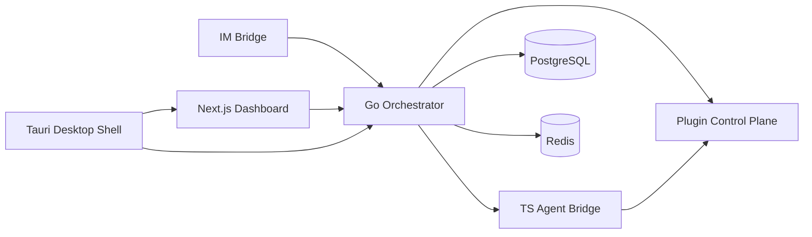

# AgentForge

AgentForge is an agent-driven development management platform that connects the full delivery loop:

`IM request -> AI task decomposition -> agent execution -> automated review -> delivery`

The project vision, defined in the latest product documents, is to make AI agents first-class team members with identity, role, cost tracking, review workflows, and collaboration surfaces alongside human developers.

[中文文档](./README_zh.md)

## What This Repository Contains

This repository is no longer just a generic starter template. It is an evolving AgentForge workspace that currently includes:

- A Next.js 16 + React 19 dashboard and auth surface in `app/`
- A Go backend foundation in `src-go/`
- A TypeScript/Bun agent bridge service in `src-bridge/`
- An IM bridge fork workspace in `src-im-bridge/`
- A Tauri desktop wrapper in `src-tauri/`
- Product, architecture, plugin, review, and technical design documents in `docs/`

## Product Direction

According to the latest PRD, AgentForge aims to be:

- An open-source platform for managing mixed human + AI engineering teams
- A system that can receive work from IM tools, decompose tasks, assign work to agents or people, and track execution
- A platform with a built-in review pipeline, budget controls, progress tracking, and plugin extensibility
- A bridge between team communication, development workflows, review automation, and delivery

## Architecture At A Glance

The current documentation describes AgentForge around these major layers:

- `Web Dashboard`: Next.js 16 UI for task management, agent status, project views, cost views, and team operations
- `Go Orchestrator`: API, task lifecycle, scheduling, worktree management, review coordination, and realtime distribution
- `TS Agent Bridge`: the unified backend AI entry point for agent execution and lightweight AI analysis
- `IM Bridge`: a cc-connect-based service for Feishu, DingTalk, Slack, Telegram, Discord, and other messaging channels
- `Review Pipeline`: layered review flow covering fast checks, deep review, and human approval
- `Data Layer`: PostgreSQL, Redis, WebSocket/event flow, and related infra

Backend connectivity rule of truth:

- `Go Orchestrator` is the backend mediator between `TS Agent Bridge` and `IM Bridge`
- `IM Bridge` talks to Go-owned `/api/v1/*` surfaces for workflow, runtime diagnostics, and bridge-backed AI capabilities
- `TS Agent Bridge` exposes canonical `/bridge/*` routes to Go; it does not directly discover or invoke IM Bridge instances
- outbound IM progress and terminal delivery return through the Go control plane so the original `bridge_id` and reply target stay intact



## Current Repository Status

This codebase is in an active migration from an earlier starter foundation into AgentForge. That matters for anyone reading the repo:

- Product docs and architecture docs already use the `AgentForge` identity
- Some code/package/module names still retain starter-era names such as `react-quick-starter` or `agentforge`
- The repo contains real implementation workspaces, but the product design is ahead of some runtime surfaces
- If documentation sections disagree, treat [`docs/PRD.md`](./docs/PRD.md) as the latest product source of truth

One important example: the PRD v2 notes that Go-to-TS communication has moved toward `HTTP + WebSocket`, while some older design parts still describe `gRPC`-based variants. The PRD should win when they conflict.

## Implementation Snapshot

As of `2026-04-20`, the repository has already moved beyond a thin starter shell in these concrete areas:

- `Overview dashboard`: `app/(dashboard)/page.tsx` now renders summary cards, activity feed, fleet/team/budget widgets, and quick actions grounded in the current project context.
- `Project task workspace`: `app/(dashboard)/project/page.tsx` now hosts one shared Board / List / Timeline / Calendar workspace with a persistent context rail, realtime health state, bulk actions, sprint-aware filtering, task detail editing, and doc/comment linkage surfaces.
- `Project dashboard workspace`: `app/(dashboard)/project/dashboard/page.tsx` now supports dashboard selection plus create / rename / delete flows, widget catalog insertion, and widget-level refresh / delete / empty-state handling instead of a fixed first-dashboard view.
- `Settings workspace`: `app/(dashboard)/settings/page.tsx` now has draft lifecycle semantics (`dirty`, save, discard/reset), validation feedback, coding-agent runtime catalog integration, and operator diagnostics grounded in current saved values and fallback state.
- `Role workspace`: `app/(dashboard)/roles/page.tsx` now exposes a responsive three-surface authoring flow with role library, structured editor, preview/sandbox context rail, inheritance-aware preview, and repo-local skill catalog selection.
- `Review workspace`: `app/(dashboard)/reviews/page.tsx` now routes backlog, detail, decision actions, and manual deep-review triggers through shared review workspace components instead of isolated page-specific UI.
- `Docs/wiki workspace`: `app/(dashboard)/docs/page.tsx` and `app/(dashboard)/docs/[pageId]/page-client.tsx` now provide a project-scoped wiki tree, BlockNote editor, comments, version history, templates, recent/favorite docs, and related-task linkage.
- `Team workspaces`: `app/(dashboard)/team/page.tsx` and `app/(dashboard)/teams/page.tsx` now cover project-scoped member management, role-aware roster editing, team-run stats/filtering, and team creation flows instead of static team placeholders.
- `Workflow operations workspace`: `app/(dashboard)/workflow/page.tsx` now exposes editable status transitions, trigger rules, realtime activity, and persisted workflow draft/save behavior per project.
- `Scheduler operations workspace`: `app/(dashboard)/scheduler/page.tsx` now provides scheduler stats, registered job inspection, run history, draft schedule editing, and manual trigger controls.
- `Memory workspace`: `app/(dashboard)/memory/page.tsx` now supports project-scoped memory search, category filtering, scope/category badges, and entry deletion.
- `Plugin operator surfaces`: the plugin control plane now distinguishes catalog entries from installed plugins, includes built-in bundle/readiness verification, and exposes maintained authoring commands such as `pnpm create-plugin`, `pnpm plugin:verify`, and `pnpm plugin:verify:builtins`.
- `Repo-owned skills`: canonical built-in skills now remain explicitly declared through `skills/builtin-bundle.yaml`, with a matching `pnpm skill:verify:builtins` drift check and marketplace-ready preview metadata derived from `SKILL.md` plus `agents/*.yaml`.
- `Internal skill governance`: repo-managed runtime skills, repo-assistant skills, and OpenSpec workflow skill mirrors are now declared in `internal-skills.yaml`, verified through `pnpm skill:verify:internal`, and synchronized via `pnpm skill:sync:mirrors`.
- `Skills workspace`: `app/(dashboard)/skills/page.tsx` now provides one governed-skills operator surface for inventory, preview, diagnostics, built-in verification, workflow mirror sync, and downstream handoff into role authoring or marketplace.
- `IM operator UI`: the current frontend contract covers `feishu`, `dingtalk`, `slack`, `telegram`, `discord`, `wecom`, `qq`, and `qqbot`, with backend-driven event types, richer delivery diagnostics, payload preview, and platform-specific config fields.
- `Marketplace`: `app/(dashboard)/marketplace/page.tsx` now provides a unified Skills/Plugin/Role marketplace with search, category filtering, featured items, detail views with version history and reviews, publish workflows, and install confirmation. The backend is a standalone Go microservice in `src-marketplace/` with its own database migrations, handler/service/repository layers, and admin moderation endpoints.
- `Desktop shell`: the Tauri app now includes shared desktop window chrome with frameless titlebar controls, bounded sidecar supervision, runtime status queries, shell actions, and window-state synchronization through `lib/platform-runtime.ts`.
- `Employee workspace`: `app/(dashboard)/employees/[id]/` provides per-employee (agent identity) profile, execution run history (`/employees/[id]/runs/`), and trigger configuration (`/employees/[id]/triggers/`) surfaces backed by dedicated Zustand stores (`employee-store`, `employee-runs-store`, `employee-trigger-store`).
- `Project VCS integrations`: `app/(dashboard)/projects/[id]/integrations/vcs/` exposes per-project VCS connection management (GitHub, GitLab, Gitea) backed by `vcs-integrations-store` and the Go VCS service with webhook routing through `vcs_webhook_handler`.
- `Project secrets management`: `app/(dashboard)/projects/[id]/secrets/` provides per-project secret CRUD backed by `secrets-store` and the Go secrets handler.
- `Qianchuan ads platform`: `app/(dashboard)/projects/[id]/qianchuan/` exposes an ads-platform operator surface including channel bindings (`/bindings/`) and strategy management (`/strategies/` and `/strategies/[sid]/edit/`) backed by `qianchuan-bindings-store`, `qianchuan-strategies-store`, and the Go adsplatform provider registry.
- `Knowledge base`: `components/knowledge/` provides ingested-file browsing (`IngestedFilesPane`), semantic search (`KnowledgeSearch`), materialization provenance pills, and live-artifact staleness banners. The Go knowledge module in `src-go/internal/knowledge/` covers asset management, chunked ingestion pipeline, vector search, comment threading, and live-artifact materialization.
- `Trigger system`: `src-go/internal/trigger/` provides the automation trigger engine with a CRUD service, idempotency guarantees, rule routing, schedule ticker, dry-run support, and flow integration tests. The frontend `workflow-trigger-store` manages trigger state for the workflow surfaces.
- `Automation rules`: `src-go/internal/automation/` hosts declarative automation rules (e.g. `review_completed_rule`) evaluated by the trigger engine. The `automation_handler` exposes CRUD for rule definitions.
- `Cost workspace`: `app/(dashboard)/cost/page.tsx` provides a full cost analytics dashboard with per-agent, per-project, and per-team breakdowns backed by `cost_handler` and `budget_query_handler`.
- `Agents workspace`: `app/(dashboard)/agents/page.tsx` provides the global agent fleet view with status, run stats, and quick-action controls backed by `agent_handler`.
- `Documents workspace`: `app/(dashboard)/documents/page.tsx` provides a global cross-project document browser (distinct from the project-scoped docs/wiki) backed by `document_handler`.
- `Dispatch observability`: `dispatch_observability_handler` and `dispatch_preflight_handler` expose structured agent-dispatch readiness checks and live execution telemetry through the Go API, covering capability matrix validation before a dispatch is accepted.
- `Custom fields`: `custom_field_handler` provides per-project custom field schema management used by tasks, reviews, and sprints.
- `Milestones`: `milestone_handler` provides project milestone CRUD integrated with sprint and task filtering.
- `Notifications`: `notification_handler` covers workspace-level notification fan-out backed by the event bus.
- `Project templates`: `project_template_handler` and `project-template-store` provide template CRUD and instantiation for creating pre-configured project workspaces.
- `Saved views`: `saved_view_handler` provides per-user saved filter/sort view persistence for task and review lists.
- `Queue management`: `queue_management_handler` exposes bounded agent queue inspection and priority controls through the Go API.
- `Workflow run history`: `workflow_run_view_handler` provides structured run history and event replay for completed workflow executions.

## Feature Matrix

| Surface | Current truth | Primary commands / entrypoints |
| --- | --- | --- |
| Web dashboard | Next.js 16 app-router workspace with auth, project/task/review/team/role/plugin/settings/docs/cost/agents surfaces | `pnpm dev`, `pnpm build` |
| Go orchestrator | Echo API, persistence, scheduling, realtime hub, review and plugin control plane, trigger/automation engine, VCS integration, knowledge, secrets, cost, dispatch observability | `cd src-go && go run ./cmd/server`, `go test ./...` |
| TS bridge | Bun service for coding runtimes, AI helpers, MCP plugin hosting | `cd src-bridge && bun run dev`, `bun run typecheck` |
| IM bridge | cc-connect-based platform bridge with backend control-plane integration | `cd src-im-bridge && go run ./cmd/bridge` |
| Desktop shell | Tauri 2 wrapper with sidecar supervision and updater plumbing | `pnpm tauri:dev`, `pnpm tauri:build` |
| Marketplace | Standalone Go microservice + Next.js frontend for publishing, discovering, and installing plugins, skills, and roles | `cd src-marketplace && go run ./cmd/server`, browse `app/(dashboard)/marketplace/` |
| Plugins | Built-in/local/catalog/remote plugin management plus MCP and workflow runs | `pnpm create-plugin`, `pnpm plugin:verify` |
| Employee workspace | Per-agent identity profile with run history and trigger configuration | browse `app/(dashboard)/employees/` |
| VCS integrations | Per-project GitHub/GitLab/Gitea connection management with webhook routing | browse `app/(dashboard)/projects/[id]/integrations/vcs/` |
| Secrets management | Per-project secret CRUD with Go-backed storage | browse `app/(dashboard)/projects/[id]/secrets/` |
| Qianchuan (ads platform) | Ads-platform channel bindings and strategy management per project | browse `app/(dashboard)/projects/[id]/qianchuan/` |
| Knowledge base | Asset ingestion pipeline, semantic search, live-artifact materialization, and comment threading | `src-go/internal/knowledge/`, `components/knowledge/` |
| Trigger / automation | Event-driven trigger routing, idempotent rule evaluation, schedule ticker, and declarative automation rules | `src-go/internal/trigger/`, `src-go/internal/automation/` |

### TS Bridge OpenCode control-plane notes

`src-bridge/` now treats OpenCode as a server-backed runtime control plane rather than a start-only execution adapter. The current Bridge contract includes:

- canonical provider-auth routes under `/bridge/opencode/provider-auth/*` for initiating and completing provider OAuth through the Bridge
- OpenCode permission request mapping through Bridge-owned request IDs before a caller responds to `/bridge/permission-response/:request_id`
- paused-session control continuity for `/bridge/messages/:task_id`, `/bridge/diff/:task_id`, `/bridge/command`, `/bridge/shell`, `/bridge/revert`, and `/bridge/unrevert` when the saved snapshot still carries an upstream OpenCode session binding
- explicit degraded diagnostics in `/bridge/runtimes` when OpenCode agent, skill, or provider discovery is unavailable even though base runtime readiness still succeeds

## Repository Map

```text
AgentForge/
├── app/                 # Next.js App Router: auth + dashboard routes
├── components/          # Shared UI components
├── hooks/               # Frontend hooks
├── lib/                 # Frontend utilities and mock/domain helpers
├── src-go/              # Go backend foundation (orchestrator)
├── src-marketplace/     # Go marketplace microservice
├── src-bridge/          # TypeScript/Bun agent bridge service
├── src-im-bridge/       # IM bridge fork workspace
├── src-tauri/           # Tauri desktop shell
├── docs/                # PRD, research, architecture, design docs
├── openspec/            # OpenSpec change artifacts
├── internal-skills.yaml # Registry for maintained internal skill assets
├── roles/               # Role definitions and related assets
├── plugins/             # Built-in plugin bundle, integrations, tools, reviews, workflows
└── scripts/             # Build helpers such as backend sidecar compilation
```

Notable frontend route groups already present:

- `app/(auth)` for login and registration
- `app/(dashboard)` for overview, projects, project dashboard/task workspaces, team/team-run orchestration, agents, sprints, reviews, cost, scheduler, memory, roles, plugins, marketplace, settings, IM, docs, workflow operations, and global document browser
- `app/(dashboard)/skills` for governed internal skill inventory, diagnostics, mirror sync, and skill-package preview
- `app/(dashboard)/employees/[id]` for per-agent (employee) profile, run history (`/runs/`), and trigger configuration (`/triggers/`)
- `app/(dashboard)/projects/[id]/integrations/vcs` for per-project VCS provider connections (GitHub, GitLab, Gitea) and webhook management
- `app/(dashboard)/projects/[id]/secrets` for per-project secret CRUD
- `app/(dashboard)/projects/[id]/qianchuan` for ads-platform operator surfaces including channel bindings and strategy editing

## Documentation Guide

Start here if you want the latest project narrative:

- [`docs/PRD.md`](./docs/PRD.md): unified product requirements and latest overall direction
- [`docs/part/AGENT_ORCHESTRATION.md`](./docs/part/AGENT_ORCHESTRATION.md): orchestrator, bridge, agent pool, worktree, and execution model
- [`docs/part/REVIEW_PIPELINE_DESIGN.md`](./docs/part/REVIEW_PIPELINE_DESIGN.md): three-layer review architecture
- [`docs/part/PLUGIN_SYSTEM_DESIGN.md`](./docs/part/PLUGIN_SYSTEM_DESIGN.md): target plugin system design
- [`docs/part/PLUGIN_RESEARCH_TECH.md`](./docs/part/PLUGIN_RESEARCH_TECH.md): runtime and sandbox technology research for plugins
- [`docs/GO_WASM_PLUGIN_RUNTIME.md`](./docs/GO_WASM_PLUGIN_RUNTIME.md): current Go-side WASM plugin runtime, SDK, and local verification flow
- [`docs/api/`](./docs/api): current REST API reference by module
- [`docs/schema/`](./docs/schema): PostgreSQL and Redis schema/reference docs
- [`docs/deployment/`](./docs/deployment): deployment, env var, desktop build, and TLS guides
- [`docs/security/`](./docs/security): auth, Tauri capability, and security best-practice docs
- [`docs/adr/`](./docs/adr): architecture decision records
- [`docs/guides/`](./docs/guides): plugin, frontend component, and state-management guides
- [`docs/desktop-updater-release.md`](./docs/desktop-updater-release.md): desktop updater signing inputs, `latest.json` generation, and release validation flow
- [`docs/guides/internal-skill-governance.md`](./docs/guides/internal-skill-governance.md): canonical internal skill families, provenance, verification, and mirror-sync workflow
- [`app/(dashboard)/skills/page.tsx`](./app/(dashboard)/skills/page.tsx): governed skills operator workspace for inventory, preview, diagnostics, and bounded verify/sync actions
- [`docs/role-authoring-guide.md`](./docs/role-authoring-guide.md): current dashboard role workspace flow, preview/sandbox loop, and operator guidance
- [`docs/role-yaml.md`](./docs/role-yaml.md): canonical role YAML layout, runtime projection rules, and skill-catalog behavior
- [`docs/part/PLUGIN_RESEARCH_PLATFORMS.md`](./docs/part/PLUGIN_RESEARCH_PLATFORMS.md): platform comparison for extension ecosystems
- [`docs/part/TECHNICAL_CHALLENGES.md`](./docs/part/TECHNICAL_CHALLENGES.md): key engineering risks and mitigation paths
- [`docs/part/DATA_AND_REALTIME_DESIGN.md`](./docs/part/DATA_AND_REALTIME_DESIGN.md): data model and realtime/event design
- [`docs/part/CC_CONNECT_REUSE_GUIDE.md`](./docs/part/CC_CONNECT_REUSE_GUIDE.md): IM bridge fork and reuse strategy

Supporting repository docs:

- [`AGENTS.md`](./AGENTS.md): repository working conventions
- [`CONTRIBUTING.md`](./CONTRIBUTING.md): contribution guide
- [`TESTING.md`](./TESTING.md): testing notes
- [`CI_CD.md`](./CI_CD.md): CI/CD overview
- [`CHANGELOG.md`](./CHANGELOG.md): project changelog

## Prerequisites

- Node.js 20+
- pnpm
- Go 1.25+ for `src-go/`
- Bun for `src-bridge/`
- Rust 1.77.2+ for Tauri desktop development
- Docker Desktop or another Docker environment if you want local PostgreSQL/Redis

## Getting Started

### Full-stack Local Workflow

If you want the repo-truthful local web development stack in one command, use:

```bash
pnpm dev:all
```

Helpful companion commands:

- `pnpm dev:all:status`
- `pnpm dev:all:logs`
- `pnpm dev:all:stop`

If you want the backend stack without the Next.js frontend, use:

```bash
pnpm dev:backend
```

Helpful backend-only companion commands:

- `pnpm dev:backend:status`
- `pnpm dev:backend:logs`
- `pnpm dev:backend:stop`
- `pnpm dev:backend:verify`

Current `dev:all` scope:

- Starts or reuses local PostgreSQL + Redis through `docker compose` when they are not already reachable on `5432` / `6379`
- Starts or reuses the Go Orchestrator on `http://127.0.0.1:7777/health`
- Starts or reuses the TS Bridge on `http://127.0.0.1:7778/bridge/health`
- Starts or reuses the IM Bridge on `http://127.0.0.1:7779/im/health`
- Starts or reuses the Next.js frontend on `http://127.0.0.1:3000`
- Persists the managed IM Bridge identity file at `.codex/im-bridge-id`
- Persists repo-local runtime metadata in `.codex/dev-all-state.json`
- Writes managed service logs under `.codex/runtime-logs/`

Current `dev:backend` scope:

- Starts or reuses local PostgreSQL + Redis through `docker compose` when they are not already reachable on `5432` / `6379`
- Starts or reuses the Go Orchestrator on `http://127.0.0.1:7777/health`
- Starts or reuses the TS Bridge on `http://127.0.0.1:7778/bridge/health`
- Starts or reuses the IM Bridge on `http://127.0.0.1:7779/im/health`
- Persists the managed IM Bridge identity file at `.codex/im-bridge-id`
- Persists repo-local runtime metadata in `.codex/dev-backend-state.json`
- Writes managed service logs under `.codex/runtime-logs/`

Current `dev:backend:verify` scope:

- Starts or reuses the same backend-only managed stack as `pnpm dev:backend`
- Verifies Go health at `http://127.0.0.1:7777/health`
- Verifies TS Bridge health at `http://127.0.0.1:7778/bridge/health`
- Verifies IM Bridge health at `http://127.0.0.1:7779/im/health`
- Injects one zero-credential IM stub command roundtrip through the managed IM Bridge test port and requires a non-empty reply before reporting success
- Leaves the managed backend stack running by default so follow-up debugging can continue immediately

Notes:

- `dev:all` is intentionally the local web-mode workflow. It does not replace `pnpm tauri:dev`.
- `dev:all` can be run after `pnpm dev:backend`; it will reuse healthy backend services and only take ownership of the frontend it starts itself.
- If a required port is occupied by a non-AgentForge listener, `dev:all` reports a conflict instead of starting a duplicate service.
- `dev:backend:verify` is the supported backend smoke proof. It reports stage-level failures (`startup`, health checks, stub command injection, reply capture) and keeps managed services running; use `pnpm dev:backend:status`, `pnpm dev:backend:logs`, or `pnpm dev:backend:stop` afterward.
- This checkout currently does not include `.env.local.example` or `src-go/.env.example`; the workflow uses code defaults plus environment overrides instead of blocking on missing example files.

### 1. Frontend Dashboard

```bash
pnpm install
pnpm dev
```

This starts the Next.js app in development mode.

Useful root commands:

- `pnpm dev`
- `pnpm build`
- `pnpm start`
- `pnpm lint`
- `pnpm test`
- `pnpm test:coverage`
- `pnpm test:tauri`
- `pnpm test:tauri:coverage`
- `pnpm create-plugin -- --type tool --name echo-tool`
- `pnpm plugin:build -- --manifest plugins/integrations/feishu-adapter/manifest.yaml`
- `pnpm plugin:debug -- --manifest plugins/integrations/feishu-adapter/manifest.yaml --operation health`
- `pnpm plugin:dev`
- `pnpm plugin:verify -- --manifest plugins/integrations/feishu-adapter/manifest.yaml`

Note: `next.config.ts` currently enables `output: "export"`. `pnpm build` generates the deployable static site in `out/`, while `pnpm start` remains a legacy Next server entrypoint rather than the primary production path for this checkout.

### 2. Go Backend

If you want the full local stack, prefer `pnpm dev:all`. If you want all backend services without the frontend, prefer `pnpm dev:backend`. If you want the supported backend smoke proof for Go + TS Bridge + IM Bridge, prefer `pnpm dev:backend:verify`. The manual steps below remain useful when you are only debugging the Go service internals.

From the repository root, start infrastructure if needed:

```bash
docker compose up -d
```

Then run the Go service:

```bash
cd src-go
go run ./cmd/server
```

Useful backend commands:

- `go test ./...`
- `go build ./cmd/server`
- `docker build -t agentforge-server .`

### Auth And Session Notes

The current auth flow is intentionally aligned across the frontend and Go backend:

- The frontend persists the canonical session payload: `accessToken`, `refreshToken`, and `user`.
- Protected dashboard routes do not trust a cached boolean alone. On bootstrap, the app validates the stored access token with `GET /api/v1/users/me`, attempts one `POST /api/v1/auth/refresh` when the access token is no longer authorized, and clears stale session state if recovery fails.
- Web mode resolves the backend from `NEXT_PUBLIC_API_URL` and falls back to `http://localhost:7777`. Tauri mode uses the native `get_backend_url` command first, then falls back to the same default.
- `POST /api/v1/auth/refresh` is rate-limited together with login and registration.

For local backend auth config, create `src-go/.env` if you need overrides. Typical values are:

```env
PORT=7777
ENV=development
JWT_SECRET=change-me-in-production-at-least-32-chars
JWT_ACCESS_TTL=15m
JWT_REFRESH_TTL=168h
ALLOW_ORIGINS=http://localhost:3000,tauri://localhost,http://localhost:1420
REDIS_URL=redis://localhost:6379
```

Security note: PostgreSQL/Redis can still be absent at process startup for local development, but auth paths that depend on token revocation state do not silently degrade. If Redis or the token cache is unavailable, refresh, logout revocation, and blacklist-backed protected-route checks now fail closed instead of reporting success.

### 3. TypeScript Agent Bridge

For normal full-stack local development, `pnpm dev:all` will start or reuse the bridge for you. The commands below remain the direct bridge-only workflow.

```bash
cd src-bridge
bun install
bun run dev
```

Useful bridge commands:

- `bun run dev`
- `bun run build`
- `bun run typecheck`

Runtime notes:

- `/bridge/execute` now accepts an optional `runtime` field with `claude_code`, `codex`, `opencode`, `cursor`, `gemini`, `qoder`, or `iflow`.
- If `runtime` is omitted, the bridge defaults to `claude_code` and still maps legacy provider hints such as `anthropic`, `codex`, `opencode`, `cursor`, `google`, `vertex`, `qoder`, and `iflow`.
- `claude_code` uses the built-in Claude-backed adapter and expects `ANTHROPIC_API_KEY`.
- `codex` now uses a bridge-owned Codex connector built on the official Codex CLI surface. `CODEX_RUNTIME_COMMAND` must point to a working `codex` executable, and that CLI must already be authenticated (`codex login status` should report a valid login).
- The Codex connector launches `codex exec --json` for fresh runs, captures `thread.started.thread_id` as continuity metadata, and uses `codex exec resume <thread-id>` for truthful resume flows instead of replaying the original prompt as a fresh session.
- `opencode` now uses a bridge-owned OpenCode connector built on the official `opencode serve` HTTP APIs. Configure `OPENCODE_SERVER_URL` to a reachable OpenCode server, and set `OPENCODE_SERVER_USERNAME` / `OPENCODE_SERVER_PASSWORD` when that server is protected with basic auth.
- The OpenCode connector creates or resumes upstream sessions through `/session`, sends work with `/session/:id/prompt_async`, aborts active work with `/session/:id/abort`, and normalizes OpenCode session events into the canonical bridge stream.
- OpenCode pause and resume now preserve upstream `session_id` continuity instead of replaying the original prompt as a fresh command process.
- `cursor`, `gemini`, `qoder`, and `iflow` now register as CLI-backed runtime profiles. They use one shared catalog and validation contract, but they do not pretend to support the same pause/resume/fork/rollback semantics as Claude Code, Codex, or OpenCode. When truthful continuity is unavailable, the bridge records a blocked continuity state and rejects resume instead of silently starting a fresh run.
- CLI-backed runtime launches are now aligned to documented headless entrypoints instead of Bridge-only stdin/flag guesses: Cursor uses headless print mode with a positional prompt, Gemini uses `-p/--output-format` plus documented approval and include-directory flags, Qoder uses `--print`/`--output-format`, and iFlow uses `--prompt` with text-mode output.
- iFlow is in a published shutdown window and the Bridge surfaces that lifecycle truth directly in runtime diagnostics and catalog metadata. Before the published sunset date (`2026-04-17`, Beijing Time) it remains degraded with migration guidance to Qoder; after that date, new launches are rejected unless the upstream contract is revalidated.

### Coding Agent Runtime Catalog

In the current product contract, coding-agent execution is no longer "provider only". The runtime tuple is:

- `runtime`: the actual execution backend (`claude_code`, `codex`, `opencode`)
- `runtime`: the actual execution backend (`claude_code`, `codex`, `opencode`, `cursor`, `gemini`, `qoder`, `iflow`)
- `provider`: the provider alias allowed for that runtime
- `model`: the concrete model string forwarded to the runtime

Project settings, single-agent launches, and Team launches now share the same catalog-driven defaults exposed from the backend. This matches the PRD direction that the TS Bridge is the unified AI execution surface, while the Go orchestrator owns project-level policy and propagation.

Current runtime compatibility rules:

| Runtime | Default Provider | Compatible Providers | Default Model | Required Runtime Dependency |
| --- | --- | --- | --- | --- |
| `claude_code` | `anthropic` | `anthropic` | `claude-sonnet-4-5` | `ANTHROPIC_API_KEY` |
| `codex` | `openai` | `openai`, `codex` | `gpt-5-codex` | `CODEX_RUNTIME_COMMAND` plus a valid Codex CLI login |
| `opencode` | `opencode` | `opencode` | `opencode-default` | `OPENCODE_SERVER_URL` and optional basic-auth credentials |
| `cursor` | `cursor` | `cursor` | `claude-sonnet-4-20250514` | `CURSOR_RUNTIME_COMMAND` pointing to the official Cursor CLI `agent` command plus any required local auth |
| `gemini` | `google` | `google`, `vertex` | `gemini-2.5-pro` | `GEMINI_RUNTIME_COMMAND` plus Gemini CLI auth (`GEMINI_API_KEY` / `GOOGLE_API_KEY` or equivalent login) |
| `qoder` | `qoder` | `qoder` | `auto` | `QODER_RUNTIME_COMMAND` plus a working Qoder CLI install |
| `iflow` | `iflow` | `iflow` | `Qwen3-Coder` | `IFLOW_RUNTIME_COMMAND` plus iFlow CLI auth (`IFLOW_API_KEY` or equivalent login); lifecycle is sunsetting and migration should target Qoder |

Bridge readiness diagnostics now surface missing credentials, missing executables, bounded model incompatibilities, and incompatible runtime/provider combinations before launch. The project settings page, single-agent launch, and Team start dialog all consume that catalog instead of hard-coded Claude-only defaults.

`GET /bridge/runtimes` now keeps `supported_features` for compatibility and also publishes:

- `interaction_capabilities`, grouped into `inputs`, `lifecycle`, `approval`, `mcp`, and `diagnostics`
- `launch_contract`, covering prompt transport, output mode, supported approval modes, additional-directory support, and env-override support
- `lifecycle`, covering runtime lifecycle state, sunset metadata, replacement runtime, and operator-facing migration guidance

This lets upstream consumers distinguish supported, degraded, unsupported, and sunsetting runtime controls without inferring behavior from the runtime key alone.

The bridge's advanced runtime controls now include `POST /bridge/shell` for OpenCode session shell commands, `POST /bridge/thinking` for Claude thinking-budget updates, and `GET /bridge/mcp-status/:task_id` for Claude Query MCP status. When a runtime does not truthfully support a control, the bridge returns a structured `{ error, operation, runtime, support_state, reason_code }` response instead of collapsing the failure into a generic 500.

Focused bridge-runtime verification commands:

- `bun test src/opencode/transport.test.ts src/handlers/opencode-runtime.test.ts src/runtime/registry.test.ts src/session/manager.test.ts src/server.test.ts`
- `bun run typecheck`

### Runtime Environment Variables

These are the key environment variables for the coding-agent runtimes:

```env
# Claude Code runtime
ANTHROPIC_API_KEY=...

# Codex runtime adapter
CODEX_RUNTIME_COMMAND=codex

# OpenCode runtime adapter
OPENCODE_RUNTIME_COMMAND=opencode

# Cursor Agent runtime adapter
CURSOR_RUNTIME_COMMAND=agent
CURSOR_API_KEY=...

# Gemini CLI runtime adapter
GEMINI_RUNTIME_COMMAND=gemini
GEMINI_API_KEY=...

# Qoder runtime adapter
QODER_RUNTIME_COMMAND=qodercli

# iFlow runtime adapter
IFLOW_RUNTIME_COMMAND=iflow
IFLOW_API_KEY=...
```

For Codex, `CODEX_RUNTIME_COMMAND` should point at the official `codex` CLI (or a repo-owned wrapper that still preserves the same `exec --json` / `exec resume` contract). Project-level runtime selection does not replace these process-level requirements; it only determines which runtime tuple Go forwards to the Bridge.

For the CLI-backed runtimes:

- `cursor` currently exposes a bounded model list through the runtime catalog and requires the local Cursor Agent executable to be discoverable.
- `gemini` currently supports bounded catalog-driven model selection and provider aliases `google` / `vertex`; if the required auth or provider profile is missing, readiness stays blocked.
- `qoder` uses bounded model tiers (`auto`, `ultimate`, `performance`, `efficient`, `lite`) and treats provider as fixed `qoder`.
- `iflow` currently exposes bounded catalog-driven model selection and treats unsupported pause/resume/fork flows as `continuity_not_supported` rather than silently replaying the original request.

Before using `runtime=codex`, verify the CLI is authenticated:

```bash
codex login status
```

If Codex pause or resume reports a blocked continuity state, the bridge is missing the saved `thread_id` needed to continue the same Codex session and will refuse to silently start a fresh run.

Suggested operator checks for the expanded backend matrix:

```bash
# Cursor Agent
agent --help

# Gemini CLI
gemini --version

# Qoder CLI
qodercli --help

# iFlow CLI
iflow --version
```

Focused verification for the bridge runtime layer:

- `bun test src/schemas.test.ts src/handlers/execute.test.ts src/runtime/registry.test.ts src/server.test.ts`
- `bun run typecheck`

From the repo root, there is also:

```bash
pnpm build:bridge
```

### 3.5 Plugin Authoring Workflow

For the maintained plugin authoring flow, the repo now exposes both scaffolded starters and the Go WASM sample loop:

```bash
pnpm create-plugin -- --type tool --name echo-tool
pnpm create-plugin -- --type review --name typescript-review
pnpm create-plugin -- --type workflow --name release-train
```

The generated starters are repo-local templates:

- Tool and review scaffolds use the TypeScript plugin SDK in `src-bridge/src/plugin-sdk/`
- Workflow and integration scaffolds generate a Go entrypoint under `src-go/cmd/<name>/` plus a manifest-backed plugin directory
- Each scaffold includes starter tests or verification hooks so template drift is caught by repository tests

For the maintained Go WASM sample plugin, the repo also keeps a supported root-level loop:

```bash
pnpm plugin:build -- --manifest plugins/integrations/feishu-adapter/manifest.yaml
pnpm plugin:debug -- --manifest plugins/integrations/feishu-adapter/manifest.yaml --operation health
pnpm plugin:verify -- --manifest plugins/integrations/feishu-adapter/manifest.yaml
```

Notes:

- `create-plugin` is the current repo-local scaffolding entrypoint. It supports `tool`, `review`, `workflow`, and `integration` starters and writes files into the repository's real plugin directories instead of a detached demo layout.
- `plugin:build` resolves the maintained sample artifact path from the manifest and still supports `--source` / `--output` overrides when you are iterating on a different Go-hosted plugin target.
- `plugin:debug` replays the real `AGENTFORGE_AUTORUN`, `AGENTFORGE_OPERATION`, `AGENTFORGE_CONFIG`, `AGENTFORGE_CAPABILITIES`, and `AGENTFORGE_PAYLOAD` contract through the Go WASM runtime instead of inventing a separate dev-only protocol.
- `plugin:verify` currently runs the maintained sample smoke path only: `build -> debug health`. It is intentionally scoped and does not replace broader Go or bridge test suites.
- `plugin:dev` is the minimal local plugin stack command. It only concerns the Go orchestrator and TS bridge, reuses them when already healthy, and reports readiness through `http://127.0.0.1:7777/health` and `http://127.0.0.1:7778/bridge/health`.
- The Go control plane now separates installable catalog entries from installed plugin records via `GET /api/v1/plugins/catalog` and `POST /api/v1/plugins/catalog/install`, while external `git`, `npm`, and `catalog` sources stay blocked from enablement until digest plus signature or explicit approval metadata mark them trusted.

### 4. IM Bridge Workspace

```bash
cd src-im-bridge
go run ./cmd/bridge
```

Useful IM bridge commands:

- `go test ./...`
- `go build ./cmd/bridge`

Current operator-facing IM scope in this repo:

- The frontend management surfaces cover `feishu`, `dingtalk`, `slack`, `telegram`, `discord`, `wecom`, `qq`, and `qqbot`.
- Channel configuration now uses backend-fetched event types instead of a hard-coded event checklist.
- Delivery and health views include richer platform badges, downgrade diagnostics, and payload/detail inspection for operator workflows.

### 4.5 Marketplace Service

The marketplace is a standalone Go microservice that manages the publishing, discovery, installation, and review of plugins, skills, and roles.

```bash
cd src-marketplace
go run ./cmd/server
```

Useful marketplace commands:

- `go test ./...`
- `go build ./cmd/server`

The marketplace backend runs on port `7781` by default and provides:

- REST API for item CRUD, version management, reviews, search, and category filtering
- Admin-only endpoints for featuring and verifying marketplace items
- Typed install and consumption bridge metadata through the Go orchestrator (`/api/v1/marketplace/install` and `/api/v1/marketplace/consumption`)
- Artifact package validation for plugin, role, and skill uploads before version publish succeeds

The frontend marketplace page (`app/(dashboard)/marketplace/page.tsx`) exposes:

- Search bar with type/category filtering and sort options (downloads, rating, newest)
- Dedicated repo-owned built-in skills section that stays visible even when the standalone marketplace service is unavailable
- Featured items section
- Item detail view with version history, reviews, moderation controls, install confirmation, downstream handoff links, and structured skill Markdown/YAML preview support
- Publish dialog for authors to submit new plugins, skills, or roles, plus item-owned version upload
- Typed installed/blocked/used tracking through the marketplace store (`lib/stores/marketplace-store.ts`)
- Plugin local side-load entrypoint reused from within the marketplace workspace; unsupported role/skill side-load paths remain explicitly blocked

Key marketplace components:

- `components/marketplace/marketplace-search-bar.tsx`
- `components/marketplace/marketplace-filter-panel.tsx`
- `components/marketplace/marketplace-item-card.tsx`
- `components/marketplace/marketplace-item-detail.tsx`
- `components/marketplace/marketplace-publish-dialog.tsx`
- `components/marketplace/marketplace-install-confirm.tsx`
- `components/marketplace/marketplace-review-dialog.tsx`
- `components/marketplace/marketplace-version-list.tsx`

### 5. Desktop Mode

If you are working on the desktop shell:

```bash
pnpm tauri:dev
```

Or build desktop artifacts through the shared desktop packaging contract:

```bash
pnpm build:desktop
```

If you want to debug only the Rust/Tauri runtime after the frontend is already up, use the standalone desktop flow:

```bash
pnpm dev
pnpm desktop:standalone:check
pnpm desktop:standalone:dev
```

Desktop capability contract in the current Tauri shell:

- Tauri now supervises three required sidecars: the Go orchestrator on `http://127.0.0.1:7777`, the TS bridge on `http://127.0.0.1:7778`, and the IM Bridge on `http://127.0.0.1:7779`.
- The desktop runtime is only reported as `ready` after all three sidecars pass health checks. Unexpected exits trigger bounded restart attempts before the runtime is marked `degraded`.
- The shared desktop prepare contract is split into `pnpm desktop:dev:prepare` for current-host development binaries and `pnpm desktop:build:prepare` for packaging binaries plus the frontend production build. `tauri:dev`, `build:desktop`, Tauri pre-commands, and the maintained VS Code desktop debug entry points all reuse that contract.
- `pnpm desktop:standalone:check` and `pnpm desktop:standalone:dev` reuse the same current-host sidecar prepare contract, but they treat frontend availability on `http://localhost:3000` as an external prerequisite instead of starting `pnpm dev` for you.
- The maintained VS Code `Tauri Standalone Rust Debug` launch entrypoint follows the same rule: it prepares current-host sidecars, but expects the frontend dev server to already be running.
- Frontend desktop access is centralized through `lib/platform-runtime.ts` and `hooks/use-platform-capability.ts`. Supported desktop commands include backend URL resolution, runtime status, native file picking, system notifications, tray updates, global shortcut registration, update checks, and read-only runtime summary queries.
- The main window now uses shared frameless chrome via `components/layout/desktop-window-frame.tsx`, including drag region handling plus minimize / maximize / restore / close actions wired through the platform capability facade.
- Web mode keeps explicit fallback semantics: file picking falls back to browser input, notifications fall back to the Web Notification API, tray updates fall back to document title updates, global shortcuts return `unsupported`, and update checks return `not_applicable`.
- The plugin dashboard consumes desktop runtime telemetry as an additive status surface only. Plugin inventory and lifecycle actions remain on the existing backend control plane.

Current limitations:

- The desktop event stream currently normalizes runtime, tray, shortcut, notification, and updater events. It does not replace backend plugin business data.
- Update checks currently cover detection and event reporting; they do not yet expose a download-and-install flow in the dashboard.

## Key Root Scripts

| Command | Purpose |
| --- | --- |
| `pnpm dev` | Run the Next.js web app |
| `pnpm build` | Build the static-export web app and emit `out/` |
| `pnpm start` | Legacy Next server entrypoint; not the primary deploy path while `output: "export"` is enabled |
| `pnpm lint` | Run ESLint |
| `pnpm test` | Run Jest |
| `pnpm test:coverage` | Run Jest with coverage |
| `pnpm test:tauri` | Run the `src-tauri` Rust library tests |
| `pnpm test:tauri:coverage` | Enforce the desktop runtime-logic coverage gate for `src-tauri/src/runtime_logic.rs` |
| `pnpm create-plugin` | Scaffold a repo-local plugin starter for tool, review, workflow, or integration development |
| `pnpm build:backend` | Cross-compile Go sidecar binaries for Tauri |
| `pnpm build:backend:dev` | Build the Go sidecar for the current platform |
| `pnpm build:im-bridge` | Cross-compile IM Bridge sidecar binaries for Tauri |
| `pnpm build:im-bridge:dev` | Build the IM Bridge sidecar for the current platform |
| `pnpm desktop:dev:prepare` | Prepare current-host backend + TS bridge + IM Bridge sidecars for desktop development |
| `pnpm desktop:standalone:check` | Validate standalone Rust desktop debug prerequisites without starting the frontend |
| `pnpm desktop:standalone:dev` | Launch the standalone Rust desktop debug flow after the frontend is already running |
| `pnpm desktop:build:prepare` | Prepare packaging backend + TS bridge + IM Bridge sidecars and build the frontend bundle |
| `pnpm dev:all` | Start or reuse the full local web development stack: compose infra + Go + TS bridge + IM Bridge + frontend |
| `pnpm dev:all:status` | Report source, health, ports, and known log paths for the local dev stack |
| `pnpm dev:all:logs` | Show the repo-local log files tracked for the local dev stack |
| `pnpm dev:all:stop` | Stop only the services managed by `dev:all` and preserve reused or external listeners |
| `pnpm dev:backend` | Start or reuse the backend-only local development stack: compose infra + Go + TS bridge + IM Bridge |
| `pnpm dev:backend:status` | Report source, health, ports, and known log paths for the backend-only local dev stack |
| `pnpm dev:backend:logs` | Show the repo-local log files tracked for the backend-only local dev stack |
| `pnpm dev:backend:stop` | Stop only the services managed by `dev:backend` and preserve reused or external listeners |
| `pnpm dev:backend:verify` | Run the supported backend runtime smoke workflow: start/reuse the backend stack, verify health hops, inject one IM stub command roundtrip, and keep managed services running |
| `pnpm build:plugin:wasm` | Build the Go WASM sample plugin artifact |
| `pnpm plugin:build` | Build a maintained Go-hosted plugin target from a manifest |
| `pnpm plugin:debug` | Run a local Go WASM plugin debug invocation through the real runtime envelope |
| `pnpm plugin:dev` | Start or reuse the minimal plugin authoring stack: Go orchestrator + TS bridge |
| `pnpm plugin:verify` | Run the maintained sample plugin smoke workflow: build -> debug health |
| `pnpm plugin:verify:builtins` | Verify the built-in plugin bundle contract and generated registry metadata |
| `pnpm skill:sync:mirrors` | Refresh declared workflow skill mirrors from their canonical `.codex` source |
| `pnpm skill:verify:internal` | Verify internal skill registry coverage, profile rules, provenance, and mirror drift |
| `pnpm skill:verify:builtins`  | Verify the built-in skill bundle contract and marketplace preview prerequisites |
| `pnpm tauri:dev` | Start Tauri dev mode with shared desktop prepare hooks for backend + TS bridge + IM Bridge |
| `pnpm tauri:build` | Build the desktop app |
| `pnpm build:bridge` | Install and build the TS/Bun bridge |
| `pnpm build:desktop` | Package the desktop app through the shared backend + TS bridge + IM Bridge desktop build contract |
| `pnpm build:updater-manifest` | Build `latest.json` from signed updater artifacts for release publishing |
| `pnpm verify:updater-artifacts` | Validate updater artifacts and `latest.json` before draft release publication |

## Tech Stack Snapshot

- Frontend: Next.js 16, React 19, TypeScript, Tailwind CSS v4, shadcn/ui, Zustand
- Backend: Go 1.25, Echo, PostgreSQL, Redis
- Bridge: Bun, TypeScript, Hono, WebSocket
- Desktop: Tauri 2
- Tooling: ESLint, Jest, OpenSpec, MCP configs

## Working Notes

- Secrets should stay in local env files such as `.env.local` or `src-go/.env`; do not rely on example env files being present in this checkout
- `src-tauri/` should keep capability scope minimal
- The repository includes both implementation work and design-stage artifacts, so do not assume every documented module is fully production-ready yet
- When in doubt about project intent, prefer the PRD and architecture docs over the legacy starter phrasing still visible in some package/module names

## License

[MIT](./LICENSE)
