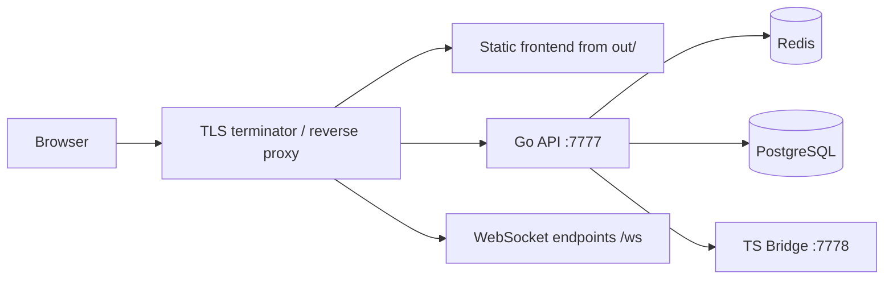

# TLS Guide / TLS 与反向代理

AgentForge does not currently ship a production-ready reverse proxy
configuration. This document describes the recommended deployment pattern around
the repository's current surfaces.

## Recommended Production Split

- serve the exported frontend from `out/`
- run the Go API on `:7777`
- expose WebSocket upgrades on `/ws` and `/ws/*`
- put TLS termination in front of all external traffic

## Traffic Map

## What Must Be Proxied

- `/` -> exported frontend in `out/`
- `/api/*` -> Go orchestrator on `http://127.0.0.1:7777`
- `/health` and `/api/v1/health`
- `/ws`, `/ws/bridge`, `/ws/im-bridge`

Forward websocket headers:

- `Connection: upgrade`
- `Upgrade: websocket`

## Security Headers

At the TLS terminator, set at minimum:

- `Strict-Transport-Security`
- `X-Content-Type-Options: nosniff`
- `X-Frame-Options: DENY`
- `Referrer-Policy: strict-origin-when-cross-origin`
- `Content-Security-Policy` appropriate for the exported frontend

Current Tauri config sets `csp: null` for the desktop shell. Do not reuse that
desktop choice as the public-web CSP policy.

## CORS

The Go server reads `ALLOW_ORIGINS` from environment configuration.

For production:

- set only the public origins that should reach the API
- keep development and Tauri origins out of production unless explicitly needed
- avoid wildcard origins when credentials or auth headers are involved
