# AgentForge — Agent 驱动的开发管理平台

## 产品需求文档 (PRD)

> 版本：v2.0 | 日期：2026-03-23 | 最后更新：2026-04-22
> 基于 3 轮并行 Agent 调研（覆盖 60+ 竞品、100+ 开源项目、5 大平台深度对比）
> v2.0 更新：合并 16 个设计文档为统一 PRD（含插件系统、Agent 编排、审查流水线、数据架构、技术挑战等完整设计）
> 架构更新：Go↔TS 通信采用 HTTP + WebSocket（gRPC 方案已弃用），TS Bridge 通过 Bun compile 输出单二进制

---

## 当前实现快照（2026-04-22）

本 PRD 描述 AgentForge 的目标蓝图，同时以下能力已进入真实实现态。阅读后续章节时，若某些设计段落保留更早的规划口径，请以这份实现快照和对应代码路径为准：

**Dashboard 与项目管理**
- `总览 Dashboard`：`app/(dashboard)/page.tsx` 提供汇总指标卡、活动流、agent/team/budget widget，以及基于当前项目上下文的快捷操作。
- `任务工作区`：`app/(dashboard)/project/page.tsx` 提供统一的 Board / List / Timeline / Calendar 视图，含右侧 context rail、实时健康态、批量操作、Sprint 过滤、任务详情编辑，以及文档/评论联动。
- `项目 Dashboard`：`app/(dashboard)/project/dashboard/page.tsx` 支持 dashboard 切换与增删改、widget catalog、widget 级刷新/删除/空态处理。
- `项目设置`：`app/(dashboard)/settings/page.tsx` 具备 draft/save/discard 生命周期、字段校验、runtime/provider/model catalog 选择，以及 operator diagnostics。

**Agent 与角色**
- `角色定义体验`：`app/(dashboard)/roles/page.tsx` 提供角色库、结构化编辑器、preview/sandbox、repo-local skill catalog、继承/覆盖与响应式三栏布局。
- `Agent 舰队`：`app/(dashboard)/agents/page.tsx` 提供全局 agent 状态、运行统计与快捷操作。
- `员工工作区`：`app/(dashboard)/employees/[id]/` 提供 per-agent（员工）身份档案、运行历史（`/runs/`）与触发器配置（`/triggers/`）。

**审查与质量**
- `审查工作区`：`app/(dashboard)/reviews/page.tsx` 收敛 backlog、详情、decision actions 与手动 deep-review 入口到共享 review workspace。
- `审查流水线`：`src-go/internal/review/` 实现三层审查（快速检查、深度审查、人工审批），支持 CI 结果接入、假阳性标记与 findings 聚合。

**文档与知识**
- `文档/知识库`：`app/(dashboard)/docs/page.tsx` 提供项目级 wiki 树、BlockNote 编辑器、评论、版本历史、模板、最近/收藏和任务关联。
- `全局文档浏览器`：`app/(dashboard)/documents/page.tsx` 提供跨项目文档浏览，支持上传、解析（docx/pdf/pptx/xlsx）与存储。
- `知识资产`：`components/knowledge/` 与 `src-go/internal/knowledge/` 实现资产摄入管道、分块向量化、语义搜索、实时产物物化与评论线程。

**工作流与调度**
- `工作流运维`：`app/(dashboard)/workflow/page.tsx` 支持状态迁移编辑、触发规则、实时活动与 draft/save 生命周期。后端 `src-go/internal/workflow/` 实现 DAG 工作流引擎，含节点注册表（条件、循环、子工作流、人工审查、等待事件、HTTP 调用、IM 发送、LLM Agent）与执行服务。
- `工作流模板`：支持克隆、发布、重复与执行模板；系统内置模板种子数据。
- `工作流运行历史`：`workflow_run_view_handler` 提供结构化运行历史与事件回放。
- `调度器`：`app/(dashboard)/scheduler/page.tsx` 提供调度统计、任务注册表查看、运行历史、draft schedule 编辑与手动触发。
- `触发器引擎`：`src-go/internal/trigger/` 提供 CRUD、幂等性保证、规则路由、调度 tick、dry-run 与流集成测试。
- `自动化规则`：`src-go/internal/automation/` 托管声明式自动化规则（如 `review_completed_rule`），由触发器引擎驱动。

**团队与协作**
- `团队工作区`：`app/(dashboard)/team/page.tsx` 与 `app/(dashboard)/teams/page.tsx` 覆盖项目成员管理、角色感知 roster 编辑、team 运行统计/筛选与创建流程。
- `Sprint 与里程碑`：`app/(dashboard)/sprints/page.tsx` 提供 Sprint 管理与燃尽图；`milestone_handler` 提供里程碑 CRUD，与任务和 Sprint 过滤联动。
- `自定义字段`：`custom_field_handler` 提供项目级自定义字段 schema，用于任务、审查与 Sprint。
- `保存视图`：`saved_view_handler` 支持 per-user 的过滤/排序视图持久化。
- `通知`：`notification_handler` 实现工作区级通知扇出，通过事件总线驱动 IM + WebSocket 双通道。

**IM 与集成**
- `IM 控制面`：前端覆盖 `feishu`、`dingtalk`、`slack`、`telegram`、`discord`、`wecom`、`qq`、`qqbot`；支持后端事件类型拉取、payload 预览、降级诊断与富媒体投递（附件/回应/线程策略）。
- `VCS 集成`：`app/(dashboard)/projects/[id]/integrations/vcs/` 支持 per-project GitHub 连接管理（GitLab 与 Gitea 已注册为 stub）；`vcs_webhook_handler` 实现 webhook 路由与 outbound 分发。
- `密钥管理`：`app/(dashboard)/projects/[id]/secrets/` 提供 per-project 密钥 CRUD，后端采用 AES-GCM 加密存储。
- `千川广告平台`：`app/(dashboard)/projects/[id]/qianchuan/` 提供渠道绑定（`/bindings/`）与策略管理（`/strategies/`），后端 `adsplatform` 实现 OAuth 刷新与 provider registry。

**插件与市场**
- `插件系统`：已落地 Go-hosted WASM Integration/Workflow plugin、TS-hosted MCP Tool/Review plugin、catalog 与 trust gate、内置插件 bundle/readiness 校验，以及 repo-local 脚手架（`pnpm create-plugin`）。built-in catalog 包含 `task-control` / `review-control` / `workflow-control` 三个 control tools，以及 `standard-dev-flow` / `task-delivery-flow` / `review-escalation-flow` 三个 workflow starters。
- `Skills 治理`：`app/(dashboard)/skills/page.tsx` 提供 governed skills 库存、预览、诊断、内置校验、workflow mirror 同步与下游分发（角色创作或市场）。
- `Marketplace`：`app/(dashboard)/marketplace/page.tsx` 提供统一的 Skills/Plugin/Role 市场，支持搜索、分类过滤、精选、详情（版本历史/评价）、发布与安装确认。后端为独立 Go 微服务 `src-marketplace/`（默认端口 7781），含独立数据库迁移、handler/service/repository 分层与管理员审核端点。

**成本与可观测性**
- `成本分析`：`app/(dashboard)/cost/page.tsx` 提供 per-agent、per-project、per-team 成本 breakdown；`cost_handler` 与 `budget_query_handler` 实现成本追踪与预算治理。
- `调度可观测性`：`dispatch_observability_handler` 与 `dispatch_preflight_handler` 提供 agent 分发就绪检查与实时执行遥测。
- `调试页面`：`/debug` 提供时间线、实时日志尾随、trace 支持与指标展示。
- `队列管理`：`queue_management_handler` 提供有界 agent 队列检查与优先级控制。

**桌面与基础设施**
- `桌面壳`：Tauri 监督三个 sidecar（Go 7777、TS Bridge 7778、IM Bridge 7779），具备桌面能力 facade、frameless titlebar、窗口状态同步与自动更新检测。
- `事件总线`：`src-go/internal/eventbus/` 提供内部 pub/sub，含 legacy adapter、多个 observer（auth、channel router、enrich、persist、metrics、IM forward）。
- `项目模板`：`project_template_handler` 提供模板 CRUD 与实例化，支持从市场安装。

---

## 目录

1. [产品愿景与目标](#一产品愿景与目标)
2. [目标用户画像](#二目标用户画像)
3. [核心功能模块](#三核心功能模块)
4. [插件系统架构](#四插件系统架构)
5. [技术架构方案](#五技术架构方案)
6. [数据模型设计](#六数据模型设计)
7. [API 设计](#七api-设计)
8. [技术挑战与应对方案](#八技术挑战与应对方案)
9. [MVP 范围定义](#九mvp-范围定义)
10. [功能优先级排序](#十功能优先级排序)
11. [非功能性需求](#十一非功能性需求)
12. [集成需求](#十二集成需求)
13. [里程碑规划](#十三里程碑规划)
14. [风险评估与缓解策略](#十四风险评估与缓解策略)
15. [竞品差异化分析](#十五竞品差异化分析)
16. [附录](#附录)

---

## 一、产品愿景与目标

### 1.1 愿景

> **第一个将「IM 收需求 → AI 分解任务 → Agent 并行编码 → 自动审查 → 部署交付」全链路打通的开源开发管理平台。**

让 AI 不只是编码助手，而是真正的**硅基员工（Silicon Employee）**——拥有身份、角色、绩效追踪，与碳基员工在同一个看板上协作。

### 1.2 核心目标

| # | 目标 | 量化指标 |
|---|------|---------|
| 1 | AI 管理和追踪团队任务 | 任务自动分解准确率 > 80%，进度预警响应 < 5 分钟 |
| 2 | 远程 Agent 编程 | 通过 IM 下达指令到 Agent 完成编码 < 3 分钟触发 |
| 3 | 人机混合团队管理 | 统一看板管理碳基+硅基员工，任务可分配给任意成员 |
| 4 | 代码审查自动化 | 所有 Agent PR 100% 自动审查，假阳性 < 5% |
| 5 | 新人友好落地 | 新人首日可通过平台完成首个编码任务 |
| 6 | 成本可控 | 每个 Agent 任务有预算上限，团队级成本看板 |

### 1.3 不做什么

- **不做 IDE**：不与 Cursor / Windsurf / Cline 竞争
- **不做 Agent 框架**：不与 CrewAI / LangGraph 竞争
- **不做通用 IM Bot**：不与 OpenClaw 竞争
- **不做通用项目管理**：不与 Linear / Jira 竞争
- **而是把它们串起来的编排层 + 管理面板**

---

## 二、目标用户画像

### 2.1 主要用户角色

| 角色 | 画像 | 核心需求 | 使用频率 |
|------|------|---------|---------|
| **技术负责人** | 管理 5-20 人团队，需要全局视野 | 任务分配（给人或 AI）、进度追踪、成本控制、质量监控 | 每日 |
| **开发工程师** | 日常编码，使用 Agent 提效 | 通过 IM/Web 下达编码指令、审查 Agent 产出、协作 | 每日 |
| **新入职成员** | 刚加入团队，不熟悉代码库 | 快速了解项目结构、领取合适任务、AI 辅助编码 | 首周高频 |
| **硅基员工（AI Agent）** | 自主执行编码/审查任务 | 接收任务、执行编码、提交 PR、响应审查反馈 | 7×24 |

### 2.2 使用场景

**场景 A：技术负责人分配任务**

```
小陈在飞书群发消息：@AgentForge 把用户认证模块拆解一下，简单的分给 Agent，复杂的分给小李
  → 平台 AI 分析需求，拆解为 5 个子任务
  → 3 个标记为"适合 Agent"（CRUD、单元测试、文档）
  → 2 个标记为"需要人工"（架构设计、安全审计）
  → 自动分配并通知相关人员/Agent
```

**场景 B：开发者远程使用 Agent**

```
小李在钉钉私聊 AgentForge：帮我修复 issue #42，auth 模块的 token 刷新逻辑有 bug
  → 平台创建任务，分配给 Coding Agent
  → Agent 分析 issue、阅读代码、修复 bug、运行测试
  → 自动创建 PR，触发审查流水线
  → 审查通过后通知小李：PR #87 已就绪，请确认合并
```

**场景 C：AI 主动催促进度**

```
Sprint 第 3 天，小王的任务进度 0%
  → 平台 AI 检测到异常，发送友好提醒到小王的 IM
  → "嘿小王，你的「搜索优化」任务还没有开始，有什么阻塞吗？需要我帮忙分解一下吗？"
  → 同时向技术负责人发送进度风险预警
```

**场景 D：新人入职引导**

```
新同事小陈入职第一天
  → 平台 AI 分析其技术栈（从简历/自我介绍）
  → 推荐 3 个适合新手的 Good First Issue
  → 为每个 issue 生成上下文说明（相关代码、设计文档、联系人）
  → 小陈选择一个 issue，AI Agent 辅助他完成（解释代码、提示最佳实践）
```

---

## 三、核心功能模块

### 3.1 模块总览

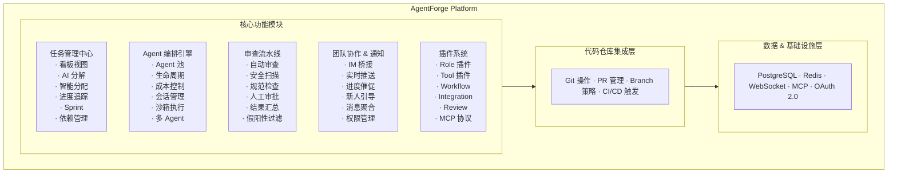

### 3.2 模块 1：任务管理中心

**核心能力：**

| 功能 | 描述 | 优先级 |
|------|------|--------|
| 看板视图 | 多视图（Board/List/Timeline/Calendar），支持拖拽 | P0 |
| AI 任务分解 | 大任务自动拆解为子任务，标记适合人/Agent 执行 | P0 |
| 智能分配 | 基于任务类型、成员技能、当前负载自动推荐分配 | P0 |
| 进度追踪 | 实时状态流转，自动检测停滞并预警 | P0 |
| Sprint 管理 | Cycle/Sprint 概念，燃尽图，速率追踪 | P1 |
| 依赖管理 | 任务间 blockedBy 关系，前置完成自动触发 | P1 |
| 自定义工作流 | 可配置的状态流转规则（如：需要审查→自动触发审查 Agent） | P1 |
| 成本汇总 | 每个任务/Sprint/项目的 Token 消耗和美元成本 | P1 |

**任务状态流转：**

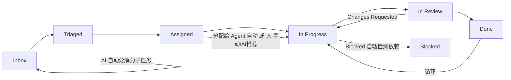

### 3.3 模块 2：Agent 编排引擎

**核心能力：**

| 功能 | 描述 | 优先级 |
|------|------|--------|
| Agent 池管理 | 管理多个 Agent 实例，支持并行执行 | P0 |
| 任务执行 | Agent 接收任务 → 分析代码 → 编码 → 测试 → 提交 PR | P0 |
| 生命周期管理 | spawn / monitor / pause / resume / kill | P0 |
| 成本控制 | 每任务预算上限（maxBudgetUsd），实时监控 | P0 |
| 会话管理 | 支持会话持久化、断点续做（session resume） | P1 |
| 沙箱执行 | 每个 Agent 独立 Git worktree + 隔离环境 | P1 |
| 多 Agent 模式 | Planner + Coder + Reviewer 角色分工 | P2 |
| Agent 记忆 | 跨会话记忆（项目知识、代码风格、历史经验） | P2 |

**Agent 执行流程：**

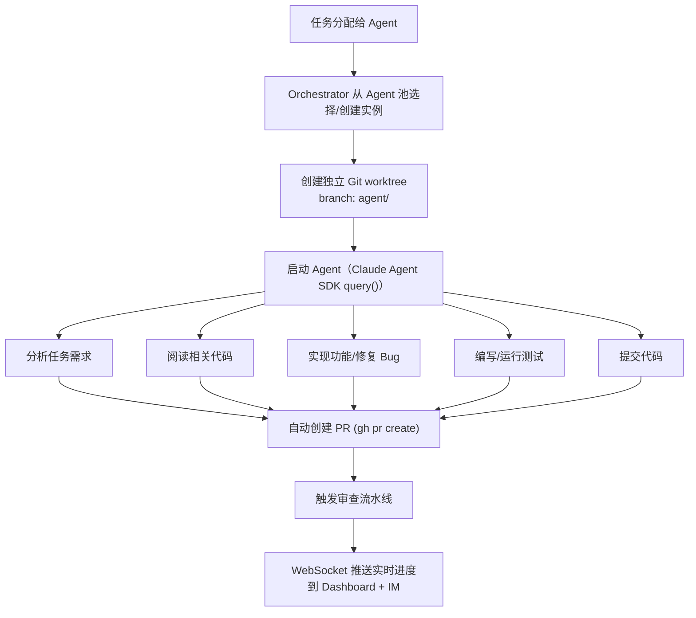

#### 3.3.1 整体编排架构（核心矛盾与决策）

AgentForge 的编排层面临一个核心架构决策：**Go 是最佳后端语言（goroutine 并发模型天然适配 Agent 生命周期管理、go-git 纯 Go 实现），但 Claude Agent SDK 仅提供 TypeScript/Python 版本**。

我们采用 **Go Orchestrator + TypeScript Agent SDK Bridge** 双进程架构。**关键决策：Bridge 是所有 AI 调用的统一出口，Go 侧不直接调用任何 LLM（去掉 LangChainGo 依赖）**。

| 组件 | 语言 | 职责范围 |
|------|------|---------|
| **Go Orchestrator** | Go | 纯业务逻辑：API 网关、任务调度、Agent 池管理、成本控制、Git 操作（go-git）、WebSocket Hub、IM Bridge — **不直接调用 LLM** |
| **TS Agent SDK Bridge** | TypeScript | **所有 AI 调用统一出口**：Agent 编码执行（query()）、AI 任务分解、IM 意图识别、Review Agent、会话管理、流式输出中继 |
| **前端 Vercel AI SDK v6** | TypeScript | 用户侧 AI 交互：聊天 UI、流式渲染、多 Provider 切换 |

**两条 AI 调用路径：**

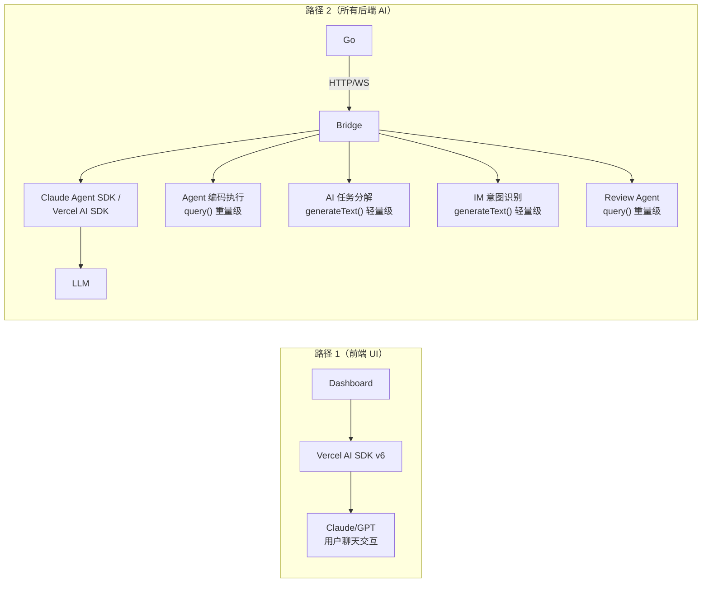

> **注意：** v1.2 架构决策中，Go↔TS Bridge 通信协议由 gRPC 改为 **HTTP（命令调用）+ WebSocket（事件/流式传输）**。Bridge 打包方式为 Bun compile 单二进制文件，作为 Tauri sidecar 运行。以下设计文档中的 proto 定义和 gRPC 代码保留作为接口契约参考，实际实现将使用等价的 HTTP+WS 协议。

**统一出口的好处：**

- 单一成本追踪点：所有 Token 消耗经过 Bridge，统一计费
- 单一 API Key 管理：Go 侧无需配置 LLM 密钥
- 减少依赖：Go 后端不依赖 LangChainGo，纯业务逻辑更清晰
- 多 Provider 扩展：Bridge 可通过 Vercel AI SDK Provider 抽象层接入其他模型

**整体架构图：**

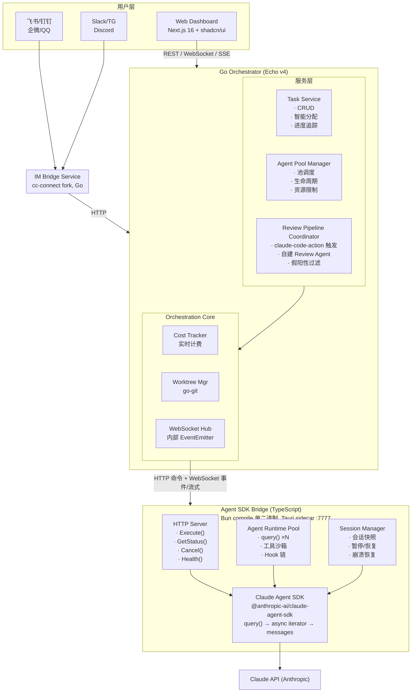

**数据流路径：**

```mermaid
flowchart TD
    User["用户在飞书发消息:\n帮我修复 issue #42"] --> IMB["IM Bridge → Go API Gateway"] --> TS["Task Service\n创建任务"]
    TS --> OC["Orchestration Core → Agent Pool Manager"]
    OC --> WM["1. Worktree Manager\n创建 /data/worktrees/<project>/<task-id>/"]
    OC --> CT["2. Cost Tracker\n初始化预算追踪 budget_usd: $5.00"]
    OC --> APM["3. Agent Pool Manager\n选择/创建 Agent 实例"]
    APM -->|HTTP Execute()| Bridge["Agent SDK Bridge"]
    Bridge --> Query["Bridge 调用 query()\nprompt: 修复 issue #42\nallowedTools: Read/Edit/Bash/Glob/Grep\npermissionMode: bypassPermissions"]
    Query <-->|流式 token| Claude["Claude API"]
    Query -->|WebSocket| GoBackend["Go Backend"]
    GoBackend --> WS["WebSocket\n前端"]
    GoBackend --> IMN["IM Bridge\n飞书通知"]
    GoBackend --> PG["PostgreSQL\n持久化"]
```

#### 3.3.2 Agent SDK Bridge 设计（接口契约与流式协议）

Agent SDK Bridge 是一个独立的 TypeScript 服务（Bun compile 单二进制），其核心职责是：

1. 封装 `@anthropic-ai/claude-agent-sdk` 的 `query()` 调用
2. 通过 HTTP+WebSocket 暴露 Agent 执行能力给 Go Orchestrator
3. 管理多个并发 Agent 运行时实例
4. 处理 Agent SDK 的会话状态（session snapshot/resume）
5. 执行工具沙箱策略（白名单、路径限制）

> **接口契约参考：** 以下 Proto 定义作为 Go↔TS 之间的接口契约文档保留。实际传输使用 HTTP JSON（命令）+ WebSocket JSON（事件流），字段映射与 proto 定义一一对应。

**Proto 定义（接口契约）：**

```protobuf
syntax = "proto3";
package agentforge.bridge;

option go_package = "github.com/agentforge/agentforge/pkg/proto/bridge";

// =============================================================
// Agent SDK Bridge 服务定义
// =============================================================
service AgentBridge {
  // HTTP POST /bridge/execute → WebSocket 返回 Agent 事件流
  rpc Execute(stream AgentCommand) returns (stream AgentEvent);

  // HTTP GET /bridge/status/:taskId
  rpc GetStatus(StatusRequest) returns (AgentStatus);

  // HTTP POST /bridge/cancel
  rpc Cancel(CancelRequest) returns (CancelResponse);

  // HTTP GET /bridge/health
  rpc HealthCheck(HealthRequest) returns (HealthResponse);

  // HTTP GET /bridge/active
  rpc ListActive(ListActiveRequest) returns (ListActiveResponse);

  // ─── 轻量 AI 调用（不启动 Agent 实例，直接调 LLM）───
  // HTTP POST /bridge/decompose — AI 任务分解
  rpc DecomposeTask(DecomposeRequest) returns (DecomposeResponse);

  // HTTP POST /bridge/classify-intent — IM 意图识别
  rpc ClassifyIntent(IntentRequest) returns (IntentResponse);

  // HTTP POST /bridge/generate — 通用 AI 补全
  rpc GenerateText(GenerateTextRequest) returns (GenerateTextResponse);
}

// =============================================================
// 命令消息（Go → TS Bridge）
// =============================================================
message AgentCommand {
  string task_id = 1;
  string session_id = 2;

  oneof command {
    ExecuteTask execute = 3;
    PauseTask pause = 4;
    ResumeTask resume = 5;
    ProvideInput provide_input = 6;
  }
}

message ExecuteTask {
  string prompt = 1;
  string worktree_path = 2;
  string branch_name = 3;
  string system_prompt = 4;
  int32 max_turns = 5;
  double budget_usd = 6;
  repeated string allowed_tools = 7;
  string permission_mode = 8;        // "bypassPermissions" | "acceptEdits"
  repeated McpServerConfig mcp_servers = 9;
  string session_snapshot = 10;       // 恢复用：上次会话快照 JSON
}

message PauseTask {}

message ResumeTask {
  string session_snapshot = 1;
}

message ProvideInput {
  string input = 1;
}

message McpServerConfig {
  string name = 1;
  string url = 2;
  map<string, string> env = 3;
}

// =============================================================
// 事件消息（TS Bridge → Go）
// =============================================================
message AgentEvent {
  string task_id = 1;
  string session_id = 2;
  int64 timestamp_ms = 3;

  oneof event {
    AgentOutput output = 10;
    ToolCall tool_call = 11;
    ToolResult tool_result = 12;
    StatusChange status_change = 13;
    CostUpdate cost_update = 14;
    AgentError error = 15;
    SessionSnapshot snapshot = 16;
  }
}

message AgentOutput {
  string content = 1;
  string content_type = 2;  // "text" | "code" | "diff" | "markdown"
  int32 turn_number = 3;
}

message ToolCall {
  string tool_name = 1;
  string tool_input = 2;   // JSON 序列化的工具参数
  string call_id = 3;
}

message ToolResult {
  string call_id = 1;
  string output = 2;
  bool is_error = 3;
}

message StatusChange {
  string old_status = 1;
  string new_status = 2;   // "starting" | "running" | "paused" | "completed" | "failed"
  string reason = 3;
}

message CostUpdate {
  int64 input_tokens = 1;
  int64 output_tokens = 2;
  int64 cache_read_tokens = 3;
  double cost_usd = 4;
  double budget_remaining_usd = 5;
}

message AgentError {
  string code = 1;           // "RATE_LIMIT" | "BUDGET_EXCEEDED" | "SESSION_EXPIRED"
  string message = 2;
  map<string, string> metadata = 3;
  bool retryable = 4;
}

message SessionSnapshot {
  string snapshot_data = 1;  // JSON: conversation history + tool state
  int32 turn_number = 2;
  double spent_usd = 3;
}

// =============================================================
// 辅助消息
// =============================================================
message StatusRequest { string task_id = 1; }
message AgentStatus {
  string task_id = 1;
  string state = 2;          // "idle" | "thinking" | "tool_executing" | "stuck"
  int32 turn_number = 3;
  string last_tool = 4;
  int64 last_activity_ms = 5;
  double spent_usd = 6;
}

message CancelRequest { string task_id = 1; string reason = 2; }
message CancelResponse { bool success = 1; }

message HealthRequest {}
message HealthResponse {
  string status = 1;          // "SERVING" | "NOT_SERVING"
  int32 active_agents = 2;
  int32 max_agents = 3;
  int64 uptime_ms = 4;
}

message ListActiveRequest {}
message ListActiveResponse { repeated AgentStatus agents = 1; }
```

**TypeScript Bridge 核心实现：**

```typescript
// src/bridge-server.ts
import { query, ClaudeAgentOptions, AssistantMessage, ResultMessage } from "@anthropic-ai/claude-agent-sdk";

interface AgentRuntime {
  taskId: string;
  sessionId: string;
  abortController: AbortController;
  status: "starting" | "running" | "paused" | "completed" | "failed";
  turnNumber: number;
  spentUsd: number;
  lastActivity: number;
}

class AgentBridgeServer {
  private runtimes: Map<string, AgentRuntime> = new Map();
  private maxConcurrent: number;

  constructor(maxConcurrent = 10) {
    this.maxConcurrent = maxConcurrent;
  }

  /**
   * 执行 Agent 任务 -- 核心方法
   * Go 通过 HTTP POST /bridge/execute 调用，事件通过 WebSocket 返回
   */
  private async handleExecute(
    sendEvent: (event: AgentEvent) => void,
    command: AgentCommand
  ): Promise<void> {
    const { taskId, sessionId } = command;
    const exec = command.execute!;

    // 检查并发限制
    if (this.runtimes.size >= this.maxConcurrent) {
      sendEvent(this.makeErrorEvent(taskId, sessionId, {
        code: "MAX_CONCURRENT",
        message: `已达最大并发 Agent 数 (${this.maxConcurrent})`,
        retryable: true,
      }));
      return;
    }

    const abortController = new AbortController();
    const runtime: AgentRuntime = {
      taskId,
      sessionId,
      abortController,
      status: "starting",
      turnNumber: 0,
      spentUsd: 0,
      lastActivity: Date.now(),
    };
    this.runtimes.set(taskId, runtime);

    // 发送状态变更事件
    sendEvent(this.makeStatusEvent(taskId, sessionId, "idle", "starting"));

    try {
      // 构建 Agent SDK 选项
      const options: ClaudeAgentOptions = {
        allowedTools: exec.allowedTools.length > 0
          ? exec.allowedTools
          : ["Read", "Edit", "Bash", "Glob", "Grep"],
        permissionMode: (exec.permissionMode as any) || "bypassPermissions",
        systemPrompt: exec.systemPrompt || this.defaultSystemPrompt(taskId),
        cwd: exec.worktreePath,
        abortSignal: abortController.signal,
        maxTurns: exec.maxTurns || 30,
      };

      // 如果有 MCP 服务器配置
      if (exec.mcpServers?.length) {
        options.mcpServers = exec.mcpServers.map((s) => ({
          name: s.name,
          url: s.url,
          env: Object.fromEntries(Object.entries(s.env)),
        }));
      }

      runtime.status = "running";
      sendEvent(this.makeStatusEvent(taskId, sessionId, "starting", "running"));

      // 核心：调用 Claude Agent SDK query()
      for await (const message of query({
        prompt: exec.prompt,
        options,
      })) {
        runtime.lastActivity = Date.now();

        if (message instanceof AssistantMessage) {
          for (const block of message.content) {
            if ("text" in block) {
              sendEvent({
                taskId, sessionId,
                timestampMs: Date.now(),
                output: {
                  content: block.text,
                  contentType: "text",
                  turnNumber: runtime.turnNumber,
                },
              });
            }
            if ("name" in block) {
              runtime.turnNumber++;
              sendEvent({
                taskId, sessionId,
                timestampMs: Date.now(),
                toolCall: {
                  toolName: block.name,
                  toolInput: JSON.stringify(block.input),
                  callId: block.id || "",
                },
              });
            }
          }
        }

        // 提取 usage 信息生成 CostUpdate
        if (message.usage) {
          const costUsd = this.calculateCost(message.usage);
          runtime.spentUsd += costUsd;
          sendEvent({
            taskId, sessionId,
            timestampMs: Date.now(),
            costUpdate: {
              inputTokens: message.usage.input_tokens || 0,
              outputTokens: message.usage.output_tokens || 0,
              cacheReadTokens: message.usage.cache_read_input_tokens || 0,
              costUsd,
              budgetRemainingUsd: exec.budgetUsd - runtime.spentUsd,
            },
          });

          // 预算检查
          if (runtime.spentUsd >= exec.budgetUsd) {
            abortController.abort();
            sendEvent(this.makeErrorEvent(taskId, sessionId, {
              code: "BUDGET_EXCEEDED",
              message: `预算已耗尽: $${runtime.spentUsd.toFixed(4)} / $${exec.budgetUsd}`,
              retryable: false,
            }));
            break;
          }
        }

        if (message instanceof ResultMessage) {
          runtime.status = "completed";
          sendEvent(this.makeStatusEvent(
            taskId, sessionId, "running", "completed", message.subtype
          ));
        }
      }
    } catch (err: any) {
      runtime.status = "failed";
      const agentError = this.classifyError(err);
      sendEvent(this.makeErrorEvent(taskId, sessionId, agentError));
    } finally {
      this.runtimes.delete(taskId);
    }
  }

  /**
   * 错误分类：将 SDK 异常映射为结构化错误
   */
  private classifyError(
    err: any
  ): { code: string; message: string; retryable: boolean } {
    if (err.status === 429) {
      return { code: "RATE_LIMIT", message: err.message, retryable: true };
    }
    if (err.status === 401 || err.status === 403) {
      return { code: "AUTH_FAILED", message: err.message, retryable: false };
    }
    if (err.name === "AbortError") {
      return { code: "CANCELLED", message: "Agent 被取消", retryable: false };
    }
    return { code: "INTERNAL", message: err.message, retryable: false };
  }

  /**
   * 成本计算（Claude 定价）
   */
  private calculateCost(usage: any): number {
    const INPUT_PER_MTOK = 3.00;   // Claude Sonnet 4
    const OUTPUT_PER_MTOK = 15.00;
    const CACHE_READ_PER_MTOK = 0.30;

    const input = (usage.input_tokens || 0) / 1_000_000 * INPUT_PER_MTOK;
    const output = (usage.output_tokens || 0) / 1_000_000 * OUTPUT_PER_MTOK;
    const cache = (usage.cache_read_input_tokens || 0) / 1_000_000
                  * CACHE_READ_PER_MTOK;

    return input + output + cache;
  }

  private defaultSystemPrompt(taskId: string): string {
    return `你是 AgentForge 平台的编码 Agent。你的任务 ID 是 ${taskId}。
规则：
1. 仅在指定的 worktree 目录内操作
2. 完成编码后运行测试确保通过
3. 使用 git add + git commit 提交你的修改
4. commit message 格式: feat/fix/refactor: <描述> [agent/${taskId}]
5. 不要修改 .env、密钥文件或配置文件中的凭证`;
  }

  // ... 辅助方法: makeStatusEvent, makeErrorEvent 等
}
```

**流式支持详解：**

Bridge 的流式架构实现了三级流转：

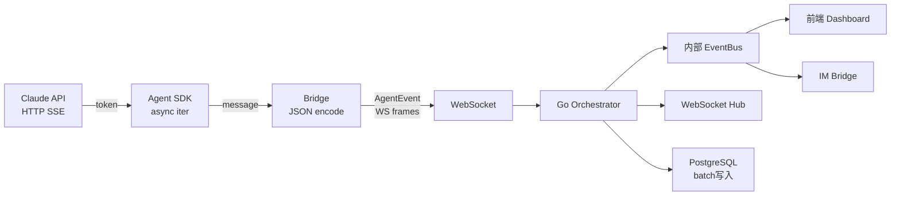

Go 侧使用 goroutine 扇出模式消费 WebSocket 事件流：

```go
func (s *AgentService) relayStream(wsConn *websocket.Conn, taskID string) {
    // 使用带缓冲的 channel 防止背压
    eventCh := make(chan *AgentEvent, 256)

    // 启动多个消费者 goroutine
    var wg sync.WaitGroup

    wg.Add(3)
    go func() { defer wg.Done(); s.wsHub.BroadcastEvents(taskID, eventCh) }()
    go func() { defer wg.Done(); s.imBridge.ForwardEvents(taskID, eventCh) }()
    go func() { defer wg.Done(); s.agentRunRepo.BatchPersist(taskID, eventCh) }()

    // 生产者：从 WebSocket 读取事件
    for {
        _, data, err := wsConn.ReadMessage()
        if err != nil {
            s.handleStreamError(taskID, err)
            break
        }

        var event AgentEvent
        json.Unmarshal(data, &event)

        // 扇出到所有消费者（非阻塞）
        select {
        case eventCh <- &event:
        default:
            // 缓冲区满：记录指标，丢弃最旧事件
            metrics.AgentEventDropped.WithLabelValues(taskID).Inc()
        }
    }

    close(eventCh)
    wg.Wait()
}
```

#### 3.3.3 Agent 池管理（暖池、冷启动、资源限制）

Agent 池采用 **弹性池 + 预热** 模式，在启动延迟和资源利用之间取得平衡：

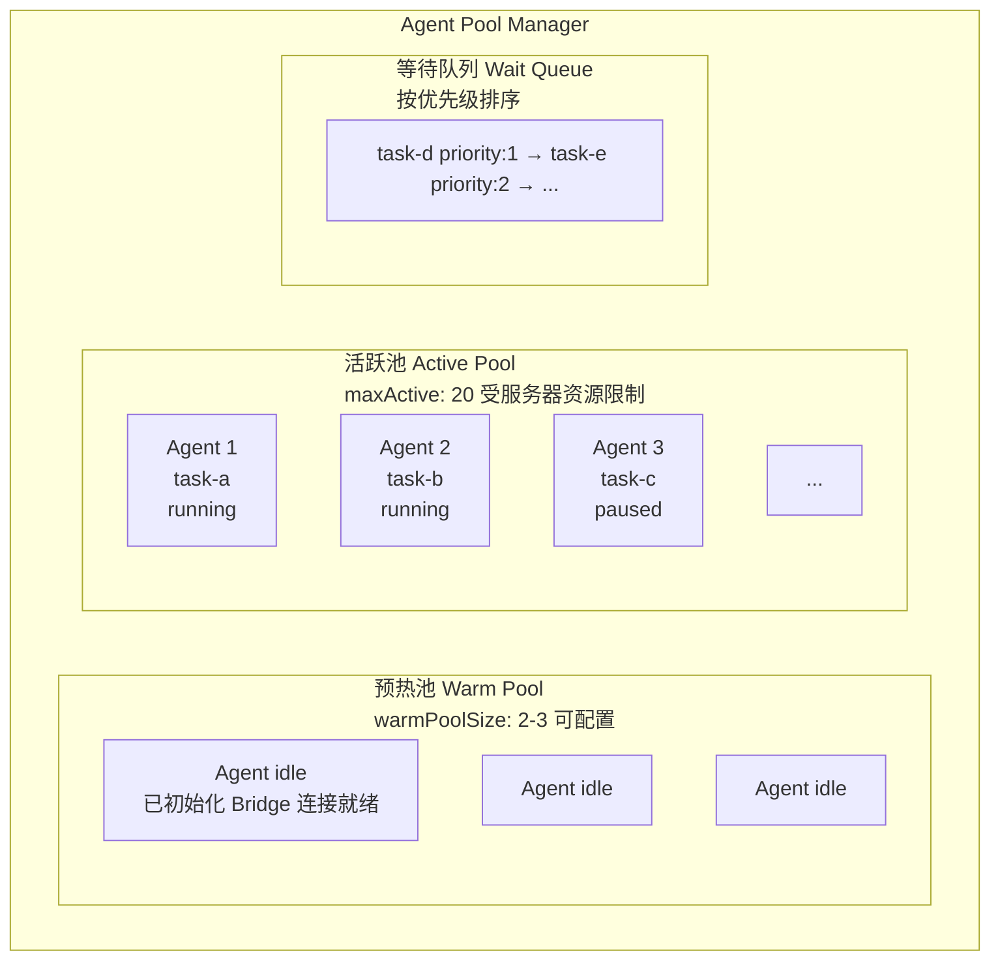

**池大小配置：**

```go
type PoolConfig struct {
    // 核心参数
    MaxActive       int           `yaml:"max_active" default:"20"`
    WarmPoolSize    int           `yaml:"warm_pool_size" default:"2"`
    MaxQueueSize    int           `yaml:"max_queue_size" default:"100"`

    // 资源限制（每 Agent）
    PerAgentMemoryMB   int       `yaml:"per_agent_memory_mb" default:"512"`
    PerAgentCPUShares  int       `yaml:"per_agent_cpu_shares" default:"1024"`

    // 超时
    IdleTimeout        time.Duration `yaml:"idle_timeout" default:"5m"`
    MaxExecutionTime   time.Duration `yaml:"max_execution_time" default:"30m"`
    WarmPoolRefreshInterval time.Duration `yaml:"warm_refresh" default:"10m"`
}

// 动态池大小计算
func (pc *PoolConfig) CalculateMaxActive() int {
    availableMemoryMB := getAvailableMemoryMB()
    availableCPUs := runtime.NumCPU()

    memoryBased := availableMemoryMB / pc.PerAgentMemoryMB
    cpuBased := availableCPUs * 4  // 每核心可支持约 4 个 I/O 密集型 Agent

    calculated := min(memoryBased, cpuBased)
    return min(calculated, pc.MaxActive) // 不超过配置上限
}
```

**预热池 vs 冷启动：**

| 指标 | 预热池 Agent | 冷启动 Agent |
|------|-------------|-------------|
| 启动延迟 | < 500ms（直接分配） | 3-8s（Bridge 初始化 + SDK 加载） |
| 内存占用 | 每实例约 150MB（空闲态） | 按需分配 |
| 适用场景 | 高频任务分配、SLA 要求高 | 低频使用、资源紧张 |

**Agent 实例复用策略：**

```go
type AgentPoolManager struct {
    mu          sync.RWMutex
    config      *PoolConfig
    active      map[string]*AgentInstance  // taskID → instance
    warmPool    []*AgentInstance            // 预热实例
    waitQueue   *PriorityQueue             // 按优先级排序

    bridgeClient *BridgeHTTPClient
    worktreeMgr  *WorktreeManager
    costTracker  *CostTracker
    metrics      *PoolMetrics
}

// 获取 Agent 实例（优先从预热池取）
func (pm *AgentPoolManager) Acquire(ctx context.Context, task *Task) (*AgentInstance, error) {
    pm.mu.Lock()
    defer pm.mu.Unlock()

    // 1. 检查活跃池是否已满
    if len(pm.active) >= pm.config.MaxActive {
        // 加入等待队列
        err := pm.enqueue(ctx, task)
        if err != nil {
            return nil, fmt.Errorf("等待队列已满: %w", err)
        }
        return nil, ErrQueued // 调用方监听通知等待调度
    }

    // 2. 尝试从预热池获取
    if len(pm.warmPool) > 0 {
        inst := pm.warmPool[len(pm.warmPool)-1]
        pm.warmPool = pm.warmPool[:len(pm.warmPool)-1]
        inst.TaskID = task.ID
        inst.Status = AgentStarting
        pm.active[task.ID] = inst

        pm.metrics.WarmPoolHit.Inc()
        go pm.replenishWarmPool() // 异步补充预热池
        return inst, nil
    }

    // 3. 冷启动新实例
    pm.metrics.ColdStart.Inc()
    inst, err := pm.createInstance(ctx, task)
    if err != nil {
        return nil, err
    }
    pm.active[task.ID] = inst
    return inst, nil
}

// 释放 Agent 实例
func (pm *AgentPoolManager) Release(taskID string) {
    pm.mu.Lock()
    inst, exists := pm.active[taskID]
    if exists {
        delete(pm.active, taskID)
    }
    pm.mu.Unlock()

    if !exists {
        return
    }

    // 清理 Agent 状态
    inst.Reset()

    // 如果预热池未满，回收到预热池（复用 Bridge 连接）
    pm.mu.Lock()
    if len(pm.warmPool) < pm.config.WarmPoolSize {
        pm.warmPool = append(pm.warmPool, inst)
        pm.mu.Unlock()
    } else {
        pm.mu.Unlock()
        inst.Destroy() // 销毁多余实例
    }

    // 检查等待队列，调度下一个任务
    go pm.scheduleNext()
}
```

**资源限制：**

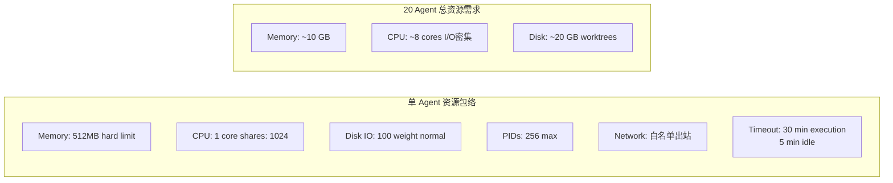

#### 3.3.4 任务到 Agent 分配流程

**完整链路序列图：**

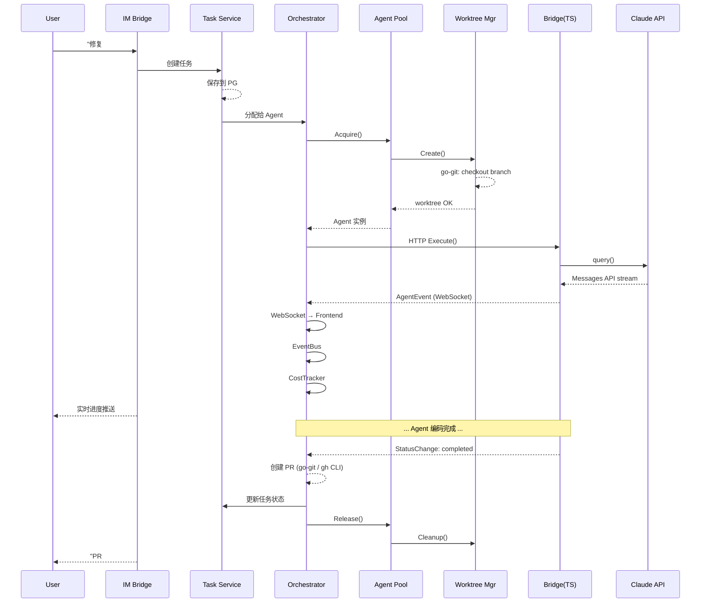

**分配决策逻辑：**

```go
func (o *Orchestrator) AssignToAgent(ctx context.Context, task *Task) error {
    // 1. 预算校验
    if task.BudgetUsd <= 0 {
        task.BudgetUsd = o.defaultBudget(task)
    }

    // 2. Sprint 预算检查
    if task.SprintID != "" {
        sprint, _ := o.sprintRepo.Get(ctx, task.SprintID)
        if sprint.SpentUsd >= sprint.TotalBudgetUsd {
            return ErrSprintBudgetExhausted
        }
    }

    // 3. 获取 Agent 实例
    inst, err := o.pool.Acquire(ctx, task)
    if errors.Is(err, ErrQueued) {
        task.Status = TaskStatusQueued
        o.taskRepo.Update(ctx, task)
        o.notify(task, "任务已进入队列，当前有 %d 个 Agent 在工作",
            o.pool.ActiveCount())
        return nil
    }
    if err != nil {
        return fmt.Errorf("获取 Agent 失败: %w", err)
    }

    // 4. 创建 worktree
    wt, err := o.worktreeMgr.Create(ctx, task.ID, task.Project.RepoBranch)
    if err != nil {
        o.pool.Release(task.ID)
        return fmt.Errorf("创建 worktree 失败: %w", err)
    }

    // 5. 构建执行上下文
    prompt := o.buildAgentPrompt(task)

    // 6. 启动执行（异步）
    go o.executeAndMonitor(ctx, inst, task, wt, prompt)

    // 7. 更新任务状态
    task.Status = TaskStatusInProgress
    task.AgentBranch = wt.Branch
    task.AgentWorktree = wt.Path
    o.taskRepo.Update(ctx, task)

    return nil
}
```

#### 3.3.5 Git Worktree 管理

每个 Agent 任务在独立的 Git worktree 中执行，避免并发冲突：

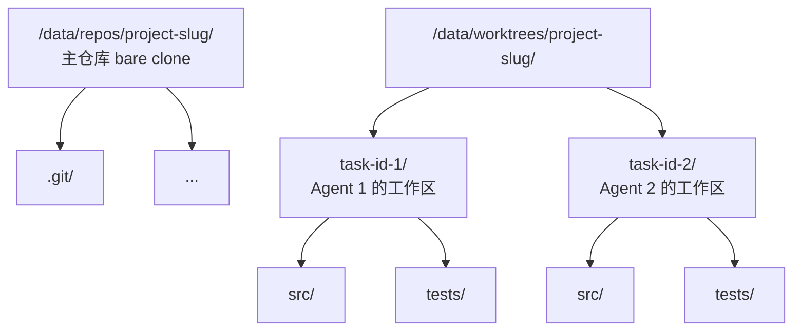

**分支命名规范：**

```
格式:   agent/<task-id>
示例:   agent/550e8400-e29b
长格式: agent/550e8400-e29b-41d4-a716-446655440000

PR 标题格式: [Agent] <task-title>
Commit 格式: <type>: <description> [agent/<task-id>]
```

**并行 Worktree 上限：**

```
默认上限: 20 (与 Agent 池 maxActive 一致)

资源估算:
  小型仓库 (< 100MB):   20 worktrees ≈  2 GB 磁盘
  中型仓库 (100MB-1GB):  20 worktrees ≈ 20 GB 磁盘
  大型仓库 (> 1GB):      10 worktrees ≈ 10 GB 磁盘 (浅克隆)

动态调整: 根据磁盘可用空间自动降低上限
```

**go-git 代码示例：**

```go
package worktree

import (
    "context"
    "fmt"
    "os"
    "path/filepath"
    "sync"
    "time"

    "github.com/go-git/go-git/v5"
    "github.com/go-git/go-git/v5/config"
    "github.com/go-git/go-git/v5/plumbing"
    "github.com/go-git/go-git/v5/plumbing/transport/http"
)

type WorktreeManager struct {
    mu           sync.Mutex
    repoPath     string                     // 主仓库路径
    worktreeBase string                     // worktree 存放根目录
    repo         *git.Repository
    worktrees    map[string]*WorktreeInfo   // taskID → info
    maxActive    int
    semaphore    chan struct{}               // 并发创建控制
    auth         *http.BasicAuth
}

type WorktreeInfo struct {
    TaskID    string
    Branch    string
    Path      string
    CreatedAt time.Time
    Status    string // "creating" | "active" | "cleaning"
}

func NewWorktreeManager(
    repoURL, repoPath, worktreeBase string,
    maxActive int, token string,
) (*WorktreeManager, error) {
    // Clone 或打开已有仓库
    repo, err := git.PlainOpen(repoPath)
    if err != nil {
        repo, err = git.PlainClone(repoPath, false, &git.CloneOptions{
            URL: repoURL,
            Auth: &http.BasicAuth{
                Username: "x-access-token",
                Password: token,
            },
        })
        if err != nil {
            return nil, fmt.Errorf("克隆仓库失败: %w", err)
        }
    }

    return &WorktreeManager{
        repoPath:     repoPath,
        worktreeBase: worktreeBase,
        repo:         repo,
        worktrees:    make(map[string]*WorktreeInfo),
        maxActive:    maxActive,
        semaphore:    make(chan struct{}, 3), // 最多 3 个并发创建
        auth: &http.BasicAuth{
            Username: "x-access-token", Password: token,
        },
    }, nil
}

// Create 创建新的 worktree 用于 Agent 任务
func (wm *WorktreeManager) Create(
    ctx context.Context, taskID, baseBranch string,
) (*WorktreeInfo, error) {
    // 获取信号量（限制并发创建数）
    select {
    case wm.semaphore <- struct{}{}:
        defer func() { <-wm.semaphore }()
    case <-ctx.Done():
        return nil, ctx.Err()
    }

    wm.mu.Lock()
    defer wm.mu.Unlock()

    // 检查上限
    if len(wm.worktrees) >= wm.maxActive {
        return nil, fmt.Errorf("已达 worktree 上限 (%d)", wm.maxActive)
    }

    // 拉取最新代码
    wt, err := wm.repo.Worktree()
    if err != nil {
        return nil, err
    }
    err = wt.Pull(&git.PullOptions{
        RemoteName: "origin",
        Auth:       wm.auth,
    })
    if err != nil && err != git.NoErrAlreadyUpToDate {
        return nil, fmt.Errorf("拉取最新代码失败: %w", err)
    }

    // 创建分支: agent/<task-id>
    branchName := fmt.Sprintf("agent/%s", taskID)
    branchRef := plumbing.NewBranchReferenceName(branchName)

    // 基于 baseBranch 创建新分支
    baseRef, err := wm.repo.Reference(
        plumbing.NewBranchReferenceName(baseBranch), true,
    )
    if err != nil {
        return nil, fmt.Errorf("找不到基础分支 %s: %w", baseBranch, err)
    }

    ref := plumbing.NewHashReference(branchRef, baseRef.Hash())
    err = wm.repo.Storer.SetReference(ref)
    if err != nil {
        return nil, fmt.Errorf("创建分支失败: %w", err)
    }

    // 创建 worktree 目录
    wtPath := filepath.Join(wm.worktreeBase, taskID)
    err = os.MkdirAll(wtPath, 0755)
    if err != nil {
        return nil, fmt.Errorf("创建 worktree 目录失败: %w", err)
    }

    // 使用 git worktree add
    // (go-git 对 worktree 支持有限，此处调用 git CLI)
    err = execGitWorktreeAdd(wm.repoPath, wtPath, branchName)
    if err != nil {
        os.RemoveAll(wtPath)
        return nil, fmt.Errorf("git worktree add 失败: %w", err)
    }

    info := &WorktreeInfo{
        TaskID:    taskID,
        Branch:    branchName,
        Path:      wtPath,
        CreatedAt: time.Now(),
        Status:    "active",
    }
    wm.worktrees[taskID] = info

    return info, nil
}

// Cleanup 清理指定任务的 worktree 和分支
func (wm *WorktreeManager) Cleanup(
    ctx context.Context, taskID string, deleteBranch bool,
) error {
    wm.mu.Lock()
    info, exists := wm.worktrees[taskID]
    if !exists {
        wm.mu.Unlock()
        return nil
    }
    info.Status = "cleaning"
    wm.mu.Unlock()

    // 1. 删除 worktree 目录
    if err := os.RemoveAll(info.Path); err != nil {
        return fmt.Errorf("删除 worktree 目录失败: %w", err)
    }

    // 2. 清理 git worktree 元数据
    _ = execGitWorktreePrune(wm.repoPath)

    // 3. 如果需要，删除远程分支（PR 已合并或任务取消）
    if deleteBranch {
        refName := plumbing.NewBranchReferenceName(info.Branch)
        _ = wm.repo.Storer.RemoveReference(refName)

        // 删除远程分支
        _ = wm.repo.Push(&git.PushOptions{
            RemoteName: "origin",
            RefSpecs: []config.RefSpec{
                config.RefSpec(":" + string(refName)),
            },
            Auth: wm.auth,
        })
    }

    wm.mu.Lock()
    delete(wm.worktrees, taskID)
    wm.mu.Unlock()

    return nil
}

// GarbageCollect 定时清理僵尸 worktree
func (wm *WorktreeManager) GarbageCollect(maxAge time.Duration) {
    wm.mu.Lock()
    defer wm.mu.Unlock()

    now := time.Now()
    for taskID, info := range wm.worktrees {
        if now.Sub(info.CreatedAt) > maxAge && info.Status == "active" {
            fmt.Printf("GC: 清理超龄 worktree task=%s age=%v\n",
                taskID, now.Sub(info.CreatedAt))
            go wm.Cleanup(context.Background(), taskID, false)
        }
    }
}
```

#### 3.3.6 成本控制实现（双重预算模型）

> **v1.2 架构决策：** 采用双重预算控制模型。TS Bridge 侧执行本地硬限制（maxBudget 由 Go 每次 HTTP 调用携带），Go 侧维护跨任务的全局预算。

**三层预算架构：**

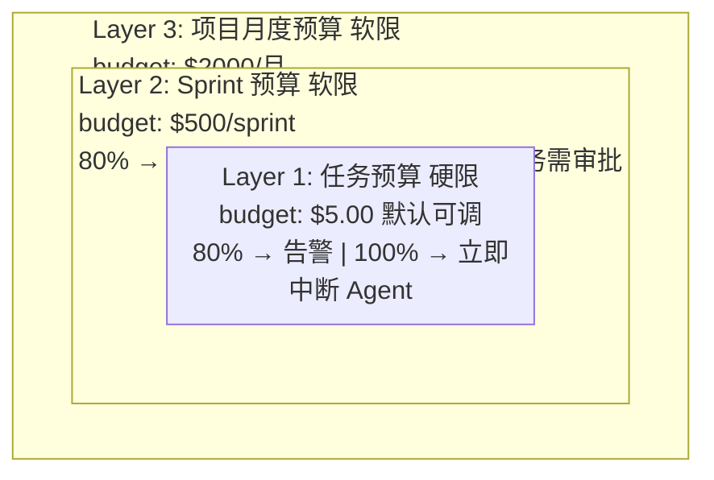

**实时 Token 计数：**

Token 计数来自两个来源，按优先级选择：

1. **Claude API 响应中的 `usage` 字段**（精确值，优先采用）
2. **TS Bridge 侧的 tokenizer 估算**（作为 API usage 缺失时的回退）

```go
type CostTracker struct {
    mu sync.RWMutex

    pricing      map[string]*ModelPricing // "claude-sonnet-4" → pricing
    taskCosts    map[string]*TaskCost
    sprintCosts  map[string]*SprintCost
    projectCosts map[string]*ProjectCost

    db     *gorm.DB
    notify func(event CostEvent)
}

type ModelPricing struct {
    Model            string
    InputPerMTok     float64 // $/百万 input tokens
    OutputPerMTok    float64 // $/百万 output tokens
    CacheReadPerMTok float64 // $/百万 cache read tokens
}

// 默认定价表 (2026-03)
var DefaultPricing = map[string]*ModelPricing{
    "claude-sonnet-4": {
        Model: "claude-sonnet-4",
        InputPerMTok: 3.0, OutputPerMTok: 15.0, CacheReadPerMTok: 0.30,
    },
    "claude-haiku-4": {
        Model: "claude-haiku-4",
        InputPerMTok: 0.80, OutputPerMTok: 4.0, CacheReadPerMTok: 0.08,
    },
    "claude-opus-4": {
        Model: "claude-opus-4",
        InputPerMTok: 15.0, OutputPerMTok: 75.0, CacheReadPerMTok: 1.50,
    },
}
```

**maxBudgetUsd 执行流程：**

```go
// RecordUsage 是成本控制的核心方法，每次 CostUpdate 事件触发
func (ct *CostTracker) RecordUsage(
    taskID string, update *CostUpdate,
) (CostAction, error) {
    ct.mu.Lock()
    defer ct.mu.Unlock()

    tc := ct.taskCosts[taskID]
    if tc == nil {
        return CostActionNone, ErrTaskNotTracked
    }

    // 1. 累加
    tc.InputTokens += update.InputTokens
    tc.OutputTokens += update.OutputTokens
    tc.CacheReadTokens += update.CacheReadTokens
    tc.SpentUsd += update.CostUsd
    tc.CallCount++

    // 2. 任务级预算检查 (硬限)
    ratio := tc.SpentUsd / tc.BudgetUsd

    if ratio >= 1.0 {
        go ct.notify(CostEvent{
            Type:   CostEventBudgetExceeded,
            TaskID: taskID,
            Spent:  tc.SpentUsd,
            Budget: tc.BudgetUsd,
        })
        return CostActionKill, nil
    }

    if ratio >= 0.8 && !tc.AlertSent80 {
        tc.AlertSent80 = true
        go ct.notify(CostEvent{
            Type:   CostEventBudgetWarning,
            TaskID: taskID,
            Spent:  tc.SpentUsd,
            Budget: tc.BudgetUsd,
            Message: fmt.Sprintf(
                "任务预算已用 %.0f%% ($%.2f/$%.2f)",
                ratio*100, tc.SpentUsd, tc.BudgetUsd,
            ),
        })
    }

    // 3. 级联更新 Sprint 和 Project 成本
    ct.cascadeUpdate(tc, update.CostUsd)

    return CostActionContinue, nil
}
```

**超预算处理：**

```go
func (o *Orchestrator) handleBudgetExceeded(taskID string) {
    // 1. 请求 Bridge 保存会话快照后取消 (< 100ms)
    o.bridgeClient.Cancel(context.Background(), taskID, "budget_exceeded")

    // 2. 更新任务状态
    o.taskRepo.UpdateStatus(context.Background(), taskID, TaskStatusBudgetExceeded)

    // 3. WebSocket 通知前端
    o.wsHub.Broadcast("task:"+taskID, map[string]any{
        "type":   "agent.budget_exceeded",
        "taskId": taskID,
    })

    // 4. IM 通知任务分配者
    task, _ := o.taskRepo.Get(context.Background(), taskID)
    o.imBridge.Send(task.ReporterID, fmt.Sprintf(
        "任务「%s」的 Agent 预算已耗尽 ($%.2f/$%.2f)，需要增加预算或手动完成",
        task.Title, task.SpentUsd, task.BudgetUsd,
    ))
}
```

**成本回调钩子：**

```go
type CostCallback func(event CostEvent)

type CostEvent struct {
    Type    CostEventType
    TaskID  string
    Spent   float64
    Budget  float64
    Message string
}

type CostEventType string

const (
    CostEventBudgetWarning  CostEventType = "budget_warning"   // 80%
    CostEventBudgetExceeded CostEventType = "budget_exceeded"  // 100%
    CostEventSprintWarning  CostEventType = "sprint_warning"   // Sprint 80%
    CostEventProjectWarning CostEventType = "project_warning"  // Project 90%
)
```

#### 3.3.7 会话管理（持久化、断点续做）

Agent 的会话状态通过 `SessionSnapshot` 机制实现跨重启持久化：

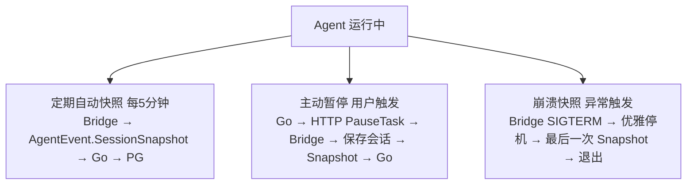

**会话存储：**

```go
// 会话存储键设计
const (
    // 活跃会话状态（低延迟读取）
    keySessionState   = "session:%s:state"    // Hash
    // 会话快照（恢复用）
    keySessionSnap    = "session:%s:snapshot"  // String (JSON)
    // 会话历史（审计用）
    keySessionHistory = "session:%s:history"   // List
)

type SessionStore struct {
    db    *gorm.DB // PostgreSQL 持久化
}

// Save 保存会话快照到 PostgreSQL
func (ss *SessionStore) Save(
    ctx context.Context, taskID string, snap *SessionSnapshot,
) error {
    snapJSON, err := json.Marshal(snap)
    if err != nil {
        return err
    }

    // 写 PostgreSQL（持久化，崩溃后可恢复）
    return ss.db.Create(&AgentSessionSnapshot{
        TaskID:       taskID,
        TurnNumber:   snap.TurnNumber,
        SpentUsd:     snap.SpentUsd,
        SnapshotData: string(snapJSON),
        CreatedAt:    time.Now(),
    }).Error
}

// Restore 恢复会话（从 PostgreSQL）
func (ss *SessionStore) Restore(
    ctx context.Context, taskID string,
) (*SessionSnapshot, error) {
    var record AgentSessionSnapshot
    err := ss.db.Where("task_id = ?", taskID).
        Order("created_at DESC").First(&record).Error
    if err != nil {
        return nil, fmt.Errorf("未找到会话快照: %w", err)
    }

    var snap SessionSnapshot
    json.Unmarshal([]byte(record.SnapshotData), &snap)

    return &snap, nil
}
```

**崩溃后恢复流程：**

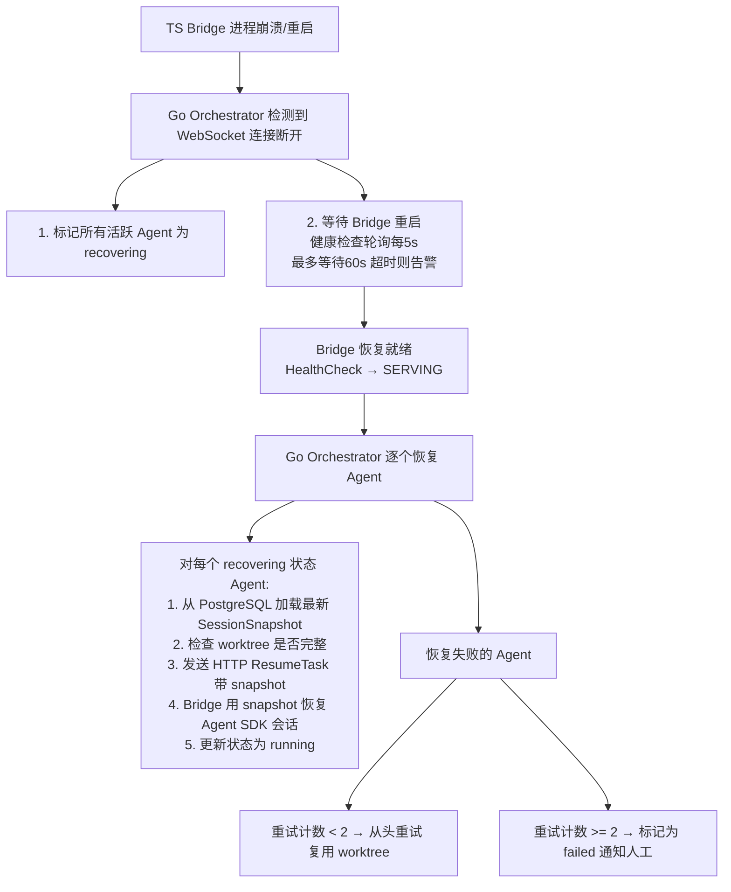

#### 3.3.8 多 Agent 模式（P2: Planner/Coder/Reviewer）

P2 阶段引入 Planner/Coder/Reviewer 三角色协作模式：

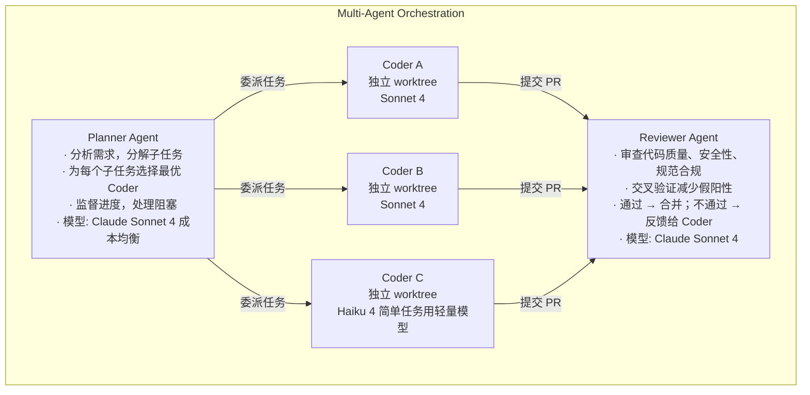

**Agent 间通信：**

Agent 间通过 Go Orchestrator 中转消息，不直接通信：

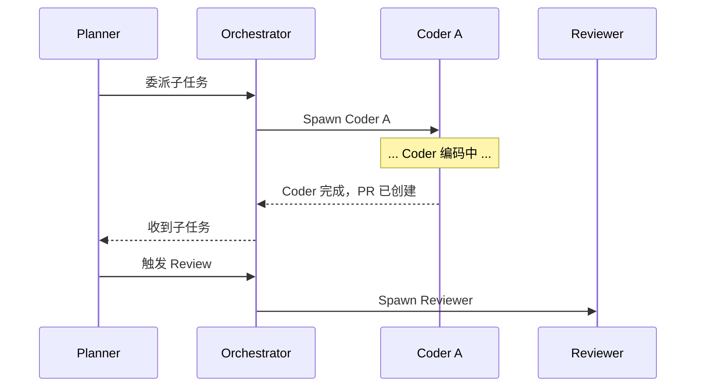

**任务委派流程：**

```go
type MultiAgentOrchestrator struct {
    pool     *AgentPoolManager
    taskRepo TaskRepository
    bridge   *BridgeHTTPClient
}

// PlannerDelegate 处理 Planner Agent 的委派请求
func (mao *MultiAgentOrchestrator) PlannerDelegate(
    ctx context.Context,
    parentTaskID string,
    subtask *SubtaskSpec,
) error {
    // 1. 创建子任务
    childTask := &Task{
        ParentID:     parentTaskID,
        Title:        subtask.Title,
        Description:  subtask.Description,
        BudgetUsd:    subtask.EstimatedBudget,
        Labels:       subtask.Labels,
        AssigneeType: "agent",
    }
    if err := mao.taskRepo.Create(ctx, childTask); err != nil {
        return err
    }

    // 2. 选择角色: coder 或 reviewer
    switch subtask.Role {
    case "coder":
        return mao.assignToCoder(ctx, childTask)
    case "reviewer":
        return mao.assignToReviewer(ctx, childTask)
    default:
        return mao.assignToCoder(ctx, childTask)
    }
}
```

**Planner 工具注入：**

Planner Agent 通过自定义 MCP 工具与 Orchestrator 交互：

```typescript
// Planner 专用工具定义
const plannerTools = [
  {
    name: "delegate_task",
    description: "将子任务委派给 Coder Agent 执行",
    inputSchema: {
      type: "object",
      properties: {
        title: { type: "string", description: "子任务标题" },
        description: { type: "string", description: "详细描述和验收标准" },
        role: { type: "string", enum: ["coder", "reviewer"] },
        complexity: { type: "string", enum: ["low", "medium", "high"] },
        files: { type: "array", items: { type: "string" } },
        dependencies: { type: "array", items: { type: "string" } },
      },
      required: ["title", "description", "role"],
    },
  },
  {
    name: "check_subtask_status",
    description: "查询已委派子任务的执行状态",
    inputSchema: {
      type: "object",
      properties: {
        subtaskId: { type: "string" },
      },
      required: ["subtaskId"],
    },
  },
  {
    name: "request_review",
    description: "请求 Reviewer Agent 审查指定 PR",
    inputSchema: {
      type: "object",
      properties: {
        prUrl: { type: "string" },
        focusAreas: { type: "array", items: { type: "string" } },
      },
      required: ["prUrl"],
    },
  },
];
```

### 3.4 模块 3：审查流水线

#### 3.4.1 三层审查架构

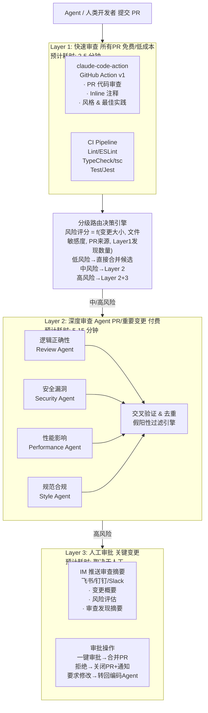

**设计原则：**

| 原则 | 描述 |
|------|------|
| **成本分级** | 低风险 PR 仅用免费的 Layer 1；高风险 PR 叠加付费 Layer 2/3 |
| **并行审查** | Layer 2 的多维度审查并行执行，不串行等待 |
| **假阳性最小化** | 交叉验证 + 历史学习，目标假阳性率 < 5% |
| **自动闭环** | 审查发现 → 变更请求 → Agent 自动修复 → 重新审查，减少人工介入 |
| **可插拔** | 审查维度可自定义扩展，新增审查 Agent 无需修改核心流程 |

#### 3.4.2 Layer 1 快速审查

**claude-code-action 集成：**

[claude-code-action](https://github.com/anthropics/claude-code-action) 是 Anthropic 官方的 GitHub Action（v1.0，MIT 协议），直接在 GitHub Runner 上运行 Claude Code，对 PR 进行代码审查、问答和修改建议。

**核心特性：**

- 智能模式检测：根据触发事件自动选择执行模式（PR 审查、@claude 提及、自动化任务）
- 内联注释：可在 PR diff 中精确标注问题代码行
- 进度追踪：实时更新审查进度（checkbox 追踪）
- 结构化输出：可返回 JSON 格式审查结果供后续流程消费
- 多 Provider 支持：Anthropic API / AWS Bedrock / Google Vertex AI / Microsoft Foundry
- 完全在自有 Runner 上执行，API 调用走用户选择的 Provider

**运行成本：** 使用用户自有 Anthropic API Key 按 Token 计费，单次 PR 审查约 $0.01-0.10（取决于 PR 大小和模型选择）。也可使用 Claude Code OAuth Token 作为替代认证方式。

**工作流配置要点：**

- `review-layer1.yml`: 使用 `anthropics/claude-code-action@v1`，所有非 Draft PR 自动触发
- `ci.yml`: 标准 CI 流水线（pnpm lint / typecheck / test + golangci-lint / go test）
- 支持 `@claude` 交互（issue_comment / review_comment 触发）
- 使用 `--json-schema` 输出结构化审查摘要，驱动后续分级路由

**触发规则：**

| 事件 | 触发动作 | 说明 |
|------|---------|------|
| `pull_request.opened` | Layer 1 完整审查 | 新 PR 打开时 |
| `pull_request.synchronize` | Layer 1 增量审查 | 推送新 commit 时 |
| `pull_request.ready_for_review` | Layer 1 完整审查 | Draft 转 Ready 时 |
| `issue_comment.created` | @claude 交互 | 评论中 @claude 时 |
| `pull_request_review_comment.created` | @claude 交互 | review 注释中 @claude 时 |

**Layer 1 输出：**

Layer 1 审查完成后产出结构化 JSON（通过 `--json-schema` 参数获取）：

```json
{
  "risk_level": "medium",
  "findings_count": 3,
  "categories": ["security", "performance"],
  "summary": "发现 3 个问题：1 个 SQL 注入风险（高）、1 个未索引查询（中）、1 个未处理错误（低）",
  "needs_deep_review": true
}
```

此输出作为 **分级路由决策** 的输入，决定是否触发 Layer 2。

#### 3.4.3 Layer 2 深度审查

**自建 Review Agent 架构：**

Layer 2 使用 Claude Agent SDK（TypeScript）构建自定义 Review Agent，通过 Agent SDK Bridge（TS 子服务）与 Go 后端通信。

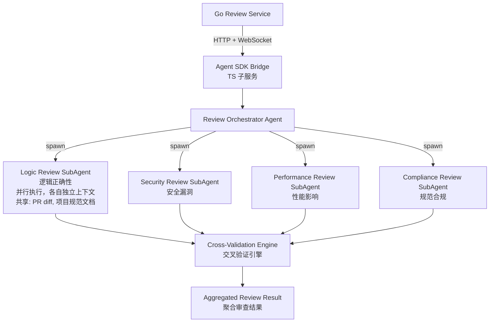

**四个并行审查维度：**

| 维度 | Agent | 模型 | 审查重点 |
|------|-------|------|---------|
| 逻辑正确性 | Logic Review Agent | Opus | 边界条件、错误处理、状态一致性、算法正确性、类型安全 |
| 安全漏洞 | Security Review Agent | Opus | OWASP Top 10 逐项检查（注入、认证、访问控制等），标注 CWE 编号 |
| 性能影响 | Performance Review Agent | Sonnet | 数据库查询（N+1/索引）、算法复杂度、内存/goroutine 泄漏、前端性能 |
| 规范合规 | Compliance Review Agent | Sonnet | 命名规范、代码组织、错误处理模式、测试规范、Git 提交规范 |

**执行流程：** `Promise.all()` 并行启动 4 个 SubAgent → 交叉验证去重 → 假阳性过滤 → 聚合结果

每个 Agent 输出结构化 findings：`{severity, category, file, line, message, suggestion}`

**触发条件：**

| 条件 | 触发方式 | 说明 |
|------|---------|------|
| Agent 提交的 PR | 自动 | 所有 Agent 生成的 PR 强制深度审查 |
| Layer 1 判定 `needs_deep_review: true` | 自动 | Layer 1 发现高风险问题 |
| 风险评分 >= 中 | 自动 | 分级路由引擎评估 |
| 人工触发 | 手动 | 通过 IM 或 Dashboard 手动触发 `/review deep <pr-url>` |
| 敏感文件变更 | 自动 | 见安全审查触发规则 |

**Layer 2 触发机制：** `review-layer2.yml` 由 Layer 1 的 `workflow_run` 事件驱动，检查 `needs_deep_review` 标志后调用 AgentForge Review API 触发深度审查。

#### 3.4.4 Layer 3 人工审批

**IM 审查摘要推送：**

通过飞书卡片消息（或其他 IM 适配格式）推送审查摘要，包含：

- PR 基本信息（仓库、分支、提交者、关联任务）
- 风险评估等级、变更规模
- 审查发现摘要（按严重性分类）
- 操作按钮：审批通过 / 拒绝 / 要求修改 / 查看详情

**审批操作处理流程：**

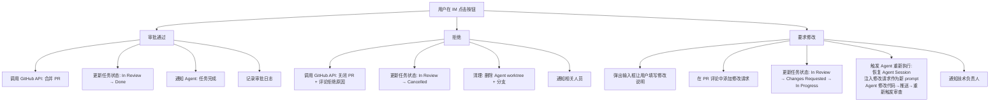

**人工审批触发规则：**

| 条件 | 说明 |
|------|------|
| Layer 2 发现 critical/high 级别问题 | 存在高危发现 |
| 涉及认证/授权/支付等关键模块 | 敏感文件路径匹配 |
| 变更量 > 500 行 | 大规模变更 |
| Agent 首次处理该类型任务 | Agent 信任度尚未建立 |
| 项目配置要求人工审批 | 在项目 settings 中可配置 |

#### 3.4.5 分级路由决策引擎

```typescript
function determineReviewLevel(pr: PRMetadata): ReviewLevel {
  const score = calculateRiskScore(pr);

  // 微小变更（< 20 行，仅文档/配置）→ Layer 1 only
  if (pr.additions + pr.deletions < 20 && isDocOrConfigOnly(pr.files)) {
    return { layers: [1], models: { layer1: "claude-haiku-4-5" } };
  }

  // 小变更（< 100 行，无敏感文件）→ Layer 1 with Sonnet
  if (pr.additions + pr.deletions < 100 && !hasSensitiveFiles(pr.files)) {
    return { layers: [1], models: { layer1: "claude-4-0-sonnet-20250805" } };
  }

  // Agent PR 或中等变更 → Layer 1 + 2
  if (pr.labels.includes("agent-generated") || score >= 0.5) {
    return {
      layers: [1, 2],
      models: {
        layer1: "claude-4-0-sonnet-20250805",
        security: "claude-opus-4-1-20250805",
        logic: "claude-4-0-sonnet-20250805",
        performance: "claude-4-0-sonnet-20250805",
        compliance: "claude-haiku-4-5-20251001",
      },
    };
  }

  // 大变更或高风险 → Layer 1 + 2 + 3
  if (score >= 0.8 || pr.additions + pr.deletions > 500) {
    return {
      layers: [1, 2, 3],
      models: {
        layer1: "claude-4-0-sonnet-20250805",
        security: "claude-opus-4-1-20250805",
        logic: "claude-opus-4-1-20250805",
        performance: "claude-4-0-sonnet-20250805",
        compliance: "claude-4-0-sonnet-20250805",
      },
    };
  }

  // 默认 Layer 1
  return { layers: [1], models: { layer1: "claude-4-0-sonnet-20250805" } };
}

function calculateRiskScore(pr: PRMetadata): number {
  let score = 0;
  const size = pr.additions + pr.deletions;

  // 变更大小
  if (size > 500) score += 0.3;
  else if (size > 200) score += 0.2;
  else if (size > 50) score += 0.1;

  // 敏感文件
  if (hasSensitiveFiles(pr.files)) score += 0.3;

  // Agent 生成
  if (pr.labels.includes("agent-generated")) score += 0.2;

  // 变更文件数
  if (pr.changedFiles > 10) score += 0.1;

  // Layer 1 发现数量
  if (pr.layer1Findings > 3) score += 0.2;

  return Math.min(score, 1.0);
}
```

#### 3.4.6 审查结果聚合

**多层 Findings 合并：**

```typescript
interface ReviewFinding {
  id: string;
  layer: 1 | 2;
  dimension: "quick" | "logic" | "security" | "performance" | "compliance";
  severity: "critical" | "high" | "medium" | "low" | "info";
  category: string;
  subcategory?: string;
  file: string;
  line?: number;
  endLine?: number;
  message: string;
  suggestion?: string;
  cwe?: string;        // CWE 编号（安全类）
  confidence: number;  // 0-1 置信度
  isValidated: boolean; // 是否经过交叉验证
}

interface AggregatedReviewResult {
  prUrl: string;
  reviewId: string;
  overallRisk: "critical" | "high" | "medium" | "low";
  findings: ReviewFinding[];
  summary: string;          // 可操作摘要
  metrics: {
    totalFindings: number;
    bySeverity: Record<string, number>;
    byDimension: Record<string, number>;
    falsePositivesFiltered: number;
    duplicatesRemoved: number;
  };
  recommendation: "approve" | "request_changes" | "reject";
  estimatedFixTime: string; // 预估修复时间
}
```

**去重策略：**

1. **精确去重**：同文件 + 同行号 + 相似消息（Levenshtein 距离 < 0.3）→ 合并，保留最高 severity
2. **语义去重**：使用 Embedding 计算 findings 间语义相似度，相似度 > 0.85 视为重复
3. **保留策略**：重复发现合并时，保留所有维度标签（如同一问题同时被 security 和 logic 发现）

**严重性评分：**

最终严重性 = max(各维度评分) + 上下文加权

```
最终评分 = base_severity x context_multiplier

context_multiplier 规则:
  - 涉及认证模块: x 1.5
  - 涉及支付模块: x 2.0
  - 涉及用户数据: x 1.3
  - 被多个维度同时发现: x 1.2
  - 在主分支直接修改: x 1.5
```

**可操作摘要生成示例：**

```
## 审查摘要 -- PR #87

**风险等级: 中等** | 发现 4 个问题 (1 高 / 2 中 / 1 低) | 预估修复: 30 分钟

### 必须修复 (阻塞合并)
1. [高] auth/token.go:87 -- SQL 参数未转义，存在注入风险
   → 建议: 使用 sqlx.NamedQuery 替代字符串拼接

### 建议修复
2. [中] auth/session.go:42 -- 并发场景缺少 mutex 保护
3. [中] auth/token.go:123 -- 数据库查询未设超时

### 可选优化
4. [低] auth/token.go:15 -- 变量名 `t` 建议改为 `tokenRefreshInterval`

**建议操作: 要求修改（修复第 1 项后可合并）**
```

#### 3.4.7 假阳性管理

**交叉验证机制：**

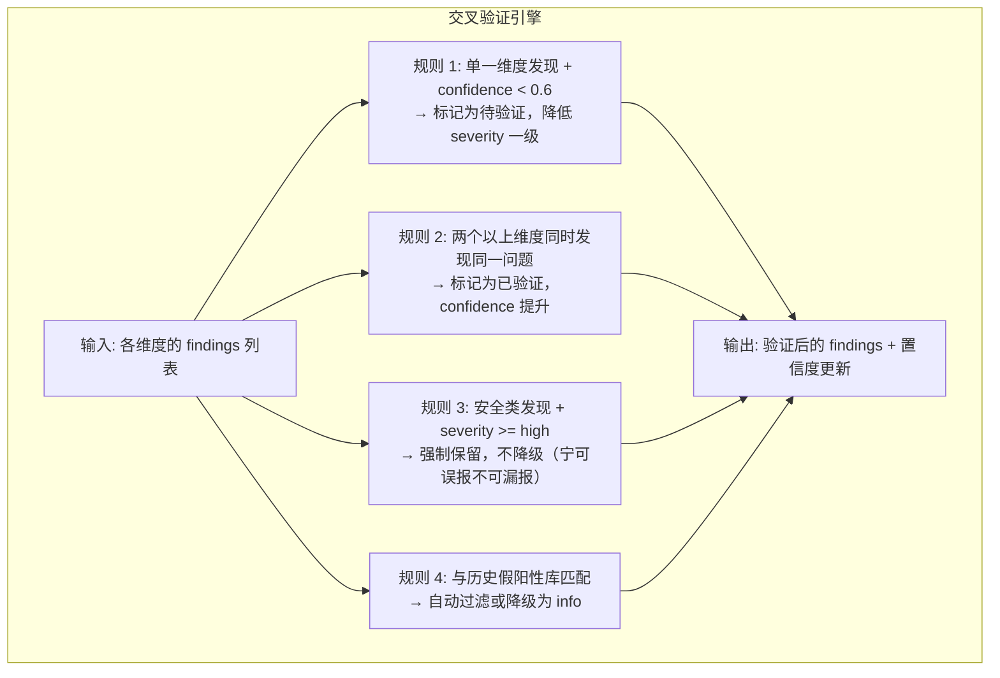

**历史假阳性学习：**

```sql
-- 假阳性记录表
CREATE TABLE false_positives (
    id          UUID PRIMARY KEY DEFAULT gen_random_uuid(),
    project_id  UUID REFERENCES projects(id),
    pattern     TEXT NOT NULL,          -- 匹配模式（正则或语义描述）
    category    VARCHAR(50),            -- 审查维度
    file_pattern VARCHAR(255),          -- 文件路径模式
    reason      TEXT,                   -- 标记为假阳性的原因
    reporter_id UUID REFERENCES members(id),
    occurrences INTEGER DEFAULT 1,      -- 累计出现次数
    is_strong   BOOLEAN DEFAULT FALSE,  -- 强假阳性（>=3次确认）
    created_at  TIMESTAMPTZ DEFAULT NOW(),
    updated_at  TIMESTAMPTZ DEFAULT NOW()
);

CREATE INDEX idx_fp_project ON false_positives(project_id);
CREATE INDEX idx_fp_category ON false_positives(category);
```

**学习流程：**

1. 审查人员在 PR 评论中标记假阳性：`@claude false-positive: 这个不是安全问题，因为...`
2. 系统提取假阳性模式，存入 `false_positives` 表
3. 后续审查时，匹配引擎自动检查新 findings 是否与已知假阳性模式匹配
4. 匹配到的 findings 自动降级为 `info` 或过滤
5. 当同一模式累计出现 >= 3 次，将其提升为"强假阳性"，未来自动过滤

**用户反馈循环：**

```mermaid
flowchart TD
    Finding["审查发现 finding"] --> Accept["用户认可\n→ 记录为真阳性\n→ 增加该类型检查权重"]
    Finding --> FP["用户标记假阳性"]
    Finding --> Ignore["用户忽略 不操作\n→ 30天后自动标记为已过期 不影响学习"]

    FP --> FP1["记录模式到假阳性库"]
    FP --> FP2["调整该类型检查参数"]
    FP --> FP3["如果同一Agent连续产出假阳性\n→ 调整 Agent prompt"]
```

**假阳性率目标：** < 5%（即 100 个发现中假阳性不超过 5 个）

#### 3.4.8 与 Agent 工作流集成

**Agent PR 触发审查的完整流程：**

```mermaid
flowchart TD
    S1["1. 任务分配\n用户通过 IM/Dashboard 创建任务 → 分配给 Agent\n任务状态: Assigned"] -->
    S2["2. Agent 执行编码\nAgent SDK Bridge 启动 Agent → 独立 worktree\nAgent 分析 → 编码 → 测试 → commit\n任务状态: In Progress"] -->
    S3["3. 创建 PR\nAgent 通过 gh pr create 创建 PR\nPR标签: agent-generated\n任务状态: In Review"] -->
    S4["4. Layer 1 自动触发\nGitHub Action 启动 claude-code-action\n同时启动 CI lint+typecheck+test"] -->
    S5["5. 分级路由\nagent-generated 标签 → 强制进入 Layer 2"] -->
    S6["6. Layer 2 深度审查\nReview Service 启动 4 个并行 SubAgent\n交叉验证 → 假阳性过滤 → 聚合结果"]

    S6 --> NoRisk["无高危发现\n自动批准合并\n任务完成 Done"]
    S6 --> HasRisk["有高危发现\nLayer 3 人工审批"]
    HasRisk --> Approved["审批通过\n任务完成 Done"]
    HasRisk --> Changes["要求修改\nAgent 自动修改\n回到步骤 2"]
```

**审查结果回流到任务状态：**

```go
// Go 后端 Review Service - 审查结果处理
func (s *ReviewService) HandleReviewResult(ctx context.Context, result *AggregatedReviewResult) error {
    task, err := s.taskRepo.GetByPRUrl(ctx, result.PRUrl)
    if err != nil {
        return err
    }

    switch result.Recommendation {
    case "approve":
        // 自动合并 PR
        if err := s.githubClient.MergePR(ctx, result.PRUrl); err != nil {
            return err
        }
        // 更新任务状态为完成
        task.Status = "done"
        task.CompletedAt = time.Now()

    case "request_changes":
        // 更新任务状态为需要修改
        task.Status = "changes_requested"
        // 将修改请求转发给 Agent
        s.bridgeClient.RequestChanges(ctx, task.AgentSessionID, ReviewChangesPrompt{
            Findings:    result.Findings,
            Summary:     result.Summary,
            TaskContext: task,
        })

    case "reject":
        // 关闭 PR
        s.githubClient.ClosePR(ctx, result.PRUrl, result.Summary)
        task.Status = "cancelled"
    }

    // 保存任务状态变更
    if err := s.taskRepo.Update(ctx, task); err != nil {
        return err
    }

    // 发送通知
    s.notifier.NotifyReviewComplete(ctx, task, result)

    // 记录审查到数据库
    return s.reviewRepo.Save(ctx, &Review{
        TaskID:   task.ID,
        PRUrl:    result.PRUrl,
        Reviewer: "review-pipeline",
        Status:   string(result.Recommendation),
        Findings: result.Findings,
        Summary:  result.Summary,
        CostUSD:  result.Cost,
    })
}
```

**变更请求时自动重新执行：**

```typescript
// Agent SDK Bridge - 处理变更请求
async function handleChangesRequested(
  sessionId: string,
  changes: ReviewChangesPrompt,
): Promise<void> {
  // 尝试恢复已有 session（断点续做）
  const result = await claude({
    prompt: `之前的 PR 审查发现了以下问题，请逐一修复：

${changes.findings
  .filter((f) => f.severity === "critical" || f.severity === "high")
  .map(
    (f, i) => `
${i + 1}. [${f.severity.toUpperCase()}] ${f.file}:${f.line}
   问题: ${f.message}
   建议: ${f.suggestion || "请根据问题描述修复"}
`,
  )
  .join("\n")}

修复后请运行测试确保所有测试通过，然后 commit 并 push 到当前分支。`,
    options: {
      resume: sessionId, // 恢复之前的 session
      maxTurns: 20,
    },
  });

  // push 后 GitHub Action 自动重新触发 Layer 1
  // 形成闭环: 修改 → push → Layer 1 → (可能) Layer 2 → 合并/再次修改
}
```

#### 3.4.9 安全审查细节

**安全审查触发规则：**

安全审查（Layer 2 Security SubAgent）在以下情况 **强制触发**：

| 触发条件 | 匹配规则 | 说明 |
|---------|---------|------|
| 认证相关变更 | 文件路径匹配 `**/auth/**`, `**/login/**`, `**/session/**`, `**/oauth/**` | 认证流程变更 |
| 加密相关变更 | 文件路径匹配 `**/crypto/**`, `**/encrypt/**`；或 diff 包含 `crypto.`, `bcrypt`, `jwt.Sign` | 密码学操作 |
| 输入处理变更 | diff 包含 `req.Body`, `req.Query`, `req.Params`, `FormValue`, `innerHTML`, `dangerouslySetInnerHTML` | 用户输入处理 |
| 数据库操作 | diff 包含原始 SQL 字符串拼接（`"SELECT.*" +`）、新增 SQL 查询 | SQL 注入风险 |
| 依赖变更 | 修改 `package.json`, `go.mod`, `go.sum`, `pnpm-lock.yaml` | 供应链安全 |
| 配置变更 | 修改 `.env*`, `config/**`, `**/secrets/**`, `docker-compose*` | 安全配置 |
| API 端点变更 | 新增路由注册（`router.GET`, `app.Post`, `api.HandleFunc`） | 新攻击面 |
| 权限相关 | diff 包含 `role`, `permission`, `admin`, `sudo`, `elevated` | 权限提升风险 |

**GitHub Action 触发：** `security-review.yml` 通过 `paths` 过滤器自动触发（auth/crypto/model/migration/config/route 等目录），使用 Opus 模型执行 OWASP Top 10 逐项检查。

**依赖漏洞扫描：** CI 中集成 `pnpm audit` + `govulncheck`，结果上报 AgentForge Review Service。

**安全审查严重性映射：**

| 安全发现类型 | 默认 Severity | 上下文加权后最高 |
|-------------|--------------|---------------|
| SQL 注入 (CWE-89) | critical | critical |
| 认证绕过 (CWE-287) | critical | critical |
| 硬编码凭据 (CWE-798) | high | critical (生产配置) |
| XSS (CWE-79) | high | critical (用户数据页面) |
| SSRF (CWE-918) | high | critical (内网可达) |
| 路径遍历 (CWE-22) | high | high |
| 竞态条件 (CWE-362) | medium | high (支付/余额) |
| 日志泄露 (CWE-532) | medium | high (含密码/Token) |
| 缺少输入验证 (CWE-20) | medium | high (面向公网) |
| 弱加密 (CWE-327) | medium | medium |
| 依赖漏洞 (已知 CVE) | 按 CVSS 评分 | 按 CVSS 评分 |

#### 3.4.10 审查成本优化

**分级审查成本模型：**

```mermaid
graph TD
    subgraph CostModel["成本分级策略"]
        L1["Layer 1: claude-code-action Sonnet\n所有 PR 100%覆盖\n成本: ~$0.01-0.10/PR\n预估: 50×$0.05=$2.50/月"]
        L2["Layer 2: 深度审查 Opus/Sonnet\nAgent PR + 中风险以上 30-50%覆盖\n成本: ~$0.30-1.50/PR\n预估: 20×$0.80=$16.00/月"]
        L3["Layer 3: 人工审批\n高风险 + 关键变更 10-20%覆盖\n成本: 人工时间，无API费用\n总计API成本: ~$18.50/月"]
    end
    L1 --> L2 --> L3
```

**模型选择策略：**

| 审查维度 | 推荐模型 | 原因 | 单次成本估算 |
|---------|---------|------|------------|
| Layer 1 快速审查 | claude-4-0-sonnet | 性价比最优，足够覆盖常见问题 | $0.01-0.10 |
| 逻辑正确性 | claude-4-0-sonnet | 中等复杂度即可 | $0.05-0.20 |
| 安全漏洞 | claude-opus-4-1 | 安全审查需要最强推理能力 | $0.15-0.60 |
| 性能影响 | claude-4-0-sonnet | 模式匹配为主 | $0.05-0.20 |
| 规范合规 | claude-haiku-4-5 | 规则匹配为主，轻量模型即可 | $0.01-0.05 |
| 交叉验证 | claude-haiku-4-5 | 简单比对任务 | $0.01-0.03 |

**审查成本预算控制：** 每个项目设置月度审查预算上限（`MonthlyLimit`），80% 阈值时告警通知技术负责人，超过上限自动降级为 Layer 1 only。

#### 3.4.11 审查数据模型

> 审查相关的 `reviews`、`review_aggregations`、`false_positives` 表定义见 [Section 6.3 审查数据模型扩展](#63-审查数据模型扩展)。

### 3.5 模块 4：团队协作与通知

**核心能力：**

| 功能 | 描述 | 优先级 |
|------|------|--------|
| IM 桥接 | 支持飞书/钉钉/企微/Slack/Telegram/Discord | P0 |
| 自然语言交互 | 通过 IM 用自然语言下达任务指令 | P0 |
| 实时进度推送 | Agent 执行状态实时推送到 IM + Dashboard | P0 |
| 智能催促 | AI 检测进度异常，自动提醒成员和负责人 | P1 |
| 新人引导 | 分析新人技能，推荐任务，生成上下文说明 | P2 |
| 日报/周报 | AI 自动汇总团队进度，生成日报/周报 | P2 |

**IM 交互协议：**

```
用户指令类型：
  /task create <description>     — 创建任务
  /task assign <id> @agent       — 分配给 Agent
  /task status <id>              — 查看状态
  /task move <id> <status>       — 流转任务状态
  /task list                     — 查看我的任务
  /agent status [id]             — 查看 Agent 池或运行状态
  /agent run <prompt>            — 直接执行 Agent 指令
  /agent pause|resume|kill <id>  — 控制 Agent 生命周期
  /queue list [status]           — 查看 Agent 队列
  /team list                     — 查看项目成员摘要
  /memory search|note            — 搜索或记录项目记忆
  /review <pr-url>               — 触发审查
  /sprint status                 — Sprint 概览
  @AgentForge <自然语言>          — AI 理解意图并执行
```

#### 3.5.1 核心能力

IM 桥接层是 AgentForge 的用户交互入口之一，将多个聊天平台的消息统一翻译为 AgentForge 内部 API 调用。核心目标是让用户无需打开 Web Dashboard，直接在日常使用的 IM 工具中完成任务管理和 Agent 操控。

**关键能力矩阵：**

| 能力 | 描述 | 依赖 |
|------|------|------|
| 消息收发 | 接收用户 IM 消息，发送系统回复和通知 | 各平台 SDK |
| 斜杠命令 | `/task`, `/agent`, `/review`, `/sprint` 等结构化命令 | Go Engine 路由 |
| 自然语言 | `@AgentForge <任意文字>` → AI 意图识别 → API 调用 | TS Bridge AI |
| 富消息 | 交互卡片（飞书）、内联按钮（Telegram）、Block Kit（Slack） | 各平台可选接口 |
| 通知推送 | AgentForge 后端主动向 IM 推送任务状态、审查结果等通知 | WebSocket 通信 |
| 流式输出 | Agent 执行时的实时进度推送到 IM | SSE/WebSocket |

#### 3.5.2 cc-connect 架构分析

AgentForge 的 IM Bridge 层基于 [cc-connect](https://github.com/chenhg5/cc-connect)（MIT License, 2.4k Stars, Go 99.4%）进行 Fork 和改造。cc-connect 是一个 **IM-to-Agent 桥接器**，将本地运行的 AI 编码 Agent 连接到 10 个聊天平台，采用 **Hub-and-Spoke** 架构。

**目录结构：**

```mermaid
graph TD
    Root["cc-connect/"]
    Root --> CMD["cmd/cc-connect/\n程序入口 main.go"]
    Root --> Core["core/\n核心抽象层：接口定义、注册表、消息类型、Engine 路由引擎"]
    Core --> IF["interfaces.go\nPlatform / Agent / AgentSession 接口定义"]
    Core --> REG["registry.go\n插件注册表 PlatformFactory / AgentFactory"]
    Core --> MSG["message.go\n统一消息类型"]
    Core --> ENG["engine.go\n中央路由引擎"]
    Core --> SESS["session.go\n会话管理"]
    Core --> I18N["i18n.go\n国际化 5种语言"]
    Core --> SPEECH["speech.go\n语音转文字"]
    Root --> Platform["platform/\nIM 平台适配器 10个 直接复用"]
    Platform --> Feishu["feishu/ 飞书/Lark — WebSocket 长连接"]
    Platform --> Dingtalk["dingtalk/ 钉钉 — Stream 模式"]
    Platform --> Slack["slack/ Slack — Socket Mode"]
    Platform --> Telegram["telegram/ Telegram — Long Polling"]
    Platform --> Discord["discord/ Discord — Gateway"]
    Platform --> Wecom["wecom/ 企业微信 — WebSocket/Webhook"]
    Platform --> Others["line/ qq/ qqbot/ wechat/ ..."]
    Root --> Agent["agent/\nAI Agent 适配器 需要替换"]
    Root --> Config["config/\nTOML 配置加载/保存/热重载"]
    Root --> Daemon["daemon/\n守护进程管理"]
```

**核心接口：**

```go
// Platform 接口 — 抽象 IM 平台
type Platform interface {
    Name() string
    Start(handler MessageHandler) error
    Reply(ctx context.Context, replyCtx any, content string) error
    Send(ctx context.Context, replyCtx any, content string) error
    Stop() error
}

type MessageHandler func(p Platform, msg *Message)

// Agent 接口 — 抽象 AI Agent
type Agent interface {
    Name() string
    StartSession(ctx context.Context, sessionID string) (AgentSession, error)
    ListSessions(ctx context.Context) ([]AgentSessionInfo, error)
    Stop() error
}

// AgentSession 接口 — 运行中的 Agent 会话
type AgentSession interface {
    Send(prompt string, images []ImageAttachment, files []FileAttachment) error
    RespondPermission(requestID string, result PermissionResult) error
    Events() <-chan Event
    CurrentSessionID() string
    Alive() bool
    Close() error
}
```

**插件注册机制（工厂模式 + init()）：**

```go
// 全局注册表
var platformFactories = make(map[string]PlatformFactory)
var agentFactories    = make(map[string]AgentFactory)

func RegisterPlatform(name string, factory PlatformFactory) {
    platformFactories[name] = factory
}

// 各平台在 init() 中注册自己
// platform/feishu/feishu.go
func init() {
    core.RegisterPlatform("feishu", New)
}
```

**消息流转全景：**

```mermaid
flowchart TD
    User["用户在飞书发消息"] --> WS["platform/feishu/\nWebSocket 长连接接收事件"]
    WS --> Conv["将原始消息转换为 core.Message\nSessionKey: feishu:{chatID}:{userID}\nContent: 帮我修复 auth 模块的 bug"]
    Conv --> Handler["调用 handler(platform, message)\nEngine.handleMessage()"]
    Handler --> AL["AllowList 过滤"]
    Handler --> RL["RateLimit 限频"]
    Handler --> BW["BannedWords 过滤"]
    Handler --> Alias["Alias 别名解析"]
    Handler --> Cmd{"检测斜杠命令\n/task /agent /review 等"}
    Cmd -->|命令匹配| CmdExec["执行命令 → Reply 返回结果"]
    Cmd -->|非命令消息| IAM["processInteractiveMessage()"]
    IAM --> Session["查找或创建 AgentSession"]
    IAM --> Send["session.Send(prompt, images, files)"]
    IAM --> Events["监听 session.Events() 通道"]
    Events --> ET["EventThinking → Reply(思考中...)"]
    Events --> ETU["EventToolUse → Reply(执行: Bash)"]
    Events --> ETX["EventText → Reply(内容)"]
    Events --> ER["EventResult → Reply(最终结果)"]
    Events --> EPR["EventPermissionRequest → 发送权限确认按钮"]
```

**平台可选接口（支持差异化能力）：**

```go
// 流式消息更新（Telegram、Discord、飞书支持）
type MessageUpdater interface {
    UpdateMessage(ctx context.Context, replyCtx any, content string) error
}

// 图片发送
type ImageSender interface {
    SendImage(ctx context.Context, replyCtx any, img ImageAttachment) error
}

// 内联按钮（Telegram 支持）
type InlineButtonSender interface {
    SendWithButtons(ctx context.Context, replyCtx any, content string,
        buttons [][]ButtonOption) error
}

// 富文本卡片（飞书支持）
type CardSender interface {
    SendCard(ctx context.Context, replyCtx any, card *Card) error
    ReplyCard(ctx context.Context, replyCtx any, card *Card) error
}

// 打字指示器
type TypingIndicator interface {
    StartTyping(ctx context.Context, replyCtx any) (stop func())
}
```

#### 3.5.3 复用策略（保留 platform/，替换 agent/ 和 core/）

**保留部分 -- platform/ 层（10 个 IM 平台适配器）：**

| 平台 | 连接方式 | 是否需要公网 IP | 优先级 | 备注 |
|------|---------|:---:|:---:|------|
| **飞书 (Feishu/Lark)** | WebSocket 长连接 | 否 | **P0** | 支持卡片消息、交互按钮、Thread 隔离 |
| **钉钉 (DingTalk)** | Stream 模式 | 否 | P1 | 国内企业广泛使用 |
| **Slack** | Socket Mode | 否 | P1 | 海外团队首选 |
| **Telegram** | Long Polling | 否 | P1 | 支持内联按钮、流式编辑 |
| **Discord** | Gateway | 否 | P2 | 支持 @everyone/@here |
| **企业微信 (WeCom)** | WebSocket/Webhook | 否(WS) | P1 | 国内企业常用 |
| **微信个人号 (Weixin)** | HTTP Long Polling (ilink) | 否 | P3 | Beta，不稳定 |
| **LINE** | Webhook | **是** | P3 | 日本/东南亚市场 |
| **QQ (NapCat/OneBot)** | WebSocket | 否 | P2 | 通过 OneBot 协议 |
| **QQ Bot 官方** | WebSocket | 否 | P2 | 官方 API |

**复用策略：原封不动保留所有 platform/ 代码。** 这些适配器只依赖 `core.Platform` 接口和 `core.Message` 类型，与 agent/ 层完全解耦。同时保留 daemon/（守护进程）和 config/（TOML 配置体系）。

**替换部分 -- agent/ 层 → HTTP 调用 AgentForge Orchestrator API：**

| 维度 | cc-connect 原有 | AgentForge Fork |
|------|----------------|-----------------|
| Agent 运行位置 | 本地子进程 | 远程 AgentForge 服务器 |
| 通信方式 | stdin/stdout 管道 | HTTP/SSE + WebSocket |
| 会话管理 | 本地 JSON 文件 | AgentForge 后端数据库 |
| Agent 类型 | CLI 工具（claude, codex...） | AgentForge Agent 池 |
| 成本控制 | 无 | AgentForge 预算系统 |

**新建 `agent/agentforge/agentforge.go`：**

```go
package agentforge

import (
    "bytes"
    "context"
    "encoding/json"
    "fmt"
    "io"
    "net/http"
    "sync"
    "time"

    "github.com/agentforge/im-bridge/core"
)

func init() {
    core.RegisterAgent("agentforge", New)
}

type Config struct {
    APIBase   string // AgentForge API 网关地址
    ProjectID string // 项目 ID
    APIKey    string // 认证 API Key
}

type Agent struct {
    config Config
    client *http.Client
}

func New(opts map[string]any) (core.Agent, error) {
    cfg := Config{
        APIBase:   opts["api_base"].(string),
        ProjectID: opts["project_id"].(string),
        APIKey:    opts["api_key"].(string),
    }
    return &Agent{
        config: cfg,
        client: &http.Client{Timeout: 30 * time.Second},
    }, nil
}

func (a *Agent) Name() string { return "agentforge" }

func (a *Agent) StartSession(ctx context.Context, sessionID string) (core.AgentSession, error) {
    return &Session{
        agent:     a,
        sessionID: sessionID,
        events:    make(chan core.Event, 100),
    }, nil
}

// Session 通过 HTTP/SSE 与 AgentForge 后端通信
type Session struct {
    agent     *Agent
    sessionID string
    events    chan core.Event
    mu        sync.Mutex
    closed    bool
}

func (s *Session) Send(prompt string, images []core.ImageAttachment, files []core.FileAttachment) error {
    body := map[string]any{
        "project_id":  s.agent.config.ProjectID,
        "session_key": s.sessionID,
        "content":     prompt,
        "source":      "im_bridge",
    }

    jsonBody, _ := json.Marshal(body)
    req, err := http.NewRequest("POST",
        s.agent.config.APIBase+"/api/v1/im/message",
        bytes.NewReader(jsonBody))
    if err != nil {
        return err
    }

    req.Header.Set("Content-Type", "application/json")
    req.Header.Set("Authorization", "Bearer "+s.agent.config.APIKey)

    // 使用 SSE 接收流式响应
    go s.streamResponse(req)
    return nil
}

func (s *Session) streamResponse(req *http.Request) {
    resp, err := s.agent.client.Do(req)
    if err != nil {
        s.events <- core.Event{Type: core.EventError, Error: err}
        return
    }
    defer resp.Body.Close()

    decoder := json.NewDecoder(resp.Body)
    for {
        var event core.Event
        if err := decoder.Decode(&event); err != nil {
            if err == io.EOF {
                s.events <- core.Event{Type: core.EventResult, Done: true}
                return
            }
            s.events <- core.Event{Type: core.EventError, Error: err}
            return
        }
        s.events <- event
    }
}

func (s *Session) Events() <-chan core.Event { return s.events }
func (s *Session) CurrentSessionID() string  { return s.sessionID }
func (s *Session) Alive() bool               { return !s.closed }
func (s *Session) Close() error {
    s.mu.Lock()
    defer s.mu.Unlock()
    s.closed = true
    close(s.events)
    return nil
}
```

**core/ 层改造重点 -- Engine 路由引擎升级：**

```go
// core/engine.go 新增命令处理
func (e *Engine) registerAgentForgeCommands() {
    e.RegisterCommand("/task", e.handleTaskCommand)
    e.RegisterCommand("/agent", e.handleAgentCommand)
    e.RegisterCommand("/review", e.handleReviewCommand)
    e.RegisterCommand("/sprint", e.handleSprintCommand)
}
```

**集成架构图：**

```mermaid
flowchart TD
    subgraph UserLayer["用户层"]
        Feishu["飞书"]
        Dingtalk["钉钉"]
        Slack["Slack"]
        Telegram["Telegram"]
        Others["..."]
    end

    subgraph IMBridge["cc-connect Fork (IM Bridge)"]
        Platform["platform/\n保留 10个IM适配器原封不动"]
        Engine["core/engine.go 改造\n· 斜杠命令解析 /task /agent /review /sprint\n· @AgentForge 自然语言意图识别\n· 通知推送 从后端接收→转发到IM"]
        AgentAdapter["agent/agentforge/ 新建\n· HTTP Client → AgentForge API Gateway\n· 复用 IM Control Plane + 实时回传契约\n· WebSocket 接收定向投递与进度事件"]
    end

    subgraph APIGateway["AgentForge API Gateway\nGo · Echo v4"]
        APIs["POST /api/v1/im/message            IM 消息入口\nPOST /api/v1/im/command            斜杠命令入口\nPOST /api/v1/im/action             交互动作入口\nPOST /api/v1/im/bridge/register    Bridge 注册\nPOST /api/v1/im/bridge/heartbeat   Bridge 心跳\nPOST /api/v1/im/bridge/unregister  Bridge 注销\nWS   /ws/im-bridge                 定向投递/回放/进度流"]
    end

    Feishu & Dingtalk & Slack & Telegram & Others --> Platform
    Platform -->|core.Message| Engine
    Engine -->|HTTP / SSE / WebSocket| AgentAdapter
    AgentAdapter -->|HTTP REST / SSE / WebSocket| APIGateway
```

#### 3.5.4 IM 命令协议实现

**命令总览：**

```
AgentForge IM 命令协议:

/task create <description>           创建任务
/task list [--mine|--agent|--all]    查看任务列表
/task status <id>                    查看任务状态
/task assign <id> @agent|@user       分配任务
/task decompose <id>                 AI 分解任务
/task move <id> <status>             流转任务状态（兼容 transition）

/agent run <prompt>                  直接执行 Agent 指令
/agent status                        Agent 池状态
/agent logs <id>                     查看 Agent 日志
/agent pause <id>                    暂停 Agent 运行
/agent resume <id>                   恢复 Agent 运行
/agent kill <id>                     终止 Agent 运行

/queue list [status]                 查看 Agent 队列
/queue cancel <entry-id>             取消队列项

/team list                           项目成员摘要

/memory search <query>               搜索项目记忆
/memory note <content>               记录项目记忆

/review <pr-url>                     触发代码审查
/review status <id>                  审查状态

/sprint status                       Sprint 概览
/sprint burndown                     燃尽图

@AgentForge <自然语言>                AI 理解意图并执行
```

**命令注册实现：**

```go
func (e *Engine) registerAgentForgeCommands(apiClient *agentforge.Client) {
    // /task 命令
    e.RegisterCommand("/task", func(p core.Platform, msg *core.Message, args string) {
        parts := strings.SplitN(strings.TrimSpace(args), " ", 2)
        subCmd := parts[0]
        subArgs := ""
        if len(parts) > 1 {
            subArgs = parts[1]
        }

        switch subCmd {
        case "create":
            resp, err := apiClient.CreateTask(msg.SessionKey, subArgs)
            if err != nil {
                p.Reply(context.Background(), msg.ReplyCtx,
                    fmt.Sprintf("创建任务失败: %v", err))
                return
            }
            // 尝试发送卡片消息
            if cs, ok := p.(core.CardSender); ok {
                card := buildTaskCard(resp)
                cs.ReplyCard(context.Background(), msg.ReplyCtx, card)
            } else {
                p.Reply(context.Background(), msg.ReplyCtx,
                    fmt.Sprintf("已创建任务 #%s: %s\n状态: %s\n优先级: %s",
                        resp.ID[:8], resp.Title, resp.Status, resp.Priority))
            }

        case "list":
            tasks, err := apiClient.ListTasks(msg.SessionKey, subArgs)
            if err != nil {
                p.Reply(context.Background(), msg.ReplyCtx,
                    fmt.Sprintf("获取任务列表失败: %v", err))
                return
            }
            p.Reply(context.Background(), msg.ReplyCtx, formatTaskList(tasks))

        case "assign":
            assignParts := strings.SplitN(subArgs, " ", 2)
            if len(assignParts) < 2 {
                p.Reply(context.Background(), msg.ReplyCtx,
                    "用法: /task assign <task-id> @agent|@用户名")
                return
            }
            err := apiClient.AssignTask(assignParts[0], assignParts[1])
            if err != nil {
                p.Reply(context.Background(), msg.ReplyCtx,
                    fmt.Sprintf("分配失败: %v", err))
                return
            }
            p.Reply(context.Background(), msg.ReplyCtx,
                fmt.Sprintf("已将任务 %s 分配给 %s", assignParts[0], assignParts[1]))

        case "status":
            task, err := apiClient.GetTask(subArgs)
            if err != nil {
                p.Reply(context.Background(), msg.ReplyCtx,
                    fmt.Sprintf("查询失败: %v", err))
                return
            }
            if cs, ok := p.(core.CardSender); ok {
                cs.ReplyCard(context.Background(), msg.ReplyCtx, buildTaskDetailCard(task))
            } else {
                p.Reply(context.Background(), msg.ReplyCtx, formatTaskDetail(task))
            }

        case "decompose":
            p.Reply(context.Background(), msg.ReplyCtx,
                "正在分解任务，请稍候...")
            go func() {
                subtasks, err := apiClient.DecomposeTask(subArgs)
                if err != nil {
                    p.Reply(context.Background(), msg.ReplyCtx,
                        fmt.Sprintf("分解失败: %v", err))
                    return
                }
                p.Reply(context.Background(), msg.ReplyCtx,
                    formatDecomposition(subtasks))
            }()
        }
    })

    // /agent 命令
    e.RegisterCommand("/agent", func(p core.Platform, msg *core.Message, args string) {
        parts := strings.SplitN(strings.TrimSpace(args), " ", 2)
        switch parts[0] {
        case "run":
            resp, err := apiClient.QuickAgentRun(msg.SessionKey, parts[1])
            if err != nil {
                p.Reply(context.Background(), msg.ReplyCtx,
                    fmt.Sprintf("执行失败: %v", err))
                return
            }
            p.Reply(context.Background(), msg.ReplyCtx,
                fmt.Sprintf("Agent 任务已启动 (ID: %s)，我会在完成后通知你", resp.TaskID[:8]))
        case "status":
            status, _ := apiClient.GetAgentPoolStatus()
            p.Reply(context.Background(), msg.ReplyCtx, formatAgentPool(status))
        }
    })

    // /review 命令
    e.RegisterCommand("/review", func(p core.Platform, msg *core.Message, args string) {
        resp, _ := apiClient.TriggerReview(args)
        p.Reply(context.Background(), msg.ReplyCtx,
            fmt.Sprintf("审查已触发 (ID: %s)，预计 %d 分钟完成", resp.ID[:8], resp.EstMinutes))
    })

    // /sprint 命令
    e.RegisterCommand("/sprint", func(p core.Platform, msg *core.Message, args string) {
        switch strings.TrimSpace(args) {
        case "status":
            sprint, _ := apiClient.GetCurrentSprint()
            p.Reply(context.Background(), msg.ReplyCtx, formatSprintStatus(sprint))
        case "burndown":
            data, _ := apiClient.GetBurndown()
            imgPath := renderBurndownChart(data)
            if is, ok := p.(core.ImageSender); ok {
                imgData, _ := os.ReadFile(imgPath)
                is.SendImage(context.Background(), msg.ReplyCtx, core.ImageAttachment{
                    MimeType: "image/png",
                    Data:     imgData,
                    FileName: "burndown.png",
                })
            }
        }
    })
}
```

**@AgentForge 自然语言处理：**

```go
func (e *Engine) handleNaturalLanguage(p core.Platform, msg *core.Message) {
    content := strings.TrimPrefix(msg.Content, "@AgentForge")
    content = strings.TrimSpace(content)

    // 发送到 AgentForge 后端的 AI 意图识别接口
    resp, err := e.apiClient.ProcessNaturalLanguage(msg.SessionKey, content, ProcessOptions{
        Platform: msg.Platform,
        UserID:   msg.UserID,
        UserName: msg.UserName,
        ChatName: msg.ChatName,
    })
    if err != nil {
        p.Reply(context.Background(), msg.ReplyCtx,
            fmt.Sprintf("处理失败: %v", err))
        return
    }

    // 后端返回 SSE 事件流，由 agentforge Session 处理并流式转发到 IM
}
```

#### 3.5.5 平台特殊考虑

**飞书 (Feishu) -- P0 首选：**

飞书是 AgentForge MVP 的首选 IM 平台，原因：WebSocket 长连接（无需公网 IP）、支持交互卡片（可嵌入按钮、表单）、支持 Thread 隔离、国内企业使用率高。IM 平台传输（飞书、钉钉、企业微信等）由 IM Bridge（`src-im-bridge/`）负责，插件系统不提供 IM 平台适配器。

```go
// 飞书交互卡片示例
func buildTaskCard(task *Task) *core.Card {
    card := core.NewCard().
        SetTitle(fmt.Sprintf("任务 #%s", task.ID[:8])).
        AddField("标题", task.Title).
        AddField("状态", task.Status).
        AddField("分配给", task.AssigneeName).
        AddField("优先级", task.Priority)

    if task.Status == "inbox" {
        card.AddButton("分配给 Agent", "act:assign-agent:"+task.ID).
             AddButton("AI 分解", "act:decompose:"+task.ID)
    }

    if task.PRUrl != "" {
        card.AddButton("查看 PR", "link:"+task.PRUrl).
             AddButton("审批通过", "act:approve:"+task.ID).
             AddButton("要求修改", "act:request-changes:"+task.ID)
    }

    return card
}
```

**各平台消息格式差异汇总：**

| 平台 | 最大长度 | 富消息 | 按钮 | 消息编辑 | Markdown |
|------|:---:|------|:---:|:---:|------|
| 飞书 | 30K | Interactive Card | 是 | 是 | 标准 |
| 钉钉 | 20K | ActionCard | 是 | 否 | 标准 |
| Slack | 40K | Block Kit | 是 | 是 | mrkdwn |
| Telegram | 4K | - | Inline Keyboard | 是 | MarkdownV2 |
| Discord | 2K | Embed | Components | 是 | 标准 |
| 企微 | 10K | Template Card | 是 | 否 | 标准 |

**IM 平台 API 限频应对：**

| 平台 | 限频策略 | 应对 |
|------|---------|------|
| **飞书** | 应用级别 50 QPS，消息 API 5 QPS/用户 | 控制 StreamPreview 更新频率（默认 1500ms 间隔） |
| **钉钉** | 企业内部应用 40 次/秒 | 消息合并，延迟发送 |
| **Slack** | Web API 1 req/sec（Tier 2），Socket Mode 无限制 | 使用 Socket Mode 接收，控制 Web API 调用频率 |
| **Telegram** | 同一聊天 1 msg/sec，广播 30 msg/sec | 消息合并，编辑替代发送 |
| **Discord** | 全局 50 req/sec，通道 5 msg/sec | 消息队列缓冲 |

**各平台认证流程：**

| 平台 | 认证方式 | 注意事项 |
|------|---------|---------|
| **飞书** | App ID + App Secret | 个人开发者可创建，无需企业认证 |
| **钉钉** | App Key + App Secret | 需企业管理员权限 |
| **Slack** | Bot Token + App Token (Socket Mode) | 需创建 Slack App |
| **Telegram** | Bot Token (via @BotFather) | 最简单，分钟级接入 |
| **Discord** | Bot Token (Developer Portal) | 需启用 MESSAGE_CONTENT Intent |
| **企微** | Corp ID + Agent ID + Secret | 需企业管理员权限 |

#### 3.5.6 迁移策略

**分步迁移计划：**

```mermaid
flowchart TD
    P1["Phase 1: Fork + 最小化改造 1周\nFork cc-connect 仓库\n删除 agent/ 下所有原有适配器\n新建 agent/agentforge/ HTTP 客户端适配器\n保留 platform/ daemon/ config/ 全部代码\n验证: 飞书消息→Bridge→HTTP Echo→飞书回复"]
    P2["Phase 2: 命令系统 + 任务管理 1周\n在 core/engine.go 注册 AgentForge 命令\n实现 /task /agent @AgentForge\n验证: 飞书 /task create → AgentForge API"]
    P3["Phase 3: 通知推送 + 富消息 1周\n实现 WebSocket 通知监听\n实现飞书交互卡片\n实现 Telegram 内联按钮\n验证: Agent完成→飞书卡片通知→点击合并"]
    P4["Phase 4: 扩展其他平台 持续\n钉钉 ActionCard 适配\nSlack Block Kit 适配\n企微 Template Card 适配"]

    P1 --> P2 --> P3 --> P4
```

**Fork 改造要点：**

1. Fork `cc-connect` → 重命名为 `agentforge/im-bridge`，替换 Go module path
2. 剥离原有 Agent 层（`agent/claudecode` 等），替换为 AgentForge Agent 适配器
3. 保留 `platform/` 和 `daemon/` 目录，通过 `git remote add upstream` 定期同步上游更新

**Gateway 模式（2026-04 起 — 见 change `add-im-bridge-multi-tenant-gateway`）：**

原 cc-connect 的 single-active-provider, single-project 模型扩展为网关：

- `IM_PLATFORMS=feishu,dingtalk,wecom`：一个 bridge 进程承载多 provider，每 provider 独立 `activeProvider`、`engine`、`notify.Receiver`、`runtimeControl`。
- `IM_TENANTS_CONFIG` YAML 声明 tenant → `projectId` + resolver（chat id / workspace id / domain）。入站消息先解析 `TenantID`，下游命令、限速、审计、客户端 projectId 都以 tenant 为维度。
- `ClientFactory.For(tenantId) → AgentForgeClient`：替代进程级单 client，实现 tenant 隔离。
- `SessionStore`（复用 change C 的 SQLite `state.db`）持久化 NLU history / intent cache / reply target binding，重启后保留。
- `core/plugin/` 新增 YAML 插件清单 + HTTP/MCP/builtin invoke；marketplace 安装带 `im_commands` 的 plugin 时会写入 `IM_BRIDGE_PLUGIN_DIR`，bridge 轮询 30s 热加载。
- 控制面 registration payload 增 `Tenants[]` + `TenantManifest[]`，后端 `QueueDelivery` 按 `(bridgeId, providerId, tenantId)` 三元组路由，缺配对返回 `ErrIMTenantProviderMismatch`。

详见 `src-im-bridge/README.md` "Gateway mode" 章节与 `src-im-bridge/docs/platform-runbook.md` "Gateway deployment"。

**配置模板（Fork 后）：**

```toml
# config.example.toml
language = "zh"
data_dir = "/var/lib/agentforge-bridge"

[log]
level = "info"

[rate_limit]
max_messages = 30
window_secs = 60

[[projects]]
name = "my-team"
allow_from = "*"

[projects.agent]
type = "agentforge"

[projects.agent.options]
api_base = "http://localhost:8080"
project_id = "your-project-uuid"
api_key = "af_your_api_key"

[[projects.platforms]]
type = "feishu"

[projects.platforms.options]
app_id = "cli_axxxxxxxxxxxx"
app_secret = "QhkMpxxxxxxxxxxxxxxxxxxxx"
enable_feishu_card = true
thread_isolation = true
```

### 3.6 模块 5：代码仓库集成

| 功能 | 描述 | 优先级 |
|------|------|--------|
| Git 操作 | clone / branch / commit / push / PR（via go-git） | P0 |
| Branch 策略 | 每个 Agent 任务独立分支：agent/<task-id> | P0 |
| PR 自动化 | Agent 完成后自动创建 PR，关联任务 | P0 |
| GitHub/GitLab 集成 | Webhook 监听 PR/Issue 事件 | P0 |
| 代码分析 | 新人上下文生成（相关代码/依赖/负责人） | P2 |

---

## 四、插件系统架构

> 基于 3 个并行 Agent 调研（覆盖 9 大平台、7 种运行时、5 种分发方案）综合设计
> 通信协议：HTTP+WS（非 gRPC），事件系统：内存 EventEmitter + WS Hub（非 Redis PubSub）
> TS Bridge 打包：Bun compile（单二进制，跨平台一命令）

---

### 4.1 设计目标与原则

#### 4.1.1 设计目标

| # | 目标 | 说明 |
|---|------|------|
| 1 | **数字员工可定制** | 用户可通过角色插件快速创建具备特定能力的数字员工 |
| 2 | **能力可扩展** | 通过工具插件给 Agent 增加新能力（MCP 兼容） |
| 3 | **流程可编排** | 通过工作流插件定义多 Agent 协作模式 |
| 4 | **系统可集成** | 通过集成插件对接外部系统（IM、CI/CD、云服务） |
| 5 | **审查可自定义** | 通过审查插件添加团队专属代码审查规则 |
| 6 | **安全可控** | 所有插件在沙箱中运行，权限显式声明 |
| 7 | **生态可持续** | 提供 SDK、市场、文档，降低开发者门槛 |

#### 4.1.2 设计原则

1. **MCP First** — Agent 工具扩展以 MCP 协议为标准，与 AI 生态兼容
2. **声明式优先** — 插件通过 YAML Manifest 声明能力和权限，减少代码量
3. **进程隔离** — 插件在独立进程/沙箱中运行，崩溃不影响平台
4. **渐进复杂度** — 简单角色只需一个 YAML 文件，复杂插件可用完整 SDK
5. **双侧一致** — Go Orchestrator 和 TS Bridge 使用统一的插件协议
6. **懒加载** — 插件按需激活，不浪费资源

#### 4.1.3 调研结论与设计决策

基于对 Claude/MCP、LangChain、Dify、Coze、CrewAI、AutoGen、Composio、n8n 等 9 大平台的深入调研，关键发现如下：

| 调研发现 | AgentForge 应对 |
|----------|----------------|
| MCP 成为 AI 工具扩展的事实标准 | 原生支持 MCP 协议 |
| Dify 的 Manifest + 签名 + 沙箱最成熟 | 借鉴其安全模型 |
| CrewAI 的 role/goal/backstory 角色隐喻最直觉 | 采用类似的角色定义模式 |
| Coze 的 Go + TS 架构与我们一致 | 参考其节点扩展机制 |
| HashiCorp go-plugin 是 Go 生态最佳实践 | Go 侧插件运行时 |
| Extism WASM 是跨语言插件的最佳方案 | 长期引入 |
| 插件市场 + 审核是成熟生态的标配 | 分阶段建设 |

**9 大平台插件架构综合对比**：

| 维度 | Claude/MCP | LangChain/LangGraph | Dify | Coze | OpenAI | CrewAI | AG2 | Composio | n8n/Zapier |
|------|-----------|---------------------|------|------|--------|--------|-----|----------|-----------|
| **扩展方式** | MCP Server (JSON Schema) | Python 装饰器/类 | 插件包 (YAML Manifest) | API 包装 + DAG 节点 | Function Calling (JSON Schema) | 装饰器/BaseTool + YAML | 函数注册 | MCP Gateway + SDK | 可视化节点 |
| **隔离级别** | OAuth，无沙箱 | 无 | Seccomp 沙箱 + 签名 | 代码节点沙箱 | 无 | 无 | 无 | 网关级隔离 | 自托管级 |
| **DX 评分** | ★★★★☆ | ★★★★☆ | ★★★★★ | ★★★★☆ | ★★★★★ | ★★★★☆ | ★★★☆☆ | ★★★★☆ | ★★★★☆ |
| **生态成熟度** | ★★★★☆ (快速增长) | ★★★★★ | ★★★★☆ | ★★★☆☆ | ★★★★★ | ★★★☆☆ | ★★☆☆☆ | ★★★☆☆ | ★★★★★ (Zapier) |
| **多语言支持** | TS/Python | Python/TS | Python/Node.js (插件) | Go/Python/Java/JS (SDK) | Python/TS | Python | Python | Python/TS | JS/Python (节点) |
| **市场/社区** | MCP Apps + GitHub | Hub + GitHub | Marketplace (120+) | 云版市场 + 开源社区 | GPT Store | crewai-tools + Studio | GitHub 仅 | 工具目录 | 社区节点 + 模板 |
| **自托管** | N/A (协议) | 是 (框架) | 是 | 是 | 否 | 部分 | 是 | 否 | 是 (n8n) |
| **MCP 兼容** | 原生 | 适配器 | 未知 | 未知 | 采用中 | 支持 | 未知 | 原生 | 部分 (Zapier) |
| **与 AgentForge 兼容性** | ★★★★★ | ★★★★☆ | ★★★★☆ | ★★★★★ | ★★★☆☆ | ★★★☆☆ | ★★☆☆☆ | ★★★☆☆ | ★★★☆☆ |

**兼容性说明**：

- **Claude/MCP ★★★★★**：MCP 作为开放标准，AgentForge 可直接实现 MCP Server，获得跨客户端兼容。JSON Schema Tool 定义与 Go 后端天然匹配。
- **Coze ★★★★★**：同为 Go + TS 双进程架构，DDD 微服务设计理念一致，工作流节点扩展模式可直接借鉴。
- **LangChain ★★★★☆**：Agent 编排模式成熟可参考，但 Python 生态需要适配层。
- **Dify ★★★★☆**：插件系统设计最完善，Manifest/权限/安全模型可直接参考，但 Python 沙箱需要替换为 Go 兼容方案。

**安全隔离设计参考**：

| 安全层次 | 代表方案 | AgentForge 建议 |
|----------|----------|-----------------|
| 无隔离 | LangChain, CrewAI, AG2 | 不可接受 |
| 签名认证 | Dify (密码学签名) | 基础要求 |
| 沙箱执行 | Dify (Seccomp), Coze | 代码执行必需 |
| 网关隔离 | Composio (MCP Gateway) | 外部工具调用 |
| 权限声明 | Dify (Manifest 权限), MCP (OAuth) | 必须实现 |

**综合设计决策记录**：

| 决策 | 选项 | 选择 | 理由 |
|------|------|------|------|
| Go ↔ TS 通信 | gRPC vs HTTP vs stdio | **HTTP (命令) + WS (事件流)** | 调试友好（curl/wscat），无 protobuf 代码生成，WS 天然流式 |
| Agent 工具扩展协议 | MCP vs gRPC vs REST | **MCP** | AI 行业标准，Claude SDK 原生支持 |
| Go 侧插件运行时 | go-plugin vs Yaegi vs WASM | **go-plugin** | Terraform/Vault 验证，最成熟 |
| TS Bridge 打包 | Bun compile vs Node SEA vs Deno compile | **Bun compile** | 一命令跨平台编译，依赖全纯 JS 无兼容问题，Claude Code 已验证 |
| TS 侧工具沙箱 | isolated-vm vs Worker vs QuickJS | **MCP 进程隔离** | MCP Server 天然进程隔离，无需额外沙箱 |
| 角色定义格式 | YAML vs JSON vs Protobuf | **YAML** | 人类可读，支持多行文本，版本控制友好 |
| 跨语言插件 (长期) | Extism vs WasmEdge vs Container | **Extism** | Go+TS 双侧 SDK，wazero 零依赖 |
| 插件分发 (MVP) | npm vs OCI vs Git | **npm + Git** | 开发者最熟悉，零基础设施 |
| 插件分发 (长期) | 自建 vs 第三方 | **自建 OCI Registry** | 可控、可定制、统一多类型插件 |
| 事件系统 (MVP) | Redis PubSub vs 内存 EventEmitter | **内存 EventEmitter + WS Hub** | 单实例够用，不引入额外依赖 |
| 事件系统 (长期) | Redis Streams vs Kafka vs NATS | **Redis Streams** | 多 Go 实例时引入，已有 Redis |
| TS Bridge 状态模型 | 有状态缓存 vs 无状态 | **无状态执行器** | 每次传完整配置，Go 是 single source of truth |
| Token 计费 | Go 单点 vs 双重控制 | **双重控制** | TS 本地硬限制兜底 + Go 全局预算跨任务管控 |

---

### 4.2 四层运行时架构

#### 4.2.1 架构全景

AgentForge 采用 **Tauri + Next.js + Go + TS** 四层架构（参考 agentforge 模板）：

```mermaid
graph TD
    subgraph L0["Layer 0: Tauri Shell Rust"]
        T0["• 桌面窗口管理 Webview2/WKWebKit/WebKitGTK\n• Sidecar 进程管理 tauri-plugin-shell\n• 原生 OS 能力 文件系统、系统通知、托盘图标\n• Tauri Commands IPC Rust↔Frontend\n• Tauri Event System 跨层事件广播"]
    end

    subgraph L1["Layer 1: Frontend\nNext.js/React"]
        T1["• 仪表盘 UI\n• 角色配置面板\n• 工作流可视化\n• 插件市场 UI"]
    end

    subgraph L2["Layer 2: Go Orchestrator\nEcho sidecar on :7777"]
        T2["• 任务管理\n• Agent 生命周期\n• go-plugin 插件管理\n• EventEmitter + WS Hub\n• 集成插件运行时"]
    end

    subgraph L3["Layer 3: TS Agent Bridge\nClaude Agent SDK"]
        T3["• MCP Client Hub 工具插件\n• Agent 执行引擎\n• Token/Cost 计量"]
    end

    L0 -->|invoke()| L1
    L0 -->|sidecar spawn| L2
    L1 -->|HTTP/WS| L3
    L2 -->|HTTP + WS| L3
```

#### 4.2.2 部署模式

| 模式 | Layer 0 | Layer 1 | Layer 2 | Layer 3 | 适用场景 |
|------|---------|---------|---------|---------|---------|
| **桌面模式** | Tauri 窗口 | Webview 内 | Tauri sidecar | Go 子进程 | 个人/小团队 |
| **Web 模式** | 无 | Vercel/静态托管 | Docker 容器 | Docker 容器 | 团队/企业 |
| **混合模式** | Tauri 窗口 | Webview 内 | 远程服务器 | 远程服务器 | 桌面客户端 + 云后端 |

关键设计约束：

- **插件系统必须在有无 Tauri 时都能工作**
- Layer 0 (Tauri) 是可选的 — Web 模式下完全不存在
- 插件通信不应依赖 Tauri IPC 作为必需通道

#### 4.2.3 打包与分发

> 详细的打包产物、构建流程、分发包结构、Dockerfile 和启动流程见 [Section 5.5 部署模式](#55-部署模式新增)。

##### MCP Server 工具插件的运行环境

**前提：用户本地提供 Node.js 和 uv (Python 包管理) 环境。**

这意味着 MCP Server 可以直接通过 `npx` / `uvx` 启动，无需预编译或内嵌：

| MCP Server 类型 | 启动方式 | 示例 |
|---|---|---|
| **npm 包 (TS/JS)** | `npx @anthropic/mcp-xxx` | GitHub Tool, Web Search |
| **Python 包** | `uvx mcp-server-xxx` | DB Query, 数据分析 |
| **HTTP 远程** | 直接 HTTP 连接 | Composio, 自建服务 |
| **独立二进制** | 直接执行 | Go/Rust 写的 MCP Server |

TS Bridge 通过 `child_process.spawn` 启动 MCP stdio Server 时，直接调用用户环境中的 `npx` / `uvx`：

```typescript
// TS Bridge 启动 MCP Server
const server = spawn("npx", ["-y", "@anthropic/mcp-github"], { stdio: "pipe" });
const server = spawn("uvx", ["mcp-server-sqlite", "--db", "data.db"], { stdio: "pipe" });
```

**桌面模式和 Web 模式行为一致** — 都依赖宿主环境的 Node/uv。Docker 镜像中预装 Node + uv 即可。

#### 4.2.4 进程拓扑

```mermaid
graph TD
    subgraph Desktop["桌面模式进程树"]
        TauriApp["tauri-app Rust"]
        TauriApp --> Webview["webview\n渲染 Next.js 静态资源"]
        TauriApp --> GoOrch777["go-orchestrator\nBun-compiled sidecar :7777"]
        GoOrch777 --> IntA1["integration-plugin-a\ngo-plugin 子进程"]
        GoOrch777 --> IntB1["integration-plugin-b\ngo-plugin 子进程"]
        TauriApp --> TSBridge7778["ts-agent-bridge\nBun-compiled binary :7778"]
        TSBridge7778 --> MCPA1["mcp-server-a 内嵌进程内"]
        TSBridge7778 --> MCPB1["mcp-server-b 内嵌进程内"]
        TSBridge7778 --> MCPC1["mcp-server-c HTTP远程连接"]
    end

    subgraph WebDocker["Web/Docker 模式进程树"]
        Container["Container"]
        Container --> GoOrch2["go-orchestrator :7777"]
        GoOrch2 --> IntA2["integration-plugin-a go-plugin"]
        GoOrch2 --> IntB2["integration-plugin-b go-plugin"]
        Container --> TSBridge2["ts-agent-bridge :7778"]
        TSBridge2 --> MCPA2["mcp-server-a 内嵌/bunx"]
        TSBridge2 --> MCPB2["mcp-server-b 内嵌/bunx"]
        TSBridge2 --> MCPC2["mcp-server-c HTTP远程"]
        FE["Frontend 独立部署\nnext.js Vercel/CDN/Nginx"]
    end
```

---

### 4.3 插件间通信架构

#### 4.3.1 通信通道总览

插件间通信涉及 4 层之间的 **5 条通信通道、2 种协议（HTTP/WS + MCP）**：

```mermaid
graph TD
    Tauri["Tauri Rust"]
    Frontend["Frontend TS"]
    GoOrch["Go Orchestrator :7777"]
    TSBridge["TS Agent Bridge :7778"]
    MCP["MCP Servers"]

    Tauri -->|"① invoke() IPC"| Frontend
    Tauri -->|"② sidecar mgmt + stdout"| GoOrch
    Frontend <-->|"③ HTTP/WS REST API"| TSBridge
    GoOrch -->|"④ HTTP 命令通道"| TSBridge
    TSBridge -->|"④ WS 事件/流通道"| GoOrch
    TSBridge <-->|"⑤ MCP stdio/HTTP"| MCP
```

| # | 通道 | 协议 | 方向 | 用途 |
|---|------|------|------|------|
| ① | Tauri ↔ Frontend | Tauri Commands (IPC) | 双向 | 原生能力 (文件选择、通知、窗口控制)，桌面模式专属 |
| ② | Tauri → Go | Sidecar 管理 + stdout | 单向 | Go 进程生命周期、日志收集，桌面模式专属 |
| ③ | Frontend ↔ Go | HTTP REST + WebSocket | 双向 | API 调用、实时状态推送，**唯一对外网络通道** |
| ④ | Go ↔ TS Bridge | HTTP + WebSocket | 双向 | Go→TS: HTTP 命令（执行任务、管理插件）；TS→Go: WS 事件流（进度、Token 消耗、状态上报） |
| ⑤ | TS Bridge ↔ MCP Servers | MCP (JSON-RPC) | 双向 | Agent 工具调用 |

**事件广播**：不使用 Redis PubSub。Go 内部 EventEmitter 接收所有事件（包括 TS Bridge 通过 WS 上报的事件），通过 WebSocket Hub 广播到前端。

**Go ↔ TS 双向通信详解**：

```mermaid
flowchart LR
    subgraph CMD["命令通道 Go主动调TS"]
        Go["Go :7777"] -->|HTTP POST| TS["TS :7778"]
        Go --> E1["POST /bridge/execute 执行Agent任务"]
        Go --> E2["POST /tools/install 安装MCP Server"]
        Go --> E3["POST /bridge/cancel 终止Agent"]
        Go --> E4["GET /bridge/health 健康检查"]
    end
    subgraph EVT["事件通道 TS主动推给Go"]
        TS2["TS"] -->|WebSocket| Go2["Go :7777/internal/ws"]
        TS2 --> EV1["Agent 执行进度 token流"]
        TS2 --> EV2["Token/Cost 消耗实时上报"]
        TS2 --> EV3["MCP Server 状态变更"]
        TS2 --> EV4["心跳 每10s"]
    end
    subgraph FWD["转发链路"]
        TS3["TS"] -->|WS| GoEE["Go 内部 EventEmitter"] -->|WS| FE["Frontend"]
        GoEE --> Log["同时写入 Plugin 事件日志"]
    end
```

**启动顺序**：Go 先启动 → TS 启动后主动连 Go 的 WS → 连接建立后 Go 才标记 TS Bridge 为 ready。

#### 4.3.2 插件通信矩阵

**插件 A 要和插件 B 通信时，走哪条路？**

| 发起方 → 接收方 | 通信路径 | 协议 | 示例 |
|-----------------|---------|------|------|
| **Tool ↔ Tool** (MCP) | 不直接通信，通过 Agent 推理链路 | N/A | Agent 先用搜索工具，再用分析工具 |
| **Tool → Go** (结果回报) | TS Bridge ──WS──► Go | WS 事件 | 工具执行完通知 Orchestrator |
| **Integration → Integration** | Go 内部 EventEmitter 路由 | 内存 | 飞书消息 → 触发 GitHub 操作 |
| **Integration → Tool** | Go ──HTTP──► TS Bridge ──MCP──► Tool | HTTP + MCP | IM 收到指令 → 触发 Agent 工具 |
| **Workflow → Tool** | Go ──HTTP──► TS Bridge ──MCP──► Tool | HTTP + MCP | 工作流步骤调用 Agent |
| **Workflow → Integration** | Go 内部调用 (同进程 go-plugin) | go-plugin | 工作流完成 → 发送 IM 通知 |
| **Review → Tool** | MCP → TS Bridge (同层) | MCP | 审查插件调用分析工具 |
| **任意插件 → Frontend** | TS ──WS──► Go EventEmitter ──WS──► Frontend | WS 转发 | 插件状态变化推送到 UI |
| **Frontend → 任意插件** | HTTP API → Go → 路由到目标层 | HTTP | 用户在 UI 配置/操作插件 |
| **Tauri → 插件** | Tauri Event → Frontend → HTTP → Go | Tauri IPC + HTTP | 原生菜单触发插件操作 |

#### 4.3.3 核心通信模式

##### 模式 1: Event Hub（Go 内存 EventEmitter + WS 广播）

**适用**: 插件间通知、状态变更、审计日志

```mermaid
flowchart TD
    Feishu["飞书 Plugin\nIntegration"] -->|go-plugin内部| GoOrch["Go Orchestrator\nEventEmitter 内存"]
    TSBridge["TS Bridge\nMCP事件"] -->|WS 上报| GoOrch
    GoOrch --> GitHub["路由到 go-plugin\nGitHub Plugin"]
    GoOrch --> FE["WS Hub → Frontend"]
    GoOrch --> Log["写入 plugin_events 日志"]
```

**所有事件汇聚到 Go**，Go 负责路由和广播。不引入 Redis PubSub，MVP 阶段内存 EventEmitter 足够。未来如需多 Go 实例再引入 Redis Streams。

**事件格式**:

```json
{
  "event_id": "evt_abc123",
  "type": "integration.im.message_received",
  "source": "im-bridge",
  "timestamp": "2026-03-23T10:00:00Z",
  "payload": {
    "channel_id": "oc_xxx",
    "sender": "user_123",
    "text": "@AgentForge 修复 issue #42"
  },
  "metadata": {
    "project_id": "proj_xxx",
    "trace_id": "trace_abc"
  }
}
```

**事件命名规范**:

```
{plugin_type}.{category}.{action}

示例:
  integration.im.message_received     # IM 收到消息
  integration.im.message_sent         # IM 发出消息
  integration.ci.build_completed      # CI 构建完成
  tool.execution.started              # 工具开始执行
  tool.execution.completed            # 工具执行完成
  workflow.step.completed             # 工作流步骤完成
  review.check.failed                 # 审查检查失败
  agent.task.status_changed           # Agent 任务状态变更
  system.plugin.installed             # 插件安装事件
  system.plugin.error                 # 插件错误事件
```

##### 模式 2: Request-Response（同步调用）

**适用**: 工具调用、API 请求、需要返回值的操作

```mermaid
sequenceDiagram
    participant FE as Frontend
    participant Go as Go Orchestrator :7777
    participant TS as TS Bridge :7778
    participant MCP as MCP Server

    FE->>Go: POST /api/v1/agent/execute-tool
    Go->>TS: POST /bridge/execute
    TS->>MCP: MCP tools/call
    MCP-->>TS: MCP result
    TS-->>Go: HTTP 200 + result
    Go-->>FE: HTTP 200 + result
```

##### 模式 3: Streaming（实时流推送）

**适用**: Agent 执行过程实时反馈、长时间任务进度

```mermaid
sequenceDiagram
    participant FE as Frontend
    participant Go as Go Orchestrator :7777
    participant TS as TS Bridge :7778
    participant LLM as Agent/LLM

    FE->>Go: WebSocket /ws (建立连接)
    Go->>TS: POST /bridge/execute (HTTP返回taskId)
    TS->>LLM: Claude API Stream
    LLM-->>TS: token chunk
    TS-->>Go: WS event (token流)
    Go-->>FE: WS message {type: "token", content: "..."}
    LLM-->>TS: tool_use
    TS-->>Go: WS event
    Go-->>FE: WS message {type: "tool_call", tool: "web_search"}
```

**流式调用模式**：Go 通过 HTTP POST 发起任务（立即返回 taskId），TS Bridge 执行过程中通过已建立的 WS 连接实时推送进度事件。Go 转发到前端的 WS。

##### 模式 4: Tauri Native Bridge（桌面专属）

**适用**: 需要原生 OS 能力的插件操作（仅桌面模式可用）

```mermaid
sequenceDiagram
    participant FE as Frontend
    participant Tauri as Tauri Rust
    participant OS

    FE->>Tauri: invoke("select_files", {filters: [...]})
    Tauri->>OS: native file dialog
    OS-->>Tauri: selected paths
    Tauri-->>FE: ["/path/to/file.ts"]
    Note over FE: 然后通过 HTTP 传给 Go
    FE->>FE: POST /api/v1/agent/add-context {files: [...]}
```

**关键原则**: Tauri 提供原生能力，但**不参与插件业务逻辑**。插件通信的核心路径始终是 Go ↔ TS，Tauri 只是前端的"增强层"。

#### 4.3.4 通信架构设计决策

| 决策 | 选择 | 理由 |
|------|------|------|
| 插件间通信中枢 | **Go Orchestrator** | 所有插件最终通过 Go 路由，避免多中心 |
| Go ↔ TS 通信协议 | **HTTP (命令) + WS (事件流)** | 调试方便，不需要 protobuf 代码生成，WS 天然支持流式进度推送 |
| Tool 插件间通信 | **不直接通信** | 通过 Agent 推理链路串联，保持工具独立性 |
| 跨类型插件事件 | **Go 内存 EventEmitter** | MVP 不引入 Redis PubSub，内存够用，未来多实例再加 Redis Streams |
| 实时推送 | **WS 双级转发** (TS→Go→Frontend) | Go 是 WS Hub，聚合 TS Bridge 事件 + 内部事件，统一推给前端 |
| Tauri 层角色 | **仅提供原生能力增强** | 不作为通信中枢，保持 Web/桌面模式一致 |
| TS Bridge 状态 | **无状态执行器** | 每次 HTTP 调用传完整角色配置，TS 不缓存，Go 是 single source of truth |
| Token 计费 | **双重控制** | TS 本地硬限制（Go 下发 maxBudget），同时 WS 实时上报消耗给 Go 全局预算 |

#### 4.3.5 Tauri 层的插件扩展点

虽然 Tauri 不参与插件业务通信，但可以为桌面模式提供**增强能力**：

```yaml
# Tauri 增强能力（桌面模式专属，Web 模式有 fallback）
tauri_capabilities:
  # 1. 原生文件选择器 (Web fallback: <input type="file">)
  - name: "native_file_picker"
    tauri_command: "select_files"
    web_fallback: "html_file_input"

  # 2. 系统通知 (Web fallback: Web Notification API)
  - name: "system_notification"
    tauri_command: "send_notification"
    web_fallback: "web_notification"

  # 3. 系统托盘 (Web fallback: 浏览器 tab 标题闪烁)
  - name: "tray_icon"
    tauri_command: "update_tray"
    web_fallback: "title_flash"

  # 4. 全局快捷键 (Web fallback: 无)
  - name: "global_shortcut"
    tauri_command: "register_shortcut"
    web_fallback: null

  # 5. 自动更新 (Web fallback: 无需, 浏览器自动最新)
  - name: "auto_update"
    tauri_command: "check_update"
    web_fallback: null
```

**实现模式**: 前端通过 `usePlatformCapability()` Hook 自动选择 Tauri 或 Web 实现：

```typescript
// hooks/use-platform-capability.ts
export function usePlatformCapability() {
  const isTauriEnv = isTauri();

  return {
    async selectFiles(filters: FileFilter[]) {
      if (isTauriEnv) {
        return invoke<string[]>("select_files", { filters });
      }
      // Web fallback
      return showHtmlFilePicker(filters);
    },

    async sendNotification(title: string, body: string) {
      if (isTauriEnv) {
        return invoke("send_notification", { title, body });
      }
      return new Notification(title, { body });
    },
  };
}
```

#### 4.3.6 完整通信流程示例

**场景**: 用户在飞书发消息 "@AgentForge 修复 issue #42" → Agent 自动修复并通知

```mermaid
sequenceDiagram
    participant Feishu as 飞书 App
    participant Go as Go Orchestrator
    participant TS as TS Agent Bridge
    participant FE as Frontend Tauri

    Feishu->>Go: webhook POST /api/v1/webhook/feishu
    Note over Go: 1. 飞书 Integration Plugin 解析消息\n→ InboundEvent {text: "修复 issue #42"}
    Note over Go: 2. Event Bus 发布: integration.im.message_received
    Note over Go: 3. Workflow Engine 匹配→启动 bug-fix-flow
    Note over Go: 4. 创建 Task + 分配给 coding-agent 角色
    Go->>TS: 5. HTTP POST Execute(task, role)
    Note over TS: 6. 加载 coding-agent 角色配置\nsystem prompt + tools + knowledge
    Note over TS: 7-10. MCP调用 GitHub/Code Editor\n读取issue→分析代码→修复bug→创建PR
    TS-->>Go: 11. WS stream 实时进度事件
    Note over Go: 12. Event Bus 发布: agent.task.completed
    Go-->>FE: WebSocket: {type: "task_completed", pr: "#87"}
    Note over FE: 更新看板UI\nTauri系统通知: "Agent已修复issue #42"
    Note over Go: 13. 飞书 Integration Plugin: 发送消息
    Go-->>Feishu: "PR #87 已创建，请审查"
```

#### 4.3.7 通信可靠性保障

| 场景 | 检测方 | 策略 |
|------|--------|------|
| MCP Server 崩溃 | TS (进程退出) | TS WS 上报 → Go 指令重启 (max 3 次) → 超限 disable |
| go-plugin 崩溃 | Go (health check) | go-plugin 内置进程监控，自动重启 |
| TS Bridge 崩溃 | Go (WS 连接断开) | Go 重启 TS 进程，等待 WS 重连 |
| Go ↔ TS WS 断开 | 双方检测 | TS 指数退避重连，Go 标记 MCP 插件为 unknown |
| Frontend WS 断开 | Frontend | 前端自动重连，Go WS Hub 补发最近 50 条事件 |
| Tauri sidecar 崩溃 | Tauri (退出码) | Tauri 检测退出码，自动重启 Go 进程 |
| Token 预算超限 | TS (本地) + Go (全局) | TS 本地硬限制立即终止；Go 全局限制通过 HTTP abort |

---

### 4.4 插件类型分层

```mermaid
graph TD
    subgraph APS["AgentForge Plugin System"]
        RP["Role Plugin
角色模板 | 能力组合 | 知识绑定"]
        TP["Tool Plugin
Agent工具扩展 | MCP兼容"]
        WP["Workflow Plugin
多Agent协作编排 | 状态图"]
        IP["Integration Plugin
外部系统对接桥梁 | IM/CI/CD"]
        RVP["Review Plugin
自定义审查规则"]
    end
    subgraph Runtime["Plugin Runtime Layer"]
        R["MCP Server | go-plugin gRPC | Event Hook | WASM"]
    end
    subgraph Security["Security Layer"]
        S["Manifest 权限声明 | 进程隔离 | 资源限制 | 签名验证"]
    end
    APS --> Runtime --> Security
```

#### 插件类型对比

| 类型 | 运行侧 | 运行时 | 典型用途 | 开发难度 |
|------|--------|--------|---------|---------|
| **Role** | 声明式 (无代码) | N/A (YAML 配置) | 创建数字员工角色 | ★☆☆☆☆ |
| **Tool** | TS Bridge | MCP Server | 给 Agent 增加新工具 | ★★☆☆☆ |
| **Workflow** | Go Orchestrator | go-plugin / YAML | 定义多 Agent 协作流程 | ★★★☆☆ |
| **Integration** | Go Orchestrator | go-plugin (gRPC) | 对接外部系统 | ★★★☆☆ |
| **Review** | Go + TS | MCP + go-plugin | 自定义代码审查规则 | ★★★★☆ |

#### MVP 架构

```mermaid
graph TD
    subgraph Tauri["Tauri Shell 可选 Web模式下不存在"]
        TauriCap["sidecar管理 | 系统通知 | 文件对话框 | 托盘 | 自动更新"]
    end

    subgraph GoOrch["Go Orchestrator :7777"]
        PM["Plugin Manager\ngo-plugin + Role Reg"]
        EE["EventEmitter + WS Hub"]
    end

    FE["Frontend Next.js\n• 仪表盘/看板\n• 角色配置\n• 插件管理\n• WebSocket 实时"]

    subgraph TSB["TS Agent Bridge :7778"]
        MCP["MCP Client Hub\nClaude SDK 内置"]
    end

    GP["Go Plugins\ngo-plugin\nIM适配器 | CI/CD Hook | 审批流程"]
    MCPS["MCP Servers stdio\nGitHub Tool | Web Search | DB Query"]
    MCPR["MCP Servers HTTP\nRemote Tool"]

    Tauri -->|invoke()| FE
    Tauri -->|sidecar spawn| GoOrch
    FE -->|HTTP/WS| TSB
    GoOrch -->|HTTP 命令| TSB
    TSB -->|WS 事件流| GoOrch
    TSB --> GP
    TSB --> MCPS
    TSB --> MCPR
```

#### 长期架构（6-18 个月）

在 MVP 基础上新增：

- **Extism WASM Runtime** — Go 和 TS 双侧加载同一 .wasm 插件
- **Plugin Registry** — OCI 兼容的自建插件市场
- **Visual Workflow Editor** — 可视化工作流编排器
- **Plugin SDK** — 脚手架、类型定义、测试框架
- **Tauri Plugin API** — 桌面增强能力暴露给第三方插件

---

### 4.5 角色插件系统（Role Plugin）

#### 4.5.1 设计理念

角色插件是**最低门槛的插件类型** — 只需一个 YAML 文件即可定义一个数字员工。

采用 **Template-Profile + Capability-Composition + Skill-Tree** 三层混合架构（综合调研 CrewAI、OpenAI GPTs、Coze Bot、Dify Agent、Claude Projects 等平台角色系统）：

```mermaid
graph TD
    L1["Layer 1: Template-Profile 身份层\n角色名称、个性、语言、风格"]
    L2["Layer 2: Capability-Composition 能力层\n预设能力包 + 自选工具 + MCP Server"]
    L3["Layer 3: Skill-Tree 知识层\n领域知识、技能文件、RAG 知识库"]
    L4["Layer 4: Security & Governance 治理层\n权限边界、资源限制、输出过滤、审计"]
    L1 --> L2 --> L3 --> L4
```

**设计模式融合说明**（来自角色调研）：

| 模式 | 来源 | AgentForge 采纳方式 |
|------|------|-------------------|
| **Template-Profile** | OpenAI GPTs, Claude Projects | 身份层：role/goal/backstory + 结构化配置 |
| **Capability-Composition** | Coze Bot, Dify Agent | 能力层：预设能力包 + 可插拔工具组合 |
| **Skill-Tree Progressive** | SKILL.md 模式, Claude Code Skills | 知识层：按需加载专业知识，渐进式披露 |
| **Hierarchical-Delegation** | CrewAI Hierarchical, AutoGen GroupChat | 协作配置：can_delegate_to / accepts_delegation_from |
| **Event-Driven Reactive** | Dify Workflow Triggers, GitHub Actions | 触发器：event + condition + action |
| **Graph-Orchestrated** | LangGraph 状态图 | 通过 Workflow Plugin 实现（见 4.7 节） |

**能力组合机制** — 借鉴 RBAC 思想，将工具权限组织为权限组，按角色分配：

```mermaid
flowchart LR
    Tool["工具 Tool"] --> Perm["权限 Permission"] --> Cap["能力包 Capability Pack"] --> Role["角色 Role"]

    subgraph Caps["能力包示例"]
        Base["基础能力包\n- text_generation\n- web_search\n- file_read"]
        Dev["开发能力包\nextends 基础能力包\n- code_execution\n- git_operations\n- terminal_access\n- code_review"]
        FE["前端开发角色\n= 开发能力包 + 设计能力包部分\n- code_execution\n- git_operations\n- figma_integration"]
    end
    Base --> Dev --> FE
```

| 组合模式 | 优势 | 劣势 | 适用场景 |
|------|------|------|----------|
| **预设能力包** | 开箱即用、经过验证 | 灵活性低 | 标准角色、快速启动 |
| **自由组合** | 完全灵活 | 配置复杂、可能冲突 | 高级用户、特殊需求 |
| **混合模式** | 平衡灵活与便捷 | 实现复杂 | **推荐方案** |

**能力依赖和冲突管理**：

```yaml
capabilities:
  code_execution:
    requires: [terminal_access]
    conflicts_with: [sandbox_only_mode]
  database_write:
    requires: [database_read]
    risk_level: high
    approval_required: true
```

#### 4.5.2 角色定义 Schema（完整版）

以下为 AgentForge 角色定义的完整 YAML Schema，融合了 PLUGIN_SYSTEM_DESIGN 和 PLUGIN_RESEARCH_ROLES 两份文档的推荐字段：

```yaml
# AgentForge Role Definition Schema v1.0
# 文件路径: roles/{role_id}/role.yaml

apiVersion: agentforge/v1
kind: Role
metadata:
  id: "frontend-developer"              # 唯一标识 (kebab-case)
  name: "前端开发工程师"                   # 显示名称
  version: "1.2.0"                       # 语义化版本
  author: "team-admin"                   # 作者
  tags: ["development", "frontend", "web"]
  icon: "code-bracket"                   # 图标标识
  description: "专业的前端开发工程师，擅长 React/Vue 生态系统"
  created_at: "2026-01-15T10:00:00Z"
  updated_at: "2026-03-20T14:30:00Z"

# ---- Layer 1: 身份 ----
identity:
  role: "Senior Frontend Developer"      # 角色职能标题（CrewAI 风格）
  goal: "高质量完成前端开发任务，遵循团队规范"  # 角色目标（驱动决策的核心）
  backstory: |                            # 背景故事（提供上下文和个性）
    你是一位资深前端工程师，拥有 8 年 Web 开发经验。
    擅长 React 生态、性能优化和用户体验设计。
  personality: "detail-oriented, collaborative"
  language: "zh-CN"
  response_style:
    tone: "professional"                 # professional | casual | formal
    verbosity: "concise"                 # concise | detailed | adaptive
    format_preference: "markdown"        # markdown | plain | structured

# 系统提示模板（可选，identity 字段会自动生成默认 prompt）
system_prompt: |
  你是一位资深前端开发工程师，拥有 8 年以上的 Web 开发经验。
  你擅长 React/Vue 生态系统，对性能优化和用户体验有深入理解。

  ## 工作原则
  - 代码质量优先，遵循团队规范
  - 先理解需求，再动手编码
  - 主动提出更优方案

# ---- Layer 2: 能力 ----
capabilities:
  # 预设能力包（平台内置）
  packages:
    - "web-development"                  # 代码编辑、终端、Git
    - "code-review"                      # 代码审查工具链
    - "testing"                          # 测试框架集成

  # 工具列表
  tools:
    built_in:                            # 平台内置工具
      - code_editor
      - terminal
      - browser_preview
      - git_client
    external:                            # 第三方工具
      - figma_viewer
      - npm_registry
    mcp_servers:                         # MCP 工具扩展
      - name: "figma-viewer"
        url: "npx @anthropic/mcp-figma"
      - name: "npm-search"
        url: "npx @anthropic/mcp-npm"
      - url: "http://localhost:3001/mcp"
        name: "project-tools"

  # 技能树（按需加载的专业知识）
  skills:
    - path: "skills/react"
      auto_load: true                    # 自动加载
    - path: "skills/typescript"
      auto_load: true
    - path: "skills/css-animation"
      auto_load: false                   # 仅在需要时加载
    - path: "skills/testing"
      auto_load: false

# ---- Layer 3: 知识 ----
knowledge:
  # 共享知识库引用
  shared:
    - ref: "company-standards"
      type: "vector"
      access: "read"
    - ref: "product-docs"
      type: "vector"
      access: "read"

  # 角色私有知识
  private:
    - id: "frontend-best-practices"
      type: "vector"
      sources:
        - "knowledge/react-patterns.md"
        - "knowledge/performance-guide.md"

  # 记忆配置
  memory:
    short_term:
      max_tokens: 128000               # 工作记忆上限
    episodic:
      enabled: true
      retention_days: 90                # 情景记忆保留 90 天
    semantic:
      enabled: true
      auto_extract: true                # 自动从交互中提取知识
    procedural:
      enabled: true
      learn_from_feedback: true         # 从反馈中学习技能

# ---- Layer 4: 协作 ----
collaboration:
  can_delegate_to: ["backend-developer", "designer"]
  accepts_delegation_from: ["project-manager", "tech-lead"]
  communication:
    preferred_channel: "structured"     # structured | chat | both
    report_format: "markdown"
    escalation_policy: "auto"           # auto | manual

# ---- Layer 5: 安全 ----
security:
  profile: "development"               # 安全模板: standard | high_security | development

  permissions:
    file_access:
      allowed_paths: ["src/", "public/", "tests/"]
      denied_paths: [".env", "secrets/", "*.key"]
    network:
      allowed_domains: ["github.com", "npmjs.com", "*.cdn.com"]
    code_execution:
      sandbox: true
      languages: ["javascript", "typescript", "shell"]

  resource_limits:
    token_budget:
      per_task: 100000
      per_day: 1000000
    api_calls:
      per_minute: 20
    execution_time:
      per_task: "60m"
    cost_limit:
      per_task: "$5"
      per_day: "$30"
      alert_threshold: 0.8              # 80% 时告警

  output_filters:
    - no_credentials                    # 不输出凭证
    - no_pii                            # 不泄露个人信息
    - code_lint_check                   # 代码必须通过 lint

# ---- 触发器 ----
triggers:
  - event: "pr_created"
    action: "auto_review"
    condition: "pr.files.any(f => f.path.startsWith('src/frontend/'))"
  - event: "issue_assigned"
    action: "analyze_and_plan"
    condition: "issue.labels.includes('frontend')"

# ---- 继承（可选）----
extends: "base-developer"
overrides:
  identity.role: "Senior Frontend Developer"
  capabilities.packages:
    add: ["design-integration"]
    remove: ["backend-development"]
```

> 当前仓库实现说明：Go 侧现在不仅负责 Role YAML 解析和 execution profile 投影，也提供了 `POST /api/v1/roles/preview` 与 `POST /api/v1/roles/sandbox` 两个非持久化 authoring helper。它们用于在保存前查看 effective manifest、execution profile、runtime readiness，以及一次 bounded prompt probe，不会创建 agent run 或改写 canonical YAML。

**JSON Schema（用于 API 验证）**：

```json
{
  "$schema": "http://json-schema.org/draft-07/schema#",
  "title": "AgentForge Role Definition",
  "type": "object",
  "required": ["apiVersion", "kind", "metadata", "identity", "capabilities"],
  "properties": {
    "apiVersion": {
      "type": "string",
      "pattern": "^agentforge/v\\d+$"
    },
    "kind": {
      "type": "string",
      "enum": ["Role"]
    },
    "metadata": {
      "type": "object",
      "required": ["id", "name", "version"],
      "properties": {
        "id": { "type": "string", "pattern": "^[a-z0-9-]+$" },
        "name": { "type": "string" },
        "version": { "type": "string", "pattern": "^\\d+\\.\\d+\\.\\d+$" },
        "author": { "type": "string" },
        "tags": { "type": "array", "items": { "type": "string" } },
        "description": { "type": "string" }
      }
    },
    "identity": {
      "type": "object",
      "required": ["role"],
      "properties": {
        "role": { "type": "string" },
        "goal": { "type": "string" },
        "backstory": { "type": "string" },
        "personality": { "type": "string" },
        "language": { "type": "string" },
        "response_style": { "type": "object" }
      }
    },
    "capabilities": {
      "type": "object",
      "properties": {
        "packages": { "type": "array", "items": { "type": "string" } },
        "tools": { "type": "object" },
        "skills": { "type": "array" }
      }
    },
    "knowledge": { "type": "object" },
    "security": { "type": "object" },
    "collaboration": { "type": "object" },
    "triggers": { "type": "array" },
    "extends": { "type": "string" }
  }
}
```

#### 4.5.3 角色继承机制

```mermaid
graph TD
    BE["base-employee\n基础数字员工"]
    BD["base-developer\n基础开发者"]
    FE["frontend-developer\n前端"]
    RS["react-specialist\nReact专家"]
    VS["vue-specialist\nVue专家"]
    BK["backend-developer\n后端"]
    GD["go-developer"]
    PD["python-developer"]
    FS["fullstack-developer\n全栈"]
    BR["base-reviewer\n基础审查员"]
    SR["security-reviewer\n安全审查"]
    PR["performance-reviewer\n性能审查"]
    PM["project-manager\n项目经理"]
    DE["devops-engineer\n运维工程师"]

    BE --> BD
    BD --> FE
    FE --> RS
    FE --> VS
    BD --> BK
    BK --> GD
    BK --> PD
    BD --> FS
    BE --> BR
    BR --> SR
    BR --> PR
    BE --> PM
    BE --> DE
```

继承规则：

- `metadata` — 子角色完全覆盖
- `identity` — 子角色覆盖
- `capabilities.packages` — 合并（可通过 `overrides` 增删）
- `capabilities.tools` — 合并
- `knowledge.shared` — 合并
- `security` — 取更严格的约束（子角色不能放松安全限制）

#### 4.5.4 预设角色模板

平台内置以下开箱即用角色：

| 角色 ID | 名称 | 核心能力 |
|---------|------|---------|
| `coding-agent` | 编码助手 | 代码生成、Bug 修复、重构 |
| `code-reviewer` | 代码审查员 | 代码审查、最佳实践检查 |
| `test-engineer` | 测试工程师 | 单元测试、集成测试编写 |
| `doc-writer` | 文档工程师 | API 文档、README 生成 |
| `devops-agent` | 运维助手 | CI/CD 配置、部署脚本 |
| `security-auditor` | 安全审计员 | 安全扫描、漏洞分析 |
| `project-assistant` | 项目助手 | 需求分析、任务分解 |

#### 4.5.5 知识与记忆体系

**知识层次**（来自角色调研）：

```mermaid
graph TD
    GK["全局知识 所有角色共享\n· 公司文化/规范\n· 产品文档\n· 通用工具使用手册"]
    TK["团队知识 同组角色共享\n· 项目上下文\n· 团队约定\n· 历史决策记录"]
    RK["角色私有知识\n· 专业领域文档\n· 个人工作记忆\n· 技能特定参考资料"]
    GK --> TK --> RK
```

**记忆类型分层**：

| 记忆类型 | 说明 | 存储方式 | 生命周期 |
|----------|------|----------|----------|
| **短期/工作记忆** | 当前会话上下文 | 上下文窗口 | 会话内 |
| **情景记忆** | 过往交互记录 | 向量库 + 元数据 | 跨会话 |
| **语义记忆** | 结构化事实知识 | 知识图谱/向量库 | 持久 |
| **程序记忆** | 技能和行为模式 | 规则库/代码 | 持久 |

**检索策略演进**：

- **Vanilla RAG**：查询 → 检索 → 生成
- **Agentic RAG**：Agent 智能决策何时检索、检索什么
- **GraphRAG**：基于知识图谱的多跳推理检索

---

### 4.6 工具插件系统（Tool Plugin）

#### 4.6.1 设计理念

工具插件让 Agent 获得新能力。**以 MCP 为标准协议**，天然兼容 AI 生态。

MCP 是 Anthropic 主导的开放标准（已捐赠给 Linux 基金会下的 AAIF），专为 AI 应用的工具/资源扩展设计。被 Anthropic、OpenAI、Google DeepMind 等广泛采用。

**MCP 三大原语**：

| 原语 | 说明 | Agent 场景 |
|------|------|-----------|
| **Tools** | 可执行的函数 | Agent 调用外部 API、执行操作 |
| **Resources** | 可读取的数据源 | Agent 获取上下文、知识库 |
| **Prompts** | 预定义的提示模板 | Agent 的行为指导、角色定义 |

**MCP 协议栈**：

```mermaid
graph TD
    App["Application\nClaude Desktop / IDE / AgentForge"]
    Client["MCP Client\nJSON-RPC 2.0 + 能力协商"]
    Transport["Transport\nstdio 本地 / Streamable HTTP 远程"]
    Server["MCP Server\n工具实现 + 资源提供 + 提示模板"]
    App --> Client --> Transport --> Server
```

#### 4.6.2 架构

```mermaid
graph TD
    Bridge["TS Agent SDK Bridge"]
    Bridge --> Hub["MCP Client Hub"]
    Hub --> SA["MCP Server A stdio\n本地进程"]
    Hub --> SB["MCP Server B HTTP\n远程服务"]
    Hub --> SC["MCP Server C stdio\nnpm 包"]
    Bridge --> TR["Tool Registry"]
    TR --> T1["工具发现 tools/list"]
    TR --> T2["工具调用 tools/call"]
    TR --> T3["资源访问 resources/read"]
    TR --> T4["工具搜索 动态按需加载"]
```

#### 4.6.3 工具插件 Manifest

```yaml
# plugins/tools/web-search/manifest.yaml
apiVersion: agentforge/v1
kind: ToolPlugin
metadata:
  id: "web-search"
  name: "网页搜索"
  version: "1.0.0"
  author: "agentforge-community"
  description: "搜索互联网获取最新信息"
  tags: ["search", "web"]

spec:
  # MCP Server 配置
  runtime: "mcp"
  transport: "stdio"           # stdio | http
  command: "npx"
  args: ["-y", "@anthropic/mcp-web-search"]
  env:
    SEARCH_API_KEY: "${SEARCH_API_KEY}"  # 引用环境变量

  # 工具声明（自动从 MCP Server 发现，此处可覆盖）
  tools:
    - name: "web_search"
      description: "搜索互联网"
      inputSchema:
        type: object
        properties:
          query:
            type: string
            description: "搜索关键词"
          limit:
            type: integer
            default: 10
        required: ["query"]

  # 权限声明
  permissions:
    network:
      required: true
      domains: ["*.google.com", "*.bing.com"]
    file_system:
      required: false

  # 资源限制
  resource_limits:
    memory_mb: 256
    timeout_seconds: 30
    max_concurrent: 5
```

> 当前仓库实现说明：官方内置工具插件清单现在由 `plugins/builtin-bundle.yaml` 管理，当前随仓库交付的 ToolPlugin 包括 `web-search`、`github-tool` 和 `db-query`。它们都会通过 built-in discovery 与 catalog 暴露真实来源和可用性说明，而不是只保留文档示例。

#### 4.6.4 MCP Server 集成流程

```mermaid
flowchart TD
    S1["1. 用户安装工具插件\nagentforge plugin install @agentforge/tool-web-search"]
    S2["2. 平台解析 manifest.yaml"]
    S3["3. 启动 MCP Server 懒加载\nspawn(npx, [-y, @anthropic/mcp-web-search], {stdio: pipe})"]
    S4["4. MCP 初始化握手\nClient→Server: initialize protocolVersion: 2025-03-26\nServer→Client: capabilities: {tools: {}}"]
    S5["5. 工具发现\nClient→Server: tools/list\nServer→Client: {tools: [...]}"]
    S6["6. Agent 调用工具\nLLM决定调用 web_search\nClient→Server: tools/call {name: web_search}\nServer→Client: {content: [...]}"]
    S7["7. 结果返回给 Agent 继续推理"]

    S1 --> S2 --> S3 --> S4 --> S5 --> S6 --> S7
```

#### 4.6.5 TS 侧运行时方案对比（来自技术调研）

| 维度 | isolated-vm | Worker Threads | QuickJS/WASM | MCP Server |
|------|-------------|---------------|--------------|------------|
| 安全隔离 | 强 (V8 isolate) | 弱 (完整 Node API) | 极强 (WASM 沙箱) | 强 (进程隔离) |
| 性能 | 高 (V8 JIT) | 高 | 低 (解释器) | 中 (IPC 开销) |
| 依赖 | C++ 编译器 | 无 | 无 | 无 |
| 不可信代码 | 适合 | 不适合 | 适合 | 适合 |
| 语言支持 | 仅 JS | 仅 JS/TS | JS/TS | 任意语言 |
| Agent 集成 | 需封装 | 需封装 | 需封装 | 天然适配 |

**决策**：AgentForge 选择 **MCP Server 进程隔离** 作为 TS 侧工具插件运行时 — MCP Server 天然进程隔离，无需额外沙箱，且与 AI 生态完全兼容。

---

### 4.7 工作流插件系统（Workflow Plugin）

#### 4.7.1 设计理念

工作流插件定义**多数字员工如何协作**。支持三种编排模式：

| 模式 | 说明 | 适用场景 |
|------|------|---------|
| **Sequential** | A → B → C 顺序执行 | 标准开发流程 |
| **Hierarchical** | Manager 分派任务给 Workers | 大型项目分解 |
| **Event-Driven** | 基于事件触发角色响应 | CI/CD、监控告警 |

#### 4.7.2 工作流定义

```yaml
# plugins/workflows/standard-dev-flow/manifest.yaml
apiVersion: agentforge/v1
kind: WorkflowPlugin
metadata:
  id: "standard-dev-flow"
  name: "标准开发流程"
  version: "1.0.0"
  description: "编码 → 审查的内置顺序工作流 starter"

spec:
  runtime: "wasm"
  module: "./dist/standard-dev-flow.wasm"
  abiVersion: "v1"
  workflow:
    process: "sequential"
    roles:
      - id: "coding-agent"
      - id: "code-reviewer"
    steps:
      - id: "implement"
        role: "coding-agent"
        action: "agent"
        next: ["review"]
      - id: "review"
        role: "code-reviewer"
        action: "review"
    triggers:
      - event: "manual"
```

> 当前仓库实现说明：repo 内置 starter 位于 `plugins/workflows/standard-dev-flow/manifest.yaml`，并使用现有 `coding-agent` / `code-reviewer` role id，因此它可以直接走当前 Go workflow runtime 的顺序执行路径。

#### 4.7.3 层级编排模式

```yaml
spec:
  process: "hierarchical"

  # Manager 角色
  manager:
    ref: "project-assistant"
    delegation_strategy: "skill_match"   # 按技能匹配分派
    max_delegation_depth: 2

  # Worker 池
  workers:
    - ref: "frontend-developer"
      max_concurrent_tasks: 3
    - ref: "backend-developer"
      max_concurrent_tasks: 3
    - ref: "test-engineer"
      max_concurrent_tasks: 2

  # Manager 自动决策
  # 接收到任务后，Manager 分析需求并分派给合适的 Worker
  # Worker 完成后汇报给 Manager，Manager 汇总并交付
```

---

### 4.8 集成插件系统（Integration Plugin）

> **当前实现更新**：集成插件实际采用 **Go-hosted WASM** 运行时（wazero），而非本节原始描述的 go-plugin (gRPC)。以下 go-plugin/gRPC 内容保留为历史技术调研参考。

#### 4.8.1 架构

集成插件运行在 Go Orchestrator 侧，当前通过 WASM 运行时加载；以下 gRPC 方案为历史设计参考。

```mermaid
graph TD
    GO["Go Orchestrator"]
    GO --> IPM["Integration Plugin Manager\ngo-plugin"]
    IPM --> IM1["IM Adapter Plugin 飞书\ngRPC 子进程"]
    IPM --> IM2["IM Adapter Plugin 钉钉\ngRPC 子进程"]
    IPM --> CI["CI/CD Plugin GitHub Actions\ngRPC 子进程"]
    IPM --> NP["Notification Plugin 邮件\ngRPC 子进程"]
    GO --> EB["Event Bus 内存 EventEmitter\n· integration.im.message_received\n· integration.ci.build_completed\n· integration.notify.send"]
```

#### 4.8.2 Go 侧运行时方案对比（来自技术调研）

| 维度 | Go Native Plugin | go-plugin | Yaegi | wazero (WASM) | Extism |
|------|-----------------|-----------|-------|---------------|--------|
| **实现复杂度** | 低 | 中 | 低 | 中 | 低 |
| **运行时性能** | 极高 (原生) | 高 (gRPC) | 中 (解释) | 高 (JIT) | 高 (JIT) |
| **安全沙箱** | 无 | 进程隔离 | 受限 | 极强 | 极强 |
| **DX (开发体验)** | 差 (版本耦合) | 良好 | 优秀 | 良好 | 优秀 |
| **跨语言** | 无 | gRPC 跨语言 | 仅 Go | 任意→WASM | 任意→WASM |
| **跨平台** | Linux/Mac | 全 | 全 | 全 | 全 |
| **热更新** | 无 | 重启进程 | 即时 | 重载模块 | 重载模块 |
| **生态成熟度** | 低 | 极高 (HashiCorp) | 中 (Traefik) | 高 | 中-高 |
| **AgentForge 兼容** | 差 | 优秀 | 良好 | 优秀 | 优秀 |

**决策**：MVP 阶段选择 **go-plugin** — 经 Terraform/Vault/Grafana 等验证的生产级方案，进程隔离保障稳定性。长期引入 **Extism WASM** 实现跨语言安全插件。

**go-plugin 架构原理**：

```mermaid
graph LR
    subgraph Host["Host App Client"]
        HC1["plugin.Client 启动子进程"]
        HC2["MuxBroker 多路复用"]
        HC3["GRPCBroker 连接代理"]
    end
    subgraph Plugin["Plugin Server\n子进程"]
        PS1["plugin.Serve 注册 gRPC 服务"]
        PS2["实现 Go interface"]
        PS3["TLS 安全通信"]
    end
    Host <-->|gRPC/localhost\nProtobuf msgs| Plugin
```

#### 4.8.3 集成插件接口（Protobuf）

```protobuf
// proto/integration/v1/integration.proto
syntax = "proto3";
package agentforge.integration.v1;

service IntegrationPlugin {
  // 插件自描述
  rpc Describe(DescribeRequest) returns (DescribeResponse);

  // 初始化（传入配置）
  rpc Initialize(InitializeRequest) returns (InitializeResponse);

  // 处理入站事件（如 IM 消息）
  rpc HandleInbound(InboundEvent) returns (InboundResult);

  // 发送出站消息（如通知）
  rpc SendOutbound(OutboundMessage) returns (OutboundResult);

  // 健康检查
  rpc HealthCheck(HealthCheckRequest) returns (HealthCheckResponse);
}

message DescribeResponse {
  string id = 1;
  string name = 2;
  string version = 3;
  string type = 4;          // "im" | "ci" | "notification" | "storage"
  repeated string events = 5; // 支持的事件类型
}

message InboundEvent {
  string event_type = 1;
  string source = 2;
  bytes payload = 3;
  map<string, string> metadata = 4;
}

message OutboundMessage {
  string target = 1;        // 目标（如飞书群 ID）
  string message_type = 2;  // "text" | "card" | "markdown"
  bytes content = 3;
  map<string, string> metadata = 4;
}
```

#### 4.8.4 集成插件参考示例

> **注意**：IM 平台传输（飞书、钉钉、企业微信、Slack、Discord 等）由 IM Bridge（`src-im-bridge/`）统一负责，不通过 IntegrationPlugin 实现。插件系统随仓库附带的集成插件是 `sample-integration-plugin`，它是一个 echo 风格的演示，不与任何 IM 平台通信。

```yaml
# plugins/integrations/sample-integration-plugin/manifest.yaml
apiVersion: agentforge/v1
kind: IntegrationPlugin
metadata:
  id: "sample-integration-plugin"
  name: "Sample Integration Plugin"
  version: "1.0.0"

spec:
  runtime: "wasm"
  module: "./dist/sample.wasm"
  abiVersion: v1
  capabilities:
    - health
    - echo

  permissions:
    network:
      required: false
```

#### 4.8.5 跨语言插件方案对比（来自技术调研）

| 维度 | Extism (WASM) | gRPC 协议 | MCP 协议 | Container |
|------|--------------|-----------|----------|-----------|
| **复杂度** | 中 | 中 | 低 | 高 |
| **性能** | 高 | 高 | 中 | 中 |
| **安全性** | 极高 | 中 (依赖进程) | 中 (依赖进程) | 高 |
| **DX** | 良好 | 良好 | 优秀 | 一般 |
| **跨语言** | WASM 编译语言 | 几乎所有 | 几乎所有 | 所有 |
| **Agent 集成** | 需封装 | 需封装 | 天然适配 | 需封装 |
| **生态** | 中 | 极高 | 快速增长 | 极高 |
| **启动速度** | 极快 (<100ms) | 快 (~ms) | 快 (~ms) | 慢 (300ms+) |
| **资源占用** | 极低 | 低 | 低 | 高 |

---

### 4.9 审查插件系统（Review Plugin）

#### 4.9.1 三层审查流水线 + 插件扩展点

```mermaid
flowchart TD
    PR["PR 提交"] --> L1
    subgraph L1["Layer 1: 快速审查 内置"]
        L1a["ESLint / 代码格式"]
        L1b["安全扫描 基础"]
        L1c["类型检查"]
    end
    L1 --> L2
    subgraph L2["Layer 2: 深度审查 插件扩展\n◄── Review Plugin 扩展点"]
        L2a["Plugin: 架构规范检查"]
        L2b["Plugin: 性能分析"]
        L2c["Plugin: 安全深度扫描"]
        L2d["Plugin: 团队自定义规则"]
    end
    L2 --> L3
    subgraph L3["Layer 3: 人工审查 Agent 辅助"]
        L3a["Review Agent 生成审查摘要"]
        L3b["人工 1-click 批准/拒绝"]
    end
```

#### 4.9.2 审查插件定义

```yaml
# plugins/reviews/architecture-check/manifest.yaml
apiVersion: agentforge/v1
kind: ReviewPlugin
metadata:
  id: "architecture-check"
  name: "架构规范检查"
  version: "1.0.0"

spec:
  runtime: "mcp"                   # 通过 MCP 提供审查工具
  transport: "stdio"
  command: "bun"
  args: ["run", "src/index.ts"]

  # 触发条件
  review:
    entrypoint: "review:run"
    triggers:
      events:
        - "pull_request.updated"
      filePatterns:
      - "src/**/*.ts"
      - "src/**/*.go"
    output:
      format: "findings/v1"
```

> 当前仓库实现说明：官方内置审查插件清单同样由 `plugins/builtin-bundle.yaml` 管理，当前随仓库交付的 built-in ReviewPlugin 包括 `architecture-check` 和 `performance-check`，它们通过与自定义 ReviewPlugin 相同的 provenance 字段参与 Layer 2 聚合。

---

### 4.10 插件协议与接口规范

#### 4.10.1 协议矩阵

| 插件类型 | 协议 | 传输 | 运行侧 |
|---------|------|------|--------|
| Role | N/A (YAML 解析) | N/A | Go Orchestrator |
| Tool | MCP (JSON-RPC 2.0) | stdio / Streamable HTTP | TS Bridge |
| Workflow | gRPC (go-plugin) 或 YAML | 子进程 | Go Orchestrator |
| Integration | gRPC (go-plugin) | 子进程 | Go Orchestrator |
| Review | MCP + gRPC | stdio / 子进程 | 双侧 |

#### 4.10.2 统一 Manifest 格式

所有插件共享统一的 Manifest 顶层结构：

```yaml
apiVersion: agentforge/v1           # 必填：API 版本
kind: RolePlugin | ToolPlugin | ... # 必填：插件类型
metadata:                            # 必填：元数据
  id: string                         # 唯一标识 (kebab-case)
  name: string                       # 显示名称
  version: string                    # 语义化版本
  author: string                     # 作者
  description: string                # 描述
  tags: string[]                     # 标签
  license: string                    # 开源协议
  homepage: string                   # 主页 URL
  repository: string                 # 仓库 URL
spec: object                         # 各类型特定配置
```

#### 4.10.3 MCP Tool Schema 兼容

工具插件的 tool 定义严格遵循 MCP 规范：

```json
{
  "name": "tool_name",
  "description": "Tool description for LLM",
  "inputSchema": {
    "type": "object",
    "properties": { ... },
    "required": [ ... ]
  }
}
```

这确保 AgentForge 的工具插件可以直接在 Claude Desktop、Cursor 等 MCP 客户端中使用。

#### 4.10.4 Go ↔ TS HTTP+WS API 契约

> 完整通信架构见 [Section 5.4 通信架构](#54-通信架构新增)，此处仅列出插件相关端点。

**命令通道（Go → TS，HTTP）**：

| 端点 | 方法 | 用途 |
|------|------|------|
| `/bridge/execute` | POST | 执行 Agent 任务（附带完整角色配置） |
| `/tools/install` | POST | 安装/启动 MCP Server |
| `/tools/uninstall` | POST | 卸载/停止 MCP Server |
| `/tools/restart` | POST | 重启崩溃的 MCP Server |
| `/bridge/cancel` | POST | 终止正在执行的 Agent |
| `/bridge/health` | GET | 健康检查 |
| `/tools` | GET | 列出所有已加载工具 |

兼容说明：裸路径和 `/ai/*` alias 仅用于兼容历史调用；新的实现、测试和运维文档都应以 `/bridge/*` 作为 canonical contract。

**事件通道（TS → Go，WebSocket）**：

TS Bridge 启动后主动连接 `ws://localhost:7777/internal/ws`，推送以下事件类型：

| 事件类型 | 说明 | 频率 |
|---------|------|------|
| `heartbeat` | 健康状态 + 所有 MCP Server 状态 | 每 10s |
| `cost_update` | Token/Cost 消耗实时上报 | 每 5s |
| `agent.progress` | Agent 执行进度（token 流） | 实时 |
| `tool.status_change` | MCP Server 状态变更 | 事件触发 |
| `tool.call_log` | 工具调用日志 | 事件触发 |

---

### 4.11 安全与沙箱架构

#### 4.11.1 安全分层

```mermaid
graph TD
    L1["Layer 1: Manifest 权限声明\n插件必须显式声明所需权限\n未声明的权限 → 直接拒绝"]
    L2["Layer 2: 签名验证\n官方/认证插件 → 密码学签名验证\n未签名插件 → 显示安全警告"]
    L3["Layer 3: 进程隔离\ngo-plugin → 独立子进程\nMCP Server → 独立子进程\nWASM → 沙箱内存隔离 长期"]
    L4["Layer 4: 资源限制\n内存上限 | CPU 时间 | 网络带宽 | 存储配额"]
    L5["Layer 5: 审计日志\n所有插件操作可追溯"]
    L1 --> L2 --> L3 --> L4 --> L5
```

#### 4.11.2 权限模型

```yaml
# 权限声明规范
permissions:
  network:
    required: boolean
    domains: string[]              # 允许访问的域名白名单
  file_system:
    required: boolean
    paths: string[]                # 允许访问的路径
    mode: "read" | "write" | "readwrite"
  code_execution:
    required: boolean
    languages: string[]
    sandbox: boolean
  database:
    required: boolean
    operations: ["read"] | ["read", "write"]
  secrets:
    required: boolean
    keys: string[]                 # 需要的密钥名称
```

#### 4.11.3 安全策略模板

| 策略 | network | file_system | code_execution | database | 适用场景 |
|------|---------|-------------|----------------|----------|---------|
| `strict` | 无 | 只读项目目录 | 禁止 | 只读 | 审计、安全扫描 |
| `standard` | 白名单 | 项目目录 | 沙箱 | 读写 | 日常开发 |
| `permissive` | 全开 | 全开 | 沙箱 | 读写 | 开发调试 |

#### 4.11.4 安全沙箱技术对比（来自技术调研）

| 维度 | 进程隔离 + seccomp | WASM 沙箱 | V8 Isolate | Container |
|------|-------------------|-----------|------------|-----------|
| **安全级别** | 高 | 极高 | 高 | 高 |
| **隔离原理** | 内核命名空间 + syscall 过滤 | 线性内存 + 能力模型 | V8 isolate + 无 Node API | 命名空间 + cgroups |
| **攻击面** | 内核 syscall | WASM 运行时 bug | V8 bug | 共享内核 |
| **启动时间** | 快 (~ms) | 极快 (20-100ms) | 极快 (~ms) | 慢 (300-1000ms) |
| **内存开销** | 低 (~10MB) | 极低 (10-50MB) | 极低 (~MB) | 高 (100-300MB) |
| **CPU 限制** | cgroups | WASM 指令计数 | 超时控制 | cgroups |
| **网络控制** | seccomp/iptables | 默认无网络 | 默认无网络 | 网络命名空间 |
| **文件系统** | mount namespace | 默认无 FS | 默认无 FS | overlay FS |
| **跨平台** | Linux only | 全平台 | 全平台 | Linux (主要) |
| **语言支持** | 任意 (独立进程) | WASM 编译语言 | 仅 JS | 任意 |

**隔离级别递进**：

```mermaid
graph LR
    P1["进程\n共享内核"] --> P2["namespace\n受限可见性"] --> P3["seccomp\n受限syscall"] --> P4["gVisor\n用户态内核"] --> P5["MicroVM\n独立内核"] --> P6["WASM\n无syscall"]
    weak["弱"] -.-> P1
    P6 -.-> strong["强"]
```

**AgentForge 推荐组合**：

- **WASM 插件**: wazero/Extism 内置沙箱（已足够安全）
- **进程级插件** (go-plugin/MCP): + seccomp 过滤 + namespace 隔离
- **不可信用户代码**: WASM（首选）或 V8 Isolate + 资源限制
- **深度防御**: WASM 沙箱 + 进程隔离 + seccomp（多层叠加）

#### 4.11.5 WASM 沙箱（长期）

长期引入 Extism/wazero 后的安全模型：

```mermaid
graph TD
    subgraph WASM["WASM Plugin .wasm"]
        LM["线性内存 隔离"]
        NS["无直接 syscall"]
        WL["Host Function 白名单\n· http_request 受控\n· log 安全\n· kv_store 受控"]
        RL["资源限制\n· 内存: 256MB max\n· CPU: 指令计数限制\n· 执行时间: 30s max"]
    end
```

---

### 4.12 插件生命周期管理

#### 4.12.1 生命周期状态机

```mermaid
stateDiagram-v2
    [*] --> NotInstalled
    NotInstalled --> Installed: install
    Installed --> Enabled: enable
    Enabled --> Active: activate
    Active --> Enabled: deactivate 空闲超时
    Enabled --> Disabled: disable
    Disabled --> NotInstalled: uninstall
    NotInstalled --> [*]
```

#### 4.12.2 各阶段行为

| 阶段 | 触发 | 行为 |
|------|------|------|
| **Install** | CLI 或 Web UI | 下载插件包、验证签名、解析 manifest、注册到数据库 |
| **Enable** | 用户手动或默认 | 加载配置、验证权限、标记可用 |
| **Activate** | Agent 首次调用 (懒加载) | 启动子进程/MCP Server、初始化握手 |
| **Active** | 正常运行 | 处理请求、资源监控、健康检查 |
| **Deactivate** | 空闲超时 (默认 5 分钟) | 优雅关闭子进程、释放资源 |
| **Disable** | 用户手动 | 停止所有实例、保留配置 |
| **Uninstall** | 用户手动 | 删除文件、清理数据库记录 |
| **Update** | 新版本可用 | 下载新版 → Disable → 替换 → Enable |

#### 4.12.3 健康检查与跨进程状态同步

Go Orchestrator 和 TS Bridge 分别管理不同类型的插件。**状态一致性**是关键挑战。

**原则：TS Bridge 上报，Go 裁决。**

```mermaid
flowchart TD
    GO["Go Orchestrator 状态权威方"]
    GO --> GPP["go-plugin 插件: Go 直接管理\n每30s gRPC health check"]
    GO --> MCP["MCP 工具插件: Go存储状态 TS管实际进程"]
    MCP --> HB["TS Bridge 通过 WS 心跳上报 每10s\n{type: heartbeat, bridge_status: healthy,\nmcp_servers: [{id: github-tool, status: active},...]}"]
    HB --> GoAction["Go 收到心跳后:\n1. 对比数据库中的 plugin_instances 状态\n2. 不一致 → 以 TS 上报为准更新数据库\n3. MCP Server 崩溃 → 指令 TS 重启 HTTP POST /tools/restart\n4. 连续3次重启失败 → Go 标记 Disabled + WS 通知前端\n5. TS Bridge WS 断开超过30s → MCP 插件标记 unknown"]
```

**异常恢复流程**:

| 场景 | 检测方 | 恢复动作 |
|------|--------|---------|
| MCP Server 崩溃 | TS (进程退出) → WS 上报 Go | Go 指令 TS 重启 (max 3 次) |
| TS Bridge 崩溃 | Go (WS 连接断开) | Go 重新启动 TS 进程，等待 WS 重连 |
| Go 重启 | TS (WS 连接断开) | TS 自动重连 Go 的 WS，重新上报所有状态 |
| go-plugin 崩溃 | Go (gRPC health check 失败) | Go 重启子进程 (go-plugin 内置) |

#### 4.12.4 Token 计费双重控制

Token 消耗发生在 TS Bridge（Claude API 调用），但预算管理在 Go Orchestrator。

```mermaid
flowchart TD
    GoTask["Go 下发任务\nPOST /bridge/execute {task_id, role_config,\nbudget: {max_tokens: 100000, max_cost_usd: 5.0, warn_threshold: 0.8}}"]
    GoTask --> TSExec["TS Bridge 执行时\n1. 每次Claude API调用后本地累计token消耗\n2. 达到warn_threshold → WS推送警告给Go\n3. 达到max_tokens/max_cost_usd → 立即终止Agent\n4. 每5s通过WS上报: {type: cost_update, tokens_used: 45000, cost_usd: 2.15}"]
    TSExec --> GoRecv["Go Orchestrator 收到上报后\n1. 更新任务级消耗记录\n2. 累加到Sprint级/项目级预算\n3. 项目级预算超限 → HTTP POST /bridge/cancel 终止TS所有任务\n4. WS推送消耗数据到前端仪表盘"]
```

**为什么需要双重控制？**

- TS 本地限制：**兜底**。即使 Go→TS 的 abort 指令因网络延迟到达，TS 也不会超支
- Go 全局限制：**跨任务/跨Sprint**。只有 Go 有全局视野（多个 Agent 并发时的总消耗）

#### 4.12.5 角色配置传递原则

**TS Bridge 是无状态执行器。** 每次 Go 调 TS 都传完整角色配置。

```
Go → TS POST /bridge/execute:
{
  "task_id": "task_xxx",
  "role": {                        # 完整角色配置，不传 role_id 让 TS 自己查
    "identity": { "role": "...", "goal": "...", "backstory": "..." },
    "system_prompt": "完整的系统提示词...",
    "tools": ["github-tool", "web-search"],   # TS 据此连接对应 MCP Server
    "knowledge_context": "注入的知识库内容...",
    "output_filters": ["no_credentials", "no_pii"]
  },
  "task": {
    "description": "修复 issue #42",
    "context": "相关代码片段..."
  },
  "budget": { ... }
}
```

**为什么不让 TS 缓存角色？**

- Go 随时可能更新角色配置（用户在 UI 修改了）
- 多个 TS 实例时不需要同步缓存
- 排查问题时，看 Go 的 HTTP 日志就知道传了什么配置，不用猜 TS 缓存了哪个版本

---

### 4.13 插件分发与市场

#### 4.13.1 MVP 阶段：Git + npm

```mermaid
graph LR
    subgraph Channels["分发渠道"]
        R1["Role Plugin → Git 仓库 YAML文件"]
        R2["Tool Plugin → npm 包 @agentforge/tool-xxx"]
        R3["Workflow Plugin → Git 仓库 YAML文件"]
        R4["Integration → GitHub Release Go二进制"]
        R5["Review Plugin → npm 包"]
    end
    subgraph Install["安装方式"]
        I1["agentforge plugin install @agentforge/tool-web-search"]
        I2["agentforge plugin install github:user/my-role-plugin"]
        I3["agentforge plugin install ./local-plugin-dir"]
    end
```

**分发方案对比**（来自技术调研）：

| 维度 | npm | OCI | Git-based | 自建 Registry |
|------|-----|-----|-----------|--------------|
| 复杂度 | 低 | 中 | 低 | 高 |
| 多语言支持 | JS/TS only | 任意 | 任意 | 任意 |
| 安全性 | 中 | 高 (签名) | 低 | 高 |
| DX | 优秀 | 一般 | 良好 | 可定制 |
| 生态成熟度 | 极高 | 高 | 高 | 需建设 |
| 适合 MVP | 是 | 否 | 是 | 否 |

#### 4.13.2 长期阶段：Plugin Registry

```mermaid
graph TD
    subgraph Registry["AgentForge Plugin Registry"]
        Search["搜索 | 浏览 | 筛选"]
        Category["分类 | 标签 | 排序"]
        Rating["评分 | 评论 | 统计"]
        Meta["元数据: PostgreSQL"]
        Storage["制品存储: S3/MinIO OCI兼容"]
        Security["安全: 自动扫描 + 人工审核 + 签名"]
        CLI["CLI: agentforge plugin search/install"]
        Web["Web: plugins.agentforge.dev"]
        API["API: registry.agentforge.dev/v1/..."]
    end
```

#### 4.13.3 插件包格式

```mermaid
graph TD
    Pkg["my-plugin.afpkg tar.gz"]
    Pkg --> MF["manifest.yaml 插件元数据"]
    Pkg --> RM["README.md 文档"]
    Pkg --> CL["CHANGELOG.md 变更日志"]
    Pkg --> IC["icon.png 图标"]
    Pkg --> Dist["dist/ 编译产物"]
    Dist --> Go["plugin Go二进制 Integration"]
    Dist --> JS["index.js TS入口 Tool/Review"]
    Pkg --> Skills["skills/ 技能文件 Role"]
    Pkg --> Examples["examples/ 使用示例"]
```

---

### 4.14 Plugin SDK 设计

#### 4.14.1 SDK 组成

| SDK | 语言 | 用途 | 发布渠道 |
|-----|------|------|---------|
| `@agentforge/plugin-sdk` | TypeScript | Tool/Review 插件开发 | npm |
| `agentforge-plugin-sdk` | Go | Integration/Workflow 插件开发 | go module |
| `@agentforge/create-plugin` | TypeScript | 脚手架工具 | npm (npx) |

#### 4.14.2 脚手架

```bash
# 创建新插件
npx @agentforge/create-plugin

? 插件名称: my-search-tool
? 插件类型: Tool Plugin (MCP)
? 开发语言: TypeScript
? 描述: 自定义搜索工具

✓ 创建 my-search-tool/
  ├── manifest.yaml
  ├── src/
  │     └── index.ts        # MCP Server 入口
  ├── tests/
  │     └── index.test.ts
  ├── package.json
  ├── tsconfig.json
  └── README.md

#### 4.14.3 当前仓库真相（2026-04-22）

- repo-local 脚手架 `pnpm create-plugin -- --type <tool|review|workflow|integration> --name <name>` 已实现，位于 `scripts/plugin/create-plugin.js`。
- TypeScript 插件 SDK 位于 `src-bridge/src/plugin-sdk/`，覆盖 Tool/Review manifest helper、MCP bootstrap、normalized review finding/result helper 与 local harness。
- Go SDK 与构建辅助位于 `src-go/plugin-sdk-go/` 和根级 `plugin:build` / `plugin:debug` / `plugin:verify` 命令；Workflow 与 Integration starter 复用同一条 Go-hosted WASM authoring contract。
- Go 控制面提供 catalog search/install、external source trust gate、update、deactivate 等 surface； Marketplace 已作为独立 Go 微服务运行，支持 publish、discover、install、review 与 admin moderation。
- 内置插件 bundle 除通用 helper 外，还包含 `task-control` / `review-control` / `workflow-control` 三个 control tools 与 `standard-dev-flow` / `task-delivery-flow` / `review-escalation-flow` 三个 workflow starters。

✓ 依赖安装完成
✓ 运行 `npm run dev` 开始开发
```

#### 4.14.3 TS Tool Plugin SDK 示例

```typescript
// src/index.ts
import { McpServer } from "@modelcontextprotocol/sdk/server/mcp.js";
import { StdioServerTransport } from "@modelcontextprotocol/sdk/server/stdio.js";
import { z } from "zod";

const server = new McpServer({
  name: "my-search-tool",
  version: "1.0.0",
});

// 定义工具
server.tool(
  "custom_search",
  "搜索自定义数据源",
  {
    query: z.string().describe("搜索关键词"),
    limit: z.number().default(10).describe("返回数量"),
  },
  async ({ query, limit }) => {
    const results = await doSearch(query, limit);
    return {
      content: [{ type: "text", text: JSON.stringify(results) }],
    };
  }
);

// 启动
const transport = new StdioServerTransport();
await server.connect(transport);
```

#### 4.14.4 Go Integration Plugin SDK 示例

以下示例来自仓库内置的 `sample-integration-plugin`（`src-go/cmd/sample-wasm-plugin`）。它是一个 echo 风格的参考实现，不与任何外部系统或 IM 平台通信。IM 平台传输由 IM Bridge（`src-im-bridge/`）负责，不在插件系统范围内。

```go
// main.go
package main

import (
    "fmt"

    sdk "github.com/agentforge/plugin-sdk-go"
)

type samplePlugin struct{}

func (s *samplePlugin) Describe(ctx *sdk.Context) (*sdk.Descriptor, error) {
    return &sdk.Descriptor{
        APIVersion: "agentforge/v1",
        Kind:       "IntegrationPlugin",
        ID:         "sample-integration-plugin",
        Name:       "Sample Integration Plugin",
        Version:    "1.0.0",
        Runtime:    "wasm",
        ABIVersion: sdk.ABIVersion,
        Capabilities: []sdk.Capability{
            {Name: "health"},
            {Name: "echo"},
        },
    }, nil
}

func (s *samplePlugin) Init(ctx *sdk.Context) error {
    return nil
}

func (s *samplePlugin) Health(ctx *sdk.Context) (*sdk.Result, error) {
    return sdk.Success(map[string]any{
        "status": "ok",
    }), nil
}

func (s *samplePlugin) Invoke(ctx *sdk.Context, invocation sdk.Invocation) (*sdk.Result, error) {
    if invocation.Operation != "echo" {
        return nil, sdk.NewRuntimeError("unsupported_operation", fmt.Sprintf("unsupported operation %s", invocation.Operation))
    }
    return sdk.Success(map[string]any{
        "echo": invocation.Payload,
    }), nil
}

var runtime = sdk.NewRuntime(&samplePlugin{})

//go:wasmexport agentforge_abi_version
func agentforgeABIVersion() uint64 { return sdk.ExportABIVersion(runtime) }

//go:wasmexport agentforge_run
func agentforgeRun() uint32 { return sdk.ExportRun(runtime) }

func main() { sdk.Autorun(runtime) }
```

---

### 4.15 与现有架构整合

#### 4.15.1 对 PRD 各模块的影响

| PRD 模块 | 影响 | 变更 |
|---------|------|------|
| **任务管理中心** | 低 | 任务可触发工作流插件 |
| **Agent 编排引擎** | 中 | Agent 实例需关联 Role Plugin 配置 |
| **审查流水线** | 中 | Layer 2 开放为 Review Plugin 扩展点 |
| **IM 适配层** | 高 | 从 cc-connect fork 改为 Integration Plugin 架构 |
| **数据模型** | 中 | 新增插件相关表（见 4.17 节） |
| **HTTP+WS Bridge** | 低 | 新增 Plugin 管理相关接口 |
| **Tauri 桌面层** | 中 | 新增 sidecar 进程树管理、系统通知转发、原生能力 API |

#### 4.15.2 Tauri 层新增职责

基于 agentforge 的 Tauri 架构，AgentForge 桌面模式需要扩展：

```rust
// src-tauri/src/lib.rs 新增
use tauri::Manager;

#[tauri::command]
fn get_backend_url(state: State<BackendState>) -> String { ... }

// 新增: 插件相关 Tauri Commands
#[tauri::command]
fn get_plugin_status(state: State<AppState>) -> Vec<PluginStatus> {
    // 通过 HTTP 调用 Go Orchestrator /api/v1/plugins
}

#[tauri::command]
fn send_system_notification(title: String, body: String) -> Result<(), String> {
    // 原生系统通知 (插件事件转发)
}

// 新增: 监听 Go sidecar 的插件事件 (通过 stdout 日志)
fn handle_sidecar_output(line: &str, app_handle: &AppHandle) {
    if let Some(event) = parse_plugin_event(line) {
        // 转发到前端
        app_handle.emit("plugin-event", event).ok();
    }
}
```

**Tauri capabilities 扩展** (`src-tauri/capabilities/default.json`):

```json
{
  "permissions": [
    "core:default",
    "core:event:default",
    "notification:default",
    "notification:allow-notify",
    {
      "identifier": "shell:allow-execute",
      "allow": [
        { "name": "server", "sidecar": true }
      ]
    }
  ]
}
```

#### 4.15.3 Go Orchestrator 新增模块

```go
// 新增到 Go Orchestrator
type PluginManager struct {
    roleRegistry       *RoleRegistry        // YAML 角色解析和管理
    goPluginManager    *GoPluginManager     // go-plugin 生命周期
    eventBus           *EventBus            // 内存 EventEmitter 事件分发
    workflowEngine     *WorkflowEngine      // 工作流编排执行
}

// 接口定义
type RoleRegistry interface {
    LoadRole(path string) (*Role, error)
    GetRole(id string) (*Role, error)
    ListRoles() ([]*Role, error)
    ValidateRole(role *Role) error
}

type GoPluginManager interface {
    Install(manifest *Manifest) error
    Enable(pluginID string) error
    Disable(pluginID string) error
    Call(pluginID string, method string, args interface{}) (interface{}, error)
    HealthCheck(pluginID string) error
}
```

#### 4.15.4 TS Bridge 新增模块

```typescript
// 新增到 TS Agent SDK Bridge
class MCPClientHub {
  private clients: Map<string, MCPClient> = new Map();

  async connectServer(manifest: ToolManifest): Promise<void>;
  async disconnectServer(pluginId: string): Promise<void>;
  async callTool(pluginId: string, toolName: string, args: any): Promise<any>;
  async listTools(pluginId: string): Promise<Tool[]>;
  async discoverAllTools(): Promise<Tool[]>;
}
```

---

### 4.16 分阶段实施路线

#### Phase 0: 基础设施（第 1-2 周）

- [ ] 设计并实现统一 Manifest 解析器 (YAML → 强类型结构)
- [ ] Go 侧: Plugin Manager 框架 (接口定义 + 生命周期状态机)
- [ ] TS 侧: MCP Client Hub 基础框架
- [ ] 数据库: 插件相关表 (plugins, plugin_configs, plugin_instances)
- [ ] CLI: `agentforge plugin` 命令骨架

#### Phase 1: 角色系统（第 3-4 周）

- [ ] Role Schema 解析和验证 (JSON Schema 校验)
- [ ] 角色继承和合并逻辑
- [ ] 内置 7 个预设角色模板
- [ ] 角色 ↔ Agent 实例绑定
- [ ] Web UI: 角色选择和配置面板
- [ ] CLI: `agentforge role create/list/apply`

#### Phase 2: 工具插件（第 5-6 周）

- [ ] MCP Client Hub 完整实现 (stdio + HTTP 传输)
- [ ] 工具插件 Manifest 解析
- [ ] 工具懒加载和健康检查
- [ ] 集成 3-5 个常用 MCP Server (GitHub, Web Search, DB)
- [ ] CLI: `agentforge plugin install/enable/disable`

#### Phase 3: 集成插件（第 7-8 周）

- [ ] go-plugin 基础设施搭建
- [ ] Integration Plugin 接口 (Protobuf 定义)
- [ ] 飞书 IM 适配器插件 (从 cc-connect 迁移)
- [ ] Event Bus (内存 EventEmitter) 事件分发
- [ ] 插件进程监控和自动重启

#### Phase 4: 工作流 + 审查（第 9-12 周）

- [ ] 工作流 YAML 解析和执行引擎
- [ ] Sequential 编排模式实现
- [ ] Review Plugin 扩展点开放
- [ ] 1-2 个内置审查插件
- [ ] Web UI: 工作流可视化 (只读，展示执行状态)

#### Phase 5: 生态建设（第 13-18 周）

- [ ] Plugin SDK 发布 (TS + Go)
- [ ] 脚手架工具 `create-plugin`
- [ ] 插件开发文档站
- [ ] Plugin Registry 基础版
- [ ] Hierarchical 编排模式
- [ ] WASM 运行时评估和原型

---

### 4.17 数据模型扩展

#### 4.17.1 新增表

```sql
-- 插件注册表
CREATE TABLE plugins (
    id              UUID PRIMARY KEY DEFAULT gen_random_uuid(),
    plugin_id       VARCHAR(128) NOT NULL UNIQUE,  -- manifest.metadata.id
    kind            VARCHAR(32) NOT NULL,           -- Role|Tool|Workflow|Integration|Review
    name            VARCHAR(256) NOT NULL,
    version         VARCHAR(32) NOT NULL,
    author          VARCHAR(128),
    description     TEXT,
    tags            TEXT[],
    manifest        JSONB NOT NULL,                 -- 完整 manifest
    status          VARCHAR(32) NOT NULL DEFAULT 'installed',  -- installed|enabled|disabled
    signature       TEXT,                           -- 签名 (可选)
    installed_at    TIMESTAMPTZ NOT NULL DEFAULT now(),
    updated_at      TIMESTAMPTZ NOT NULL DEFAULT now()
);

-- 插件实例（运行时状态）
CREATE TABLE plugin_instances (
    id              UUID PRIMARY KEY DEFAULT gen_random_uuid(),
    plugin_id       UUID NOT NULL REFERENCES plugins(id),
    project_id      UUID NOT NULL REFERENCES projects(id),
    config          JSONB,                          -- 项目级配置覆盖
    status          VARCHAR(32) NOT NULL DEFAULT 'inactive',  -- inactive|active|error
    pid             INTEGER,                        -- 子进程 PID
    last_health     TIMESTAMPTZ,
    error_count     INTEGER NOT NULL DEFAULT 0,
    created_at      TIMESTAMPTZ NOT NULL DEFAULT now()
);

-- 角色定义（Role Plugin 具体化）
CREATE TABLE roles (
    id              UUID PRIMARY KEY DEFAULT gen_random_uuid(),
    plugin_id       UUID REFERENCES plugins(id),    -- 可选关联插件
    role_id         VARCHAR(128) NOT NULL,
    name            VARCHAR(256) NOT NULL,
    definition      JSONB NOT NULL,                 -- 完整角色定义
    parent_role_id  VARCHAR(128),                   -- 继承的父角色
    is_builtin      BOOLEAN NOT NULL DEFAULT false,
    project_id      UUID REFERENCES projects(id),   -- NULL = 全局角色
    created_by      UUID REFERENCES members(id),
    created_at      TIMESTAMPTZ NOT NULL DEFAULT now(),
    updated_at      TIMESTAMPTZ NOT NULL DEFAULT now(),
    UNIQUE(role_id, project_id)
);

-- 插件事件日志（审计）
CREATE TABLE plugin_events (
    id              UUID PRIMARY KEY DEFAULT gen_random_uuid(),
    plugin_id       UUID NOT NULL REFERENCES plugins(id),
    project_id      UUID REFERENCES projects(id),
    event_type      VARCHAR(64) NOT NULL,           -- install|enable|call|error|...
    event_data      JSONB,
    created_at      TIMESTAMPTZ NOT NULL DEFAULT now()
) PARTITION BY RANGE (created_at);

-- 索引
CREATE INDEX idx_plugins_kind ON plugins(kind);
CREATE INDEX idx_plugins_status ON plugins(status);
CREATE INDEX idx_plugin_instances_project ON plugin_instances(project_id);
CREATE INDEX idx_roles_project ON roles(project_id);
CREATE INDEX idx_plugin_events_plugin ON plugin_events(plugin_id, created_at);
```

#### 4.17.2 修改现有表

```sql
-- agent_runs 表新增角色关联
ALTER TABLE agent_runs ADD COLUMN role_id UUID REFERENCES roles(id);

-- tasks 表新增工作流关联
ALTER TABLE tasks ADD COLUMN workflow_instance_id UUID;

-- members 表区分人类/数字员工
-- （已有 is_agent boolean，无需修改）
```

---

> **参考项目**
>
> | 项目 | 借鉴点 |
> |------|--------|
> | **Terraform Provider** | go-plugin 架构、版本协商、Plugin SDK 模式 |
> | **Dify Plugin** | Manifest 规范、签名机制、多运行时模式 |
> | **VS Code Extension** | 懒加载、Activation Events、Extension Host |
> | **Grafana Plugin SDK** | 前后端插件分离、实例管理、内置 Observability |
> | **Backstage** | Extension Points、Service 注入 |
> | **CrewAI** | 角色定义 (role/goal/backstory)、YAML 配置 |
> | **MCP 协议** | 工具/资源/提示三大原语、JSON-RPC 通信 |
> | **Coze Studio** | Go+TS 架构、DAG 工作流、节点扩展 |

---

## 五、技术架构方案

### 5.1 技术选型决策

| 层 | 技术选型 | 选型理由 |
|----|----------|---------|
| **桌面外壳** | Tauri 2.9 (Rust) | 跨平台桌面应用，sidecar 进程管理，原生 OS 能力，Webview 渲染 |
| **前端框架** | Next.js 16 + React 19 | 团队已有 4 个 Next.js 16 项目（Cognia/sast-people/PagefluxWeb/sast-link），零学习成本 |
| **UI 组件** | shadcn/ui (new-york/neutral) | 团队标准，Cognia 已有 47+ 组件可复用 |
| **前端 AI SDK** | Vercel AI SDK v6 (@ai-sdk/react) | Cognia 项目已验证，支持多 Provider 流式响应，`ToolLoopAgent` + `useChat()` 前端 AI 交互 |
| **后端语言** | **Go** | Agent 编排最佳选择：goroutine 天然适配 Agent 生命周期，2-3x 开发效率，go-git 生态成熟 |
| **Web 框架** | Echo v4 | 结构化路由、内建 WebSocket、企业级中间件生态 |
| **Agent 编排** | Go Orchestrator + Agent SDK Bridge | Go 负责调度/池管理/成本控制，Bridge 封装 Claude Agent SDK 运行时 |
| **LLM 统一出口** | Agent SDK Bridge (TS) | **所有 AI 调用统一经过 Bridge**（Agent 编码 + AI 任务分解 + 意图识别），单一成本追踪点，去掉 Go 侧 LangChainGo 依赖 |
| **Git 操作** | go-git v5 | 纯 Go 实现，Gitea 生产验证，支持内存操作 |
| **数据库** | PostgreSQL | 事务完整性 + JSON 支持 + 全文搜索 |
| **缓存/队列** | Redis (Streams) | 任务队列 + 实时 Pub/Sub + 会话缓存 |
| **IM 桥接** | 复用 cc-connect platform/ | Go 实现，10 平台成熟适配器，MIT 协议 |
| **代码审查** | claude-code-action + 自建 Review Agent | 免费层覆盖所有 PR + 深度审查重要 PR |
| **Agent 运行时** | Claude Agent SDK (TypeScript) | 官方 SDK，subagent/session/hook 完整，作为子服务 |
| **TS Bridge 打包** | Bun compile | 单二进制跨平台分发，Claude Code CLI 同方案，Anthropic 收购 Bun 保障兼容 |
| **协议** | MCP + HTTP + WebSocket | MCP 为工具扩展标准，HTTP+WS 为 Go↔TS 通信 |
| **认证** | JWT + OAuth 2.0 | Echo 内建中间件 |
| **ORM** | GORM 或 sqlx | GORM 快速开发，sqlx 性能优先 |
| **任务调度** | gocron | 进度催促、定时报告、健康检查 |
| **部署** | Tauri 桌面 / Docker Compose → K8s | 桌面模式单安装包，云模式 Docker |

#### Go vs Rust 后端语言加权评分

基于平台核心需求的加权评分分析，Go 以显著优势胜出：

| 评估维度 | 权重 | Go 得分 | Rust 得分 |
|---------|------|---------|-----------|
| 开发速度 | HIGH | 9/10 | 5/10 |
| Agent 编排 | HIGH | 9/10 | 7/10 |
| LLM API 集成 | HIGH | 8/10 | 6/10 |
| 实时性能 (WebSocket) | MEDIUM | 8/10 | 10/10 |
| Git 操作集成 | MEDIUM | 9/10 | 6/10 |
| 招聘/团队因素 | MEDIUM | 8/10 | 4/10 |
| 长期可维护性 | MEDIUM | 8/10 | 8/10 |
| **加权总分** | | **8.6** | **6.3** |

**选择 Go 的决定性理由：**

1. **平台性质决定**：我们构建的是管理平台而非推理引擎，工作负载以 I/O 为主（API 调用、WebSocket、数据库查询、Git 操作），Go 完全胜任且 Rust 的计算优势无用武之地。
2. **Agent 编排生态更成熟**：Google ADK、Genkit、LangChainGo、Eino (ByteDance) 提供生产级框架，支持 MCP 和 A2A 协议。
3. **开发效率 2-3x**：Go 语法简洁，编译秒级，AI 代码生成准确率 ~95%，对创业/内部工具项目的交付速度至关重要。
4. **go-git 纯 Go 实现**：Gitea 生产验证，无 CGo 依赖，清晰的跨平台编译，对比 Rust 的 git2-rs（C 绑定）优势明显。
5. **人才可获取性**：更大的开发者池，1-2 周上手（vs Rust 2-6 个月），更低的招聘成本。
6. **性能远超需求**：目标规模 <1000 并发用户，Go 的 WebSocket/HTTP 性能有极大余量，Rust 的性能优势是学术性的。
7. **可选混合路线**：如果未来特定热路径需要 Rust 性能（如大规模代码分析），可增量引入 Rust 微服务。

**风险缓解**：

- GC 停顿：Go GC 已优化至 <1ms 停顿，在我们的规模下不是问题
- 类型系统：Go 1.18+ 泛型已满足需求
- 性能天花板：热路径可后期引入 Rust 微服务

---

### 5.2 系统架构图

```mermaid
graph TD
    subgraph L0["Layer 0: Tauri Shell Rust"]
        T0["• 桌面窗口管理 Webview2/WKWebKit/WebKitGTK\n• Sidecar 进程管理 tauri-plugin-shell\n• 原生 OS 能力 文件系统 系统通知 托盘图标\n• Tauri Commands IPC\n• Tauri Event System 跨层事件广播"]
    end

    subgraph L1["Layer 1: Frontend Next.js/React"]
        T1["• 仪表盘 UI\n• 角色配置面板\n• 工作流可视化\n• 插件市场 UI\n• 看板 & Sprint"]
    end

    subgraph L2["Layer 2: Go Orchestrator\nEcho sidecar on :7777"]
        T2["• 任务管理 & Agent 调度\n• Agent 生命周期管理\n• go-plugin 集成插件运行时\n• 内部 EventEmitter 事件总线\n• 成本控制 & 预算检查"]
    end

    subgraph L3["Layer 3: TS Agent Bridge\nBun-compiled binary :7778"]
        T3["• Agent 执行引擎 query() ×N\n• AI 任务分解 / 意图识别\n• MCP Client Hub 工具插件\n• 统一成本追踪 & Token 计量\n• Claude Agent SDK Runtime"]
    end

    subgraph DataLayer["Data Layer"]
        PG["PostgreSQL\n任务/用户/项目/Agent/审查/通知"]
        Redis["Redis\n队列/缓存/PubSub"]
        FS["File Storage\nAgent日志/审查报告/代码快照"]
    end

    subgraph GitLayer["Git Layer"]
        Git["go-git · branch-per-agent · worktree isolation\nGitHub/GitLab Webhook · PR Automation"]
    end

    subgraph IMLayer["IM Bridge cc-connect fork"]
        IM["Go · 10 平台适配器 · 飞书/钉钉/企微/Slack/TG/Discord"]
    end

    L0 -->|invoke()| L1
    L0 -->|sidecar spawn| L2
    L1 -->|HTTP/WS REST API :7777| L2
    L2 -->|HTTP 命令| L3
    L3 -->|WS 事件/流式| L2
    L3 --> DataLayer
    L2 --> GitLayer
    L2 --> IMLayer
```

---

### 5.3 关键架构决策

**决策 1：Go 后端 + TypeScript Agent SDK Bridge**

Agent SDK 是 TypeScript，但我们的后端选 Go。解决方案：

```mermaid
flowchart LR
    Go["Go Backend\n纯业务逻辑\n不直接调 LLM"] <-->|HTTP + WS| Bridge["Agent SDK Bridge\nTS 子服务\n· Agent 编码: query() × N\n· AI 任务分解 / 意图识别\n· 统一成本追踪 & API Key\n· Claude Agent SDK"]
```

Agent SDK Bridge 是 TS 子服务，封装 Claude Agent SDK 的 `query()` 调用，通过 HTTP+WebSocket 暴露给 Go 后端。**它同时也是所有 AI 调用的统一出口**：

- Go 后端负责业务逻辑、API、任务管理、调度 — **不直接调用任何 LLM**
- TS Bridge 负责 Agent 运行时（subagent/session/hook）+ 轻量 AI 调用（任务分解、意图识别）
- 前端通过 Vercel AI SDK v6 进行用户侧 AI 交互（聊天 UI、流式渲染）
- **两条 AI 路径**：前端 → Vercel AI SDK → LLM（UI 交互）；Go → Bridge → Claude Agent SDK → LLM（Agent 执行 + AI 分析）
- 去掉 Go 侧 LangChainGo 依赖，简化依赖栈，统一成本追踪和 API Key 管理

**决策 2：cc-connect Fork 而非集成**

Fork cc-connect 的理由：

- 直接复用 `platform/` 层（10 个 IM 平台适配器）
- 替换 `agent/` 层为 HTTP 调用我们的 Orchestrator API
- 替换 `core/` 层以支持任务管理语义（不只是聊天转发）
- 保留守护进程能力（`daemon/`）

**决策 3：branch-per-agent 隔离策略**

每个 Agent 任务在独立的 Git worktree 中执行：

- 避免多 Agent 并发冲突
- 每个 worktree 对应一个 PR
- 合并时通过审查流水线保证质量
- 失败的 Agent 任务可以安全清理（删除 worktree + 分支）

**决策 4：统一 AI 调用路径（去掉 Go 侧 LangChainGo）**

早期设计中 Go 后端通过 LangChainGo 直接调用 LLM 做任务分解和意图识别，形成 3 条 AI 调用路径。优化后合并为 2 条：

```mermaid
flowchart LR
    subgraph P1["路径 1 前端 UI 交互"]
        Dashboard --> VercelSDK["Vercel AI SDK v6"] --> LLM1["Claude/GPT"]
    end
    subgraph P2["路径 2 所有后端 AI"]
        Go["Go Backend"] --> Bridge["Agent SDK Bridge"] --> SDK["Claude Agent SDK"] --> Claude["Claude"]
        Bridge --> E1["Agent 编码执行 query()"]
        Bridge --> E2["AI 任务分解 轻量prompt"]
        Bridge --> E3["IM 意图识别 轻量prompt"]
        Bridge --> E4["审查 Agent Review Agent query()"]
    end
```

好处：

- **单一成本出口**：所有 AI Token 消耗都经过 Bridge，统一计费、统一限频
- **单一 API Key 管理**：Go 侧无需配置任何 LLM API Key
- **减少依赖**：Go 后端不依赖 LangChainGo，纯业务逻辑更清晰
- **多 Provider 扩展**：Bridge 侧可通过 Vercel AI SDK 的 Provider 抽象层接入其他模型

Bridge 对轻量 AI 调用暴露 canonical HTTP 接口：

- `POST /bridge/decompose` — 任务分解
- `POST /bridge/classify-intent` — 意图识别

兼容说明：`/ai/decompose` 与 `/ai/classify` 仍可作为历史 alias 存在，但它们只是迁移兼容入口，不再是主文档和新调用方应使用的 live contract。

这些轻量调用不需要 Agent 完整运行时，Bridge 内部使用 Vercel AI SDK 的 `generateText()` 直接调用 LLM，无需启动 Agent 实例。

**决策 5：HTTP+WS 替代 gRPC 用于 Go↔TS 通信**

在 MVP 阶段选择 HTTP+WebSocket 而非 gRPC 进行 Go 与 TS Bridge 之间的通信：

| 对比维度 | gRPC | HTTP + WebSocket |
|---------|------|-----------------|
| 流式传输 | 双向流原生支持 | WS 原生双向，HTTP 单向 |
| 调试性 | 需 grpcurl/Postman gRPC | curl/浏览器直接调试 |
| 依赖体积 | protoc + 代码生成工具链 | 零额外依赖 |
| Bun 兼容 | @grpc/grpc-js 在 Bun 下兼容性待验证 | ws/fetch 100% 兼容 |
| 类型安全 | proto 编译时保证 | TypeScript interface + Zod 运行时校验 |
| 序列化开销 | protobuf 二进制（更小） | JSON（可读性优先，体积差异在内网可忽略） |

**结论**：MVP 阶段 HTTP+WS 的低复杂度和调试友好性优势压倒 gRPC 的性能优势。Go 和 TS 在同一台机器（桌面模式）或同一 Pod 内（Docker 模式）通信，序列化开销可忽略。如未来需要，可渐进迁移到 gRPC。

**决策 6：Bun compile 打包 TS Bridge 为单二进制**

使用 `bun build --compile` 将 TS Bridge 编译为单二进制文件：

- 依赖全是纯 JS/TS（`@anthropic-ai/sdk`、`@modelcontextprotocol/sdk`、`ws`），无 native addon，Bun 完全兼容
- 一条命令跨平台编译：`bun build --compile --target=bun-linux-x64 ./src/index.ts`
- Claude Code CLI 本身就是 Bun 打包的，Anthropic 已收购 Bun，SDK 兼容性有保障
- `child_process.spawn` 在编译后完整支持（MCP stdio Server 启动需要）
- 二进制体积 50-60MB (macOS/Linux)，~105MB (Windows)
- Tauri 可将其作为 sidecar 分发，用户无需安装 Node.js 运行时

```bash
# 为所有平台构建 TS Bridge sidecar
bun build --compile --target=bun-linux-x64   ./src/index.ts --outfile=bridge-x86_64-unknown-linux-gnu
bun build --compile --target=bun-darwin-arm64 ./src/index.ts --outfile=bridge-aarch64-apple-darwin
bun build --compile --target=bun-windows-x64  ./src/index.ts --outfile=bridge-x86_64-pc-windows-msvc.exe
```

**决策 7：内部 EventEmitter 替代 Redis PubSub（MVP 阶段）**

MVP 阶段使用 Go 进程内 EventEmitter（event bus）处理事件分发，而非 Redis Pub/Sub：

| 对比维度 | Redis Pub/Sub | 内部 EventEmitter |
|---------|--------------|------------------|
| 跨实例扇出 | 天然支持 | 不支持（单实例） |
| 依赖 | 需要 Redis 实例 | 零依赖 |
| 延迟 | ~1ms 网络 RTT | ~0.01ms 进程内 |
| 部署复杂度 | 高（Redis 可用性） | 零 |
| 适用规模 | 多实例水平扩展 | 单实例（桌面模式天然单实例） |

**结论**：桌面模式天然是单实例，不需要跨实例消息扇出。MVP 阶段使用进程内 EventEmitter，性能更高、依赖更少。当需要 Web 模式多实例部署时，再引入 Redis Pub/Sub 作为事件中继层。EventEmitter 接口设计保持与 Redis Pub/Sub 兼容，迁移成本低。

---

### 5.4 通信架构（新增）

Go Orchestrator 与 TS Agent Bridge 之间的通信是系统最关键的跨语言边界。采用 **HTTP（命令方向）+ WebSocket（事件/流式方向）** 双通道架构。

#### 5.4.1 Go→TS HTTP 命令协议

Go 作为编排者，通过 HTTP 向 TS Bridge 发送命令请求。TS Bridge 在 `:7778` 上监听。

```mermaid
sequenceDiagram
    participant Go as Go Orchestrator
    participant TS as TS Bridge :7778

    Go->>TS: POST /bridge/execute {taskId, prompt, worktree, maxTurns, budgetUsd, roleConfig}
    TS-->>Go: {sessionId}
    Go->>TS: POST /bridge/pause {taskId}
    TS-->>Go: {snapshot}
    Go->>TS: POST /bridge/resume {taskId}
    TS-->>Go: {ok}
    Go->>TS: POST /bridge/cancel {taskId}
    TS-->>Go: {ok}
    Go->>TS: GET /bridge/status/:taskId
    TS-->>Go: {status, turn, tokens}
    Go->>TS: POST /bridge/decompose {requirement, context}
    TS-->>Go: {subtasks[]}
    Go->>TS: POST /bridge/classify-intent {message, history}
    TS-->>Go: {intent, confidence}
    Go->>TS: GET /bridge/health
    TS-->>Go: {status, mcpServers[]}
```

兼容说明：`/execute`、`/pause`、`/resume`、`/abort`、`/health`、`/ai/decompose`、`/ai/classify` 仍可作为历史 alias 存在，但这里展示的是当前 live contract。

**关键设计原则**：TS Bridge 是无状态执行器。每次 HTTP 调用从 Go 携带完整的角色配置（`roleConfig`），Go 是配置的唯一真相源（Single Source of Truth）。TS 不缓存角色配置，每次执行都以请求中的配置为准。

#### 5.4.2 TS→Go WebSocket 事件/流式协议

TS Bridge 主动连接 Go 的 WebSocket 端点，上报事件和流式数据。

```mermaid
sequenceDiagram
    participant TS as TS Bridge
    participant Go as Go Orchestrator :7777

    TS->>Go: ws://localhost:7777/internal/ws 建立WS连接
    TS->>Go: {type: "agent.output", sessionId, content, sequence} Agent实时文本输出
    TS->>Go: {type: "agent.tool_call", sessionId, toolName, args} Agent工具调用
    TS->>Go: {type: "agent.tool_result", sessionId, toolName, result} 工具执行结果
    TS->>Go: {type: "agent.status", sessionId, status, reason} Agent状态变更
    TS->>Go: {type: "cost.update", sessionId, deltaInput, deltaOutput, deltaCostUsd} Token消耗增量上报
    TS->>Go: {type: "agent.error", sessionId, code, message, retryable} Agent错误
    TS->>Go: {type: "agent.snapshot", sessionId, snapshot} 会话快照
    TS->>Go: {type: "heartbeat", mcpServers: [...status], activeAgents: 3} TS Bridge心跳
```

#### 5.4.3 错误语义映射

TypeScript 的异常体系（Error/TypeError/RangeError）与 Go 的 `error` 接口截然不同。Agent SDK 的错误需要结构化传递到 Go 侧进行业务决策：

```
TS Bridge 侧（捕获 Agent SDK 错误）:
  try {
    await query(...)
  } catch (e) {
    // 分类映射为结构化错误事件
    if (e instanceof RateLimitError) → code: "RATE_LIMIT", retryable: true
    if (e instanceof BudgetError)    → code: "BUDGET_EXCEEDED", retryable: false
    if (e instanceof AuthError)      → code: "AUTH_FAILED", retryable: false
    // 未知错误保留原始堆栈
    else → code: "INTERNAL", message: e.message, metadata: {stack: e.stack}
  }

Go 侧（接收并处理）:
  switch agentErr.Code {
  case "RATE_LIMIT":
      // 指数退避重试，通知调度器降低并发
  case "BUDGET_EXCEEDED":
      // 标记任务失败，通知用户
  case "AUTH_FAILED":
      // 告警 + 阻止后续调用
  default:
      // 记录日志，根据 retryable 决定是否重试
  }
```

#### 5.4.4 健康检查与部署耦合

```mermaid
sequenceDiagram
    participant Go as Go Orchestrator
    participant TS as TS Bridge

    loop 每5s
        Go->>TS: GET /bridge/health
        TS-->>Go: {status: "ok", mcpServers: [{name: "github", status: "up"}, ...]}
    end
    loop 每10s
        TS->>Go: WS heartbeat {mcpServers: [...status]} TS主动心跳
        Note over Go: 以TS上报的MCP Server状态作为ground truth
    end
    Note over Go: 连续3次失败 → 触发:\n· 告警通知\n· 尝试重启TS Bridge进程\n· 排队任务标记为等待恢复\n· 已执行任务等待session resume
```

#### 5.4.5 Token 双重计费

Token 预算采用 TS 本地硬限 + Go 全局预算的双重控制：

```mermaid
graph LR
    subgraph TSLocal["TS Bridge 本地"]
        TL1["每次HTTP请求携带: maxBudget = $5.00"]
        TL2["本地累计: $4.85\n剩余: $0.15"]
        TL3["→ 达到 maxBudget\n→ 立即停止 query()\n→ WS 上报 exceeded"]
    end
    subgraph GoGlobal["Go Orchestrator 全局"]
        GL1["全局已花费: $127.50\nSprint预算: $500.00\n项目月预算: $2000.00"]
        GL2["收到 cost.update:\n→ 累加到 task/sprint\n→ 检查全局预算\n→ 80% 告警 / 100% 暂停"]
    end
    TSLocal -->|WS cost.update| GoGlobal
```

---

### 5.5 部署模式（新增）

AgentForge 支持三种部署模式，插件系统必须在所有模式下工作：

| 模式 | Layer 0 | Layer 1 | Layer 2 | Layer 3 | 适用场景 |
|------|---------|---------|---------|---------|---------|
| **桌面模式** | Tauri 窗口 | Webview 内 | Tauri sidecar | Go 子进程 | 个人/小团队 |
| **Web 模式** | 无 | Vercel/静态托管 | Docker 容器 | Docker 容器 | 团队/企业 |
| **混合模式** | Tauri 窗口 | Webview 内 | 远程服务器 | 远程服务器 | 桌面客户端 + 云后端 |

**关键设计约束**：

- **插件系统必须在有无 Tauri 时都能工作** — Layer 0 (Tauri) 是可选的，Web 模式下完全不存在
- 插件通信不应依赖 Tauri IPC 作为必需通道
- Tauri 提供原生 OS 增强能力（系统通知、文件选择器、托盘图标），但**不是通信枢纽**

#### 桌面模式完整分发包

```mermaid
graph TD
    Pkg["Tauri 安装包 ~150-200MB"]
    Pkg --> App["tauri-app Rust壳 ~10MB"]
    Pkg --> Out["out/ Next.js静态资源 ~10MB"]
    Pkg --> Bin["binaries/"]
    Bin --> Server["server-{target-triple}\nGo Orchestrator ~20MB"]
    Bin --> Bridge["bridge-{target-triple}\nTS Bridge Bun binary ~60-105MB"]
    Pkg --> Icons["icons/ + metadata"]
```

**桌面模式启动流程**：

1. Tauri 启动 → spawn Go sidecar (`binaries/server --port 7777`)
2. Go 启动 → spawn TS Bridge (`binaries/bridge --port 7778 --go-ws ws://localhost:7777/internal/ws`)
3. TS Bridge 启动 → 连接 Go 的 WS → 上报 ready
4. Go 收到 ready → 标记系统就绪 → WS 通知前端

#### Web/Docker 模式

```dockerfile
# Dockerfile.server (Go + TS Bridge)
FROM golang:1.23 AS go-builder
WORKDIR /app
COPY src-go/ .
RUN CGO_ENABLED=0 go build -o /server ./cmd/server

FROM oven/bun:1.3 AS ts-builder
WORKDIR /app
COPY src-bridge/ .
RUN bun build --compile ./src/index.ts --outfile=/bridge

FROM debian:bookworm-slim
COPY --from=go-builder /server /usr/local/bin/
COPY --from=ts-builder /bridge /usr/local/bin/
ENTRYPOINT ["/usr/local/bin/server"]
# Go 启动后自动 spawn bridge
```

#### 各层打包产物

| 层 | 打包方式 | 产物 | 大小 |
|---|---|---|---|
| Layer 0 (Tauri) | `tauri build` | .msi / .dmg / .AppImage | ~10MB (不含 sidecar) |
| Layer 1 (Next.js) | `next build` + `output: "export"` | 静态 HTML/CSS/JS in `out/` | ~5-20MB |
| Layer 2 (Go) | `go build` + `CGO_ENABLED=0` | 单二进制 | ~15-25MB |
| Layer 3 (TS Bridge) | `bun build --compile` | 单二进制 | ~50-105MB |

---

## 六、数据模型设计

### 6.1 核心实体 Schema

```sql
-- ============ 项目表 ============
CREATE TABLE projects (
    id          UUID PRIMARY KEY DEFAULT gen_random_uuid(),
    name        VARCHAR(255) NOT NULL,
    slug        VARCHAR(100) UNIQUE NOT NULL,
    description TEXT,
    repo_url    VARCHAR(500),          -- Git 仓库地址
    repo_branch VARCHAR(100) DEFAULT 'main',
    settings    JSONB DEFAULT '{}',     -- 项目级配置
    created_at  TIMESTAMPTZ DEFAULT NOW(),
    updated_at  TIMESTAMPTZ DEFAULT NOW()
);

-- ============ 团队成员（碳基 + 硅基） ============
CREATE TABLE members (
    id           UUID PRIMARY KEY DEFAULT gen_random_uuid(),
    project_id   UUID NOT NULL REFERENCES projects(id) ON DELETE CASCADE,
    name         VARCHAR(255) NOT NULL,
    type         VARCHAR(20) NOT NULL CHECK (type IN ('human', 'agent')),
    role         VARCHAR(50),           -- 'lead' | 'developer' | 'reviewer' | 'qa'
    email        VARCHAR(255),          -- 人类成员
    im_platform  VARCHAR(50),           -- 'feishu' | 'dingtalk' | 'slack' ...
    im_user_id   VARCHAR(255),          -- IM 平台用户 ID
    agent_config JSONB,                 -- Agent 配置（仅硅基）
    skills       TEXT[],                -- 技能标签
    status       VARCHAR(20) DEFAULT 'active' CHECK (status IN ('active', 'inactive', 'suspended')),
    created_at   TIMESTAMPTZ DEFAULT NOW()
);

-- ============ Sprint / Cycle ============
CREATE TABLE sprints (
    id              UUID PRIMARY KEY DEFAULT gen_random_uuid(),
    project_id      UUID NOT NULL REFERENCES projects(id) ON DELETE CASCADE,
    name            VARCHAR(255) NOT NULL,
    start_date      DATE,
    end_date        DATE,
    status          VARCHAR(20) DEFAULT 'planned' CHECK (status IN ('planned', 'active', 'completed')),
    total_budget_usd DECIMAL(10,2),
    spent_usd       DECIMAL(10,2) DEFAULT 0.00,
    created_at      TIMESTAMPTZ DEFAULT NOW()
);

-- ============ 任务表 ============
CREATE TABLE tasks (
    id               UUID PRIMARY KEY DEFAULT gen_random_uuid(),
    project_id       UUID NOT NULL REFERENCES projects(id) ON DELETE CASCADE,
    parent_id        UUID REFERENCES tasks(id) ON DELETE SET NULL,
    title            VARCHAR(500) NOT NULL,
    description      TEXT,
    status           VARCHAR(30) NOT NULL DEFAULT 'inbox'
        CHECK (status IN ('inbox','triaged','assigned','in_progress','in_review','done','cancelled')),
    priority         VARCHAR(20) DEFAULT 'medium'
        CHECK (priority IN ('critical','high','medium','low')),
    assignee_id      UUID REFERENCES members(id) ON DELETE SET NULL,
    assignee_type    VARCHAR(20) CHECK (assignee_type IN ('human', 'agent')),
    reporter_id      UUID REFERENCES members(id) ON DELETE SET NULL,
    sprint_id        UUID REFERENCES sprints(id) ON DELETE SET NULL,
    estimated_hours  DECIMAL(5,2),
    actual_hours     DECIMAL(5,2),

    -- Agent 执行相关
    agent_session_id VARCHAR(255),                -- Agent SDK session ID
    agent_branch     VARCHAR(255),                -- Git 分支名
    agent_worktree   VARCHAR(500),                -- Worktree 路径
    budget_usd       DECIMAL(8,2) DEFAULT 5.00,   -- 预算上限
    spent_usd        DECIMAL(8,2) DEFAULT 0.00,   -- 已花费
    max_turns        INTEGER DEFAULT 30,           -- Agent 循环上限
    pr_url           VARCHAR(500),                 -- 关联 PR
    review_required  BOOLEAN DEFAULT TRUE,

    -- 元数据
    labels       TEXT[],
    blocked_by   UUID[],                           -- 依赖任务 ID
    metadata     JSONB DEFAULT '{}',
    search_vector tsvector,                        -- 全文搜索向量
    created_at   TIMESTAMPTZ DEFAULT NOW(),
    updated_at   TIMESTAMPTZ DEFAULT NOW(),
    completed_at TIMESTAMPTZ
);

-- ============ Agent 运行记录表（分区） ============
-- 写入最频繁的表，按月 Range 分区
CREATE TABLE agent_runs (
    id              UUID NOT NULL DEFAULT gen_random_uuid(),
    task_id         UUID NOT NULL,              -- 应用层保证引用完整性（分区表不支持外键）
    agent_member_id UUID NOT NULL,
    session_id      VARCHAR(255),
    status          VARCHAR(20) NOT NULL CHECK (status IN ('running','completed','failed','cancelled')),
    prompt          TEXT,
    result          TEXT,
    tokens_input    BIGINT DEFAULT 0,
    tokens_output   BIGINT DEFAULT 0,
    cost_usd        DECIMAL(8,4) DEFAULT 0,
    duration_sec    INTEGER,
    error_message   TEXT,
    metadata        JSONB DEFAULT '{}',         -- 扩展字段：model, provider, tools_used 等
    started_at      TIMESTAMPTZ NOT NULL DEFAULT NOW(),
    completed_at    TIMESTAMPTZ,
    PRIMARY KEY (id, started_at)                -- 分区键必须在主键中
) PARTITION BY RANGE (started_at);

-- 创建初始月分区
CREATE TABLE agent_runs_2026_03 PARTITION OF agent_runs
    FOR VALUES FROM ('2026-03-01') TO ('2026-04-01');
CREATE TABLE agent_runs_2026_04 PARTITION OF agent_runs
    FOR VALUES FROM ('2026-04-01') TO ('2026-05-01');
CREATE TABLE agent_runs_2026_05 PARTITION OF agent_runs
    FOR VALUES FROM ('2026-05-01') TO ('2026-06-01');
CREATE TABLE agent_runs_2026_06 PARTITION OF agent_runs
    FOR VALUES FROM ('2026-06-01') TO ('2026-07-01');

-- ============ 审查记录表 ============
CREATE TABLE reviews (
    id          UUID PRIMARY KEY DEFAULT gen_random_uuid(),
    task_id     UUID NOT NULL REFERENCES tasks(id) ON DELETE CASCADE,
    pr_url      VARCHAR(500),
    reviewer    VARCHAR(100) NOT NULL,  -- 'claude-code-action' | 'security-review' | 'custom' | 人名
    status      VARCHAR(20) NOT NULL CHECK (status IN ('pending','approved','changes_requested','rejected')),
    findings    JSONB DEFAULT '[]',     -- [{severity, category, message, file, line}]
    summary     TEXT,
    cost_usd    DECIMAL(8,4),
    created_at  TIMESTAMPTZ DEFAULT NOW()
);

-- ============ 通知表 ============
CREATE TABLE notifications (
    id          UUID PRIMARY KEY DEFAULT gen_random_uuid(),
    project_id  UUID NOT NULL REFERENCES projects(id) ON DELETE CASCADE,
    target_id   UUID NOT NULL REFERENCES members(id) ON DELETE CASCADE,
    type        VARCHAR(50) NOT NULL,   -- task_assigned | review_complete | progress_warning | ...
    title       VARCHAR(500) NOT NULL,
    content     TEXT,
    channel     VARCHAR(50) NOT NULL,   -- 'web' | 'feishu' | 'dingtalk' | 'slack' | ...
    sent        BOOLEAN DEFAULT FALSE,
    read        BOOLEAN DEFAULT FALSE,
    created_at  TIMESTAMPTZ DEFAULT NOW()
);
```

#### 索引策略

```sql
-- ============================================================
-- 基础 B-Tree 索引
-- ============================================================

CREATE INDEX idx_projects_slug ON projects(slug);
CREATE INDEX idx_members_project ON members(project_id);
CREATE INDEX idx_sprints_project ON sprints(project_id);
CREATE INDEX idx_sprints_status ON sprints(status) WHERE status = 'active';
CREATE INDEX idx_tasks_project ON tasks(project_id);
CREATE INDEX idx_tasks_assignee ON tasks(assignee_id);
CREATE INDEX idx_tasks_status ON tasks(status);
CREATE INDEX idx_tasks_sprint ON tasks(sprint_id);
CREATE INDEX idx_reviews_task ON reviews(task_id);
CREATE INDEX idx_reviews_status ON reviews(status) WHERE status = 'pending';
CREATE INDEX idx_notifications_target ON notifications(target_id, sent);

-- ============================================================
-- 复合索引（覆盖高频查询模式）
-- ============================================================

-- 看板视图：按项目+状态查询，避免回表
-- 查询: SELECT * FROM tasks WHERE project_id = ? AND status = ? ORDER BY updated_at DESC
CREATE INDEX idx_tasks_project_status_updated
    ON tasks(project_id, status, updated_at DESC);

-- Sprint 看板：Sprint 内按状态分组
-- 查询: SELECT * FROM tasks WHERE sprint_id = ? AND status != 'cancelled' ORDER BY priority
CREATE INDEX idx_tasks_sprint_status_priority
    ON tasks(sprint_id, status, priority);

-- 成员任务列表：某人在某项目下的活跃任务
-- 查询: SELECT * FROM tasks WHERE assignee_id = ? AND project_id = ? AND status NOT IN ('done','cancelled')
CREATE INDEX idx_tasks_assignee_project_active
    ON tasks(assignee_id, project_id)
    WHERE status NOT IN ('done', 'cancelled');

-- Agent 运行历史：按时间倒序查看某 Agent 的运行记录
-- 查询: SELECT * FROM agent_runs WHERE agent_member_id = ? ORDER BY started_at DESC
CREATE INDEX idx_agent_runs_task_time ON agent_runs(task_id, started_at DESC);
CREATE INDEX idx_agent_runs_member_time ON agent_runs(agent_member_id, started_at DESC);

-- 通知查询：某人未读通知（按时间倒序）
-- 查询: SELECT * FROM notifications WHERE target_id = ? AND read = FALSE ORDER BY created_at DESC
CREATE INDEX idx_notifications_unread
    ON notifications(target_id, created_at DESC)
    WHERE read = FALSE;

-- ============================================================
-- 部分索引（减少索引大小、加速热点查询）
-- ============================================================

-- 只索引活跃任务（done/cancelled 占大多数但极少查询）
-- 活跃任务通常不超过总量 20%，索引体积缩小 80%
CREATE INDEX idx_tasks_active
    ON tasks(project_id, assignee_id, updated_at DESC)
    WHERE status NOT IN ('done', 'cancelled');

-- 只索引正在运行的 Agent（池管理只关心活跃实例）
CREATE INDEX idx_agent_runs_running
    ON agent_runs(agent_member_id, started_at DESC)
    WHERE status = 'running';

-- 只索引未发送的通知（发送队列消费者使用）
CREATE INDEX idx_notifications_pending
    ON notifications(created_at)
    WHERE sent = FALSE;

-- 只索引超预算风险任务（成本监控告警使用）
CREATE INDEX idx_tasks_budget_risk
    ON tasks(project_id, spent_usd, budget_usd)
    WHERE spent_usd > budget_usd * 0.8 AND status = 'in_progress';

-- ============================================================
-- GIN 索引（JSONB 和数组字段）
-- ============================================================

-- 任务 metadata JSONB 查询
CREATE INDEX idx_tasks_metadata ON tasks USING GIN (metadata jsonb_path_ops);

-- 任务标签数组查询
-- 查询: SELECT * FROM tasks WHERE labels @> ARRAY['bug']
CREATE INDEX idx_tasks_labels ON tasks USING GIN (labels);

-- 成员技能标签查询（智能分配用）
-- 查询: SELECT * FROM members WHERE skills @> ARRAY['golang', 'testing']
CREATE INDEX idx_members_skills ON members USING GIN (skills);

-- 审查 findings JSONB 查询
CREATE INDEX idx_reviews_findings ON reviews USING GIN (findings jsonb_path_ops);

-- 项目 settings JSONB 查询
CREATE INDEX idx_projects_settings ON projects USING GIN (settings jsonb_path_ops);

-- Agent 配置 JSONB 查询
CREATE INDEX idx_members_agent_config ON members USING GIN (agent_config jsonb_path_ops);

-- 全文搜索 GIN 索引
CREATE INDEX idx_tasks_search ON tasks USING GIN (search_vector);

-- IM 成员唯一索引
CREATE UNIQUE INDEX idx_members_im ON members(im_platform, im_user_id) WHERE im_platform IS NOT NULL;

-- agent_runs 分区表 metadata 索引
CREATE INDEX idx_agent_runs_metadata ON agent_runs USING GIN (metadata jsonb_path_ops);
```

#### 全文搜索支持

```sql
-- 全文搜索触发器
CREATE OR REPLACE FUNCTION tasks_search_vector_update() RETURNS trigger AS $$
BEGIN
    NEW.search_vector :=
        setweight(to_tsvector('simple', COALESCE(NEW.title, '')), 'A') ||
        setweight(to_tsvector('simple', COALESCE(NEW.description, '')), 'B') ||
        setweight(to_tsvector('simple', COALESCE(array_to_string(NEW.labels, ' '), '')), 'C') ||
        setweight(to_tsvector('simple', COALESCE(NEW.metadata::text, '')), 'D');
    RETURN NEW;
END;
$$ LANGUAGE plpgsql;

CREATE TRIGGER trg_tasks_search_vector
    BEFORE INSERT OR UPDATE OF title, description, labels, metadata
    ON tasks
    FOR EACH ROW
    EXECUTE FUNCTION tasks_search_vector_update();

-- updated_at 自动更新触发器
CREATE OR REPLACE FUNCTION update_updated_at() RETURNS trigger AS $$
BEGIN
    NEW.updated_at = NOW();
    RETURN NEW;
END;
$$ LANGUAGE plpgsql;

CREATE TRIGGER trg_tasks_updated_at
    BEFORE UPDATE ON tasks
    FOR EACH ROW
    EXECUTE FUNCTION update_updated_at();

CREATE TRIGGER trg_projects_updated_at
    BEFORE UPDATE ON projects
    FOR EACH ROW
    EXECUTE FUNCTION update_updated_at();
```

#### 分区保留策略

| 时间范围 | 处理方式 | 查询性能 |
|---------|---------|---------|
| 近 3 个月 | 在线分区，全索引 | 最优 |
| 3-12 个月 | 在线分区，索引可精简 | 良好 |
| 12 个月以上 | DETACH 后归档到冷存储 | 需显式查询归档表 |

**自动分区维护（Go 定时任务）**：

```go
// internal/scheduler/partition.go
package scheduler

import (
    "context"
    "fmt"
    "time"

    "github.com/jmoiron/sqlx"
)

// EnsurePartitions 确保未来 N 个月的分区存在
// 由 gocron 每天执行一次
func EnsurePartitions(ctx context.Context, db *sqlx.DB, monthsAhead int) error {
    now := time.Now()
    for i := 0; i <= monthsAhead; i++ {
        t := now.AddDate(0, i, 0)
        partName := fmt.Sprintf("agent_runs_%s", t.Format("2006_01"))
        rangeStart := time.Date(t.Year(), t.Month(), 1, 0, 0, 0, 0, time.UTC)
        rangeEnd := rangeStart.AddDate(0, 1, 0)

        query := fmt.Sprintf(`
            DO $$
            BEGIN
                IF NOT EXISTS (
                    SELECT 1 FROM pg_class WHERE relname = '%s'
                ) THEN
                    CREATE TABLE %s PARTITION OF agent_runs
                        FOR VALUES FROM ('%s') TO ('%s');
                END IF;
            END $$;
        `, partName, partName,
            rangeStart.Format("2006-01-02"),
            rangeEnd.Format("2006-01-02"))

        if _, err := db.ExecContext(ctx, query); err != nil {
            return fmt.Errorf("创建分区 %s 失败: %w", partName, err)
        }
    }
    return nil
}

// DetachOldPartitions 将超过保留期的分区分离（不删除数据）
// 分离后可按需归档或删除
func DetachOldPartitions(ctx context.Context, db *sqlx.DB, retainMonths int) error {
    cutoff := time.Now().AddDate(0, -retainMonths, 0)
    partName := fmt.Sprintf("agent_runs_%s", cutoff.Format("2006_01"))

    query := fmt.Sprintf(`
        DO $$
        BEGIN
            IF EXISTS (
                SELECT 1 FROM pg_class WHERE relname = '%s'
            ) THEN
                ALTER TABLE agent_runs DETACH PARTITION %s;
            END IF;
        END $$;
    `, partName, partName)

    _, err := db.ExecContext(ctx, query)
    return err
}
```

---

### 6.2 插件数据模型扩展

插件系统引入的数据模型（插件注册表、安装记录、配置存储、MCP Server 状态等）详见第四章 4.17 节。

---

### 6.3 审查数据模型扩展

```sql
-- 审查记录
CREATE TABLE reviews (
    id              UUID PRIMARY KEY DEFAULT gen_random_uuid(),
    task_id         UUID REFERENCES tasks(id),
    pr_url          VARCHAR(500) NOT NULL,
    pr_number       INTEGER,
    repo            VARCHAR(255),
    layer           SMALLINT NOT NULL,       -- 1, 2, 3
    dimension       VARCHAR(50),             -- 'quick', 'logic', 'security', 'performance', 'compliance', 'human'
    reviewer        VARCHAR(100) NOT NULL,   -- 'claude-code-action', 'logic-agent', ...
    status          VARCHAR(30) NOT NULL,    -- pending | running | completed | failed
    recommendation  VARCHAR(30),             -- approve | request_changes | reject
    risk_level      VARCHAR(20),             -- critical | high | medium | low
    findings        JSONB DEFAULT '[]',
    summary         TEXT,
    model_used      VARCHAR(100),
    tokens_input    BIGINT DEFAULT 0,
    tokens_output   BIGINT DEFAULT 0,
    cost_usd        DECIMAL(8,4) DEFAULT 0,
    duration_sec    INTEGER,
    created_at      TIMESTAMPTZ DEFAULT NOW(),
    completed_at    TIMESTAMPTZ
);

-- 聚合审查结果（多层合并后的最终结果）
CREATE TABLE review_aggregations (
    id              UUID PRIMARY KEY DEFAULT gen_random_uuid(),
    pr_url          VARCHAR(500) NOT NULL UNIQUE,
    task_id         UUID REFERENCES tasks(id),
    review_ids      UUID[] NOT NULL,
    overall_risk    VARCHAR(20) NOT NULL,
    recommendation  VARCHAR(30) NOT NULL,
    findings        JSONB NOT NULL,
    summary         TEXT NOT NULL,
    metrics         JSONB NOT NULL,          -- {totalFindings, bySeverity, ...}
    human_decision  VARCHAR(30),
    human_reviewer  UUID REFERENCES members(id),
    human_comment   TEXT,
    decided_at      TIMESTAMPTZ,
    total_cost_usd  DECIMAL(8,4) DEFAULT 0,
    created_at      TIMESTAMPTZ DEFAULT NOW(),
    updated_at      TIMESTAMPTZ DEFAULT NOW()
);

-- 假阳性记录
CREATE TABLE false_positives (
    id              UUID PRIMARY KEY DEFAULT gen_random_uuid(),
    project_id      UUID REFERENCES projects(id),
    pattern         TEXT NOT NULL,
    category        VARCHAR(50),
    file_pattern    VARCHAR(255),
    reason          TEXT,
    reporter_id     UUID REFERENCES members(id),
    occurrences     INTEGER DEFAULT 1,
    is_strong       BOOLEAN DEFAULT FALSE,
    created_at      TIMESTAMPTZ DEFAULT NOW(),
    updated_at      TIMESTAMPTZ DEFAULT NOW()
);

CREATE INDEX idx_reviews_pr ON reviews(pr_url);
CREATE INDEX idx_reviews_task ON reviews(task_id);
CREATE INDEX idx_reviews_status ON reviews(status);
CREATE INDEX idx_review_agg_pr ON review_aggregations(pr_url);
CREATE INDEX idx_review_agg_task ON review_aggregations(task_id);
CREATE INDEX idx_fp_project ON false_positives(project_id);
CREATE INDEX idx_fp_category ON false_positives(category);
```

---

### 6.4 Redis 架构

#### Key 命名规范

所有 Redis Key 采用统一的命名规范，使用冒号 `:` 分隔层级，便于监控和按前缀管理。

```
格式：{业务域}:{实体类型}:{实体ID}[:{子资源}]

示例：
  af:task:queue                          -- 任务队列 Stream
  af:agent:pool:{project_id}             -- 项目 Agent 池状态
  af:session:{session_id}                -- Agent 会话缓存
  af:ws:channel:{channel_name}           -- WebSocket 频道 Pub/Sub
  af:rate:{endpoint}:{client_id}         -- 限频计数器
  af:lock:{resource}                     -- 分布式锁
  af:cache:{entity}:{id}                 -- 通用缓存

前缀说明：
  af           = AgentForge（全局前缀，避免与其他服务冲突）
  task         = 任务域
  agent        = Agent 域
  session      = 会话域
  ws           = WebSocket 域
  rate         = 限频域
  lock         = 分布式锁
  cache        = 缓存域
```

#### Key 过期策略

| Key 模式 | TTL | 说明 |
|---------|-----|------|
| `af:session:*` | 24h | Agent 会话缓存，超时自动清理 |
| `af:cache:*` | 5m-1h | 业务缓存，按使用频率设置 |
| `af:rate:*` | 1s-1m | 限频窗口，自动过期 |
| `af:lock:*` | 30s | 分布式锁，防止死锁 |
| `af:ws:*` | 无 TTL | WebSocket 频道，连接断开后清理 |
| `af:task:queue` | 无 TTL | 任务队列 Stream，定期 XTRIM |

#### Streams 任务队列

使用 Redis Streams 作为任务队列，Consumer Groups 对接 Agent 池，实现可靠的任务分发。

```
Stream Key: af:task:queue:{project_id}

消息结构（XADD fields）:
  task_id       — 任务 UUID
  type          — "coding" | "review" | "test" | "decompose"
  priority      — "critical" | "high" | "medium" | "low"
  assignee_id   — 指定 Agent（可选，空则由 Consumer Group 竞争）
  budget_usd    — 预算上限
  max_turns     — 最大循环
  payload       — JSON 序列化的完整任务信息

Consumer Group: af:agent:group:{project_id}
  Consumer 名: agent:{member_id}
```

```go
// internal/queue/task_queue.go
package queue

import (
    "context"
    "fmt"
    "time"

    "github.com/redis/go-redis/v9"
)

type TaskQueue struct {
    rdb       *redis.Client
    projectID string
    streamKey string
    groupName string
}

func NewTaskQueue(rdb *redis.Client, projectID string) *TaskQueue {
    return &TaskQueue{
        rdb:       rdb,
        projectID: projectID,
        streamKey: fmt.Sprintf("af:task:queue:%s", projectID),
        groupName: fmt.Sprintf("af:agent:group:%s", projectID),
    }
}

// Init 创建 Consumer Group（幂等操作）
func (q *TaskQueue) Init(ctx context.Context) error {
    err := q.rdb.XGroupCreateMkStream(ctx, q.streamKey, q.groupName, "0").Err()
    if err != nil && err.Error() != "BUSYGROUP Consumer Group name already exists" {
        return fmt.Errorf("创建 Consumer Group 失败: %w", err)
    }
    return nil
}

type TaskMessage struct {
    TaskID     string  `json:"task_id"`
    Type       string  `json:"type"`
    Priority   string  `json:"priority"`
    AssigneeID string  `json:"assignee_id,omitempty"`
    BudgetUSD  float64 `json:"budget_usd"`
    MaxTurns   int     `json:"max_turns"`
    Payload    string  `json:"payload"`
}

// Enqueue 将任务推入队列
func (q *TaskQueue) Enqueue(ctx context.Context, msg TaskMessage) (string, error) {
    fields := map[string]interface{}{
        "task_id":     msg.TaskID,
        "type":        msg.Type,
        "priority":    msg.Priority,
        "assignee_id": msg.AssigneeID,
        "budget_usd":  fmt.Sprintf("%.2f", msg.BudgetUSD),
        "max_turns":   msg.MaxTurns,
        "payload":     msg.Payload,
    }

    id, err := q.rdb.XAdd(ctx, &redis.XAddArgs{
        Stream: q.streamKey,
        Values: fields,
    }).Result()
    if err != nil {
        return "", fmt.Errorf("任务入队失败: %w", err)
    }

    return id, nil
}

// Consume 消费任务（阻塞读取，Consumer Group 模式）
func (q *TaskQueue) Consume(ctx context.Context, agentID string, batchSize int64) ([]TaskMessage, error) {
    consumerName := fmt.Sprintf("agent:%s", agentID)

    results, err := q.rdb.XReadGroup(ctx, &redis.XReadGroupArgs{
        Group:    q.groupName,
        Consumer: consumerName,
        Streams:  []string{q.streamKey, ">"},
        Count:    batchSize,
        Block:    5 * time.Second,
    }).Result()
    if err == redis.Nil {
        return nil, nil
    }
    if err != nil {
        return nil, fmt.Errorf("消费任务失败: %w", err)
    }

    var tasks []TaskMessage
    for _, stream := range results {
        for _, msg := range stream.Messages {
            var tm TaskMessage
            tm.TaskID = msg.Values["task_id"].(string)
            tm.Type = msg.Values["type"].(string)
            tm.Priority = msg.Values["priority"].(string)
            tm.AssigneeID, _ = msg.Values["assignee_id"].(string)
            tm.Payload = msg.Values["payload"].(string)
            tasks = append(tasks, tm)
        }
    }

    return tasks, nil
}

// Ack 确认消息已处理
func (q *TaskQueue) Ack(ctx context.Context, messageIDs ...string) error {
    return q.rdb.XAck(ctx, q.streamKey, q.groupName, messageIDs...).Err()
}

// ClaimStale 认领超时未确认的消息（故障恢复）
func (q *TaskQueue) ClaimStale(ctx context.Context, agentID string, minIdleTime time.Duration) ([]redis.XMessage, error) {
    consumerName := fmt.Sprintf("agent:%s", agentID)

    pending, err := q.rdb.XPendingExt(ctx, &redis.XPendingExtArgs{
        Stream: q.streamKey,
        Group:  q.groupName,
        Start:  "-",
        End:    "+",
        Count:  10,
        Idle:   minIdleTime,
    }).Result()
    if err != nil {
        return nil, err
    }

    if len(pending) == 0 {
        return nil, nil
    }

    ids := make([]string, len(pending))
    for i, p := range pending {
        ids[i] = p.ID
    }

    return q.rdb.XClaim(ctx, &redis.XClaimArgs{
        Stream:   q.streamKey,
        Group:    q.groupName,
        Consumer: consumerName,
        MinIdle:  minIdleTime,
        Messages: ids,
    }).Result()
}
```

**任务优先级处理**：Redis Streams 不支持优先级，采用多 Stream 策略：

```
af:task:queue:{project_id}:critical    -- 最高优先级
af:task:queue:{project_id}:high
af:task:queue:{project_id}:normal      -- medium + low

Agent 消费顺序：critical → high → normal
```

#### Pub/Sub 实现 WebSocket 扇出

Redis Pub/Sub 用于将事件从业务服务扇出到所有 WebSocket 服务器实例（Web 多实例模式下使用）。

```
频道命名:
  af:ws:project:{project_id}             -- 项目级事件
  af:ws:task:{task_id}                   -- 任务级事件
  af:ws:agent:{agent_member_id}          -- Agent 级事件（实时输出）
  af:ws:user:{user_id}                   -- 用户级通知
  af:ws:broadcast                        -- 全局广播
```

```go
// internal/event/publisher.go
package event

import (
    "context"
    "encoding/json"
    "fmt"

    "github.com/redis/go-redis/v9"
)

type Publisher struct {
    rdb *redis.Client
}

type Event struct {
    Type      string      `json:"type"`
    Timestamp int64       `json:"timestamp"`
    Data      interface{} `json:"data"`
}

func (p *Publisher) PublishProjectEvent(ctx context.Context, projectID string, evt Event) error {
    channel := fmt.Sprintf("af:ws:project:%s", projectID)
    return p.publish(ctx, channel, evt)
}

func (p *Publisher) PublishTaskEvent(ctx context.Context, taskID string, evt Event) error {
    channel := fmt.Sprintf("af:ws:task:%s", taskID)
    return p.publish(ctx, channel, evt)
}

func (p *Publisher) PublishAgentOutput(ctx context.Context, agentMemberID string, evt Event) error {
    channel := fmt.Sprintf("af:ws:agent:%s", agentMemberID)
    return p.publish(ctx, channel, evt)
}

func (p *Publisher) PublishUserNotification(ctx context.Context, userID string, evt Event) error {
    channel := fmt.Sprintf("af:ws:user:%s", userID)
    return p.publish(ctx, channel, evt)
}

func (p *Publisher) publish(ctx context.Context, channel string, evt Event) error {
    data, err := json.Marshal(evt)
    if err != nil {
        return fmt.Errorf("序列化事件失败: %w", err)
    }
    return p.rdb.Publish(ctx, channel, data).Err()
}
```

#### 会话缓存结构

```
Key: af:session:{session_id}
Type: Hash
TTL: 24h
Fields:
  task_id          — 关联任务 ID
  agent_member_id  — Agent 成员 ID
  status           — "running" | "paused" | "completed" | "failed"
  started_at       — 开始时间（ISO 8601）
  last_active_at   — 最后活跃时间
  tokens_input     — 累计输入 token
  tokens_output    — 累计输出 token
  cost_usd         — 累计成本
  current_turn     — 当前循环次数
  max_turns        — 最大循环次数
  worktree_path    — Git worktree 路径
  branch_name      — Git 分支名
  checkpoint       — 最后检查点（JSON，用于断点续做）

Key: af:session:index:task:{task_id}
Type: String (存 session_id)
TTL: 24h
用途: 通过 task_id 快速反查 session_id
```

#### 限频实现

使用 Redis 滑动窗口限频，保护 API 和 LLM 调用。

```go
// internal/middleware/ratelimit.go
package middleware

import (
    "context"
    "fmt"
    "time"

    "github.com/redis/go-redis/v9"
)

type RateLimiter struct {
    rdb *redis.Client
}

type RateLimit struct {
    Key      string
    Limit    int
    Window   time.Duration
}

// Allow 使用滑动窗口日志算法判断是否允许请求
func (rl *RateLimiter) Allow(ctx context.Context, limit RateLimit) (bool, int, error) {
    now := time.Now().UnixMilli()
    windowStart := now - limit.Window.Milliseconds()
    key := fmt.Sprintf("af:rate:%s", limit.Key)

    script := redis.NewScript(`
        redis.call('ZREMRANGEBYSCORE', KEYS[1], '-inf', ARGV[1])
        local count = redis.call('ZCARD', KEYS[1])
        if count < tonumber(ARGV[3]) then
            redis.call('ZADD', KEYS[1], ARGV[2], ARGV[2])
            redis.call('PEXPIRE', KEYS[1], ARGV[4])
            return {1, tonumber(ARGV[3]) - count - 1}
        else
            return {0, 0}
        end
    `)

    result, err := script.Run(ctx, rl.rdb, []string{key},
        windowStart,
        now,
        limit.Limit,
        limit.Window.Milliseconds(),
    ).Int64Slice()

    if err != nil {
        return false, 0, err
    }

    allowed := result[0] == 1
    remaining := int(result[1])
    return allowed, remaining, nil
}
```

**限频策略配置**：

| 端点类别 | 限频规则 | 说明 |
|---------|---------|------|
| REST API 通用 | 100 req/min/user | 防滥用 |
| 任务创建 | 20 req/min/user | 防止批量创建 |
| Agent 启动 | 10 req/min/project | 防止 Agent 池爆炸 |
| LLM 调用 | 60 req/min/project | 成本控制 |
| WebSocket 消息 | 30 msg/sec/connection | 防止消息洪泛 |
| IM 消息发送 | 20 msg/min/platform | 遵守 IM 平台限制 |

#### Redis Key 速查表

| Key 模式 | 类型 | TTL | 用途 |
|---------|------|-----|------|
| `af:task:queue:{project_id}` | Stream | 无 | 任务队列 |
| `af:task:queue:{project_id}:{priority}` | Stream | 无 | 优先级任务队列 |
| `af:agent:group:{project_id}` | Consumer Group | — | Agent 消费者组 |
| `af:session:{session_id}` | Hash | 24h | Agent 会话缓存 |
| `af:session:index:task:{task_id}` | String | 24h | Task→Session 索引 |
| `af:ws:project:{project_id}` | Pub/Sub Channel | — | 项目级事件 |
| `af:ws:task:{task_id}` | Pub/Sub Channel | — | 任务级事件 |
| `af:ws:agent:{agent_member_id}` | Pub/Sub Channel | — | Agent 输出流 |
| `af:ws:user:{user_id}` | Pub/Sub Channel | — | 用户通知 |
| `af:rate:api:{client_id}:{window}` | Sorted Set | 窗口时长 | API 限频 |
| `af:rate:llm:{project_id}:{window}` | Sorted Set | 窗口时长 | LLM 限频 |
| `af:lock:{resource}` | String | 30s | 分布式锁 |
| `af:cache:task:{task_id}` | String (JSON) | 5m | 任务详情缓存 |
| `af:cache:project:{project_id}:members` | String (JSON) | 10m | 项目成员缓存 |

---

### 6.5 文件存储设计

#### 存储分类

| 文件类型 | 大小范围 | 写入频率 | 读取频率 | 保留期 |
|---------|---------|---------|---------|--------|
| Agent 执行日志 | 10KB-10MB/次 | 高（Agent 运行时连续写入） | 中（调试时查看） | 30 天 |
| 审查报告 | 5KB-500KB | 中（每次审查生成） | 低（需要时查看） | 永久 |
| 代码快照 | 1KB-50MB | 低（任务完成时快照） | 低（回溯时查看） | 90 天 |
| Agent 工件产物 | 可变 | 低 | 低 | 30 天 |

#### 存储层抽象

```go
// internal/storage/storage.go
package storage

import (
    "context"
    "io"
    "time"
)

// FileInfo 文件元信息
type FileInfo struct {
    Key          string
    Size         int64
    ContentType  string
    CreatedAt    time.Time
    ExpiresAt    *time.Time
}

// Storage 存储接口（本地/S3/MinIO 统一接口）
type Storage interface {
    Put(ctx context.Context, key string, reader io.Reader, opts PutOptions) error
    Get(ctx context.Context, key string) (io.ReadCloser, *FileInfo, error)
    Delete(ctx context.Context, key string) error
    List(ctx context.Context, prefix string) ([]FileInfo, error)
    Exists(ctx context.Context, key string) (bool, error)
}

type PutOptions struct {
    ContentType string
    ExpiresAt   *time.Time
    Metadata    map[string]string
}

// Key 命名规范:
// agent-logs/{project_id}/{task_id}/{session_id}/{timestamp}.log
// reviews/{project_id}/{task_id}/{review_id}/report.json
// snapshots/{project_id}/{task_id}/{commit_sha}.tar.gz
// artifacts/{project_id}/{task_id}/{filename}
```

**MVP 阶段使用本地文件存储**：

```go
// internal/storage/local.go
package storage

import (
    "context"
    "io"
    "os"
    "path/filepath"
)

type LocalStorage struct {
    basePath string
}

func NewLocalStorage(basePath string) *LocalStorage {
    return &LocalStorage{basePath: basePath}
}

func (s *LocalStorage) Put(ctx context.Context, key string, reader io.Reader, opts PutOptions) error {
    fullPath := filepath.Join(s.basePath, key)

    if err := os.MkdirAll(filepath.Dir(fullPath), 0755); err != nil {
        return err
    }

    f, err := os.Create(fullPath)
    if err != nil {
        return err
    }
    defer f.Close()

    _, err = io.Copy(f, reader)
    return err
}

func (s *LocalStorage) Get(ctx context.Context, key string) (io.ReadCloser, *FileInfo, error) {
    fullPath := filepath.Join(s.basePath, key)

    f, err := os.Open(fullPath)
    if err != nil {
        return nil, nil, err
    }

    stat, err := f.Stat()
    if err != nil {
        f.Close()
        return nil, nil, err
    }

    info := &FileInfo{
        Key:       key,
        Size:      stat.Size(),
        CreatedAt: stat.ModTime(),
    }

    return f, info, nil
}

func (s *LocalStorage) Delete(ctx context.Context, key string) error {
    return os.Remove(filepath.Join(s.basePath, key))
}

func (s *LocalStorage) Exists(ctx context.Context, key string) (bool, error) {
    _, err := os.Stat(filepath.Join(s.basePath, key))
    if os.IsNotExist(err) {
        return false, nil
    }
    return err == nil, err
}
```

**生产阶段迁移到 S3/MinIO**：

```go
// internal/storage/s3.go
package storage

import (
    "context"
    "io"

    "github.com/aws/aws-sdk-go-v2/service/s3"
)

type S3Storage struct {
    client *s3.Client
    bucket string
}

func NewS3Storage(client *s3.Client, bucket string) *S3Storage {
    return &S3Storage{client: client, bucket: bucket}
}

func (s *S3Storage) Put(ctx context.Context, key string, reader io.Reader, opts PutOptions) error {
    input := &s3.PutObjectInput{
        Bucket:      &s.bucket,
        Key:         &key,
        Body:        reader,
        ContentType: &opts.ContentType,
    }

    if opts.ExpiresAt != nil {
        input.Expires = opts.ExpiresAt
    }

    _, err := s.client.PutObject(ctx, input)
    return err
}

// Get, Delete, List, Exists 实现类似...
```

**保留策略（gocron 定时清理）**：

```go
// internal/scheduler/retention.go
package scheduler

import (
    "context"
    "log/slog"
    "time"
)

type RetentionPolicy struct {
    Prefix     string
    MaxAge     time.Duration
}

var DefaultPolicies = []RetentionPolicy{
    {Prefix: "agent-logs/",  MaxAge: 30 * 24 * time.Hour},   // 30 天
    {Prefix: "snapshots/",   MaxAge: 90 * 24 * time.Hour},   // 90 天
    {Prefix: "artifacts/",   MaxAge: 30 * 24 * time.Hour},   // 30 天
    // reviews/ 不设置自动清理（永久保留）
}

// CleanExpiredFiles 清理过期文件
// 由 gocron 每天凌晨执行
func CleanExpiredFiles(ctx context.Context, store Storage, policies []RetentionPolicy, logger *slog.Logger) error {
    for _, policy := range policies {
        files, err := store.List(ctx, policy.Prefix)
        if err != nil {
            logger.Error("列出文件失败", "prefix", policy.Prefix, "error", err)
            continue
        }

        cutoff := time.Now().Add(-policy.MaxAge)
        deleted := 0

        for _, f := range files {
            if f.CreatedAt.Before(cutoff) {
                if err := store.Delete(ctx, f.Key); err != nil {
                    logger.Error("删除过期文件失败", "key", f.Key, "error", err)
                } else {
                    deleted++
                }
            }
        }

        logger.Info("清理过期文件完成",
            "prefix", policy.Prefix,
            "scanned", len(files),
            "deleted", deleted,
        )
    }
    return nil
}
```

---

### 6.6 迁移策略

使用 [golang-migrate](https://github.com/golang-migrate/migrate) 管理数据库 Schema 版本。

#### 目录结构

```mermaid
graph TD
    Root["migrations/"]
    Root --> M1["000001_init_schema.up.sql 初始化Schema\n000001_init_schema.down.sql"]
    Root --> M2["000002_add_search_vector.up.sql 添加全文搜索\n000002_add_search_vector.down.sql"]
    Root --> M3["000003_partition_agent_runs.up.sql agent_runs分区\n000003_partition_agent_runs.down.sql"]
    Root --> M4["000004_add_event_log.up.sql 事件日志表\n000004_add_event_log.down.sql"]
    Root --> More["..."]
```

#### 迁移执行集成

```go
// internal/database/migrate.go
package database

import (
    "database/sql"
    "fmt"
    "log/slog"

    "github.com/golang-migrate/migrate/v4"
    "github.com/golang-migrate/migrate/v4/database/postgres"
    _ "github.com/golang-migrate/migrate/v4/source/file"
)

type Migrator struct {
    m      *migrate.Migrate
    logger *slog.Logger
}

func NewMigrator(db *sql.DB, migrationsPath string, logger *slog.Logger) (*Migrator, error) {
    driver, err := postgres.WithInstance(db, &postgres.Config{})
    if err != nil {
        return nil, fmt.Errorf("创建迁移驱动失败: %w", err)
    }

    m, err := migrate.NewWithDatabaseInstance(
        fmt.Sprintf("file://%s", migrationsPath),
        "postgres",
        driver,
    )
    if err != nil {
        return nil, fmt.Errorf("初始化迁移器失败: %w", err)
    }

    return &Migrator{m: m, logger: logger}, nil
}

// Up 执行所有未应用的迁移
func (mg *Migrator) Up() error {
    mg.logger.Info("开始执行数据库迁移...")
    err := mg.m.Up()
    if err == migrate.ErrNoChange {
        mg.logger.Info("数据库已是最新版本")
        return nil
    }
    if err != nil {
        return fmt.Errorf("迁移执行失败: %w", err)
    }
    mg.logger.Info("迁移执行完成")
    return nil
}

// Version 返回当前 Schema 版本
func (mg *Migrator) Version() (uint, bool, error) {
    return mg.m.Version()
}
```

#### 零停机迁移规范

为确保生产环境迁移不中断服务，所有迁移必须遵循以下规范：

**规则 1：只增不删（立即生效类）**

```sql
-- 允许：新增列（带默认值）
ALTER TABLE tasks ADD COLUMN priority_score INTEGER DEFAULT 0;

-- 允许：新增索引（CONCURRENTLY 不锁表）
CREATE INDEX CONCURRENTLY idx_tasks_priority_score ON tasks(priority_score);

-- 允许：新增表
CREATE TABLE task_comments (...);
```

**规则 2：分步删除（跨版本）**

```
-- 删除列的正确流程（跨 3 个版本）：

版本 N:   应用代码停止写入该列
版本 N+1: ALTER TABLE tasks DROP COLUMN IF EXISTS old_column;
版本 N+2: 确认清理完成

-- 错误做法：直接 DROP COLUMN（正在读写的代码会报错）
```

**规则 3：重命名列使用"加新列 → 双写 → 迁移 → 删旧列"模式**

```sql
-- 步骤 1（版本 N）：添加新列
ALTER TABLE tasks ADD COLUMN assignee_member_id UUID REFERENCES members(id);

-- 步骤 2（版本 N，应用层）：双写
-- INSERT/UPDATE 同时写 assignee_id 和 assignee_member_id
-- SELECT 优先读 assignee_member_id，fallback 到 assignee_id

-- 步骤 3（版本 N+1）：数据回填
UPDATE tasks SET assignee_member_id = assignee_id WHERE assignee_member_id IS NULL;

-- 步骤 4（版本 N+2）：应用完全切换到新列，删除旧列
ALTER TABLE tasks DROP COLUMN assignee_id;
```

#### 使用方式

```bash
# 执行迁移
go run cmd/migrate/main.go up

# 填充种子数据（仅开发环境）
go run cmd/seed/main.go

# 回滚最后一次迁移
go run cmd/migrate/main.go down 1

# 查看当前版本
go run cmd/migrate/main.go version
```

---

## 七、API 设计

### 7.1 REST API

```
# 项目管理
POST   /api/v1/projects                    创建项目
GET    /api/v1/projects                    项目列表
GET    /api/v1/projects/:id                项目详情
PUT    /api/v1/projects/:id                更新项目
DELETE /api/v1/projects/:id                删除项目

# 任务管理
POST   /api/v1/projects/:pid/tasks         创建任务
GET    /api/v1/projects/:pid/tasks         任务列表（支持筛选/排序/分页）
GET    /api/v1/tasks/:id                   任务详情
PUT    /api/v1/tasks/:id                   更新任务
DELETE /api/v1/tasks/:id                   删除任务
POST   /api/v1/tasks/:id/decompose         AI 分解任务
POST   /api/v1/tasks/:id/assign            分配任务（人或 Agent）
POST   /api/v1/tasks/:id/transition        状态流转

# Agent 管理
POST   /api/v1/agents/spawn                启动 Agent
GET    /api/v1/agents                      Agent 池状态
GET    /api/v1/agents/:id                  Agent 详情
POST   /api/v1/agents/:id/pause            暂停 Agent
POST   /api/v1/agents/:id/resume           恢复 Agent
POST   /api/v1/agents/:id/kill             终止 Agent
GET    /api/v1/agents/:id/logs             Agent 日志流

# 审查
POST   /api/v1/reviews/trigger             触发审查
GET    /api/v1/reviews/:id                 审查结果
POST   /api/v1/reviews/:id/approve         审批通过
POST   /api/v1/reviews/:id/reject          拒绝

# Sprint
POST   /api/v1/projects/:pid/sprints       创建 Sprint
GET    /api/v1/projects/:pid/sprints       Sprint 列表
GET    /api/v1/sprints/:id/burndown        燃尽图数据

# 成员
POST   /api/v1/projects/:pid/members       添加成员
GET    /api/v1/projects/:pid/members       成员列表
PUT    /api/v1/members/:id                 更新成员信息

# 通知
GET    /api/v1/notifications               我的通知
PUT    /api/v1/notifications/:id/read      标记已读
PUT    /api/v1/notifications/read-all      全部标记已读

# 统计
GET    /api/v1/stats/cost                  成本统计
GET    /api/v1/stats/velocity              开发速率
GET    /api/v1/stats/agent-performance     Agent 绩效

# 插件管理
GET    /api/v1/plugins                     已安装插件列表
POST   /api/v1/plugins/install             安装插件
DELETE /api/v1/plugins/:id                 卸载插件
PUT    /api/v1/plugins/:id/config          更新插件配置
POST   /api/v1/plugins/:id/enable          启用插件
POST   /api/v1/plugins/:id/disable         禁用插件
GET    /api/v1/plugins/marketplace          插件市场（可用插件列表）

# 角色管理
GET    /api/v1/roles                       角色列表
POST   /api/v1/roles                       创建角色（YAML）
GET    /api/v1/roles/:id                   角色详情
PUT    /api/v1/roles/:id                   更新角色
DELETE /api/v1/roles/:id                   删除角色
```

---

### 7.2 WebSocket 系统设计

#### 连接管理

```go
// internal/ws/manager.go
package ws

import (
    "context"
    "sync"
    "time"

    "github.com/gofiber/contrib/websocket"
    "github.com/google/uuid"
)

// ConnManager 管理所有 WebSocket 连接
type ConnManager struct {
    mu    sync.RWMutex
    conns map[string]*Client           // connID → Client
    subs  map[string]map[string]bool   // channel → set(connID)
}

// Client 表示一个 WebSocket 客户端连接
type Client struct {
    ID          string
    UserID      string
    ProjectID   string
    Conn        *websocket.Conn
    Channels    map[string]bool    // 已订阅的频道
    LastPing    time.Time
    SendCh      chan []byte        // 发送缓冲
    ctx         context.Context
    cancel      context.CancelFunc
}

func NewConnManager() *ConnManager {
    return &ConnManager{
        conns: make(map[string]*Client),
        subs:  make(map[string]map[string]bool),
    }
}

// Register 注册新连接
func (m *ConnManager) Register(conn *websocket.Conn, userID, projectID string) *Client {
    ctx, cancel := context.WithCancel(context.Background())
    client := &Client{
        ID:        uuid.New().String(),
        UserID:    userID,
        ProjectID: projectID,
        Conn:      conn,
        Channels:  make(map[string]bool),
        LastPing:  time.Now(),
        SendCh:    make(chan []byte, 256),
        ctx:       ctx,
        cancel:    cancel,
    }

    m.mu.Lock()
    m.conns[client.ID] = client
    m.mu.Unlock()

    return client
}

// Unregister 注销连接并清理订阅
func (m *ConnManager) Unregister(clientID string) {
    m.mu.Lock()
    defer m.mu.Unlock()

    client, ok := m.conns[clientID]
    if !ok {
        return
    }

    for ch := range client.Channels {
        if subs, ok := m.subs[ch]; ok {
            delete(subs, clientID)
            if len(subs) == 0 {
                delete(m.subs, ch)
            }
        }
    }

    client.cancel()
    close(client.SendCh)
    delete(m.conns, clientID)
}

// Subscribe 客户端订阅频道
func (m *ConnManager) Subscribe(clientID, channel string) {
    m.mu.Lock()
    defer m.mu.Unlock()

    if client, ok := m.conns[clientID]; ok {
        client.Channels[channel] = true
        if m.subs[channel] == nil {
            m.subs[channel] = make(map[string]bool)
        }
        m.subs[channel][clientID] = true
    }
}

// Broadcast 向频道内所有连接推送消息
func (m *ConnManager) Broadcast(channel string, data []byte) {
    m.mu.RLock()
    subs := m.subs[channel]
    clients := make([]*Client, 0, len(subs))
    for connID := range subs {
        if c, ok := m.conns[connID]; ok {
            clients = append(clients, c)
        }
    }
    m.mu.RUnlock()

    for _, c := range clients {
        select {
        case c.SendCh <- data:
            // 消息入队成功
        default:
            // 缓冲区满，丢弃消息（客户端可能卡住）
        }
    }
}
```

#### 房间/频道模型

```mermaid
graph TD
    PL["project:{project_id}\n项目级：任务变更、Sprint进度、成员变动"]
    TL["task:{task_id}\n任务级：状态流转、评论、Agent分配"]
    AL["agent:{agent_member_id}\nAgent级：实时输出流、Token消耗"]
    NL["notifications:{user_id}\n用户通知：个人消息"]
    PL --> TL --> AL
    PL --> NL
    Note["订阅规则:\n· 订阅project级 → 接收该项目所有事件\n· 订阅task级 → 仅接收该任务事件\n· 订阅agent级 → 接收Agent实时输出流 高频\n· 客户端可同时订阅多个频道"]
```

#### 消息协议

所有 WebSocket 消息使用统一 JSON 格式。

**Server → Client 事件消息**：

```jsonc
{
    "type": "event",
    "event": "task.updated",             // 事件名称
    "channel": "project:uuid-1234",      // 来源频道
    "timestamp": 1711123200000,          // Unix 毫秒时间戳
    "data": {
        "task_id": "uuid-5678",
        "status": "in_progress",
        "assignee_id": "uuid-agent-1",
        "updated_fields": ["status", "assignee_id"]
    }
}
```

**Client → Server 命令消息**：

```jsonc
// 订阅频道
{
    "type": "subscribe",
    "channels": [
        "project:uuid-1234",
        "task:uuid-5678",
        "agent:uuid-agent-1"
    ]
}

// 取消订阅
{
    "type": "unsubscribe",
    "channels": ["agent:uuid-agent-1"]
}

// 心跳（客户端发送）
{
    "type": "ping",
    "timestamp": 1711123200000
}
```

**Server → Client 控制消息**：

```jsonc
// 心跳响应
{
    "type": "pong",
    "timestamp": 1711123200050
}

// 订阅确认
{
    "type": "subscribed",
    "channels": ["project:uuid-1234", "task:uuid-5678"]
}

// 错误
{
    "type": "error",
    "code": "UNAUTHORIZED",
    "message": "无权订阅该频道"
}
```

#### 心跳与重连

**服务端心跳检测**：

```go
// internal/ws/heartbeat.go
package ws

import (
    "time"
)

const (
    pingInterval  = 30 * time.Second
    pongTimeout   = 10 * time.Second
    maxMissedPong = 2
)

// StartHeartbeat 为单个连接启动心跳检测
func (m *ConnManager) StartHeartbeat(client *Client) {
    ticker := time.NewTicker(pingInterval)
    defer ticker.Stop()

    missedPongs := 0

    for {
        select {
        case <-client.ctx.Done():
            return
        case <-ticker.C:
            if time.Since(client.LastPing) > pingInterval+pongTimeout {
                missedPongs++
                if missedPongs >= maxMissedPong {
                    m.Unregister(client.ID)
                    return
                }
            } else {
                missedPongs = 0
            }

            pingMsg := []byte(`{"type":"ping","timestamp":` +
                formatTimestamp(time.Now()) + `}`)
            select {
            case client.SendCh <- pingMsg:
            default:
                m.Unregister(client.ID)
                return
            }
        }
    }
}
```

**客户端重连策略（前端 TypeScript）**：

```typescript
// lib/ws-client.ts
interface WSClientOptions {
  url: string;
  token: string;
  onEvent: (event: WSEvent) => void;
  onStatusChange: (status: 'connecting' | 'connected' | 'disconnected') => void;
}

class WSClient {
  private ws: WebSocket | null = null;
  private reconnectAttempts = 0;
  private maxReconnectAttempts = 10;
  private subscriptions = new Set<string>();
  private pingTimer: NodeJS.Timer | null = null;
  private pongTimer: NodeJS.Timer | null = null;

  constructor(private options: WSClientOptions) {}

  connect() {
    this.options.onStatusChange('connecting');

    this.ws = new WebSocket(`${this.options.url}?token=${this.options.token}`);

    this.ws.onopen = () => {
      this.reconnectAttempts = 0;
      this.options.onStatusChange('connected');

      // 重新订阅之前的频道
      if (this.subscriptions.size > 0) {
        this.send({
          type: 'subscribe',
          channels: Array.from(this.subscriptions),
        });
      }

      this.startPingLoop();
    };

    this.ws.onmessage = (event) => {
      const msg = JSON.parse(event.data);

      if (msg.type === 'pong') {
        this.clearPongTimeout();
        return;
      }

      if (msg.type === 'event') {
        this.options.onEvent(msg);
      }
    };

    this.ws.onclose = () => {
      this.stopPingLoop();
      this.options.onStatusChange('disconnected');
      this.scheduleReconnect();
    };

    this.ws.onerror = () => {
      this.ws?.close();
    };
  }

  subscribe(channels: string[]) {
    channels.forEach((ch) => this.subscriptions.add(ch));
    this.send({ type: 'subscribe', channels });
  }

  unsubscribe(channels: string[]) {
    channels.forEach((ch) => this.subscriptions.delete(ch));
    this.send({ type: 'unsubscribe', channels });
  }

  // 指数退避重连：1s, 2s, 4s, 8s, ... 最大 30s
  private scheduleReconnect() {
    if (this.reconnectAttempts >= this.maxReconnectAttempts) {
      return;
    }

    const baseDelay = 1000;
    const maxDelay = 30000;
    const delay = Math.min(
      baseDelay * Math.pow(2, this.reconnectAttempts),
      maxDelay
    );
    // 加抖动避免雷群效应
    const jitter = delay * 0.2 * Math.random();

    this.reconnectAttempts++;
    setTimeout(() => this.connect(), delay + jitter);
  }

  private startPingLoop() {
    this.pingTimer = setInterval(() => {
      this.send({ type: 'ping', timestamp: Date.now() });

      this.pongTimer = setTimeout(() => {
        this.ws?.close();
      }, 10000);
    }, 30000);
  }

  private clearPongTimeout() {
    if (this.pongTimer) {
      clearTimeout(this.pongTimer);
      this.pongTimer = null;
    }
  }

  private stopPingLoop() {
    if (this.pingTimer) {
      clearInterval(this.pingTimer);
      this.pingTimer = null;
    }
    this.clearPongTimeout();
  }

  private send(msg: object) {
    if (this.ws?.readyState === WebSocket.OPEN) {
      this.ws.send(JSON.stringify(msg));
    }
  }

  close() {
    this.maxReconnectAttempts = 0;
    this.stopPingLoop();
    this.ws?.close();
  }
}
```

#### 多实例支持（Redis Pub/Sub 扩展）

当部署多个 WebSocket 服务器实例时（Web 模式），使用 Redis Pub/Sub 将事件扇出到所有实例。

```mermaid
flowchart LR
    BS["业务服务"] -->|Redis PUBLISH| RPS["Redis Pub/Sub"]
    RPS --> WS1["WS 实例 1"] --> AB["客户端 A, B"]
    RPS --> WS2["WS 实例 2"] --> CD["客户端 C, D"]
    RPS --> WS3["WS 实例 3"] --> EF["客户端 E, F"]
```

```go
// internal/ws/redis_bridge.go
package ws

import (
    "context"
    "log/slog"
    "strings"

    "github.com/redis/go-redis/v9"
)

// RedisBridge 订阅 Redis Pub/Sub 并转发到本地 ConnManager
type RedisBridge struct {
    rdb     *redis.Client
    manager *ConnManager
    logger  *slog.Logger
}

func NewRedisBridge(rdb *redis.Client, manager *ConnManager, logger *slog.Logger) *RedisBridge {
    return &RedisBridge{rdb: rdb, manager: manager, logger: logger}
}

// Start 启动 Redis 订阅循环
func (b *RedisBridge) Start(ctx context.Context) {
    pubsub := b.rdb.PSubscribe(ctx, "af:ws:*")
    defer pubsub.Close()

    ch := pubsub.Channel()
    for {
        select {
        case <-ctx.Done():
            return
        case msg := <-ch:
            localChannel := strings.TrimPrefix(msg.Channel, "af:ws:")
            b.manager.Broadcast(localChannel, []byte(msg.Payload))
        }
    }
}
```

---

### 7.3 实时 Agent 输出流

#### 完整流转链路

```mermaid
flowchart LR
    subgraph AgentSDK["Agent SDK TS"]
        Q["query()\nclaude subagent\ntool calls"]
    end
    subgraph Bridge["Bridge TS"]
        B["解析输出 打tag\n缓冲/批量 背压控制"]
    end
    subgraph GoBackend["Go Backend"]
        GS["Agent Service\n聚合+持久化\n成本计算\n预算检查"]
    end

    Q -->|stdout| B
    Q -->|stderr| B
    B -->|HTTP/WS| GS
    GS --> RPS["Redis Pub/Sub\naf:ws:agent:xxx"]
    RPS --> WS1["WS 实例 1\nDashboard Browser"]
    RPS --> WS2["WS 实例 2\nDashboard Browser"]
    RPS --> WS3["WS 实例 3\nMobile App"]
```

#### Agent SDK Bridge 输出捕获

```typescript
// agent-bridge/src/output-capture.ts
import { AgentSDK } from '@anthropic-ai/agent-sdk';

interface AgentOutput {
  type: 'text' | 'tool_call' | 'tool_result' | 'error' | 'status';
  content: string;
  sequence: number;
  timestamp: number;
  metadata?: {
    tool_name?: string;
    tokens_input?: number;
    tokens_output?: number;
  };
}

class OutputCapture {
  private sequence = 0;
  private buffer: AgentOutput[] = [];
  private flushInterval: NodeJS.Timer;
  private onFlush: (outputs: AgentOutput[]) => Promise<void>;

  constructor(
    private bufferSize: number = 10,
    private flushIntervalMs: number = 200,
    onFlush: (outputs: AgentOutput[]) => Promise<void>
  ) {
    this.onFlush = onFlush;
    this.flushInterval = setInterval(() => this.flush(), flushIntervalMs);
  }

  capture(type: AgentOutput['type'], content: string, metadata?: AgentOutput['metadata']) {
    this.buffer.push({
      type,
      content,
      sequence: this.sequence++,
      timestamp: Date.now(),
      metadata,
    });

    if (this.buffer.length >= this.bufferSize) {
      this.flush();
    }
  }

  private async flush() {
    if (this.buffer.length === 0) return;

    const batch = this.buffer.splice(0);
    try {
      await this.onFlush(batch);
    } catch (err) {
      // 发送失败，放回缓冲区头部
      this.buffer.unshift(...batch);
      if (this.buffer.length > this.bufferSize * 10) {
        this.applyBackpressure();
      }
    }
  }

  private applyBackpressure() {
    // 丢弃低优先级输出，保留 error/status/tool_call
    const critical = this.buffer.filter(
      (o) => o.type === 'error' || o.type === 'status' || o.type === 'tool_call'
    );
    const text = this.buffer
      .filter((o) => o.type === 'text')
      .slice(-this.bufferSize);
    this.buffer = [...critical, ...text].sort((a, b) => a.sequence - b.sequence);
  }

  destroy() {
    clearInterval(this.flushInterval);
    this.flush();
  }
}
```

#### 背压处理策略

```
背压层级:

1. Bridge 缓冲层
   - 缓冲区大小: 10 条消息 / 200ms
   - 满则触发: 批量发送到 Go 后端（WS 推送）
   - 积压 > 100 条: 丢弃低优先级 text 输出，保留 tool_call/error/status

2. Go 后端处理层
   - WS 接收，内存队列 1000 条
   - 满则: 通知 Bridge 降速
   - 持久化到 agent_runs 使用批量 INSERT

3. Redis Pub/Sub 层（Web 多实例模式）
   - Redis Pub/Sub 无背压机制（fire and forget）
   - 解决方案: 对高频 agent.output 事件进行采样
   - 全量输出存 agent_runs 表，Pub/Sub 只推送摘要

4. WebSocket 推送层
   - 每连接发送缓冲: 256 条消息
   - 缓冲满: 丢弃旧消息，客户端可通过 REST API 补拉
   - 慢客户端检测: 连续 3 次缓冲满则断开连接
```

```go
// internal/agent/output_handler.go
package agent

import (
    "context"
    "time"
)

// OutputHandler 处理 Agent 输出流的背压控制
type OutputHandler struct {
    publisher    *event.Publisher
    repo         *repo.AgentRunRepo
    batchBuffer  []AgentOutputData
    batchSize    int
    flushTicker  *time.Ticker
    sampleRate   int  // 每 N 条 text 输出只推送 1 条到 WebSocket
    sampleCount  int
}

func NewOutputHandler(publisher *event.Publisher, repo *repo.AgentRunRepo) *OutputHandler {
    h := &OutputHandler{
        publisher:   publisher,
        repo:        repo,
        batchSize:   50,
        flushTicker: time.NewTicker(500 * time.Millisecond),
        sampleRate:  5, // 每 5 条 text 推送 1 条
    }
    go h.flushLoop()
    return h
}

func (h *OutputHandler) Handle(ctx context.Context, output AgentOutputData) {
    // 1. 所有输出都进入持久化缓冲
    h.batchBuffer = append(h.batchBuffer, output)
    if len(h.batchBuffer) >= h.batchSize {
        h.flushToDB(ctx)
    }

    // 2. WebSocket 推送采样：tool_call/error/status 全量推送，text 采样
    shouldPush := output.OutputType != "text"
    if output.OutputType == "text" {
        h.sampleCount++
        shouldPush = h.sampleCount%h.sampleRate == 0
    }

    if shouldPush {
        h.publisher.PublishAgentOutput(ctx, output.AgentMemberID, event.Event{
            Type:      string(event.AgentOutput),
            Timestamp: time.Now().UnixMilli(),
            Data:      output,
        })
    }
}

func (h *OutputHandler) flushLoop() {
    for range h.flushTicker.C {
        if len(h.batchBuffer) > 0 {
            h.flushToDB(context.Background())
        }
    }
}

func (h *OutputHandler) flushToDB(ctx context.Context) {
    batch := h.batchBuffer
    h.batchBuffer = nil
    go h.repo.BatchInsertOutputs(ctx, batch)
}
```

---

### 7.4 IM Bridge API（cc-connect 对接）

```
# 从 IM 到平台
POST   /api/v1/im/message                 接收 IM 消息
POST   /api/v1/im/command                 接收斜杠命令

# 从平台到 IM
POST   /api/v1/im/send                    发送消息到 IM
POST   /api/v1/im/notify                  发送通知到 IM
```

---

### 7.5 事件驱动架构

#### 事件类型定义

```go
// internal/event/types.go
package event

import "time"

// EventType 事件类型枚举
type EventType string

const (
    // 任务事件
    TaskCreated    EventType = "task.created"
    TaskUpdated    EventType = "task.updated"
    TaskAssigned   EventType = "task.assigned"
    TaskTransition EventType = "task.transition"
    TaskDeleted    EventType = "task.deleted"

    // Agent 事件
    AgentSpawned   EventType = "agent.spawned"
    AgentStatus    EventType = "agent.status"
    AgentOutput    EventType = "agent.output"
    AgentHeartbeat EventType = "agent.heartbeat"

    // 审查事件
    ReviewTriggered EventType = "review.triggered"
    ReviewCompleted EventType = "review.completed"
    ReviewApproved  EventType = "review.approved"
    ReviewRejected  EventType = "review.rejected"

    // 通知事件
    NotificationNew EventType = "notification.new"

    // Sprint 事件
    SprintProgress  EventType = "sprint.progress"
    SprintStarted   EventType = "sprint.started"
    SprintCompleted EventType = "sprint.completed"

    // 成本事件
    CostUpdated     EventType = "cost.updated"
    CostBudgetAlert EventType = "cost.budget_alert"
)

// Event 统一事件结构
type Event struct {
    ID        string      `json:"id"`
    Type      EventType   `json:"type"`
    Source    string      `json:"source"`     // "task-service", "agent-service" 等
    Timestamp time.Time   `json:"timestamp"`
    ProjectID string      `json:"project_id"`
    Data      interface{} `json:"data"`
}

// ======== 事件负载类型定义 ========

type TaskUpdatedData struct {
    TaskID        string   `json:"task_id"`
    UpdatedFields []string `json:"updated_fields"`
    OldValues     map[string]interface{} `json:"old_values,omitempty"`
    NewValues     map[string]interface{} `json:"new_values"`
    UpdatedBy     string   `json:"updated_by"`
}

type TaskTransitionData struct {
    TaskID    string `json:"task_id"`
    FromState string `json:"from_state"`
    ToState   string `json:"to_state"`
    Trigger   string `json:"trigger"`    // "manual" | "auto" | "agent"
    TriggerBy string `json:"trigger_by"`
}

type AgentStatusData struct {
    AgentMemberID string `json:"agent_member_id"`
    TaskID        string `json:"task_id"`
    SessionID     string `json:"session_id"`
    OldStatus     string `json:"old_status"`
    NewStatus     string `json:"new_status"`
    Reason        string `json:"reason,omitempty"`
}

type AgentOutputData struct {
    AgentMemberID string `json:"agent_member_id"`
    TaskID        string `json:"task_id"`
    SessionID     string `json:"session_id"`
    OutputType    string `json:"output_type"`  // "text" | "tool_call" | "tool_result" | "error"
    Content       string `json:"content"`
    Sequence      int64  `json:"sequence"`
}

type ReviewCompletedData struct {
    ReviewID  string `json:"review_id"`
    TaskID    string `json:"task_id"`
    PRURL     string `json:"pr_url"`
    Status    string `json:"status"`
    Reviewer  string `json:"reviewer"`
    Summary   string `json:"summary"`
    FindCount int    `json:"find_count"`
}

type SprintProgressData struct {
    SprintID       string  `json:"sprint_id"`
    TotalTasks     int     `json:"total_tasks"`
    CompletedTasks int     `json:"completed_tasks"`
    InProgress     int     `json:"in_progress"`
    Blocked        int     `json:"blocked"`
    BurndownPoint  float64 `json:"burndown_point"`
    SpentUSD       float64 `json:"spent_usd"`
    BudgetUSD      float64 `json:"budget_usd"`
}

type CostBudgetAlertData struct {
    TaskID     string  `json:"task_id"`
    SpentUSD   float64 `json:"spent_usd"`
    BudgetUSD  float64 `json:"budget_usd"`
    Percentage float64 `json:"percentage"`
    AlertLevel string  `json:"alert_level"` // "warning"(80%) | "critical"(95%) | "exceeded"(100%)
}
```

#### 事件总线

```go
// internal/event/bus.go
package event

import (
    "context"
    "log/slog"
    "sync"
)

// Handler 事件处理器函数
type Handler func(ctx context.Context, evt Event) error

// Bus 进程内事件总线
type Bus struct {
    mu       sync.RWMutex
    handlers map[EventType][]Handler
    logger   *slog.Logger
}

func NewBus(logger *slog.Logger) *Bus {
    return &Bus{
        handlers: make(map[EventType][]Handler),
        logger:   logger,
    }
}

// On 注册事件处理器
func (b *Bus) On(eventType EventType, handler Handler) {
    b.mu.Lock()
    defer b.mu.Unlock()
    b.handlers[eventType] = append(b.handlers[eventType], handler)
}

// Emit 发布事件，异步调用所有处理器
func (b *Bus) Emit(ctx context.Context, evt Event) {
    b.mu.RLock()
    handlers := b.handlers[evt.Type]
    b.mu.RUnlock()

    for _, h := range handlers {
        go func(handler Handler) {
            if err := handler(ctx, evt); err != nil {
                b.logger.Error("事件处理失败",
                    "event_type", evt.Type,
                    "event_id", evt.ID,
                    "error", err,
                )
            }
        }(h)
    }
}
```

#### 事件溯源考量（P1 阶段引入）

```sql
-- 事件日志表（追加写入，不可变）
-- 用于审计、调试和事件重放
CREATE TABLE event_log (
    id          BIGSERIAL PRIMARY KEY,
    event_id    UUID NOT NULL UNIQUE,
    event_type  VARCHAR(50) NOT NULL,
    source      VARCHAR(50) NOT NULL,
    project_id  UUID NOT NULL,
    entity_type VARCHAR(30),              -- "task" | "agent" | "review" | "sprint"
    entity_id   UUID,
    data        JSONB NOT NULL,
    created_at  TIMESTAMPTZ NOT NULL DEFAULT NOW()
) PARTITION BY RANGE (created_at);

CREATE INDEX idx_event_log_type ON event_log(event_type, created_at DESC);
CREATE INDEX idx_event_log_entity ON event_log(entity_type, entity_id, created_at DESC);
CREATE INDEX idx_event_log_project ON event_log(project_id, created_at DESC);
```

---

### 7.6 成本追踪数据流

#### 完整数据流

```mermaid
flowchart LR
    subgraph AgentSDK["Agent SDK"]
        Q["query()\nresponse.usage"]
    end
    subgraph Bridge["Bridge"]
        TC["Token计数\n单价计算\n累计统计"]
    end
    subgraph GoBackend["Go Backend"]
        CA["成本聚合\n写入DB\n更新task\n更新sprint"]
    end

    Q -->|usage event| TC
    TC -->|WS push| CA
    CA --> Redis["Redis Session Token累计\naf:session:xxx"]
    CA --> Budget["预算检查点\n80% → 告警\n95% → 警告\n100% → 暂停"]
    Budget --> WS["WebSocket 推送\ncost.updated\ncost.budget_alert"]
```

#### Bridge Token 计数

```typescript
// agent-bridge/src/cost-tracker.ts

interface TokenUsage {
  inputTokens: number;
  outputTokens: number;
  cacheReadTokens?: number;
  cacheWriteTokens?: number;
}

interface CostReport {
  sessionId: string;
  taskId: string;
  usageDelta: TokenUsage;
  usageTotal: TokenUsage;
  costDeltaUsd: number;
  costTotalUsd: number;
  model: string;
  timestamp: number;
}

// 模型定价表（美元/百万 token）
const MODEL_PRICING: Record<string, { input: number; output: number; cacheRead?: number }> = {
  'claude-opus-4-6':   { input: 15.0,  output: 75.0, cacheRead: 1.5 },
  'claude-sonnet-4-6': { input: 3.0,   output: 15.0, cacheRead: 0.3 },
  'claude-haiku-4-5':  { input: 0.80,  output: 4.0,  cacheRead: 0.08 },
};

class CostTracker {
  private totalUsage: TokenUsage = {
    inputTokens: 0,
    outputTokens: 0,
    cacheReadTokens: 0,
    cacheWriteTokens: 0,
  };
  private totalCostUsd = 0;

  constructor(
    private sessionId: string,
    private taskId: string,
    private model: string,
    private onReport: (report: CostReport) => Promise<void>,
    private reportIntervalMs: number = 5000
  ) {
    setInterval(() => this.report(), reportIntervalMs);
  }

  private pendingDelta: TokenUsage = {
    inputTokens: 0, outputTokens: 0,
    cacheReadTokens: 0, cacheWriteTokens: 0,
  };

  // 每次 Agent SDK 返回 usage 时调用
  trackUsage(usage: TokenUsage) {
    this.pendingDelta.inputTokens += usage.inputTokens;
    this.pendingDelta.outputTokens += usage.outputTokens;
    this.pendingDelta.cacheReadTokens! += usage.cacheReadTokens ?? 0;
    this.pendingDelta.cacheWriteTokens! += usage.cacheWriteTokens ?? 0;

    this.totalUsage.inputTokens += usage.inputTokens;
    this.totalUsage.outputTokens += usage.outputTokens;
    this.totalUsage.cacheReadTokens! += usage.cacheReadTokens ?? 0;
    this.totalUsage.cacheWriteTokens! += usage.cacheWriteTokens ?? 0;

    const cost = this.calculateCost(usage);
    this.totalCostUsd += cost;
  }

  private calculateCost(usage: TokenUsage): number {
    const pricing = MODEL_PRICING[this.model];
    if (!pricing) return 0;

    const inputCost = (usage.inputTokens / 1_000_000) * pricing.input;
    const outputCost = (usage.outputTokens / 1_000_000) * pricing.output;
    const cacheCost = ((usage.cacheReadTokens ?? 0) / 1_000_000) * (pricing.cacheRead ?? 0);

    return inputCost + outputCost + cacheCost;
  }

  private async report() {
    if (this.pendingDelta.inputTokens === 0 && this.pendingDelta.outputTokens === 0) {
      return;
    }

    const delta = { ...this.pendingDelta };
    const costDelta = this.calculateCost(delta);
    this.pendingDelta = {
      inputTokens: 0, outputTokens: 0,
      cacheReadTokens: 0, cacheWriteTokens: 0,
    };

    await this.onReport({
      sessionId: this.sessionId,
      taskId: this.taskId,
      usageDelta: delta,
      usageTotal: { ...this.totalUsage },
      costDeltaUsd: costDelta,
      costTotalUsd: this.totalCostUsd,
      model: this.model,
      timestamp: Date.now(),
    });
  }
}
```

#### Go 后端成本聚合与预算检查

```go
// internal/cost/aggregator.go
package cost

import (
    "context"
    "fmt"
    "log/slog"

    "github.com/jmoiron/sqlx"
    "github.com/redis/go-redis/v9"
)

type Aggregator struct {
    db        *sqlx.DB
    rdb       *redis.Client
    publisher *event.Publisher
    logger    *slog.Logger
}

type CostReport struct {
    SessionID    string  `json:"session_id"`
    TaskID       string  `json:"task_id"`
    CostDeltaUSD float64 `json:"cost_delta_usd"`
    CostTotalUSD float64 `json:"cost_total_usd"`
    TokensInput  int64   `json:"tokens_input"`
    TokensOutput int64   `json:"tokens_output"`
}

// ProcessCostReport 处理来自 Bridge 的成本上报
func (a *Aggregator) ProcessCostReport(ctx context.Context, report CostReport) error {
    // 1. 更新 Redis 会话缓存（实时数据）
    sessionKey := fmt.Sprintf("af:session:%s", report.SessionID)
    pipe := a.rdb.Pipeline()
    pipe.HIncrByFloat(ctx, sessionKey, "cost_usd", report.CostDeltaUSD)
    pipe.HIncrBy(ctx, sessionKey, "tokens_input", report.TokensInput)
    pipe.HIncrBy(ctx, sessionKey, "tokens_output", report.TokensOutput)
    if _, err := pipe.Exec(ctx); err != nil {
        a.logger.Error("更新会话缓存失败", "session_id", report.SessionID, "error", err)
    }

    // 2. 更新 PostgreSQL（持久化）
    tx, err := a.db.BeginTxx(ctx, nil)
    if err != nil {
        return err
    }
    defer tx.Rollback()

    var task struct {
        SpentUSD  float64 `db:"spent_usd"`
        BudgetUSD float64 `db:"budget_usd"`
        SprintID  *string `db:"sprint_id"`
        ProjectID string  `db:"project_id"`
    }
    err = tx.GetContext(ctx, &task, `
        UPDATE tasks
        SET spent_usd = spent_usd + $1, updated_at = NOW()
        WHERE id = $2
        RETURNING spent_usd, budget_usd, sprint_id, project_id
    `, report.CostDeltaUSD, report.TaskID)
    if err != nil {
        return fmt.Errorf("更新任务成本失败: %w", err)
    }

    if task.SprintID != nil {
        _, err = tx.ExecContext(ctx, `
            UPDATE sprints SET spent_usd = spent_usd + $1 WHERE id = $2
        `, report.CostDeltaUSD, *task.SprintID)
        if err != nil {
            return fmt.Errorf("更新 Sprint 成本失败: %w", err)
        }
    }

    if err := tx.Commit(); err != nil {
        return err
    }

    // 3. WebSocket 推送成本更新
    a.publisher.PublishProjectEvent(ctx, task.ProjectID, event.Event{
        Type: string(event.CostUpdated),
        Data: map[string]interface{}{
            "task_id":    report.TaskID,
            "spent_usd":  task.SpentUSD,
            "budget_usd": task.BudgetUSD,
        },
    })

    // 4. 预算检查点
    a.checkBudget(ctx, report.TaskID, task.SpentUSD, task.BudgetUSD, task.ProjectID)

    return nil
}

// checkBudget 预算检查点
func (a *Aggregator) checkBudget(ctx context.Context, taskID string, spent, budget float64, projectID string) {
    if budget <= 0 {
        return
    }

    percentage := (spent / budget) * 100

    var alertLevel string
    switch {
    case percentage >= 100:
        alertLevel = "exceeded"
        // 超预算：暂停 Agent
        a.pauseAgent(ctx, taskID)
    case percentage >= 95:
        alertLevel = "critical"
    case percentage >= 80:
        alertLevel = "warning"
    default:
        return
    }

    a.publisher.PublishProjectEvent(ctx, projectID, event.Event{
        Type: string(event.CostBudgetAlert),
        Data: CostBudgetAlertData{
            TaskID:     taskID,
            SpentUSD:   spent,
            BudgetUSD:  budget,
            Percentage: percentage,
            AlertLevel: alertLevel,
        },
    })
}

func (a *Aggregator) pauseAgent(ctx context.Context, taskID string) {
    a.logger.Warn("任务超预算，暂停 Agent", "task_id", taskID)
    // 通过 Agent Service 暂停 Agent
    // agentService.PauseByTaskID(ctx, taskID)
}
```

---

## 八、技术挑战与应对方案

### 8.1 Go + TypeScript Agent SDK Bridge 双栈通信

#### 8.1.1 问题描述（为什么难）

AgentForge 的核心矛盾：**Go 是最佳后端语言（goroutine 并发模型、go-git 纯 Go 实现），但 Claude Agent SDK 只有 TypeScript 版本**。这意味着系统必须运行两个异构运行时，并在它们之间建立高效、可靠的通信桥梁。

> **架构决策更新**：Bridge 不仅负责 Agent 编码执行，还是**所有后端 AI 调用的统一出口**（包括 AI 任务分解、IM 意图识别）。Go 侧不再依赖 LangChainGo，所有 LLM 调用统一经过 Bridge。这增加了 Bridge 的重要性，同时也意味着 Bridge 的通信可靠性和性能更加关键。

具体难点：

- **跨进程边界的流式数据传输**：Agent SDK 的 `query()` 产生的是持续数秒到数分钟的流式输出（token-by-token），不是简单的请求-响应。Go 后端需要实时中继这些流式数据到前端 WebSocket，任何中间缓冲都会增加延迟。
- **错误语义的跨语言映射**：TypeScript 的异常体系（Error/TypeError/RangeError）与 Go 的 `error` 接口截然不同。Agent SDK 的错误可能包含 rate limit 信息、token 用量、会话状态等结构化数据，需要完整传递到 Go 侧进行业务决策。
- **会话状态的跨进程共享**：Agent SDK 的 session resume 功能依赖内存中的会话状态。当 TS Bridge 进程重启时，这些状态必须能够恢复。
- **部署耦合**：Go 二进制和 TS Bridge（Bun 编译的单二进制）的部署、健康检查、版本升级必须协调。任一侧宕机都会影响整个 Agent 执行流水线。
- **序列化开销**：Agent 输出包含代码片段、diff、日志等大文本，高频流式场景下 JSON 序列化/反序列化可能成为瓶颈。

#### 8.1.2 技术方案

> 通信协议选型（HTTP+WS 双通道）和完整 API 定义见 [Section 5.4 通信架构](#54-通信架构新增)。本节聚焦实现层面的技术难点和应对策略。

##### 数据结构约定

Go↔TS 之间传输的核心数据结构：

| 结构 | 关键字段 | 用途 |
|------|---------|------|
| `AgentCommand` | task_id, session_id, command (execute/pause/resume/input) | Go→TS 命令 |
| `AgentEvent` | task_id, session_id, event (output/tool_call/status/cost/error/snapshot) | TS→Go 事件流 |
| `AgentOutput` | content, content_type (text/code/diff/markdown), turn_number | 流式文本输出 |
| `CostUpdate` | input_tokens, output_tokens, cost_usd, budget_remaining_usd | 成本实时更新 |
| `AgentError` | code (RATE_LIMIT/BUDGET_EXCEEDED/AUTH_FAILED/...), message, retryable | 错误传播 |

##### 错误传播策略

```
TS Bridge 侧（捕获 Agent SDK 错误）:
  try {
    await query(...)
  } catch (e) {
    // 分类映射为 AgentError JSON
    if (e instanceof RateLimitError) → code: "RATE_LIMIT", retryable: true
    if (e instanceof BudgetError)    → code: "BUDGET_EXCEEDED", retryable: false
    if (e instanceof AuthError)      → code: "AUTH_FAILED", retryable: false
    // 未知错误保留原始堆栈
    else → code: "INTERNAL", message: e.message, metadata: {stack: e.stack}
  }

Go 侧（接收并处理）:
  switch agentErr.Code {
  case "RATE_LIMIT":
      // 指数退避重试，通知调度器降低并发
  case "BUDGET_EXCEEDED":
      // 标记任务失败，通知用户
  case "AUTH_FAILED":
      // 告警 + 阻止后续调用
  default:
      // 记录日志，根据 retryable 决定是否重试
  }
```

##### 流式输出中继架构

```mermaid
flowchart LR
    CA["Claude API"] -->|token| SDK["Agent SDK\nTS Bridge"] -->|AgentEvent JSON| WS["WebSocket"] --> GO["Go Orchestrator"]
    GO --> EE["Internal EventEmitter"]
    EE --> WSHub["WebSocket Hub → 前端"]
    EE --> IMB["IM Bridge → 飞书/钉钉"]
    GO --> PG["PostgreSQL\n持久化日志"]
```

MVP 使用 Go 内部 EventEmitter 替代 Redis Pub/Sub（见 [Section 5.3 决策 7](#53-关键架构决策)）。Go 侧使用 goroutine 从 WebSocket 读取事件，通过 channel 扇出到多个消费者：

```go
func (s *AgentService) relayStream(wsConn *websocket.Conn, taskID string) {
    eventCh := make(chan *AgentEvent, 256) // 带缓冲，防背压

    // 消费者 goroutine
    go s.wsHub.BroadcastEvents(taskID, eventCh)      // WebSocket → 前端
    go s.imBridge.ForwardEvents(taskID, eventCh)      // IM
    go s.agentRunRepo.PersistEvents(taskID, eventCh)  // DB

    // 生产者：从 Bridge WebSocket 读取
    for {
        _, message, err := wsConn.ReadMessage()
        if err != nil {
            // 处理连接断开、超时等
            s.handleStreamError(taskID, err)
            close(eventCh)
            return
        }

        var event AgentEvent
        if err := json.Unmarshal(message, &event); err != nil {
            continue // 跳过格式错误的消息
        }

        eventCh <- &event  // 非阻塞写入（缓冲区满则丢弃旧消息并告警）
    }
}
```

##### 健康检查与部署

> 健康检查机制（HTTP + WS 心跳）和部署模式（桌面/Web/Docker）见 [Section 5.4](#54-通信架构新增) 和 [Section 5.5](#55-部署模式新增)。
>
> 关键补充：连续 3 次健康检查失败 → 触发告警 + 尝试重启 TS Bridge + 排队任务标记"等待恢复" + 执行中任务等待 session resume。Tauri 桌面模式下由 Layer 0 负责进程重启。

#### 8.1.3 关键实现细节

- **API 契约管理**：使用 TypeScript 类型定义和 Go struct 对齐的 JSON schema 作为契约。CI 中检查两侧类型定义是否一致（可用 json-schema-to-ts / go-jsonschema 工具辅助）。
- **大消息分片**：Agent 输出中的代码文件可能很大（>1MB）。WebSocket 消息默认无大小限制，但对超大输出在 TS 侧分片发送（每片 64KB），Go 侧重组，避免单帧过大导致内存峰值。
- **连接管理**：Go 侧维护到 TS Bridge 的 WebSocket 长连接（自动重连机制），HTTP 请求复用连接池（`http.Client` 配置 `MaxIdleConns`），减少 TCP 握手开销。
- **优雅停机**：TS Bridge 收到 SIGTERM 后，等待所有进行中的 Agent `query()` 调用发送 SessionSnapshot，然后才退出。Go 侧在 Bridge 重启后用 snapshot 恢复会话。
- **超时配置**：Agent 执行可能持续数分钟，WebSocket 连接的 keepalive 需要适配长时间连接（`ping interval: 30s, pong timeout: 10s`）。HTTP 请求中的 `/bridge/execute` 立即返回响应，实际执行通过 WS 事件流异步推送。

#### 8.1.4 风险与缓解

| 风险 | 可能性 | 影响 | 缓解 |
|------|--------|------|------|
| WebSocket 在长时间执行中断开 | 中 | 高 | keepalive + 自动重连 + session resume |
| TS Bridge OOM（多 Agent 同时执行） | 中 | 高 | 限制单 Bridge 实例并发数 + 多实例水平扩展 |
| Go/TS JSON 类型不一致导致解析失败 | 低 | 高 | CI 契约检查 + JSON schema 验证 |
| Go/TS 时区差异导致时间戳不一致 | 低 | 低 | 统一使用 UTC 毫秒时间戳 |

---

### 8.2 多 Agent 并发隔离

#### 8.2.1 问题描述（为什么难）

PRD 要求支持 **20+ 并发 Agent**，每个 Agent 都在同一个 Git 仓库上独立编码。核心矛盾：**多个 Agent 可能同时修改同一仓库的不同文件，甚至同一文件的不同区域**。

具体难点：

- **Git worktree 的并发限制**：`git worktree` 不允许两个 worktree 检出同一个分支。worktree 的创建和清理本身不是原子操作，并发创建可能导致 `.git/worktrees/` 目录下的元数据冲突。
- **文件系统资源竞争**：20 个 worktree 意味着 20 份代码副本。对于大型仓库（>1GB），磁盘 I/O 和存储空间成为瓶颈。Agent 执行时还会安装依赖（node_modules、go mod download），进一步放大磁盘压力。
- **合并冲突不可避免**：当两个 Agent 修改了有交叉的代码区域，后合并的 PR 必然冲突。自动解决合并冲突是一个未解决的软件工程难题。
- **Git 锁竞争**：go-git 对同一 `.git` 目录的并发操作（push、fetch）需要序列化。Git 的引用更新使用文件锁（`refs/heads/*.lock`），高并发下容易出现锁争用。
- **worktree 泄漏**：Agent 崩溃、被 kill 或超时后，遗留的 worktree 和分支需要清理，否则会持续消耗磁盘空间。

#### 8.2.2 技术方案

##### branch-per-agent 命名策略

```
分支命名：agent/<task-id>/<短hash>
示例：agent/550e8400-e29b/a1b2c3

Worktree 路径：/data/worktrees/<project-slug>/<task-id>/
示例：/data/worktrees/agentforge/550e8400-e29b/
```

使用 task-id 而非 agent-id 作为分支标识，原因：

- 一个 Agent 可能执行多个任务（重试场景）
- 任务与分支一一对应，方便追踪

##### Worktree 生命周期管理器

```go
type WorktreeManager struct {
    mu          sync.Mutex
    repo        *git.Repository
    basePath    string
    worktrees   map[string]*WorktreeInfo  // taskID → info
    maxActive   int                        // 并行上限
    semaphore   chan struct{}               // 控制并发创建
}

type WorktreeInfo struct {
    TaskID    string
    Branch    string
    Path      string
    CreatedAt time.Time
    Status    WorktreeStatus  // Creating | Active | Merging | Cleaning
    PID       int             // Agent 进程 PID（用于僵尸检测）
}

// 创建 worktree（带并发控制）
func (wm *WorktreeManager) Create(ctx context.Context, taskID string, baseBranch string) (*WorktreeInfo, error) {
    // 1. 获取信号量（限制同时创建数）
    select {
    case wm.semaphore <- struct{}{}:
        defer func() { <-wm.semaphore }()
    case <-ctx.Done():
        return nil, ctx.Err()
    }

    wm.mu.Lock()
    defer wm.mu.Unlock()

    // 2. 检查是否已达并行上限
    activeCount := wm.countActive()
    if activeCount >= wm.maxActive {
        return nil, ErrMaxWorktreesReached
    }

    // 3. 创建分支和 worktree
    branchName := fmt.Sprintf("agent/%s/%s", taskID, shortHash())
    wtPath := filepath.Join(wm.basePath, taskID)

    // go-git 创建 worktree
    wt, err := wm.repo.Worktree()  // 主 worktree
    // ... 创建新分支、添加 worktree ...

    info := &WorktreeInfo{
        TaskID:    taskID,
        Branch:    branchName,
        Path:      wtPath,
        CreatedAt: time.Now(),
        Status:    WorktreeActive,
    }
    wm.worktrees[taskID] = info
    return info, nil
}

// 清理 worktree（带安全检查）
func (wm *WorktreeManager) Cleanup(taskID string) error {
    wm.mu.Lock()
    info, exists := wm.worktrees[taskID]
    wm.mu.Unlock()

    if !exists {
        return nil
    }

    // 1. 确保 Agent 进程已终止
    if info.PID > 0 && processAlive(info.PID) {
        return ErrAgentStillRunning
    }

    // 2. 删除 worktree 目录
    os.RemoveAll(info.Path)

    // 3. 清理 git worktree 元数据
    // git worktree prune

    // 4. 如果 PR 已合并或任务已取消，删除远程分支
    // git push origin --delete <branch>

    wm.mu.Lock()
    delete(wm.worktrees, taskID)
    wm.mu.Unlock()

    return nil
}
```

##### 并行执行上限与排队机制

```mermaid
flowchart TD
    Queue["任务队列 优先级排序\npriority:1 task-A\npriority:2 task-B\npriority:3 task-C\n..."] --> Scheduler["Agent Pool Scheduler\nmaxConcurrent: 20\ncurrent: 18\navailable: 2"]
    Scheduler --> A1["Agent 1\nwt: /t1"]
    Scheduler --> A2["Agent 2\nwt: /t2"]
    Scheduler --> AN["..."]
```

并发上限的计算依据：

- 每个 Agent worktree 约占 100MB-1GB 磁盘（取决于仓库大小）
- 每个 Agent 进程（Bun/Node.js）约占 200-500MB 内存
- 20 个 Agent ≈ 10-20GB 磁盘 + 4-10GB 内存
- 建议初始上限 10，根据服务器配置动态调整

##### 合并冲突解决策略

```mermaid
flowchart TD
    A["Agent A 完成 → PR #1 → 审查通过"] --> MergeA["尝试合并到 main"]
    MergeA --> SuccessA["合并成功"]
    B["Agent B 完成 → PR #2 → 审查通过"] --> MergeB["尝试合并到 main"]
    MergeB --> Conflict{"冲突检测"}
    Conflict -->|无冲突| DirectMerge["直接合并"]
    Conflict -->|有冲突| AutoResolve["自动解决尝试\ngit merge --strategy"]
    AutoResolve --> AutoResult{"解决结果"}
    AutoResult -->|成功| ReReview1["重新审查"]
    AutoResult -->|失败| AgentRebase["派 Agent 重新 rebase\n+ 修复冲突"]
    AgentRebase --> RebaseResult{"修复结果"}
    RebaseResult -->|修复成功| ReReview2["重新审查"]
    RebaseResult -->|修复失败| Manual["通知人工"]
```

实现要点：

- **合并队列**：使用分布式锁实现 FIFO 合并队列，同一项目同一时间只允许一个 PR 合并到 main
- **冲突预检**：在 Agent 提交 PR 前，先 `git merge --no-commit --no-ff main` 预检是否有冲突
- **自动 rebase**：冲突时，优先让 Agent 重新 rebase 到最新 main，在 rebase 过程中由 Agent 解决冲突（利用 LLM 理解两侧代码意图）

##### Git 锁竞争解决

```go
// 所有 Git 写操作通过统一的锁管理器
type GitLockManager struct {
    locks map[string]*sync.Mutex  // repoURL → mutex
    mu    sync.RWMutex
}

func (glm *GitLockManager) WithLock(repoURL string, fn func() error) error {
    glm.mu.RLock()
    lock, exists := glm.locks[repoURL]
    glm.mu.RUnlock()

    if !exists {
        glm.mu.Lock()
        lock = &sync.Mutex{}
        glm.locks[repoURL] = lock
        glm.mu.Unlock()
    }

    lock.Lock()
    defer lock.Unlock()
    return fn()
}

// 使用：所有 push 操作序列化
glm.WithLock(repoURL, func() error {
    return repo.Push(&git.PushOptions{...})
})
```

#### 8.2.3 关键实现细节

- **Worktree 共享 .git 目录**：所有 worktree 共享同一个 `.git` 目录，只有工作区文件被复制。这大幅减少磁盘占用，但也意味着 `.git/index.lock` 是全局瓶颈——所有 worktree 的 `git add`/`git commit` 实际上使用各自独立的 index 文件（`$GIT_DIR/worktrees/<name>/index`），不会冲突。
- **浅克隆优化**：对大型仓库，Agent worktree 可以基于浅克隆（`--depth=1`）创建，减少初始检出时间和磁盘占用。
- **依赖缓存共享**：多个 worktree 的 `node_modules`/Go module cache 可以通过符号链接或硬链接共享只读部分，减少磁盘 I/O。
- **定时清理 cron**：每小时运行一次僵尸 worktree 检测（创建超过 2 小时且 Agent 已无活动的 worktree 自动清理）。

#### 8.2.4 风险与缓解

| 风险 | 可能性 | 影响 | 缓解 |
|------|--------|------|------|
| 磁盘空间耗尽 | 中 | 高 | 监控磁盘使用 + 自动清理 + 浅克隆 |
| 合并冲突导致 PR 积压 | 中 | 中 | 合并队列 + Agent 自动 rebase |
| Git 锁争用导致推送失败 | 中 | 低 | 操作级锁管理 + 重试 |
| Worktree 泄漏积累 | 中 | 中 | 定时清理 + 任务完成 hook |

---

### 8.3 实时 WebSocket 架构

#### 8.3.1 问题描述（为什么难）

PRD 要求支持 **1000+ 并发 WebSocket 连接**，且 **Agent 输出延迟 < 100ms**。核心挑战在于：

- **扇出放大**：一个 Agent 的流式输出需要同时推送给所有订阅了该任务的前端连接和 IM 频道。如果 50 个用户同时查看同一个 Agent 的实时输出，一条 Agent 消息需要扇出为 50 条 WebSocket 消息。
- **消息有序性**：Agent 的 token-by-token 输出必须按顺序到达前端。TCP 保证了单连接的有序性，但当消息经过中转时，多个消费者可能以不同顺序收到消息。
- **背压处理**：慢速客户端（如手机弱网环境）无法及时消费消息，会导致服务端 WebSocket 写缓冲膨胀，最终 OOM。
- **重连状态恢复**：客户端断开后重连，需要接收断开期间的缺失消息，否则 Agent 输出不完整。
- **多节点部署**：API 服务水平扩展后，同一个用户的 WebSocket 可能连接到不同节点。Agent 事件需要跨节点广播。

#### 8.3.2 技术方案

##### 分层消息架构

> **v1.2 说明**：MVP 阶段为 Tauri 桌面应用单节点部署，使用 Go 内部 EventEmitter 替代 Redis Pub/Sub。以下架构为云端多节点场景的完整设计，MVP 中按需裁剪。

```mermaid
flowchart LR
    subgraph Sources["Agent 事件源"]
        A1["Agent 1"]
        A2["Agent 2"]
        A3["Agent 3"]
        AN["..."]
    end
    subgraph Distrib["分发层"]
        RS["Redis Streams\n持久化消息"]
    end
    subgraph Consumers["消费层"]
        FE1["前端连接 ×50\nws"]
        FE2["前端连接 ×30\nws"]
        IMB["IM Bridge\nhttp"]
        PG["PostgreSQL\npg"]
    end

    A1 & A2 & A3 & AN -->|AgentEvent| RS
    RS --> FE1 & FE2 & IMB & PG
```

**为什么选 Redis Streams 而非 Pub/Sub（云端部署时）：**

- Redis Streams 持久化消息，支持按 ID 范围读取（解决重连补发问题）
- 支持消费者组（Consumer Group），多个 API 节点可以分摊消费负载
- 消息自带递增 ID，天然保证有序性

##### WebSocket Hub 实现

```go
type WSHub struct {
    // 连接管理
    connections map[string]*WSConn              // connID → conn
    // 订阅管理：一个 topic 可能有多个连接订阅
    subscriptions map[string]map[string]*WSConn // topic → {connID → conn}

    mu sync.RWMutex

    // 背压控制
    maxBufferSize int  // 每连接最大缓冲消息数
}

type WSConn struct {
    ID        string
    UserID    string
    Conn      *websocket.Conn
    SendCh    chan []byte     // 带缓冲的发送通道
    Topics    map[string]bool // 已订阅的 topic
    LastMsgID string          // 最后接收的消息 ID（用于重连补发）
    CreatedAt time.Time
}

// 消息广播（带背压保护）
func (h *WSHub) Broadcast(topic string, msg []byte) {
    h.mu.RLock()
    conns := h.subscriptions[topic]
    h.mu.RUnlock()

    for _, conn := range conns {
        select {
        case conn.SendCh <- msg:
            // 正常写入
        default:
            // 缓冲区满 → 慢速客户端
            // 策略：丢弃最旧消息 + 发送"消息跳过"标记
            h.handleSlowClient(conn, msg)
        }
    }
}

// 每个连接的写 goroutine
func (h *WSHub) writePump(conn *WSConn) {
    ticker := time.NewTicker(30 * time.Second) // ping 间隔
    defer ticker.Stop()

    for {
        select {
        case msg, ok := <-conn.SendCh:
            if !ok {
                conn.Conn.WriteMessage(websocket.CloseMessage, nil)
                return
            }
            conn.Conn.SetWriteDeadline(time.Now().Add(10 * time.Second))
            if err := conn.Conn.WriteMessage(websocket.TextMessage, msg); err != nil {
                return // 写入失败，关闭连接
            }
            conn.LastMsgID = extractMsgID(msg)

        case <-ticker.C:
            conn.Conn.SetWriteDeadline(time.Now().Add(10 * time.Second))
            if err := conn.Conn.WriteMessage(websocket.PingMessage, nil); err != nil {
                return
            }
        }
    }
}
```

##### 重连消息补发

```
客户端重连流程：

1. 客户端发送：{ "type": "reconnect", "lastMsgID": "1679825410123-5" }
2. 服务端从 Redis Streams 读取该 ID 之后的所有消息
3. 批量发送缺失消息（压缩为单次 batch）
4. 恢复实时订阅

Redis Streams 保留策略：
  - MAXLEN ~10000  每个 topic 保留最近 10000 条消息
  - 或 MINID 保留最近 1 小时的消息
  - 超出部分自动裁剪
```

```go
func (h *WSHub) handleReconnect(conn *WSConn, lastMsgID string) error {
    // 从 Redis Streams 读取缺失消息
    messages, err := h.redis.XRange(ctx,
        topicStreamKey(conn.CurrentTopic),
        lastMsgID, "+",  // 从 lastMsgID 到最新
    ).Result()

    if err != nil {
        return err
    }

    // 批量补发
    batch := make([]json.RawMessage, 0, len(messages))
    for _, msg := range messages {
        batch = append(batch, json.RawMessage(msg.Values["data"].(string)))
    }

    batchPayload, _ := json.Marshal(map[string]interface{}{
        "type":     "batch",
        "messages": batch,
        "count":    len(batch),
    })

    conn.SendCh <- batchPayload
    return nil
}
```

##### 多节点消息同步

```mermaid
flowchart TD
    RS["Redis Streams 消息总线\nstream:agent:task1\nstream:agent:task2\nstream:project:p1"]
    RS --> N1["API 节点1\n消费者组\nWSHub 300 conn"]
    RS --> N2["API 节点2\n消费者组\nWSHub 350 conn"]
    RS --> N3["API 节点3\n消费者组\nWSHub 350 conn"]
```

每个 API 节点独立运行一个 Redis Streams 消费者，读取所有相关 topic 的消息，然后只推送给本节点上有对应订阅的 WebSocket 连接。

#### 8.3.3 关键实现细节

- **消息压缩**：对 Agent 输出（尤其是代码块）启用 WebSocket permessage-deflate 扩展，减少 30-50% 带宽。
- **心跳检测**：服务端每 30 秒 Ping，客户端必须在 10 秒内 Pong，否则认为连接死亡，清理资源。
- **订阅粒度**：支持 project 级（接收项目内所有事件）和 task 级（仅接收特定任务事件）订阅。前端根据当前页面自动切换订阅粒度。
- **消息聚合**：对高频 Agent 输出（token-by-token），在服务端做 50ms 窗口聚合，将多个 token 合并为一条消息发送，减少消息数量。
- **连接数限制**：每用户最多 5 个并发 WebSocket 连接（防止标签页泄漏导致连接数爆炸）。

#### 8.3.4 风险与缓解

| 风险 | 可能性 | 影响 | 缓解 |
|------|--------|------|------|
| 慢客户端导致内存泄漏 | 中 | 高 | 背压机制 + 消息丢弃策略 + 连接超时断开 |
| Redis 单点故障 | 低 | 高 | Redis Sentinel / Redis Cluster 高可用 |
| 消息乱序 | 低 | 中 | Redis Streams ID 天然有序 + 客户端排序验证 |
| 重连风暴（服务端重启后所有客户端同时重连） | 低 | 高 | 客户端随机退避重连（1-5s） + 服务端连接限速 |

---

### 8.4 Token 成本控制

#### 8.4.1 问题描述（为什么难）

Token 成本是 AgentForge 运营中最不可预测的变量。一个"修复小 bug"的任务可能花费 $0.05，也可能因为 Agent 陷入循环而花费 $50。

具体难点：

- **成本估算的不确定性**：任务开始前无法精确知道 Agent 会消耗多少 token。Agent 可能需要阅读大量代码文件（大 context），也可能一次就解决问题。估算误差可能达到 10 倍。
- **实时预算执行**：Agent SDK 的 `query()` 调用是异步流式的，token 消耗在调用过程中逐步增加。需要在 token 消耗达到预算上限时**立即**中断执行，而非等调用完成后才发现超支。
- **多 Provider 成本归一化**：Claude/GPT-4/Gemini 的定价模型不同（每百万 token 价格、输入输出差异、缓存折扣），需要统一的成本计算框架。
- **成本归属**：一个 Agent 任务可能包含多次 LLM 调用（分析代码、编码、运行测试、修复错误），成本需要准确归属到具体任务和子步骤。
- **预算告警的时效性**：从检测到预算即将耗尽到中断 Agent 执行，延迟必须 < 1 秒，否则可能多花费显著金额。

#### 8.4.2 技术方案

##### 双层成本控制架构

> **v1.2 说明**：原始设计的三层架构（任务级/Sprint级/项目级）简化为**双层控制**模式——TS Bridge 本地硬限（maxBudget，从 Go 下发）+ Go 全局预算（跨任务汇总）。TS 是无状态执行器，每次 HTTP 调用携带完整角色配置和预算信息，Go 是预算的 single source of truth。

```mermaid
graph TD
    subgraph L1["Layer 1: TS Bridge 本地硬限 即时生效"]
        T1["每次HTTP调用携带 maxBudgetUsd\nTS侧实时追踪当前调用的token消耗\n达到maxBudget → 立即 abort Agent query()"]
    end
    subgraph L2["Layer 2: Go Orchestrator 全局预算"]
        T2a["任务级: 每个任务 maxBudgetUsd 默认$5.00\n达到80% → 告警\n达到100% → 发送Cancel到TS Bridge"]
        T2b["Sprint/项目级: 软限\n达到阈值 → 通知技术负责人/暂停新任务"]
    end
    L1 --> L2
```

##### 实时成本追踪器

```go
type CostTracker struct {
    mu sync.RWMutex

    // 价格表（定期从配置刷新）
    pricing map[string]*ProviderPricing  // provider → pricing

    // 实时累计
    taskCosts    map[string]*TaskCost     // taskID → cost
    sprintCosts  map[string]*SprintCost   // sprintID → cost
    projectCosts map[string]*ProjectCost  // projectID → cost
}

type ProviderPricing struct {
    Provider       string
    Model          string
    InputPerMToken float64  // 输入 token 单价（每百万 token 美元）
    OutputPerMToken float64 // 输出 token 单价
    CacheReadDiscount float64 // 缓存读取折扣（如 Claude 的 prompt caching）
    UpdatedAt      time.Time
}

type TaskCost struct {
    TaskID         string
    BudgetUsd      float64
    SpentUsd       float64
    InputTokens    int64
    OutputTokens   int64
    CacheReadTokens int64
    Calls          int32          // LLM 调用次数
    AlertSent      bool           // 80% 告警是否已发送

    // 按步骤分拆（分析/编码/测试/修复）
    StepCosts      map[string]*StepCost
}

// 核心：每次 Agent 事件中的 CostUpdate 触发此方法
func (ct *CostTracker) RecordUsage(taskID string, update *CostUpdate) error {
    ct.mu.Lock()
    defer ct.mu.Unlock()

    task := ct.taskCosts[taskID]
    if task == nil {
        return ErrTaskNotTracked
    }

    // 1. 累加 token 使用量
    task.InputTokens += update.InputTokens
    task.OutputTokens += update.OutputTokens

    // 2. 计算成本（根据 Provider 定价）
    cost := ct.calculateCost(update)
    task.SpentUsd += cost

    // 3. 检查预算
    ratio := task.SpentUsd / task.BudgetUsd

    if ratio >= 1.0 {
        // 立即中断！
        return ErrBudgetExceeded
    }

    if ratio >= 0.8 && !task.AlertSent {
        // 异步发送告警（不阻塞主流程）
        go ct.sendBudgetAlert(taskID, task.SpentUsd, task.BudgetUsd)
        task.AlertSent = true
    }

    // 4. 级联更新 Sprint 和 Project 成本
    ct.updateSprintCost(task.SprintID, cost)
    ct.updateProjectCost(task.ProjectID, cost)

    // 5. 持久化（异步）
    go ct.syncToDB(taskID, task)

    return nil
}

// 成本计算
func (ct *CostTracker) calculateCost(update *CostUpdate) float64 {
    pricing := ct.pricing[update.Provider]
    if pricing == nil {
        // 回退到默认定价
        pricing = ct.pricing["default"]
    }

    inputCost := float64(update.InputTokens) / 1_000_000 * pricing.InputPerMToken
    outputCost := float64(update.OutputTokens) / 1_000_000 * pricing.OutputPerMToken

    // 缓存折扣
    if update.CacheReadTokens > 0 {
        cacheSaved := float64(update.CacheReadTokens) / 1_000_000 * pricing.InputPerMToken * pricing.CacheReadDiscount
        inputCost -= cacheSaved
    }

    return inputCost + outputCost
}
```

##### 预算中断流程

```mermaid
flowchart TD
    CT["CostTracker.RecordUsage() 返回 ErrBudgetExceeded"] --> AS["Agent Service 捕获错误"]
    AS --> S1["1. 发送 HTTP POST /agent/cancel 到 TS Bridge < 100ms\n→ TS Bridge 调用 Agent SDK 的 abort/cancel"]
    AS --> S2["2. 发送 SessionSnapshot 请求 保存当前进度\n→ 用于后续手动增加预算后的 session resume"]
    AS --> S3["3. 更新任务状态为 budget_exceeded"]
    AS --> S4["4. WebSocket 推送中断事件到前端\n{type: agent.budget_exceeded, taskId, spent, budget}"]
    AS --> S5["5. IM 通知任务分配者\n任务预算已耗尽 需要增加预算或手动完成"]
```

##### 执行前成本估算

```go
type CostEstimator struct {
    // 历史数据统计
    historyRepo *AgentRunRepository
}

type CostEstimate struct {
    EstimatedUsd    float64
    ConfidenceLevel string  // "low" | "medium" | "high"
    Breakdown       map[string]float64  // 各步骤估算
    SimilarTasks    []TaskReference      // 参考历史任务
    Recommendation  string               // "建议预算" 文本
}

func (ce *CostEstimator) Estimate(task *Task) (*CostEstimate, error) {
    // 1. 查找同项目、同类型的历史任务成本
    similar, err := ce.historyRepo.FindSimilarTasks(task.ProjectID, task.Labels, 20)

    // 2. 计算统计值
    costs := extractCosts(similar)
    p50 := percentile(costs, 50)
    p90 := percentile(costs, 90)

    // 3. 根据任务描述复杂度调整
    complexity := ce.assessComplexity(task.Description)
    multiplier := complexityMultiplier(complexity) // 1.0 / 1.5 / 2.5

    estimated := p50 * multiplier

    // 4. 推荐预算 = p90 × 1.2（留 20% 余量）
    recommended := p90 * multiplier * 1.2

    confidence := "medium"
    if len(similar) < 5 {
        confidence = "low"
    } else if len(similar) > 20 {
        confidence = "high"
    }

    return &CostEstimate{
        EstimatedUsd:    estimated,
        ConfidenceLevel: confidence,
        Recommendation:  fmt.Sprintf("建议预算 $%.2f（基于 %d 个类似任务的历史数据）", recommended, len(similar)),
    }, nil
}
```

#### 8.4.3 关键实现细节

- **Token 计数的来源**：优先使用 Claude API 响应中的 `usage` 字段（精确值），而非客户端 tokenizer 估算。TS Bridge 在每次 API 调用后立即通过 WebSocket 报告 CostUpdate 事件。
- **价格表更新**：Provider 定价随时可能变化。价格表存储在 PostgreSQL 中，管理后台可手动更新，同时提供 API 端点用于自动化更新脚本。
- **成本的最终一致性**：TS Bridge 本地硬限提供即时保护（毫秒级响应），Go 全局追踪定期与 PostgreSQL 同步（每 5 分钟），两者偶尔的不一致在最终同步时修正。
- **预算溢出容忍**：由于 CostUpdate 不是实时到达的（Agent SDK 可能批量报告），实际花费可能略微超过预算。设计上接受 5-10% 的超支容忍度。

#### 8.4.4 风险与缓解

| 风险 | 可能性 | 影响 | 缓解 |
|------|--------|------|------|
| Agent 在预算检查间隙大量消耗 token | 中 | 中 | 减小 CostUpdate 报告间隔 + TS 本地硬限兜底 + 超支容忍 |
| Provider 定价变更未及时同步 | 低 | 低 | 价格表变更告警 + 人工确认 |
| 历史数据不足导致估算偏差大 | 高（初期） | 低 | 冷启动期使用保守默认值 + 标记"low confidence" |
| 多节点成本追踪不一致 | 低 | 中 | 原子操作 + 定期 PostgreSQL 校准 |

---

### 8.5 Agent 生命周期管理

#### 8.5.1 问题描述（为什么难）

Agent 不是简单的无状态函数调用——它是一个**有状态、长时间运行、可能产生副作用的进程**。管理 Agent 的完整生命周期（spawn → monitor → pause → resume → kill）面临以下挑战：

- **进程模型复杂**：Claude Agent SDK 通过 `query()` 调用执行，每次调用是一个长时间运行的异步操作。SDK 可能在内部管理子进程（如执行 shell 命令、运行测试）。暂停一个 Agent 意味着需要暂停整个进程树。
- **会话持久化**：Agent SDK 支持 session resume，但这要求在暂停/崩溃时正确保存会话状态（包括 conversation history、tool results、正在进行的操作上下文）。
- **崩溃恢复的不确定性**：Agent 崩溃后恢复执行，代码仓库的状态可能已经改变（其他 Agent 合并了代码）。恢复的 Agent 需要感知环境变化并调整行为。
- **超时处理的粒度**：简单的"30 分钟超时 kill"太粗暴——Agent 可能在超时前 1 秒刚开始一个关键操作。需要区分"Agent 空转"（真正卡住）和"Agent 正在执行耗时操作"（正常）。
- **僵尸检测**：Agent 进程可能存在但不产生任何输出和活动（死循环、等待永远不会到达的输入）。需要启发式方法区分"正在思考"和"已经卡死"。

#### 8.5.2 技术方案

##### Agent 状态机

```mermaid
stateDiagram-v2
    [*] --> Starting: spawn
    Starting --> Running: Agent SDK 就绪
    Running --> Paused: pause
    Paused --> Running: resume
    Running --> Done: 完成
    Running --> Failed: 失败
    Running --> Cancelled: kill
    Paused --> Cancelled: kill/timeout
    Failed --> Running: retryable && retries < maxRetries
    Done --> [*]
    Failed --> [*]
    Cancelled --> [*]
```

##### Agent 进程管理器

```go
type AgentManager struct {
    agents    map[string]*AgentInstance  // taskID → instance
    mu        sync.RWMutex

    bridgeHTTP  *http.Client             // HTTP client → TS Bridge
    bridgeWS    *websocket.Conn          // WebSocket conn ← TS Bridge events
    wsHub       *WSHub
    costTracker *CostTracker
    wtManager   *WorktreeManager

    // 配置
    maxRetries        int           // 最大重试次数（默认 2）
    idleTimeout       time.Duration // 空转超时（默认 5 分钟）
    maxExecutionTime  time.Duration // 最大执行时间（默认 30 分钟）
    heartbeatInterval time.Duration // 心跳检测间隔（默认 30 秒）
}

type AgentInstance struct {
    TaskID      string
    SessionID   string
    Status      AgentStatus

    // 活动追踪
    LastActivity time.Time         // 最后一次输出/工具调用时间
    LastOutput   string            // 最后一条输出内容
    TurnCount    int               // 当前对话轮次
    MaxTurns     int               // 最大轮次限制

    // 恢复相关
    RetryCount   int
    Snapshots    []*SessionSnapshot // 会话快照（用于恢复）

    // 取消控制
    cancel       context.CancelFunc
    done         chan struct{}
}

// 启动 Agent
func (am *AgentManager) Spawn(ctx context.Context, task *Task) (*AgentInstance, error) {
    // 1. 创建 worktree
    wt, err := am.wtManager.Create(ctx, task.ID, task.Project.RepoBranch)
    if err != nil {
        return nil, fmt.Errorf("创建 worktree 失败: %w", err)
    }

    // 2. 初始化 Agent 实例
    agentCtx, cancel := context.WithCancel(ctx)
    instance := &AgentInstance{
        TaskID:       task.ID,
        Status:       AgentStarting,
        LastActivity: time.Now(),
        MaxTurns:     task.MaxTurns,
        cancel:       cancel,
        done:         make(chan struct{}),
    }

    am.mu.Lock()
    am.agents[task.ID] = instance
    am.mu.Unlock()

    // 3. 发送 HTTP 请求启动 Agent 执行
    go am.executeAgent(agentCtx, instance, task, wt)

    // 4. 启动监控 goroutine
    go am.monitorAgent(agentCtx, instance)

    return instance, nil
}

// Agent 执行主循环
func (am *AgentManager) executeAgent(ctx context.Context, inst *AgentInstance, task *Task, wt *WorktreeInfo) {
    defer close(inst.done)

    // 通过 HTTP 发送执行命令到 TS Bridge
    reqBody := &ExecuteRequest{
        TaskID:       task.ID,
        Prompt:       task.Description,
        WorktreePath: wt.Path,
        BranchName:   wt.Branch,
        MaxTurns:     task.MaxTurns,
        BudgetUsd:    task.BudgetUsd,
        RoleConfig:   task.RoleConfig,  // 完整角色配置，TS 无状态
    }

    resp, err := am.bridgeHTTP.Post(bridgeURL+"/bridge/execute", "application/json", toJSON(reqBody))
    if err != nil || resp.StatusCode != http.StatusAccepted {
        inst.Status = AgentFailed
        return
    }

    inst.Status = AgentRunning

    // 从 WebSocket 事件流读取该任务的事件
    // （Bridge 通过 WS 推送所有 Agent 事件，Go 侧按 taskID 过滤）
    for event := range am.taskEventChan(task.ID) {
        // 更新活动时间
        inst.LastActivity = time.Now()

        // 处理各类事件
        switch event.Type {
        case "output":
            inst.LastOutput = event.Output.Content
            inst.TurnCount = event.Output.TurnNumber
            am.wsHub.Broadcast("task:"+task.ID, event.ToJSON())

        case "cost_update":
            if err := am.costTracker.RecordUsage(task.ID, event.CostUpdate); err != nil {
                if errors.Is(err, ErrBudgetExceeded) {
                    inst.cancel()
                    inst.Status = AgentFailed
                    return
                }
            }

        case "snapshot":
            inst.Snapshots = append(inst.Snapshots, event.Snapshot)

        case "error":
            if event.Error.Retryable {
                // 可重试错误（如 rate limit），让 TS Bridge 内部处理
                continue
            }
            inst.Status = AgentFailed
            return

        case "done":
            inst.Status = AgentDone
            return
        }
    }
}
```

##### 僵尸检测与超时处理

```go
func (am *AgentManager) monitorAgent(ctx context.Context, inst *AgentInstance) {
    ticker := time.NewTicker(am.heartbeatInterval)
    defer ticker.Stop()

    for {
        select {
        case <-ctx.Done():
            return
        case <-inst.done:
            return
        case <-ticker.C:
            am.checkAgentHealth(inst)
        }
    }
}

func (am *AgentManager) checkAgentHealth(inst *AgentInstance) {
    now := time.Now()
    idleDuration := now.Sub(inst.LastActivity)
    totalDuration := now.Sub(inst.CreatedAt)

    // 1. 空转超时检测
    if idleDuration > am.idleTimeout {
        // Agent 超过 5 分钟没有任何输出
        // 通过 HTTP 查询 Bridge 侧的 Agent 状态
        resp, err := am.bridgeHTTP.Get(
            fmt.Sprintf("%s/agent/%s/status", bridgeURL, inst.TaskID),
        )

        if err != nil || parseStatus(resp).State == "stuck" {
            // 确认卡死，发送警告
            am.sendAlert(inst, "Agent 已空转 %v，可能卡住", idleDuration)

            // 超过 2 倍空转超时 → 强制终止
            if idleDuration > am.idleTimeout*2 {
                am.Kill(inst.TaskID, "idle_timeout")
            }
        }
        // 如果 Bridge 报告 Agent 仍在执行工具（如运行测试），则不视为空转
    }

    // 2. 总执行时间超时
    if totalDuration > am.maxExecutionTime {
        am.Kill(inst.TaskID, "max_execution_time")
    }

    // 3. 轮次超限
    if inst.TurnCount >= inst.MaxTurns {
        am.Kill(inst.TaskID, "max_turns_exceeded")
    }
}
```

##### 会话持久化与恢复

```go
// 暂停 Agent（保存会话状态）
func (am *AgentManager) Pause(taskID string) error {
    inst := am.getAgent(taskID)
    if inst == nil || inst.Status != AgentRunning {
        return ErrInvalidState
    }

    // 1. 通过 HTTP 请求 TS Bridge 暂停并保存 session snapshot
    resp, err := am.bridgeHTTP.Post(
        bridgeURL+"/bridge/pause",
        "application/json",
        toJSON(map[string]string{"task_id": taskID}),
    )
    // Bridge 触发 SDK session save，通过 WS 返回 snapshot

    // 2. 等待 snapshot 返回（通过 WebSocket 事件流接收）
    // ...

    // 3. 持久化 snapshot 到 PostgreSQL
    am.snapshotRepo.Save(taskID, inst.Snapshots[len(inst.Snapshots)-1])

    // 4. 更新状态
    inst.Status = AgentPaused

    return nil
}

// 恢复 Agent
func (am *AgentManager) Resume(taskID string) error {
    inst := am.getAgent(taskID)
    if inst == nil || inst.Status != AgentPaused {
        return ErrInvalidState
    }

    // 1. 从 PostgreSQL 加载最新 snapshot
    snapshot, _ := am.snapshotRepo.GetLatest(taskID)

    // 2. 通过 HTTP 发送恢复命令到 TS Bridge
    //    Bridge 使用 Agent SDK 的 session resume 功能
    //    传入 snapshot 中的 session_id + conversation history

    // 3. 重启执行和监控 goroutine
    go am.executeAgent(ctx, inst, task, wt)
    go am.monitorAgent(ctx, inst)

    inst.Status = AgentRunning
    return nil
}
```

#### 8.5.3 关键实现细节

- **进程树管理**：Agent 可能通过 shell 工具启动子进程（如 `npm test`）。Kill Agent 时必须终止整个进程组（`kill -PGID`），否则子进程成为孤儿进程。
- **Session Resume 的限制**：Claude Agent SDK 的 session resume 依赖 conversation history。如果会话过长（超过 context window），resume 后 Agent 可能丢失早期上下文。需要在 snapshot 中保留关键上下文摘要。
- **重试策略**：失败重试时，Agent 从上一个 snapshot 恢复，而非从头开始。如果没有 snapshot，则从头重试但复用已有的 worktree（已完成的代码修改仍然存在）。
- **优雅终止 vs 强制终止**：优雅终止给 Agent 10 秒时间保存状态并提交已完成的工作。超时后强制终止进程。

#### 8.5.4 风险与缓解

| 风险 | 可能性 | 影响 | 缓解 |
|------|--------|------|------|
| Session resume 后 Agent 行为异常 | 中 | 中 | 恢复后自动运行 sanity check + 人工确认 |
| 子进程泄漏 | 中 | 低 | 进程组管理 + 定时扫描孤儿进程 |
| 僵尸检测误判（正常耗时操作被 kill） | 低 | 高 | 查询 Bridge 侧实际状态 + 多级超时 |
| 并发 Kill + Resume 竞态 | 低 | 中 | 操作级互斥锁 + 状态机严格校验 |

---

### 8.6 AI 任务分解可靠性

#### 8.6.1 问题描述（为什么难）

PRD 要求任务自动分解准确率 > 80%。"准确"的定义本身就很模糊：

- **需求的歧义性**：用户通过 IM 发送的需求描述通常是非结构化的自然语言，可能缺少上下文、包含隐含假设、甚至自相矛盾。例如"优化搜索功能"——是优化性能？优化 UI？还是增加搜索范围？
- **拆解粒度的判断**：什么粒度的子任务适合 Agent？太粗（"实现用户认证模块"）Agent 难以一次完成；太细（"在第 42 行添加一个 if 判断"）失去了 AI 分解的意义。
- **技术上下文的获取**：分解任务需要理解代码库结构、技术栈、已有实现。LLM 的 context window 无法容纳整个代码库，需要智能选择相关文件。
- **人-Agent 任务分类**：判断一个子任务适合人还是 Agent 需要考虑复杂度、安全性、创造性等多维因素。这本身就是一个需要领域知识的决策。
- **评估反馈闭环**：如何知道分解结果是否"好"？只有在 Agent 实际执行后才能验证，但此时成本已经产生。

#### 8.6.2 技术方案

##### 分层分解架构

```mermaid
flowchart TD
    Input["用户输入 自然语言需求"] -->
    S1["Step 1: 需求澄清\n· 识别模糊点\n· 通过IM追问 如有必要\n· 提取结构化需求"] -->
    S2["Step 2: 代码上下文获取\n· 根据需求关键词搜索代码库\n· 获取相关文件和函数签名\n· 获取项目结构和依赖关系"] -->
    S3["Step 3: 任务分解 LLM\n· 输入: 需求 + 代码上下文\n· 输出: 子任务列表\n· 每个子任务标注: 标题/复杂度/执行者/依赖/文件"] -->
    S4["Step 4: 分解验证\n· 子任务覆盖度检查\n· 依赖关系合理性\n· 粒度合理性 太粗/太细\n· 总成本估算"] -->
    S5["Step 5: 人工确认 可选\n· 推送分解结果到IM\n· 用户一键确认/调整/拒绝\n· 调整后的结果反馈给AI"]
```

##### 分解 Prompt 工程

```go
type DecompositionRequest struct {
    Requirement    string            // 原始需求
    ProjectContext *ProjectContext    // 项目信息
    CodeContext    []*CodeSnippet    // 相关代码片段
    PastExamples   []*DecompositionExample // 历史成功分解案例（few-shot）
}

type ProjectContext struct {
    TechStack    []string          // ["Go", "PostgreSQL", "Redis"]
    Structure    string            // 项目目录结构摘要
    Conventions  string            // 编码规范摘要
    TeamSkills   map[string][]string // member → skills
}

// 构建 system prompt
func buildDecompositionPrompt(req *DecompositionRequest) string {
    return fmt.Sprintf(`你是 AgentForge 的任务分解引擎。你的职责是将用户需求拆解为可独立执行的子任务。

## 项目上下文
- 技术栈：%s
- 项目结构：
%s

## 编码规范
%s

## 相关代码
%s

## 分解规则
1. 每个子任务应该是一个独立的、可验证的工作单元
2. 子任务粒度指南：
   - 适合 Agent：修复明确的 bug、实现 CRUD 接口、编写单元测试、添加文档
   - 适合人工：架构设计、安全审计、性能优化、复杂算法、跨模块重构
3. 标注依赖关系（哪些任务必须先完成）
4. 每个子任务包含涉及的文件列表（即使是预估）
5. 估计每个子任务的 Agent 执行成本（low/medium/high）

## 输出格式
返回 JSON 数组，每个元素包含：
{
  "title": "简短标题",
  "description": "详细描述，包含验收标准",
  "executor": "agent" | "human",
  "executor_reason": "为什么选择这个执行者",
  "complexity": "low" | "medium" | "high",
  "estimated_cost": "low" | "medium" | "high",
  "dependencies": ["task-index-0", "task-index-1"],
  "files": ["path/to/file1.go", "path/to/file2.go"],
  "labels": ["bug", "feature", "test", "docs"]
}

## 历史成功案例（参考）
%s

## 用户需求
%s`,
        strings.Join(req.ProjectContext.TechStack, ", "),
        req.ProjectContext.Structure,
        req.ProjectContext.Conventions,
        formatCodeContext(req.CodeContext),
        formatExamples(req.PastExamples),
        req.Requirement,
    )
}
```

##### 准确率追踪与反馈循环

```go
type DecompositionFeedback struct {
    DecompositionID string
    TaskID          string

    // Agent 执行结果反馈
    AgentSucceeded  bool     // Agent 是否成功完成
    ActualCost      float64  // 实际成本
    ActualFiles     []string // 实际修改的文件

    // 人工反馈
    UserRating      int      // 1-5 星评分（可选）
    UserAdjustments []string // 用户做了哪些调整
}

// 定期计算准确率
func (ds *DecompositionService) CalculateAccuracy(projectID string, period time.Duration) float64 {
    feedbacks := ds.repo.GetFeedbacks(projectID, time.Now().Add(-period), time.Now())

    total := len(feedbacks)
    if total == 0 {
        return 0
    }

    successful := 0
    for _, f := range feedbacks {
        // "准确" = Agent 成功完成 + 成本未超估 2 倍 + 文件列表覆盖度 > 70%
        if f.AgentSucceeded &&
           f.ActualCost <= f.EstimatedCost*2 &&
           fileCoverage(f.ActualFiles, f.EstimatedFiles) > 0.7 {
            successful++
        }
    }

    return float64(successful) / float64(total)
}
```

#### 8.6.3 关键实现细节

- **代码上下文检索**：使用 go-git 获取项目文件树，结合关键词匹配和 embedding 相似度搜索，选择最相关的 5-10 个文件的摘要（函数签名 + 注释）作为 context。
- **Few-shot 学习**：存储历史上成功的分解案例（用户确认且 Agent 成功执行），作为 few-shot 示例提供给 LLM，持续提升分解质量。
- **渐进式分解**：对于大型需求，先做粗粒度分解（3-5 个模块级任务），每个模块级任务开始执行前再做细粒度分解。避免一次性分解失控。
- **人机协同兜底**：当 AI 分解置信度低时（如需求非常模糊），自动通知人工审查。用户可以在 IM 中直接修改分解结果。
- **统一 AI 出口**：任务分解的 LLM 调用统一经过 TS Bridge（POST `/bridge/decompose`），Go 侧不直接调用 LLM API。Bridge 作为所有 AI 调用的统一出口。

#### 8.6.4 风险与缓解

| 风险 | 可能性 | 影响 | 缓解 |
|------|--------|------|------|
| 分解遗漏关键子任务 | 中 | 高 | 覆盖度检查 + 人工确认步骤 |
| Agent/人工分类错误 | 中 | 中 | 基于历史数据训练分类规则 + 回退到人工 |
| 依赖关系错误导致执行顺序混乱 | 低 | 高 | DAG 验证（无环） + 分解后模拟执行 |
| 冷启动期准确率低 | 高（初期） | 低 | 初期全部人工确认 + 积累数据 |

---

### 8.7 安全沙箱

#### 8.7.1 问题描述（为什么难）

Agent 本质上是一个**拥有代码执行能力的 AI**。如果不加限制，Agent 可能：

- **读取/泄露敏感信息**：环境变量中的 API key、`.env` 文件、私钥、数据库凭证。
- **执行恶意命令**：`rm -rf /`、挖矿程序、反弹 shell。
- **网络外联**：将代码或凭证发送到外部服务器。
- **资源耗尽**：无限循环消耗 CPU、分配大量内存、填满磁盘。
- **提权攻击**：利用 Agent 运行时的权限执行超出预期的操作。

真实案例参考：OpenClaw 曾发生过 API key 泄露事件（PRD 风险 #10），说明 Agent 安全不是理论问题。

#### 8.7.2 技术方案

##### 三层沙箱架构

```mermaid
graph TD
    L1["Layer 1: 工具白名单 Agent SDK 层\n· 只允许预定义的工具集\n· 文件操作限制在 worktree 目录内\n· Shell 命令白名单"]
    L2["Layer 2: 进程隔离 操作系统层\n· 独立 Linux 用户 最小权限\n· cgroup 资源限制 CPU/内存/磁盘IO\n· 网络策略 限制外联范围"]
    L3["Layer 3: 容器隔离 部署层 Phase 2\n· 每个 Agent 独立 Docker 容器\n· 只读根文件系统 + 可写 worktree volume\n· seccomp 限制系统调用"]
    L1 --> L2 --> L3
```

##### Layer 1: 工具白名单

```typescript
// TS Bridge 中的 Agent 配置
const agentConfig = {
  tools: [
    // 文件操作：限制在 worktree 路径
    createFileTool({
      allowedPaths: [worktreePath],
      blockedPatterns: [
        '**/.env*',          // 环境变量文件
        '**/*.pem',          // 私钥
        '**/*.key',          // 密钥
        '**/credentials*',   // 凭证文件
        '**/secrets*',       // 密钥配置
      ],
    }),

    // Shell 命令：白名单
    createShellTool({
      allowedCommands: [
        'npm test',
        'npm run build',
        'npm run lint',
        'go test ./...',
        'go build ./...',
        'go vet ./...',
        'git add',
        'git commit',
        'git diff',
        'git log',
        'git status',
        'cat', 'ls', 'find', 'grep',  // 只读命令
      ],
      blockedPatterns: [
        /curl\s.*\|.*sh/,    // 防止 curl | sh 攻击
        /wget/,               // 防止下载执行
        /rm\s+-rf/,           // 防止递归删除
        /chmod\s+[0-7]*s/,   // 防止 SUID 设置
        /ssh\s/,              // 防止 SSH 连接
        /nc\s/,               // 防止 netcat
      ],
      workingDirectory: worktreePath,
      timeout: 120_000, // 单命令 2 分钟超时
    }),

    // Git 操作：仅限当前仓库
    createGitTool({
      repoPath: worktreePath,
      allowPush: true,
      allowForcePush: false,
    }),
  ],
};
```

##### Layer 2: 进程隔离

```go
// 启动 Agent 进程时的隔离配置
type SandboxConfig struct {
    // Linux 用户隔离
    User    string // "agentforge-agent" (低权限用户)
    Group   string // "agentforge-agents"

    // cgroup 资源限制
    CPUShares    int64  // 1024 (一个核心)
    MemoryLimit  int64  // 2GB
    DiskIOWeight int    // 100 (正常优先级)
    PidsMax      int64  // 256 (最大进程数)

    // 网络限制
    NetworkPolicy NetworkPolicy

    // 文件系统
    ReadOnlyPaths []string // ["/usr", "/lib", "/bin"]
    WritablePaths []string // [worktreePath, "/tmp/agent-<id>"]
    MaskedPaths   []string // ["/proc/kcore", "/proc/keys"]
}

type NetworkPolicy struct {
    AllowOutbound []string // 允许的出站目标
    // 例如：["api.anthropic.com:443", "api.openai.com:443",
    //        "github.com:443", "registry.npmjs.org:443"]
    DenyAll       bool     // Phase 2: 默认拒绝所有出站
}
```

##### 凭证隔离

```mermaid
graph TD
    subgraph Hidden["Agent 看不到的敏感信息"]
        C1["1. LLM API Key → 仅 TS Bridge 持有\nAgent 通过 Bridge 调用 LLM 无需直接持有 key"]
        C2["2. GitHub Token → 仅 Go Backend 持有\nAgent 通过工具间接操作 Git 无需持有 token"]
        C3["3. Database 凭证 → 仅 Go Backend 持有\nAgent 无数据库访问权限"]
        C4["4. 项目 .env 文件 → 从 worktree 中排除\n.gitignore + 工具白名单双重保护"]
    end
```

##### 审计追踪

```go
type AuditLogger struct {
    store AuditStore // PostgreSQL
}

type AuditEntry struct {
    ID          string
    TaskID      string
    AgentID     string
    Timestamp   time.Time
    Action      string          // "file_read" | "file_write" | "shell_exec" | "git_push" | ...
    Target      string          // 文件路径 / 命令 / URL
    Result      string          // "allowed" | "blocked" | "error"
    Details     json.RawMessage // 额外上下文
}

// 所有 Agent 操作都通过审计中间件
func (al *AuditLogger) LogAndCheck(entry *AuditEntry) error {
    // 1. 持久化日志
    al.store.Insert(entry)

    // 2. 实时异常检测
    if al.isAnomaly(entry) {
        // 例如：Agent 在短时间内读取大量不相关文件
        // 或者尝试访问被阻止的路径多次
        al.sendSecurityAlert(entry)
    }

    return nil
}

// 异常检测规则示例
func (al *AuditLogger) isAnomaly(entry *AuditEntry) bool {
    // 规则 1：单分钟内 > 50 次文件读取
    // 规则 2：连续 > 3 次尝试访问被阻止的路径
    // 规则 3：尝试执行不在白名单中的命令
    // ...
    return false
}
```

#### 8.7.3 关键实现细节

- **MVP 阶段聚焦 Layer 1**：工具白名单是最快实现且最有效的安全措施。Agent SDK 本身支持自定义工具集，直接在 TS Bridge 中配置。
- **环境变量清洗**：Agent 进程的环境变量只保留最小集（`PATH`、`HOME`、`NODE_PATH`），所有敏感变量（`ANTHROPIC_API_KEY`、`DATABASE_URL` 等）不传递到 Agent 进程。
- **输出审查**：Agent 提交的代码在 PR 审查阶段会被 claude-code-security-review 扫描，检测是否引入了硬编码凭证、不安全的配置等。
- **定期安全审计**：每周生成 Agent 操作审计报告，人工审查异常模式。

#### 8.7.4 风险与缓解

| 风险 | 可能性 | 影响 | 缓解 |
|------|--------|------|------|
| Agent 通过代码注入绕过白名单 | 低 | 高 | 多层防御 + 输出审查 + 异常检测 |
| 白名单过严影响 Agent 能力 | 中 | 中 | 按项目可配置 + 逐步放宽 |
| 容器逃逸（Phase 2） | 极低 | 极高 | seccomp + 定期安全更新 |
| 审计日志被篡改 | 极低 | 高 | 日志写入独立存储 + 追加写（不可修改） |

---

### 8.8 IM 自然语言解析

#### 8.8.1 问题描述（为什么难）

用户通过 IM 用自然语言与 AgentForge 交互。这不是简单的命令解析——需要理解意图、保持上下文、处理歧义。

具体难点：

- **意图分类的边界模糊**：
  - "帮我看看 auth 模块" → 代码审查？Bug 查找？文档生成？
  - "这个太慢了" → 性能优化？前端加载优化？数据库查询优化？
- **多轮上下文追踪**：
  - 用户："修复 #42"
  - Agent："您指的是 issue #42 '登录失败'吗？"
  - 用户："对"
  - 两条消息之间可能间隔数分钟，中间有其他人的消息穿插。
- **多语言支持**：团队可能使用中文、英文、甚至混合（"帮我 fix 这个 bug"）。意图分类需要语言无关。
- **命令消歧**：
  - "@AgentForge 把这个分给小李" → "这个"指什么？最近的 issue？当前讨论的话题？
  - "@AgentForge 测试一下" → 运行全部测试？运行特定文件的测试？
- **群聊噪声过滤**：在群聊中，大量消息与 AgentForge 无关。需要只响应明确指向 AgentForge 的消息，避免误触发。

#### 8.8.2 技术方案

##### 分层解析架构

```mermaid
flowchart TD
    Input["IM 消息到达"] --> L1

    subgraph L1["Layer 1: 触发检测"]
        T1["@AgentForge 提及 | / 斜杠命令 | 私聊直接触发\n非触发消息 → 忽略"]
    end

    L1 --> L2

    subgraph L2["Layer 2: 命令路由"]
        Route{"消息类型"}
        Route -->|斜杠命令| CMD["命令解析器\n正则+模板"]
        Route -->|自然语言| LLM["意图分类器 LLM\n· create_task · assign_task\n· query_status · run_agent\n· review_code · clarify · unknown"]
    end

    CMD & LLM --> L3

    subgraph L3["Layer 3: 参数提取"]
        P3["从消息中提取实体\n· issue/PR 编号 · 人名→成员ID · 项目名 · 代码引用\n缺失参数 → 追问"]
    end

    L3 --> L4

    subgraph L4["Layer 4: 执行 + 响应"]
        E4["调用对应 API\n格式化响应消息\n更新上下文"]
    end
```

##### 意图分类实现

> **v1.2 说明**：意图分类的 LLM 调用统一经过 TS Bridge（POST `/ai/classify`），Go 侧不直接调用 LLM API。

```go
type IntentClassifier struct {
    bridgeHTTP *http.Client      // HTTP client → TS Bridge (统一 AI 出口)
    contextMgr *ContextManager   // 多轮上下文
}

type ClassificationResult struct {
    Intent     string            // "create_task" | "assign_task" | ...
    Confidence float64           // 0.0 - 1.0
    Params     map[string]string // 提取的参数
    NeedMore   []string          // 需要追问的参数
}

func (ic *IntentClassifier) Classify(ctx context.Context, msg *IMMessage) (*ClassificationResult, error) {
    // 1. 获取会话上下文（最近 10 条消息）
    history := ic.contextMgr.GetHistory(msg.ChannelID, msg.UserID, 10)

    // 2. 构建分类请求，发送到 TS Bridge
    classifyReq := &ClassifyRequest{
        Message:  msg.Content,
        UserName: msg.UserName,
        History:  formatHistory(history),
        Intents: []string{
            "create_task", "assign_task", "query_status",
            "run_agent", "review_code", "decompose_task",
            "list_tasks", "sprint_status", "clarify", "unknown",
        },
        Model:       "claude-haiku-4-5",  // 快速 + 低成本
        MaxTokens:   200,
        Temperature: 0.1,  // 低温度提高确定性
    }

    resp, err := ic.bridgeHTTP.Post(
        bridgeURL+"/ai/classify",
        "application/json",
        toJSON(classifyReq),
    )
    if err != nil {
        return nil, err
    }

    // 3. 解析结果
    var classification ClassificationResult
    json.NewDecoder(resp.Body).Decode(&classification)

    // 4. 低置信度检测
    if classification.Confidence < 0.6 {
        classification.Intent = "clarify"
        classification.NeedMore = append(classification.NeedMore, "intent")
    }

    return &classification, nil
}
```

##### 多轮上下文管理

```go
type ContextManager struct {
    // Redis 存储会话上下文
    redis *redis.Client

    // 上下文过期时间（默认 30 分钟）
    ttl time.Duration
}

type ConversationContext struct {
    ChannelID    string
    UserID       string
    Messages     []*ContextMessage  // 最近 N 条消息
    PendingTask  *PendingTaskState  // 正在进行中的操作（等待确认/追问）
    LastIntent   string             // 上次识别的意图
    LastEntitys  map[string]string  // 上次提取的实体
}

type PendingTaskState struct {
    Intent     string            // 待完成的意图
    Params     map[string]string // 已收集的参数
    MissingParams []string       // 待收集的参数
    CreatedAt  time.Time
    ExpiresAt  time.Time         // 超时自动取消
}

// 处理"对"、"是的"、"确认"等简短回复
func (cm *ContextManager) HandleConfirmation(msg *IMMessage) (*Action, error) {
    ctx := cm.GetContext(msg.ChannelID, msg.UserID)

    if ctx.PendingTask == nil {
        return nil, nil // 没有待确认的操作
    }

    // 检查是否是确认性回复
    if isConfirmation(msg.Content) {
        // 执行待确认的操作
        action := &Action{
            Intent: ctx.PendingTask.Intent,
            Params: ctx.PendingTask.Params,
        }
        ctx.PendingTask = nil
        cm.SaveContext(ctx)
        return action, nil
    }

    // 检查是否是取消性回复
    if isCancellation(msg.Content) {
        ctx.PendingTask = nil
        cm.SaveContext(ctx)
        return &Action{Intent: "cancelled"}, nil
    }

    // 否则作为参数补充处理
    return nil, nil
}

// 确认性回复的多语言检测
func isConfirmation(text string) bool {
    confirmPatterns := []string{
        "对", "是", "是的", "确认", "好", "好的", "行", "可以", "ok",
        "yes", "yep", "sure", "confirm", "right", "correct",
    }
    normalized := strings.TrimSpace(strings.ToLower(text))
    for _, p := range confirmPatterns {
        if normalized == p {
            return true
        }
    }
    return false
}
```

##### 命令消歧

```go
// 处理指代消歧（"这个"、"那个"、"上面的"）
func (ic *IntentClassifier) resolveReference(msg *IMMessage, ctx *ConversationContext) string {
    // 策略 1：查找最近的 issue/PR/task 引用
    // 如果上一条消息提到了 #42，那么"这个"大概率指 #42

    // 策略 2：查找 IM 消息中的引用/回复
    // 如果用户回复了一条包含 issue 链接的消息，"这个"指那个 issue

    // 策略 3：查找当前频道最近讨论的任务
    // 上下文窗口内最后被提及的任务

    // 策略 4：无法消歧 → 追问
    return ""
}
```

#### 8.8.3 关键实现细节

- **LLM 模型选择**：意图分类使用 Haiku（快速 + 低成本），复杂的参数提取使用 Sonnet。分层调用减少总成本。所有 LLM 调用统一经过 TS Bridge。
- **命令快捷方式缓存**：高频命令（如 `/task list`）直接正则匹配，不经过 LLM，响应时间 < 50ms。
- **群聊优化**：只处理 @AgentForge 或 / 前缀的消息，大幅减少 LLM 调用量。私聊模式下所有消息都处理。
- **响应格式适配**：不同 IM 平台的富文本格式不同（飞书 Markdown vs 钉钉 ActionCard vs Slack Block Kit）。cc-connect 的 platform 层已经抽象了这些差异，但响应内容构建需要感知平台特性。
- **限流保护**：每用户每分钟最多 20 条命令消息，防止刷屏导致 LLM 调用成本失控。

#### 8.8.4 风险与缓解

| 风险 | 可能性 | 影响 | 缓解 |
|------|--------|------|------|
| 意图分类错误导致错误操作 | 中 | 中 | 关键操作前确认 + 低置信度追问 |
| 多轮上下文丢失 | 低 | 低 | Redis 持久化 + 30 分钟 TTL |
| 群聊误触发 | 低 | 低 | 严格触发条件 + @提及 |
| LLM 分类延迟影响 IM 体验 | 中 | 中 | Haiku 快速分类 + 快捷方式缓存 |

---

#### 附：挑战间的交叉依赖

```mermaid
flowchart TD
    IM["IM 解析\n8"] --> TD["任务分解\n6"]
    TD --> AL["Agent 生命周期\n5"]
    AL --> MAI["多 Agent 隔离\n2"]
    TD --> CC["成本控制\n4"]
    AL --> CC
    MAI --> DS["双栈通信\n1"]
    DS --> CC
    CC --> WS["WebSocket\n3"]
    DS --> WS
    WS --> SS["安全沙箱\n7"]

    Note["实施优先级:\nPhase 1 MVP: 1→5→3→4→7L1→8基础命令\nPhase 2: 2→6→7L2→8自然语言\nPhase 3: 7L3→8高级"]
```

---

## 九、MVP 范围定义

### MVP 核心功能（4-6 周）

**必须有：**

| # | 功能 | 用户故事 |
|---|------|---------|
| 1 | 任务 CRUD + 看板视图 | 作为技术负责人，我可以创建/查看/编辑/删除任务，在看板上拖拽管理状态 |
| 2 | 任务分配给 Agent | 作为技术负责人，我可以把任务分配给 AI Agent 执行 |
| 3 | Agent 执行编码任务 | Agent 接收任务后自动分析代码、实现功能、创建 PR |
| 4 | 实时进度查看 | 我可以在 Dashboard 实时看到 Agent 的执行进度和输出 |
| 5 | 1 个 IM 平台接入 | 通过飞书（或 Slack）下达任务指令给 Agent |
| 6 | 基础审查 | Agent PR 自动触发 claude-code-action 审查 |
| 7 | 成本追踪 | 每个任务显示 Token 消耗和美元成本 |
| 8 | **Role YAML 插件（基础）** | 通过 YAML 文件定义数字员工角色，绑定到 Agent 实例 |

**不在 MVP：**

- AI 任务分解
- Sprint 管理
- 多 IM 平台
- 智能催促
- 新人引导
- Agent 记忆
- 自定义工作流
- **Tool/Workflow/Integration/Review 插件**（均为 P1-P2）
- **插件市场**（P1）
- **WASM 跨语言插件**（P2+）

### 插件系统 MVP 范围

MVP 阶段仅实现**角色插件（Role Plugin）**的核心能力：

| 能力 | MVP 包含 | 说明 |
|------|:---:|------|
| Role YAML Schema 解析 | ✅ | 支持 identity/capabilities/knowledge/security 四层 |
| 角色继承与合并 | ✅ | 子角色继承父角色配置，security 取更严格约束 |
| 7 个内置预设角色 | ✅ | coding-agent, code-reviewer, test-engineer 等 |
| 角色 ↔ Agent 实例绑定 | ✅ | 创建 Agent 时选择角色，注入对应配置 |
| 统一 Manifest 解析器 | ✅ | 所有插件类型共用的 YAML Manifest 解析基础 |
| MCP 工具插件 | ❌ | P1：MCP Client Hub + 懒加载 + 健康检查 |
| go-plugin 集成插件 | ❌ | P1：IM 适配器插件化（从 cc-connect 迁移） |
| 工作流插件 | ❌ | P2：YAML 工作流定义 + Sequential 编排 |
| 审查插件 | ❌ | P2：Review Plugin 扩展点 + 内置审查插件 |
| Plugin SDK | ❌ | P2：TS + Go SDK 发布 |
| Extism WASM | ❌ | P3：跨语言插件运行时 |

---

## 十、功能优先级排序

> **P0 (MVP)** 详见上方 [Section 9 MVP 范围定义](#九mvp-范围定义)。

### P1 — 核心增强（Phase 2: 4-6 周）

- AI 任务分解（大任务 → 子任务）
- Sprint / Cycle 管理 + 燃尽图
- 多 Agent 并行执行
- 深度审查流水线（Security + Compliance）
- 进度异常检测 + 智能催促
- 依赖管理（blockedBy 自动触发）
- 自定义工作流状态
- 多 IM 平台（扩展到 3-5 个）
- 会话持久化 + 断点续做
- **MCP 工具插件系统**（MCP Client Hub + stdio/HTTP 传输 + 懒加载 + 健康检查）
- **go-plugin 集成插件**（飞书 IM 适配器从 cc-connect 迁移为插件）
- **基础插件市场 UI**（安装/启用/禁用/配置）
- **插件进程监控与自动重启**

### P2 — 高级功能（Phase 3: 6-8 周）

- 多 Agent 角色协作（Planner / Coder / Reviewer）
- Agent 跨会话记忆
- 新人引导系统
- AI 日报/周报自动生成
- Agent 绩效分析
- 团队成本预算管理
- 自定义 Review Agent（项目规范）
- MCP 工具市场
- Agent-to-Agent 任务委派
- **工作流插件**（YAML 定义 + Sequential/Hierarchical 编排）
- **审查插件**（Review Plugin 扩展点 + 内置架构检查/性能分析插件）
- **Plugin SDK 发布**（`@agentforge/plugin-sdk` TS + `agentforge-plugin-sdk` Go）
- **脚手架工具**（`npx @agentforge/create-plugin`）
- **Extism WASM 运行时评估与原型**

### P3 — 远景（未来）

- 全自主团队模式（Agent 自主拆解 + 分配 + 执行 + 审查）
- 多仓库协同
- 自然语言 → 部署全链路
- Agent 招聘/培训（训练专项 Agent）
- 开放 Agent 市场
- **OCI 兼容自建 Plugin Registry**
- **Agent 市场（角色模板 + 工具包交易）**
- **可视化工作流编排器**

---

## 十一、非功能性需求

### 11.1 性能

| 指标 | 目标 |
|------|------|
| API 响应时间（p95） | < 200ms |
| WebSocket 消息延迟 | < 100ms |
| Agent 启动时间 | < 10s（从任务分配到 Agent 开始执行） |
| 看板页面加载 | < 2s（100 个任务） |
| 并发 Agent 数 | 支持 20+ 并发 Agent |
| 并发 WebSocket 连接 | 支持 1000+ |
| **Agent 流式输出首 token 延迟** | < 2s（Go→TS HTTP 命令 + Claude API 首 token） |
| **Go↔TS WS 事件传播延迟** | < 50ms（TS Bridge WS 上报 → Go 转发 → 前端） |
| **插件懒加载启动时间** | < 3s（MCP Server stdio）/ < 1s（MCP Server HTTP） |

### 11.2 安全

| 需求 | 措施 |
|------|------|
| 认证 | JWT + OAuth 2.0 + IM 平台 SSO |
| 授权 | RBAC（项目级角色 + 操作权限） |
| Agent 沙箱 | 独立 worktree + 受限工具集 + 预算上限 |
| API 安全 | Rate Limiting + CORS + HTTPS |
| 密钥管理 | 环境变量 + 加密存储（不硬编码） |
| 审计日志 | 所有操作可追溯 |
| **插件沙箱** | Manifest 权限声明 + 进程隔离（go-plugin/MCP）+ 签名验证（P1）+ Extism WASM 沙箱（P2+） |
| **插件权限模型** | 网络白名单 + 文件系统路径限制 + 代码执行沙箱 + 数据库操作限制 |
| **未签名插件** | 显示安全警告，需用户显式确认安装 |

### 11.3 可扩展性

| 维度 | 策略 |
|------|------|
| 横向扩展 | 无状态 API 服务 + 内存 EventEmitter（MVP），未来多实例引入 Redis Streams |
| Agent 扩展 | Agent 池可动态扩缩容 |
| IM 平台扩展 | Integration Plugin 架构，添加新平台 < 1 天 |
| Agent Provider 扩展 | Bridge 侧通过 Vercel AI SDK Provider 抽象层切换 LLM，添加新 Provider < 1 天 |
| 审查扩展 | Review Plugin 可插拔，自定义审查维度 |
| **插件类型扩展** | 5 种插件类型（Role/Tool/Workflow/Integration/Review），统一 Manifest + 生命周期 |

### 11.4 可用性

| 需求 | 目标 |
|------|------|
| 系统可用性 | 99.5%（内部工具标准） |
| 数据备份 | PostgreSQL 每日备份 + WAL 归档 |
| 故障恢复 | Agent 任务失败自动重试（最多 2 次），Session 可恢复 |
| 监控 | Prometheus + Grafana（Agent 池、成本、队列） |

### 11.5 可观测性

基于 AGENT_ORCHESTRATION 设计文档，系统实现全链路可观测性：

**Prometheus 指标体系：**

| 指标类别 | 关键指标 |
|---------|---------|
| Agent 池 | `agentforge_agent_pool_active`, `agentforge_agent_pool_warm`, `agentforge_agent_pool_queue_size` |
| Agent 执行 | `agentforge_agent_execution_duration_seconds{status}`, `agentforge_agent_turns_total{status}` |
| 成本 | `agentforge_agent_cost_usd_total{project,model}`, `agentforge_agent_tokens_total{project,direction}`, `agentforge_agent_budget_exceeded_total{level}` |
| Bridge 健康 | `agentforge_bridge_ws_latency_seconds`, `agentforge_bridge_health_status` |
| Worktree | `agentforge_worktree_active`, `agentforge_worktree_disk_usage_bytes` |
| WebSocket | `agentforge_ws_connections`, `agentforge_ws_event_dropped_total{task_id}` |
| **插件** | `agentforge_plugin_instances_active{kind}`, `agentforge_plugin_health_check_failures{plugin_id}`, `agentforge_mcp_tool_call_duration_seconds{tool}` |

**OpenTelemetry 分布式追踪：**

覆盖完整任务执行链路：`task.assign` → `pool.acquire` → `worktree.create` → `bridge.execute` → `sdk.query` → `llm.call.*` → `tool.*` → `cost.record` → `git.commit` → `pr.create` → `review.trigger` → `notify`

**Grafana Dashboard：**

- Agent Pool Status（活跃/预热/队列）
- Cost Overview（日/周/Sprint 级别 + Top Cost Tasks）
- Execution Metrics（成功率、平均时长、P95 时长、轮次分布）
- Bridge Health（状态、延迟 p99、活跃 Agent 数）
- Token Usage 趋势（7 天 input/output/cache 分布）
- Worktree Status（活跃数、磁盘占用、僵尸检测）
- Active Agents 实时列表

**告警规则：**

| 告警 | 条件 | 严重性 |
|------|------|--------|
| AgentPoolExhausted | 池使用率 > 90% 持续 5 分钟 | warning |
| BridgeUnhealthy | Bridge WS 连接断开 > 30s | critical |
| AgentSuccessRateLow | 成功率 < 70% 持续 30 分钟 | warning |
| CostSpike | 成本增长 > $50/h 持续 15 分钟 | warning |
| WorktreeLeak | Worktree 数 > 活跃 Agent 数 × 1.5 持续 30 分钟 | warning |

---

## 十二、集成需求

### 12.1 IM 平台集成

IM 平台通过 IM Bridge 架构接入。详细设计参见 **Section 3.5（IM 适配层）** 及 [`docs/architecture/cc-connect-reuse-guide.md`](../architecture/cc-connect-reuse-guide.md)。

**MVP：** 飞书 1 个平台（基于 cc-connect Fork）
**P1：** 钉钉 + Slack（扩展为 Integration Plugin 架构）
**P2：** 企微 + Telegram + Discord（5+ 平台）

cc-connect 复用策略：`platform/` 连接器直接复用（10 个 IM 平台适配器），`agent/` 替换为调用 Orchestrator API，`core/` 重写支持任务管理语义。

### 12.2 Claude Reviewer 接入

| 工具 | 接入方式 | 触发条件 |
|------|---------|---------|
| claude-code-action | GitHub Action，配置到仓库 | 所有 Agent PR |
| claude-code-security-review | GitHub Action | 涉及 auth/crypto/输入处理的 PR |
| 自建 Review Agent | Agent SDK Bridge，自定义 prompt | P1 重要 PR |

### 12.3 代码托管平台

| 集成 | 方式 | 阶段 |
|------|------|------|
| GitHub | REST API + Webhook + gh CLI | P0 |
| GitLab | REST API + Webhook | P1 |
| Gitea | REST API + Webhook | P2 |
| CI/CD | GitHub Actions trigger | P0 |
| MCP | 作为 MCP Server 暴露 AgentForge 工具 | P1 |

---

## 十三、里程碑规划

### Phase 1: MVP（第 1-6 周）

**目标：** 核心编码闭环——任务 → Agent 编码 → PR → 审查

| 周 | 里程碑 | 交付物 |
|----|--------|--------|
| W1-2 | 基础设施 + 插件基础 | Go 后端脚手架、数据库 Schema（含插件相关表）、JWT 认证、CI/CD、**统一 Manifest 解析器**、**Plugin Manager 框架（接口定义 + 生命周期状态机）**、**TS 侧 MCP Client Hub 基础框架** |
| W2-3 | 任务管理 + 角色系统 | 任务 CRUD API + 看板前端 + WebSocket 实时更新、**Role Schema 解析和验证**、**角色继承和合并逻辑**、**7 个预设角色模板**、**角色配置面板 UI** |
| W3-4 | Agent 引擎 | Agent SDK Bridge (TS, Bun compile) + Go Orchestrator + 单 Agent 执行、**角色 ↔ Agent 实例绑定** |
| W4-5 | IM 桥接 | cc-connect Fork + 飞书适配 + 自然语言指令解析 |
| W5-6 | 审查 + 打磨 | claude-code-action 集成 + 成本追踪 + Bug 修复 |

**验收标准：**

- [ ] 通过飞书发消息 → Agent 执行编码 → 创建 PR → 自动审查 → 通知完成
- [ ] Dashboard 实时显示 Agent 执行进度
- [ ] 成本面板显示 Token 消耗
- [ ] 可选择预设角色分配给 Agent，角色配置正确注入

### Phase 2: 团队协作 + 工具插件（第 7-12 周）

**目标：** 人机混合团队管理 + 插件生态基础

| 周 | 里程碑 | 交付物 |
|----|--------|--------|
| W7-8 | AI 分解 + 多 Agent + MCP 工具插件 | 任务自动分解 + Agent 池并行执行、**MCP Client Hub 完整实现 (stdio + HTTP)**、**工具插件 Manifest 解析**、**工具懒加载和健康检查**、**集成 3-5 个常用 MCP Server** |
| W8-9 | Sprint 管理 + 集成插件 | Sprint CRUD + 燃尽图 + 速率追踪、**go-plugin 基础设施搭建**、**飞书 IM 适配器插件（从 cc-connect 迁移）**、**内存 EventEmitter 事件分发** |
| W9-10 | 深度审查 | 安全审查 + 自定义审查 + 假阳性过滤、**插件进程监控和自动重启** |
| W10-11 | 智能通知 + 插件管理 | 进度催促 + 异常检测 + 多 IM 扩展（+钉钉/Slack）、**插件管理 UI（安装/启用/禁用）**、**CLI: `agentforge plugin install/enable/disable`** |
| W11-12 | 会话管理 | Session 持久化 + 断点续做 + 依赖自动触发 |

### Phase 3: 高级功能 + 插件生态（第 13-20 周）

**目标：** 硅基员工完整体验 + 插件 SDK + 审查/工作流插件

| 周 | 里程碑 | 交付物 |
|----|--------|--------|
| W13-14 | 多 Agent 协作 + 工作流插件 | Planner / Coder / Reviewer 角色分工、**工作流 YAML 解析和执行引擎**、**Sequential 编排模式实现** |
| W15-16 | Agent 记忆 + 审查插件 | 跨会话知识库 + 代码风格学习、**Review Plugin 扩展点开放**、**1-2 个内置审查插件**、**Web UI: 工作流可视化（只读）** |
| W17-18 | 新人系统 + Plugin SDK | 技能分析 + 任务推荐 + 上下文生成、**Plugin SDK 发布 (TS + Go)**、**脚手架工具 `create-plugin`**、**插件开发文档站** |
| W19-20 | 分析优化 + 生态 | Agent 绩效分析 + 团队报告 + 成本优化、**Plugin Registry 基础版**、**Hierarchical 编排模式**、**WASM 运行时评估和原型** |

---

## 十四、风险评估与缓解策略

| # | 风险 | 可能性 | 影响 | 缓解策略 |
|---|------|--------|------|---------|
| 1 | **Agent 代码质量不稳定** | 高 | 高 | 强制审查流水线（100% PR 审查）+ 测试必须通过 + 人工最终审批关键变更 |
| 2 | **Token 成本不可控** | 高 | 中 | `maxBudgetUsd` 硬限 + 实时监控告警 + 团队级预算上限 + 成本分析面板。详见 Section 8.4（成本控制） |
| 3 | **Agent SDK 每次启动子进程** | 中 | 中 | Agent 池复用 + 会话恢复避免重建 + 预热池 |
| 4 | **多 Agent 并发写同文件** | 中 | 高 | branch-per-agent 隔离 + 文件锁 + worktree 空间隔离 |
| 5 | **IM 平台 API 变更** | 中 | 低 | 复用 cc-connect 社区维护 + 适配器抽象层 |
| 6 | **Claude 模型锁定** | 低 | 中 | Bridge 侧可通过 Vercel AI SDK Provider 切换模型 + cc-connect 已支持多 Agent |
| 7 | **市场竞争加速** | 中 | 中 | 聚焦差异化（全链路 + 人机混合），不追求单点最优 |
| 8 | **Go + TS 双栈复杂度** | 中 | 中 | 清晰的服务边界 + **HTTP+WS 契约** + 独立部署。Go→TS HTTP 命令通道 + TS→Go WS 事件通道，调试友好（curl/wscat） |
| 9 | **团队规模不足** | 高 | 高 | MVP 最小化 + 大量复用（cc-connect/shadcn/Cognia 组件）+ Agent 辅助开发自身 |
| 10 | **安全漏洞（参考 OpenClaw 事件）** | 低 | 极高 | Agent 沙箱隔离 + API 密钥加密存储 + 审计日志 + 无公网暴露 |
| 11 | **插件安全 / 恶意插件** | 中 | 高 | 进程隔离（go-plugin/MCP）+ Manifest 权限声明 + 签名验证（P1）+ 安装时显示权限清单需用户确认 + 未签名插件安全警告 + P2 引入 Extism WASM 沙箱 |
| 12 | **IM 平台 API 频率限制** | 中 | 中 | 消息合并（批量通知）+ 速率感知队列 + 退避重试 + 关键通知优先级 + 参考 Section 8 详细缓解措施 |

---

## 十五、竞品差异化分析

### 核心定位

```mermaid
quadrantChart
    title Agent 编码能力 vs 任务管理能力
    x-axis 低任务管理能力 --> 高任务管理能力
    y-axis 低Agent编码能力 --> 高Agent编码能力
    quadrant-1 高编码/高管理
    quadrant-2 高编码/低管理
    quadrant-3 低编码/低管理
    quadrant-4 低编码/高管理
    AgentForge: [0.85, 0.85]
    Devin: [0.2, 0.9]
    Copilot Coding Agent: [0.35, 0.85]
    Factory AI: [0.45, 0.88]
    OpenHands: [0.3, 0.6]
    Composio: [0.4, 0.55]
    Asana AI: [0.3, 0.2]
    ClickUp AI: [0.5, 0.2]
    Linear AI: [0.65, 0.2]
    Plane: [0.7, 0.25]
    Notion AI: [0.6, 0.15]
```

### 差异化要点

| 维度 | AgentForge | 最接近竞品 | 差异 |
|------|-----------|-----------|------|
| **全链路** | IM → 任务 → 编码 → 审查 → 通知 | 无完整方案 | 唯一全链路平台 |
| **人机混合看板** | 碳基+硅基统一管理 | GitHub Mission Control（仅 Issue 分配） | 完整 PM + 角色 + 绩效 |
| **IM 原生** | 10+ 平台（中国 IM 全覆盖） | Cursor Automations（仅 Slack） | 飞书/钉钉/企微原生支持 |
| **开源** | 核心开源 | Devin/Factory 闭源 | 可自部署、可定制 |
| **成本透明** | 每任务/Sprint 成本追踪 | 大多无此功能 | 预算管理 + 成本优化 |
| **插件生态** | 5 类插件 + MCP 兼容 + Plugin SDK | Dify（通用 AI 插件）、Coze（工作流节点扩展） | **面向开发管理的垂直插件生态**：角色模板 + 编码工具 + 审查规则 + IM 集成 + 开发工作流 |

### 插件生态差异化

| 平台 | 插件类型 | 协议 | 定位 | AgentForge 差异 |
|------|---------|------|------|----------------|
| **Dify** | Model/Tool/Agent Strategy/Extension | 自有 Manifest + 沙箱 | 通用 AI Agent 构建 | AgentForge 专注开发管理垂直场景，插件面向编码、审查、IM、工作流 |
| **Coze** | 插件 + 工作流节点 | Go 微服务 + DAG | 通用 AI Bot 构建 | AgentForge 的角色插件（YAML 声明式）+ 审查插件是独有品类 |
| **n8n** | 400+ 集成节点 | 自有节点协议 | 通用自动化 | AgentForge 原生 MCP 兼容 + 自有 go-plugin 集成 + Agent 编码能力 |
| **CrewAI** | Agent + Tool | Python 装饰器 | 多 Agent 编排 | AgentForge 有完整 PM 层 + 桌面应用 + IM 集成，不仅是编排框架 |

---

## 附录

### 附录 A：技术选型分析（Go vs Rust）

> 来源：`docs/backend-tech-analysis.md`

**结论：选择 Go**

Go 在开发速度、Agent 编排生态成熟度、人才招聘便利性方面全面优于 Rust，同时性能对我们的 I/O 密集型管理平台完全够用。

#### 评估框架与评分

| 因素 | 权重 | Go 评分 | Rust 评分 |
|------|------|---------|-----------|
| 开发速度 | HIGH | 9/10 | 5/10 |
| Agent 编排能力 | HIGH | 9/10 | 7/10 |
| LLM API 集成 | HIGH | 8/10 | 6/10 |
| 实时性能（WebSocket） | MEDIUM | 8/10 | 10/10 |
| Git 操作集成 | MEDIUM | 9/10 | 6/10 |
| 招聘/团队 | MEDIUM | 8/10 | 4/10 |
| 长期可维护性 | MEDIUM | 8/10 | 8/10 |
| **加权总分** | | **8.6** | **6.3** |

#### 关键决策因素

1. **我们在构建管理平台而非推理引擎** — 工作负载是 I/O 密集型（API 调用、WebSocket、数据库、Git），Go 擅长此领域，Rust 的原始计算优势无关。
2. **Agent 编排是核心特性，Go 生态更成熟** — Google ADK、Genkit、LangChainGo、Eino（字节跳动）提供生产就绪的 Agent 框架，支持 MCP 和 A2A 协议。
3. **开发速度 2-3 倍差异** — 对创业团队至关重要。
4. **go-git 提供原生 Git 集成** — 纯 Go 实现，Gitea/Keybase/Pulumi 生产验证，无 C 依赖。
5. **未来可混合** — 如需 Rust 级性能的热路径（大规模代码分析），可增量引入 Rust 微服务。

#### Go 推荐技术栈

| 组件 | 技术 |
|------|------|
| Web 框架 | Echo v4（企业级、结构化） |
| Agent 编排 | 自建（参考 Google ADK 模式） |
| Git 操作 | go-git v5 |
| 数据库 | PostgreSQL + GORM/sqlx |
| 缓存/事件 | 内存 EventEmitter（MVP），Redis Streams（多实例） |
| 认证 | JWT 中间件（Echo 内置） |
| 协议 | MCP（工具扩展）+ HTTP+WS（Go↔TS Bridge） |

---

### 附录 B：市场调研摘要

> 来源：`MARKET_RESEARCH.md` + `research/ai-dev-management-tools-report.md`

#### 关键市场数据

| 数据点 | 数值 |
|--------|------|
| AI Agent 市场规模 | $7.6B (2025) → $52.62B (2030)，CAGR 47.2% |
| PM 日常使用 AI 工具 | 73%（同比翻倍，2024 年为 45%） |
| 开发者使用 AI 编码工具 | 85% |
| McKinsey AI Agent 部署 | 25,000 AI Agent + 40,000 人类员工并行 |
| Gartner 预测 | 40% 企业应用将具备 AI Agent（2026） |
| GitHub AI 提交 | 4% 公共提交由 AI Agent 产生，预计年底 20% |
| Jensen Huang 预测 | NVIDIA 7.5 万员工 + 750 万 AI Agent（10 年内） |
| 企业 AI Agent 采用 | 30% 探索、38% 试点、仅 11% 生产部署 |
| 失败预测 | 40%+ agentic AI 项目将于 2027 年前失败（Gartner） |

#### 竞品矩阵

| 维度 | AgentForge 目标 | 最接近现有方案 | 差距/机会 |
|------|----------------|---------------|----------|
| 任务管理 | AI 分解/分配/追踪 | Linear AI + Agent 委派 | Linear 不做编码，AgentForge 做端到端 |
| 远程 Agent 编程 | 团队通过 IM 调用 Agent | cc-connect / OpenClaw | 无任务管理/太通用 |
| 代码审查 | 自动审查流水线 | Claude Code Review + CodeRabbit | 需集成而非重建 |
| 多 Agent 协调 | 多 Agent 并行编码 | Cursor Background Agents | 闭源且绑定 IDE |
| 全链路整合 | IM→任务→编码→审查→合并 | **无完整方案** | **核心差异化** |

#### 编排框架对比

| 框架 | Stars | 语言 | 架构模式 | 生产就绪 |
|------|-------|------|----------|---------|
| MetaGPT | 62.3K | Python | SOP + 结构化文档 | 中 |
| CrewAI | 45.9K | Python | 角色 Crews + Flows | 高 |
| LangGraph | 24.8K | Python/TS | 有向图 + 状态机 | **最高** |
| Mastra | 22K | **TypeScript** | Agent + 工作流 | 高 |
| Claude SDK | 82K 生态 | Python/TS | 工具优先 + 子 Agent | 高 |

#### 功能对比矩阵

| Feature | Devin | Copilot WS | Factory | OpenHands | Claude Code | **AgentForge** |
|---------|-------|-----------|---------|-----------|-------------|-------------|
| 自主编码 | ✅ | ✅ | ✅ | ✅ | ✅ | ✅ |
| 任务管理 | ❌ | Issues only | Issues | ❌ | ❌ | **完整 PM** |
| 多 Agent | ✅ | 有限 | ✅ | Via SDK | Review only | **✅** |
| 团队协调 | ❌ | Mission Ctrl | 有限 | ❌ | ❌ | **核心** |
| AI 作为团队成员 | 部分 | 部分 | ✅ | ❌ | ❌ | **核心** |
| 绩效追踪 | ❌ | ❌ | ❌ | ❌ | ❌ | **✅** |
| 开源 | ❌ | 部分 | ❌ | ✅(MIT) | 部分 | TBD |
| 自部署 | ❌ | ❌ | 企业版 | ✅ | CLI only | **✅** |

#### 战略洞察

1. **全链路整合是空白市场** — 没有工具能完成「IM→分解→编码→审查→部署」全链路。
2. **"硅基员工"概念广泛讨论但无平台完整实现** — 缺少 HR 式管理、绩效追踪、角色分配。
3. **"图工作流"正在赢得生产环境** — LangGraph 方法被 Google ADK 2.0、MS Agent Framework 采纳。
4. **结构化通信优于自由对话** — MetaGPT 证明 Agent 间通过结构化文档通信比自由聊天更有效。
5. **MCP 正在成为 AI Agent ↔ 开发工具的标准集成层**。

---

### 附录 C：平台对比

> 来源：`PLATFORM_COMPARISON.md`

#### 总评分矩阵

| 维度 (权重) | NocoBase 2.0 | Huly | **Plane** | ERPNext | AppFlowy |
|---|:---:|:---:|:---:|:---:|:---:|
| 自定义 Agent 任务实体 (15%) | ⭐⭐⭐⭐⭐ | ⭐⭐ | ⭐⭐⭐⭐ | ⭐⭐⭐⭐⭐ | ⭐⭐⭐ |
| API 完整性 (15%) | ⭐⭐⭐⭐⭐ | ⭐⭐⭐⭐ | ⭐⭐⭐⭐⭐ | ⭐⭐⭐⭐⭐ | ⭐⭐ |
| Webhook/事件触发 (10%) | ⭐⭐⭐⭐⭐ | ⭐⭐ | ⭐⭐⭐⭐⭐ | ⭐⭐⭐⭐⭐ | ⭐ |
| AI Agent 集成能力 (20%) | ⭐⭐⭐⭐⭐ | ⭐⭐⭐ | ⭐⭐⭐⭐⭐ | ⭐⭐⭐ | ⭐⭐ |
| 项目管理功能完整度 (15%) | ⭐⭐ | ⭐⭐⭐⭐⭐ | ⭐⭐⭐⭐⭐ | ⭐⭐⭐ | ⭐⭐ |
| 实时更新 (5%) | ⭐⭐⭐ | ⭐⭐⭐⭐⭐ | ⭐⭐⭐⭐ | ⭐⭐⭐⭐ | ⭐⭐⭐⭐ |
| 部署简易度 (5%) | ⭐⭐⭐⭐⭐ | ⭐⭐ | ⭐⭐⭐ | ⭐⭐⭐ | ⭐⭐⭐⭐ |
| 社区活跃度 (5%) | ⭐⭐⭐ | ⭐⭐⭐ | ⭐⭐⭐⭐⭐ | ⭐⭐⭐⭐⭐ | ⭐⭐⭐⭐ |
| 许可证友好度 (5%) | ⭐⭐⭐ | ⭐⭐⭐⭐ | ⭐⭐⭐ | ⭐⭐⭐⭐ | ⭐⭐⭐ |
| **加权总分** | **4.25** | **3.15** | **4.55** | **3.95** | **2.25** |

#### 各平台摘要

| 平台 | Stars | 技术栈 | 核心优势 | 核心劣势 |
|------|-------|--------|---------|---------|
| **Plane** (推荐) | 46.8K | Django + Next.js | @mention 触发 Agent + MCP Server(30+ 工具) + Linear 级 PM + OAuth App | AGPL-3.0；无内建 AI |
| **NocoBase** | 21.6K | Koa + React | 内建 AI Employees + 微内核插件 + 可视化工作流 | 非专业 PM；社区小 |
| **ERPNext** | 31.4K | Python + MariaDB | DocType 万物皆实体 + 最成熟事件系统 | PM 基础；前端老旧 |
| **Huly** | 25.1K | TS 全栈 + Svelte | 功能最完整 PM + GitHub 双向同步 + EPL-2.0 | Svelte 非主流；文档薄 |
| **AppFlowy** | 68.7K | Flutter + Rust | Stars 最高 + 美观 | 无 Webhook/无自动化/不推荐为基座 |

**决策：AgentForge 选择自建而非基于现有平台扩展**，原因是需要深度集成 Agent 编排、IM 桥接和插件系统，现有平台改造成本高于自建。但 Plane 的 MCP Server 和 UI 设计理念是重要参考。

---

### 附录 D：可复用开源项目

> 来源：[`docs/research/reusable-projects.md`](../research/reusable-projects.md)

#### Top 12 可复用/参考项目

| 项目 | Stars | 类型 | 复用策略 |
|------|-------|------|---------|
| **Composio Agent Orchestrator** | 新 | Agent 编排器 | 参考 8 插槽插件架构、SSE Dashboard、agent-agnostic 设计 |
| **OpenSwarm** | 新 | Claude Code 编排 | 参考 Worker/Reviewer 配对流水线、LanceDB 长期记忆、Discord 命令界面 |
| **OpenHands** | ~69K | AI 编码平台 | 参考 V1 SDK、TaskTrackerTool、沙箱设计 |
| **OpenCode** | ~126K | Claude Code 替代 | 参考 Agent Teams、UI 设计 |
| **Plane** | ~46.8K | PM 工具 | 参考 MCP Server 设计、@mention Agent 触发、OAuth App 框架 |
| **Gitea** | ~54.3K | 代码托管 | 可作为自托管 Git 后端；MCP Server 可复用 |
| **n8n** | ~180K | 工作流自动化 | 参考可视化工作流构建器；MCP Client + Server 支持 |
| **Temporal** | ~19K | 持久执行 | P2+ 可引入做崩溃恢复；OpenAI Codex 的 Agent 基础设施 |
| **Agent Swarm** | 新 | Agent 编排 | 参考 Docker 隔离 + 优先级队列 + 持久记忆 + Slack/GitHub 集成 |
| **Ruflo** | ~20.7K | 多 Agent 编排 | 参考 60+ 专项 Agent + 3 层模型路由（节省 75% API 成本） |
| **Dify** | ~134K | AI Agent 平台 | 参考插件 Marketplace、签名+沙箱安全模型 |
| **cc-connect** | 2.4K | IM 桥接 | **直接复用** platform/ 连接器（10 平台），替换 agent/core 层 |

#### 完整对比矩阵

| 项目 | Agent 编码 | 任务管理 | 远程分配 | 成本追踪 | Web UI | IM 集成 |
|------|:---:|:---:|:---:|:---:|:---:|:---:|
| OpenHands | ✅ | ✅(v1.5) | ✅ | ✅ | ✅ | Slack,Jira |
| Composio Orchestrator | ✅ | ✅ | ✅ | ✅ | ✅ | GH,Linear |
| Agent Swarm | ✅ | ✅ | ✅ | 部分 | API | Slack,GH,GL,Email |
| OpenSwarm | ✅ | ✅(Linear) | ✅(Discord) | 部分 | ✅ | Discord,Linear |
| Ruflo | ✅ | ✅ | ✅(MCP) | ✅ | Dashboard | MCP |
| Mission Control | ✅ | ✅(6 列 Kanban) | ✅ | ✅ | ✅ | OpenClaw |

---

### 附录 E：技术调研综合报告

> 来源：`RESEARCH_REPORT.md`

#### Anthropic 官方工具栈

| 工具 | 用途 | 状态 |
|------|------|------|
| **Claude Agent SDK** | 编程式 Agent 运行时，`query()` API | 稳定，TS v0.2.71 / Py v0.1.48 |
| **Claude Code CLI** | Agent 底层运行时（SDK 依赖） | 稳定 |
| **Claude Code Review** | 多 Agent 并行代码审查 | 研究预览，$15-25/次 |
| **claude-code-action** | 免费 GitHub Action | 开源，稳定 |
| **claude-code-security-review** | 安全漏洞专项审查 | 开源 |
| **Remote Control** | 手机/Web 远程控制 | 研究预览，需 Max 计划 |
| **Agent Teams** | 多 Agent 协作 | 实验性 |
| **MCP** | Agent-工具通信协议 | 稳定，1000+ 社区服务器 |
| **Claude Code Channels** | MCP 子进程 IM 桥接 | 研究预览（Telegram/Discord） |

#### Claude Agent SDK 核心能力

- `query()` 返回 AsyncGenerator，流式输出 Agent 消息
- **Subagents**：内置多 Agent 机制，支持并发、独立上下文
- **Session 管理**：`resume`/`sessionId`/`forkSession` 支持会话持久化
- **MCP 集成**：`mcpServers` 参数直接挂载自定义工具
- **Hooks**：`PreToolUse`/`PostToolUse`/`Stop` 生命周期回调
- **成本控制**：`maxBudgetUsd`/`maxTurns` 硬性上限

#### 推荐架构决策

| 决策点 | 推荐 | 理由 |
|--------|------|------|
| Agent 运行时 | **Claude Agent SDK** | 官方支持、subagent/session/hook 完整 |
| 编排层 | **Go 自建 Orchestrator** | 最大灵活性、goroutine 原生适配 Agent 生命周期 |
| Go↔TS 通信 | **HTTP（命令）+ WS（事件流）** | 调试友好、无 protobuf 代码生成、WS 天然流式 |
| IM 桥接 | **Fork cc-connect** | 复用 platform/ 层，替换 core/ 和 agent/ 层 |
| 审查集成 | **claude-code-action + 自建 Review Agent** | 免费层 + 深度层组合 |
| 任务管理 | **自建**（参考 Linear 设计） | 现有 PM 工具无法深度集成 Agent 编码流 |
| 协议 | **MCP** | 事实标准，所有主流框架支持 |
| 桌面应用 | **Tauri 2.9** | Rust 壳 + Webview，sidecar 管理 Go + TS 进程 |

#### 三层审查方案

| 层级 | 方案 | 适用场景 |
|------|------|----------|
| 轻量 | `claude-code-action` GitHub Action | 所有 PR，免费，单 Agent |
| 深度 | Claude Code Review（官方多 Agent） | 关键 PR，付费，多 Agent 并行 + 验证 |
| 自定义 | Agent SDK 构建专项审查 Agent | 特殊需求（安全/性能/合规） |

---

### 附录 F：插件平台调研

> 来源：`docs/research/plugin-research-platforms.md`、`docs/research/plugin-research-roles.md`、`docs/research/plugin-research-tech.md`

#### 9 大平台插件架构对比

| 平台 | 插件定义 | 运行时隔离 | 市场/分发 | 开发者体验 |
|------|---------|-----------|----------|-----------|
| **MCP/Claude** | JSON Schema + MCP Server | 进程隔离 (stdio/HTTP) | 社区 GitHub，无官方市场 | TS/Py SDK，标准化高 |
| **LangChain** | `@tool` 装饰器 | 无内置沙箱 | 开源社区 | Python 为主，抽象良好 |
| **Dify** | 5 类插件 + YAML Manifest | **签名 + Seccomp 沙箱 + 权限声明** | **Dify Marketplace (120+ 插件)** | 低代码 + 代码双模式 |
| **Coze** | 插件 + 工作流节点 | 代码沙箱 + 微服务隔离 | 云版市场 | Go+React，DDD 微服务 |
| **OpenAI** | Function Calling + JSON Schema | 无内置沙箱 | GPT Store | 极简 API，双语言 SDK |
| **CrewAI** | YAML Agent 定义 (role/goal/backstory) | 无内置沙箱 | 开源社区 | 最低入门门槛 |
| **AutoGen/AG2** | Python Class 定义 | 无内置沙箱 | 开源社区 | 对话式 Agent |
| **Composio** | Tool Spec + Auth | OAuth 管理 | 1000+ 预建工具 | 连接层，非平台 |
| **n8n** | 节点协议 + JSON 配置 | Docker 容器 | 400+ 集成节点 | 可视化编排器 |

#### AgentForge 借鉴要点

| 借鉴来源 | 借鉴内容 |
|---------|---------|
| **Dify** | Manifest 规范、签名机制、多运行时模式、Marketplace 设计 |
| **CrewAI** | role/goal/backstory 角色隐喻、YAML 声明式定义 |
| **Coze** | Go + TS 架构参考、DAG 工作流、节点扩展机制 |
| **MCP** | 工具/资源/提示三大原语、JSON-RPC 通信、AI 生态标准 |
| **Terraform** | go-plugin 架构、版本协商、Plugin SDK 模式 |
| **VS Code** | 懒加载、Activation Events、Extension Host |

#### 角色定义设计模式（来自 PLUGIN_RESEARCH_ROLES）

| 模式 | 来源 | AgentForge 采用 |
|------|------|----------------|
| System Prompt 模板化 | GPTs, Coze Bot | ✅ 作为基础层 |
| 角色卡片/Profile | CrewAI (role/goal/backstory) | ✅ 核心采用 |
| 技能树/能力图谱 | SKILL.md 新兴标准 | ✅ capabilities.skills |
| 角色继承和组合 | 面向对象模式 | ✅ extends + overrides |
| 预设能力包 + 自由组合 | RBAC 思想 | ✅ 混合模式 |

#### 技术实现方案对比矩阵（来自 PLUGIN_RESEARCH_TECH）

**Go 侧运行时：**

| 方案 | 进程隔离 | 跨语言 | 热加载 | 成熟度 | 推荐 |
|------|:---:|:---:|:---:|:---:|:---:|
| Go native plugin | ❌ 同进程 | ❌ | ❌ | 低 | ❌ |
| **go-plugin** | ✅ 子进程 | ✅(gRPC) | ❌ | **最高** | **✅ MVP** |
| Yaegi | ❌ 同进程 | ❌ | ✅ | 中 | ❌ |
| **wazero (WASM)** | ✅ 沙箱 | ✅ | ✅ | 中 | **✅ 长期** |

**TS 侧运行时：**

| 方案 | 安全隔离 | 性能 | Agent 集成 | 推荐 |
|------|:---:|:---:|:---:|:---:|
| isolated-vm | 强 (V8) | 高 | 需封装 | 特定场景 |
| Worker Threads | 弱 | 高 | 需封装 | 可信插件 |
| QuickJS/WASM | 极强 | 低 | 需封装 | 简单逻辑 |
| **MCP Server** | 强 (进程) | 中 | **天然适配** | **✅ 首选** |

**跨语言方案：**

| 方案 | 双侧复用 | 安全沙箱 | 生态 | 推荐 |
|------|:---:|:---:|:---:|:---:|
| **Extism (WASM)** | ✅ Go+TS SDK | ✅ | 成长中 | **✅ 长期** |
| WasmEdge | 部分 | ✅ | CNCF | 备选 |
| gRPC 协议 | ✅ | ❌ 需进程隔离 | 成熟 | go-plugin 已含 |
| Container | ✅ | ✅ 最强 | 成熟 | 过重 |

---

### 附录 G：编排竞品对比

> 来源：[`docs/architecture/agent-orchestration.md`](../architecture/agent-orchestration.md) Section 9

#### 竞品编排对比表

| 维度 | AgentForge | Composio Orchestrator | OpenSwarm | SWE-agent (Open SWE) |
|------|-----------|----------------------|-----------|---------------------|
| **架构语言** | Go + TypeScript | TypeScript | TypeScript | Python (LangGraph) |
| **Agent 运行时** | Claude Agent SDK (TS Bridge) | 可插拔 (Claude Code/Codex/Aider) | Claude Code CLI | LangGraph + Daytona |
| **隔离方式** | Git worktree (go-git) | Git worktree (tmux/Docker) | Claude Code 内置 | Daytona 沙箱 VM |
| **任务管理** | 内建看板 + AI 分解 | 外部 (GitHub Issues/Linear) | Linear 集成 | GitHub Issues |
| **IM 集成** | 10+ 平台 (cc-connect) | Slack/Desktop 通知 | Discord 命令 | Slack 线程 |
| **成本控制** | 三层预算 + 实时追踪 | 基础追踪 | 无 | 无 |
| **会话恢复** | 快照持久化 + Redis | 无（重启重来） | 无 | Temporal 持久执行 |
| **审查流水线** | 三层 (CI+Review Agent+人工) | CI 自动修复 | Worker/Reviewer 配对 | 基础 |
| **多 Agent 协作** | Planner/Coder/Reviewer (P2) | Orchestrator Agent 统一调度 | Worker/Reviewer | Manager/Planner/Programmer |
| **可观测性** | Prometheus + Grafana + OTel | SSE Dashboard | 实时 Dashboard | LangSmith |
| **部署方式** | Tauri 桌面 + Docker Compose → K8s | npm 全局安装 (CLI) | Node.js 服务 | Docker + Daytona |
| **插件系统** | 5 类插件 + MCP + go-plugin | 8 插槽插件架构 | 无 | 无 |

#### AgentForge 差异化优势

1. **全链路 IM → 任务 → 编码 → 审查 → 通知** — 竞品通常只覆盖编码环节
2. **中国 IM 原生支持** (飞书/钉钉/企微/QQ) — 竞品仅支持 Slack/Discord
3. **三层成本控制 + 实时追踪** — 竞品最多有基础追踪，无预算执行
4. **人机混合看板** (碳基 + 硅基统一管理) — 竞品将 Agent 视为工具而非团队成员
5. **会话持久化 + 崩溃恢复** — 竞品普遍不支持会话恢复
6. **5 类垂直插件生态** — 竞品最多有通用插件架构

#### 关键借鉴点

| 来源 | 借鉴 |
|------|------|
| **Composio** | 8 插槽插件架构；CI 失败自动路由回 Agent 修复（Reaction 系统） |
| **OpenSwarm** | Worker/Reviewer 配对流水线；LanceDB 长期记忆 |
| **Open SWE** | Manager/Planner/Programmer 分层；Daytona 90ms VM 创建（P3 可考虑） |

---

### 附录 H：名词解释

| 术语 | 解释 |
|------|------|
| 硅基员工 | AI Agent 作为团队正式成员，拥有身份、角色、绩效追踪 |
| 碳基员工 | 人类团队成员 |
| MCP | Model Context Protocol，AI Agent 与工具通信的开放标准（Anthropic 主导，Linux 基金会 AAIF 托管） |
| A2A | Agent-to-Agent Protocol，Agent 间通信协议（Google） |
| Worktree | Git 工作树，允许同一仓库同时检出多个分支，实现 Agent 并行隔离 |
| Session Resume | Agent SDK 会话恢复，避免重新启动 Agent，支持断点续做 |
| **Role Plugin** | 角色插件，通过 YAML 文件声明式定义数字员工的身份、能力、知识和安全约束 |
| **Tool Plugin** | 工具插件，通过 MCP Server 给 Agent 增加新工具能力（如 Web 搜索、数据库查询） |
| **Workflow Plugin** | 工作流插件，定义多 Agent 协作模式（Sequential/Hierarchical/Event-Driven） |
| **Integration Plugin** | 集成插件，当前通过 Go 宿主 `runtime: wasm` 对接外部系统（IM/CI/CD/云服务） |
| **Review Plugin** | 审查插件，当前通过 TS Bridge 宿主的 MCP 路径扩展 Layer 2 深度审查规则与工具交互 |
| **go-plugin** | HashiCorp 开发的 Go 插件框架，插件作为独立子进程通过 gRPC 通信，被 Terraform/Vault 广泛使用 |
| **Extism** | 跨语言 WASM 插件框架，同一 .wasm 文件可在 Go 和 TS 双侧运行（长期方案） |
| **EventEmitter** | Go 内存事件总线，替代 Redis PubSub（MVP 阶段），所有插件事件汇聚到 Go Orchestrator 路由和广播 |
| **WS Hub** | WebSocket 广播中心，Go Orchestrator 聚合 TS Bridge 事件 + 内部事件，统一推送到前端 |
| **TS Bridge** | TypeScript Agent SDK Bridge，无状态执行器，封装 Claude Agent SDK，Bun compile 打包为单二进制 |
| **Sidecar** | 伴随进程，Tauri 通过 sidecar 机制管理 Go Orchestrator 和 TS Bridge 进程 |
| **审查流水线** | 三层代码审查架构：Layer 1 快速审查（ESLint/类型检查）→ Layer 2 深度审查（Review Plugin 扩展点）→ Layer 3 人工审查（Agent 辅助） |
| **IM Bridge** | 即时通讯桥接层，通过 Integration Plugin 对接飞书/钉钉/Slack 等 10+ 平台，复用 cc-connect platform/ 连接器 |

---

### 附录 I：技术参考

#### 核心技术

| 资源 | 用途 |
|------|------|
| [Claude Agent SDK](https://platform.claude.com/docs/en/agent-sdk/overview) | Agent 运行时核心 |
| [MCP 协议](https://modelcontextprotocol.io/) | Agent-工具通信标准 |
| [claude-code-action](https://github.com/anthropics/claude-code-action) | 代码审查集成 |
| [claude-code-security-review](https://github.com/anthropics/claude-code-action) | 安全审查集成 |
| [cc-connect](https://github.com/chenhg5/cc-connect) | IM 桥接组件复用（10 平台） |
| [go-git](https://github.com/go-git/go-git) | Git 操作（纯 Go 实现） |
| [Vercel AI SDK v6](https://sdk.vercel.ai) | 前端 AI 流式集成 + Bridge 侧多 Provider 抽象 |
| [Tauri 2.9](https://v2.tauri.app/) | 桌面应用 Shell + Sidecar 管理 |
| [Bun](https://bun.sh/) | TS Bridge 编译打包（`bun build --compile`） |

#### 框架与库

| 资源 | 用途 |
|------|------|
| [Echo v4](https://echo.labstack.com/) | Go Web 框架 |
| [HashiCorp go-plugin](https://github.com/hashicorp/go-plugin) | Go 侧插件运行时 |
| [Extism](https://extism.org/) | 跨语言 WASM 插件框架（长期） |
| [wazero](https://wazero.io/) | 纯 Go WASM 运行时（Extism 底层） |
| [Google ADK for Go](https://github.com/google/adk-go) | Go Agent 编排参考 |
| [Next.js 16](https://nextjs.org/) | 前端框架 |
| [shadcn/ui](https://ui.shadcn.com/) | UI 组件库 |
| [Prometheus](https://prometheus.io/) + [Grafana](https://grafana.com/) | 监控与可视化 |
| [OpenTelemetry](https://opentelemetry.io/) | 分布式追踪 |

#### 参考项目

| 项目 | 参考点 |
|------|--------|
| [Plane](https://github.com/makeplane/plane) | PM 功能参考、MCP Server 设计 |
| [Composio Agent Orchestrator](https://github.com/ComposioHQ/agent-orchestrator) | 编排架构、8 插槽插件 |
| [OpenHands](https://github.com/OpenHands/OpenHands) | 沙箱设计、TaskTrackerTool |
| [Dify](https://github.com/langgenius/dify) | 插件 Marketplace、安全模型 |
| [CrewAI](https://github.com/crewAIInc/crewAI) | 角色定义模式 |
| [LangGraph](https://github.com/langchain-ai/langgraph) | 图工作流参考 |
| [Coze Studio](https://github.com/coze-dev/coze-studio) | Go+TS 架构、DAG 工作流 |
| [Terraform](https://github.com/hashicorp/terraform) | go-plugin 最佳实践 |
| [n8n](https://github.com/n8n-io/n8n) | 可视化工作流 + MCP 支持 |

#### 市场调研

| 资源 | 内容 |
|------|------|
| [Deloitte: Agentic AI Strategy](https://www.deloitte.com/us/en/insights/topics/technology-management/tech-trends/2026/agentic-ai-strategy.html) | 企业 AI Agent 采用趋势 |
| [Forrester Predictions 2026](https://www.forrester.com/blogs/predictions-2026-ai-agents-changing-business-models-and-workplace-culture-impact-enterprise-software/) | 数字员工管理预测 |
| [GitHub AI 提交统计](https://github.blog) | AI 生成代码比例趋势 |

---

> **文档状态：** 合并完成，待团队评审
>
> **关联文档：**
>
> - Sections 1-8: `tmp/sections_1_8.md`
> - 插件系统详细设计: [`docs/architecture/plugin-system-design.md`](../architecture/plugin-system-design.md)
> - Agent 编排详细设计: [`docs/architecture/agent-orchestration.md`](../architecture/agent-orchestration.md)
> - 数据架构详细设计: [`docs/architecture/data-realtime-design.md`](../architecture/data-realtime-design.md)
> - 审查流水线详细设计: [`docs/architecture/review-pipeline-design.md`](../architecture/review-pipeline-design.md)
