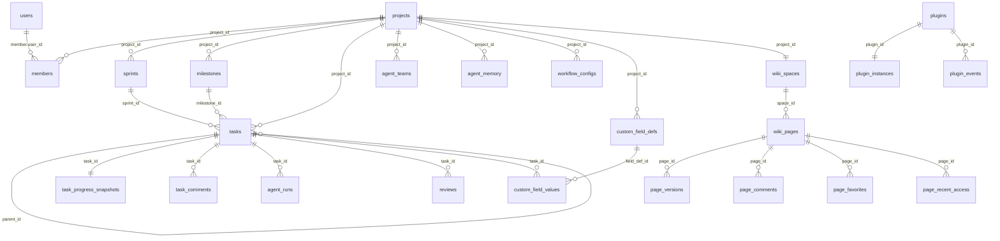

# PostgreSQL Schema / PostgreSQL 表结构

This document summarizes the PostgreSQL schema defined by:

- `src-go/migrations/*.up.sql`
- `src-go/internal/repository/persistence_models.go`
- `src-go/internal/repository/foundation_persistence_models.go`
- `src-go/internal/repository/wiki_records.go`

## Core ER Diagram

## Core Collaboration Tables

### `users`

- Fields: `id`, `email`, `password`, `name`, `created_at`, `updated_at`
- Indexes: `idx_users_email`
- Notes: password is stored as a bcrypt hash

### `projects`

- Fields: `id`, `name`, `slug`, `description`, `repo_url`, `default_branch`, `settings`, `created_at`, `updated_at`
- Indexes: `idx_projects_slug`
- Notes: `settings` is JSONB and stores coding-agent, review-policy, budget, and webhook configuration

### `members`

- Fields: `id`, `project_id`, `user_id`, `name`, `type`, `role`, `status`, `email`, `im_platform`, `im_user_id`, `avatar_url`, `agent_config`, `skills`, `is_active`, `created_at`, `updated_at`
- Foreign keys:
  - `project_id -> projects.id`
  - `user_id -> users.id`
- Notes: supports both human and agent members

### `sprints`

- Fields: `id`, `project_id`, `name`, `start_date`, `end_date`, `milestone_id`, `status`, `total_budget_usd`, `spent_usd`, `created_at`, `updated_at`
- Foreign keys:
  - `project_id -> projects.id`
  - `milestone_id -> milestones.id`
- Indexes:
  - `idx_sprints_project`
  - `idx_sprints_project_status`
  - `idx_sprints_milestone`

### `milestones`

- Fields: `id`, `project_id`, `name`, `target_date`, `status`, `description`, `created_at`, `updated_at`, `deleted_at`
- Foreign keys:
  - `project_id -> projects.id`
- Purpose: project milestone planning for tasks and sprints

### `tasks`

- Fields: `id`, `project_id`, `parent_id`, `sprint_id`, `milestone_id`, `title`, `description`, `status`, `priority`, `assignee_id`, `assignee_type`, `reporter_id`, `labels`, `budget_usd`, `spent_usd`, `agent_branch`, `agent_worktree`, `agent_session_id`, `pr_url`, `pr_number`, `blocked_by`, `search_vector`, `planned_start_at`, `planned_end_at`, `created_at`, `updated_at`, `completed_at`
- Foreign keys:
  - `project_id -> projects.id`
  - `parent_id -> tasks.id`
  - `sprint_id -> sprints.id`
  - `milestone_id -> milestones.id`
  - `assignee_id -> members.id`
  - `reporter_id -> members.id`
- Indexes:
  - `idx_tasks_project_status`
  - `idx_tasks_assignee`
  - `idx_tasks_sprint`
  - `idx_tasks_parent`
  - `idx_tasks_project_priority`
  - `idx_tasks_labels` (GIN)
  - `idx_tasks_search` (GIN)
  - `idx_tasks_active`
  - `idx_tasks_kanban`
  - `idx_tasks_planned_start_at`
  - `idx_tasks_milestone`

### `task_progress_snapshots`

- Fields: `task_id`, `last_activity_at`, `last_activity_source`, `last_transition_at`, `health_status`, `risk_reason`, `risk_since_at`, `last_alert_state`, `last_alert_at`, `last_recovered_at`, `created_at`, `updated_at`
- Foreign keys:
  - `task_id -> tasks.id`
- Purpose: derived task health state used by alerts and workspace summaries

### `task_comments`

- Fields: `id`, `task_id`, `parent_comment_id`, `body`, `mentions`, `resolved_at`, `created_by`, `created_at`, `updated_at`, `deleted_at`
- Foreign keys:
  - `task_id -> tasks.id`
  - `parent_comment_id -> task_comments.id`
- Indexes:
  - `idx_task_comments_task_created`

### `entity_links`

- Fields: `id`, `project_id`, `source_type`, `source_id`, `target_type`, `target_id`, `link_type`, `anchor_block_id`, `created_by`, `created_at`, `deleted_at`
- Foreign keys:
  - `project_id -> projects.id`
- Indexes:
  - `idx_entity_links_source`
  - `idx_entity_links_target`

## Runtime, Review, And Cost Tables

| Table | Fields | Foreign keys | Key indexes |
| --- | --- | --- | --- |
| `agent_runs` | `id`, `task_id`, `member_id`, `session_id`, `status`, `prompt`, `system_prompt`, `worktree_path`, `branch_name`, `role_id`, token/cost fields, `budget_usd`, error fields, `started_at`, `completed_at`, `created_at`, `updated_at`, `runtime`, `provider`, `model`, `team_id`, `team_role` | `task_id -> tasks.id`, `member_id -> members.id`, `team_id -> agent_teams.id` | `idx_agent_runs_task`, `idx_agent_runs_member`, `idx_agent_runs_status`, `idx_agent_runs_active` |
| `agent_events` | `id`, `run_id`, `task_id`, `project_id`, `event_type`, `payload`, `occurred_at`, `created_at` | `run_id -> agent_runs.id` | `idx_agent_events_run_id`, `idx_agent_events_task_id`, `idx_agent_events_project_time`, `idx_agent_events_event_type` |
| `agent_teams` | `id`, `project_id`, `task_id`, `name`, `status`, `strategy`, `planner_run_id`, `reviewer_run_id`, budget fields, `config`, `error_message`, timestamps | `project_id -> projects.id`, `task_id -> tasks.id`, planner/reviewer FKs to `agent_runs` | `idx_agent_teams_project`, `idx_agent_teams_task`, `idx_agent_teams_status` |
| `agent_memory` | `id`, `project_id`, `scope`, `role_id`, `category`, `key`, `content`, `metadata`, `relevance_score`, `access_count`, `last_accessed_at`, timestamps | `project_id -> projects.id` | `idx_agent_memory_project`, `idx_agent_memory_scope_role`, `idx_agent_memory_key` |
| `agent_pool_queue_entries` | `entry_id`, `project_id`, `task_id`, `member_id`, `status`, `reason`, `runtime`, `provider`, `model`, `role_id`, `priority`, `budget_usd`, `agent_run_id`, timestamps | `project_id -> projects.id`, `task_id -> tasks.id`, `member_id -> members.id`, `agent_run_id -> agent_runs.id` | `idx_agent_pool_queue_entries_project_status_created`, `idx_agent_pool_queue_entries_task_status`, `idx_agent_pool_queue_entries_project_status_priority_created` |
| `dispatch_attempts` | `id`, `project_id`, `task_id`, `member_id`, `outcome`, `trigger_source`, `reason`, `guardrail_type`, `guardrail_scope`, `created_at` | `project_id -> projects.id`, `task_id -> tasks.id`, `member_id -> members.id` | `idx_dispatch_attempts_project_created`, `idx_dispatch_attempts_task_created` |
| `reviews` | `id`, `task_id`, `pr_url`, `pr_number`, `layer`, `status`, `risk_level`, `findings`, `execution_metadata`, `summary`, `recommendation`, `cost_usd`, timestamps | `task_id -> tasks.id` | `idx_reviews_task`, `idx_reviews_pr` |
| `review_aggregations` | `id`, `pr_url`, `task_id`, `review_ids`, `overall_risk`, `recommendation`, `findings`, `summary`, `metrics`, human decision fields, `total_cost_usd`, timestamps | `task_id -> tasks.id` | `idx_review_aggregations_task`, `idx_review_aggregations_pr` |
| `false_positives` | `id`, `project_id`, `pattern`, `category`, `file_pattern`, `reason`, `reporter_id`, `occurrences`, `is_strong`, timestamps | `project_id -> projects.id` | `idx_false_positives_project`, `idx_false_positives_category` |
| `notifications` | `id`, `target_id`, `type`, `title`, `body`, `data`, `is_read`, `channel`, `sent`, `created_at` | none | list/query indexes from notification repository patterns |

## Workflow, Forms, And Operator Tables

| Table | Fields | Foreign keys | Key indexes |
| --- | --- | --- | --- |
| `workflow_configs` | `id`, `project_id`, `transitions`, `triggers`, `created_at`, `updated_at` | `project_id -> projects.id` | project-key lookups |
| `custom_field_defs` | `id`, `project_id`, `name`, `field_type`, `options`, `sort_order`, `required`, timestamps, `deleted_at` | `project_id -> projects.id` | `idx_custom_field_defs_project`, `idx_custom_field_defs_project_sort` |
| `custom_field_values` | `id`, `task_id`, `field_def_id`, `value`, `created_at`, `updated_at` | `task_id -> tasks.id`, `field_def_id -> custom_field_defs.id` | `idx_custom_field_values_task`, `idx_custom_field_values_field`, `idx_custom_field_values_value_gin` |
| `saved_views` | `id`, `project_id`, `name`, `owner_id`, `is_default`, `shared_with`, `config`, timestamps, `deleted_at` | `project_id -> projects.id`, `owner_id -> members.id` | `idx_saved_views_project`, `idx_saved_views_project_default`, shared-with GIN |
| `form_definitions` | `id`, `project_id`, `name`, `slug`, `fields`, `target_status`, `target_assignee`, `is_public`, timestamps, `deleted_at` | `project_id -> projects.id`, `target_assignee -> members.id` | project/slug lookups |
| `form_submissions` | `id`, `form_id`, `task_id`, `submitted_by`, `submitted_at`, `ip_address` | `form_id -> form_definitions.id`, `task_id -> tasks.id` | submission history lookups |
| `automation_rules` | `id`, `project_id`, `name`, `enabled`, `event_type`, `conditions`, `actions`, `created_by`, timestamps, `deleted_at` | `project_id -> projects.id`, `created_by -> members.id` | project/event lookup plus GIN on `conditions` and `actions` |
| `automation_logs` | `id`, `rule_id`, `task_id`, `event_type`, `triggered_at`, `status`, `detail` | `rule_id -> automation_rules.id`, `task_id -> tasks.id` | `idx_automation_logs_rule_triggered_at`, `idx_automation_logs_task`, `idx_automation_logs_status`, `idx_automation_logs_detail_gin` |
| `dashboard_configs` | `id`, `project_id`, `name`, `layout`, `created_by`, timestamps, `deleted_at` | `project_id -> projects.id`, `created_by -> members.id` | project lookup plus layout GIN |
| `dashboard_widgets` | `id`, `dashboard_id`, `widget_type`, `config`, `position`, timestamps | `dashboard_id -> dashboard_configs.id` | `idx_dashboard_widgets_dashboard`, `idx_dashboard_widgets_type`, config/position GIN |
| `scheduled_jobs` | `job_key`, `name`, `scope`, `schedule`, `enabled`, `execution_mode`, `overlap_policy`, run summary fields, `config`, timestamps | none | `idx_scheduled_jobs_enabled`, `idx_scheduled_jobs_next_run_at` |
| `scheduled_job_runs` | `run_id`, `job_key`, `trigger_source`, `status`, `started_at`, `finished_at`, `summary`, `error_message`, `metrics`, timestamps | `job_key -> scheduled_jobs.job_key` | `idx_scheduled_job_runs_job_key_started_at`, `idx_scheduled_job_runs_job_key_status` |

## Plugin Control Plane Tables

| Table | Fields | Foreign keys | Key indexes |
| --- | --- | --- | --- |
| `plugins` | `plugin_id`, `kind`, `name`, `version`, `description`, `tags`, `manifest`, `source_type`, `source_path`, `runtime`, `lifecycle_state`, `runtime_host`, health/error fields, `resolved_source_path`, `runtime_metadata`, timestamps | none | `idx_plugins_kind`, `idx_plugins_lifecycle_state`, `idx_plugins_runtime_host` |
| `plugin_instances` | `plugin_id`, `project_id`, `runtime_host`, `lifecycle_state`, `resolved_source_path`, `runtime_metadata`, `restart_count`, health/error fields, timestamps | `plugin_id -> plugins.plugin_id` | `idx_plugin_instances_project_id` |
| `plugin_events` | `id`, `plugin_id`, `event_type`, `event_source`, `lifecycle_state`, `summary`, `payload`, `created_at` | `plugin_id -> plugins.plugin_id` | `idx_plugin_events_plugin_created_at` |

## Wiki Tables

| Table | Fields | Foreign keys | Key indexes |
| --- | --- | --- | --- |
| `wiki_spaces` | `id`, `project_id`, `created_at`, `deleted_at` | `project_id -> projects.id` | project lookup |
| `wiki_pages` | `id`, `space_id`, `parent_id`, `title`, `content`, `content_text`, `path`, `sort_order`, template/system/pinned flags, `created_by`, `updated_by`, timestamps, `deleted_at` | `space_id -> wiki_spaces.id`, `parent_id -> wiki_pages.id`, user refs | `idx_wiki_pages_content_gin`, `idx_wiki_pages_path`, `idx_wiki_pages_space_parent_sort` |
| `page_versions` | `id`, `page_id`, `version_number`, `name`, `content`, `created_by`, `created_at` | `page_id -> wiki_pages.id` | page/version lookup |
| `page_comments` | `id`, `page_id`, `anchor_block_id`, `parent_comment_id`, `body`, `mentions`, `resolved_at`, `created_by`, timestamps, `deleted_at` | `page_id -> wiki_pages.id`, `parent_comment_id -> page_comments.id` | page comment lookup |
| `page_favorites` | `page_id`, `user_id`, `created_at` | `page_id -> wiki_pages.id`, `user_id -> users.id` | composite primary key |
| `page_recent_access` | `page_id`, `user_id`, `accessed_at` | `page_id -> wiki_pages.id`, `user_id -> users.id` | composite primary key |

## Indexing Notes

The schema favors:

- GIN indexes for JSONB and array-backed filter surfaces
- explicit composite indexes for project-scoped dashboards, queueing, and kanban-style task views
- lookup indexes on lifecycle-heavy runtime tables (`agent_runs`, `plugins`, `scheduled_jobs`)

For the canonical truth, prefer the migration files over this summary whenever a
column-level dispute appears.
