# PostgreSQL Schema / PostgreSQL 表结构

This document summarizes the PostgreSQL schema defined by:

- `src-go/migrations/*.up.sql`
- `src-go/internal/repository/persistence_models.go`
- `src-go/internal/repository/foundation_persistence_models.go`
- `src-go/internal/repository/wiki_records.go`

## Core ER Diagram

```mermaid
erDiagram
  users ||--o{ members : "member.user_id"
  projects ||--o{ members : "project_id"
  projects ||--o{ sprints : "project_id"
  projects ||--o{ milestones : "project_id"
  projects ||--o{ tasks : "project_id"
  sprints ||--o{ tasks : "sprint_id"
  milestones ||--o{ tasks : "milestone_id"
  tasks ||--o{ tasks : "parent_id"
  tasks ||--|| task_progress_snapshots : "task_id"
  tasks ||--o{ task_comments : "task_id"
  tasks ||--o{ agent_runs : "task_id"
  tasks ||--o{ reviews : "task_id"
  projects ||--o{ agent_teams : "project_id"
  projects ||--o{ agent_memory : "project_id"
  projects ||--o{ workflow_configs : "project_id"
  projects ||--o{ workflow_definitions : "project_id"
  workflow_definitions ||--o{ workflow_executions : "workflow_id"
  workflow_executions ||--o{ workflow_node_executions : "execution_id"
  projects ||--o{ custom_field_defs : "project_id"
  custom_field_defs ||--o{ custom_field_values : "field_def_id"
  tasks ||--o{ custom_field_values : "task_id"
  projects ||--o{ knowledge_assets : "project_id"
  knowledge_assets ||--o{ asset_versions : "asset_id"
  knowledge_assets ||--o{ asset_comments : "asset_id"
  knowledge_assets ||--o{ asset_ingest_chunks : "asset_id"
  projects ||--o{ documents : "project_id"
  projects ||--o{ employees : "project_id"
  employees ||--o{ employee_skills : "employee_id"
  projects ||--o{ secrets : "project_id"
  projects ||--o{ vcs_integrations : "project_id"
  projects ||--o{ qianchuan_bindings : "project_id"
  projects ||--o{ qianchuan_strategies : "project_id"
  projects ||--o{ project_templates : "project_id"
  projects ||--o{ project_audit_events : "project_id"
  projects ||--o{ project_invitations : "project_id"
  plugins ||--|| plugin_instances : "plugin_id"
  plugins ||--o{ plugin_events : "plugin_id"
```

## Core Collaboration Tables

### `users`

- Fields: `id`, `email`, `password`, `name`, `created_at`, `updated_at`
- Indexes: `idx_users_email`
- Notes: password is stored as a bcrypt hash

### `projects`

- Fields: `id`, `name`, `slug`, `description`, `repo_url`, `default_branch`, `settings`, `created_at`, `updated_at`
- Indexes: `idx_projects_slug`
- Notes: `settings` is JSONB and stores coding-agent, review-policy, budget, and webhook configuration

### `members`

- Fields: `id`, `project_id`, `user_id`, `name`, `type`, `role`, `status`, `email`, `im_platform`, `im_user_id`, `avatar_url`, `agent_config`, `skills`, `is_active`, `created_at`, `updated_at`
- Foreign keys:
  - `project_id -> projects.id`
  - `user_id -> users.id`
- Notes: supports both human and agent members

### `sprints`

- Fields: `id`, `project_id`, `name`, `start_date`, `end_date`, `milestone_id`, `status`, `total_budget_usd`, `spent_usd`, `created_at`, `updated_at`
- Foreign keys:
  - `project_id -> projects.id`
  - `milestone_id -> milestones.id`
- Indexes:
  - `idx_sprints_project`
  - `idx_sprints_project_status`
  - `idx_sprints_milestone`

### `milestones`

- Fields: `id`, `project_id`, `name`, `target_date`, `status`, `description`, `created_at`, `updated_at`, `deleted_at`
- Foreign keys:
  - `project_id -> projects.id`
- Purpose: project milestone planning for tasks and sprints

### `tasks`

- Fields: `id`, `project_id`, `parent_id`, `sprint_id`, `milestone_id`, `title`, `description`, `status`, `priority`, `assignee_id`, `assignee_type`, `reporter_id`, `labels`, `budget_usd`, `spent_usd`, `agent_branch`, `agent_worktree`, `agent_session_id`, `pr_url`, `pr_number`, `blocked_by`, `search_vector`, `planned_start_at`, `planned_end_at`, `created_at`, `updated_at`, `completed_at`
- Foreign keys:
  - `project_id -> projects.id`
  - `parent_id -> tasks.id`
  - `sprint_id -> sprints.id`
  - `milestone_id -> milestones.id`
  - `assignee_id -> members.id`
  - `reporter_id -> members.id`
- Indexes:
  - `idx_tasks_project_status`
  - `idx_tasks_assignee`
  - `idx_tasks_sprint`
  - `idx_tasks_parent`
  - `idx_tasks_project_priority`
  - `idx_tasks_labels` (GIN)
  - `idx_tasks_search` (GIN)
  - `idx_tasks_active`
  - `idx_tasks_kanban`
  - `idx_tasks_planned_start_at`
  - `idx_tasks_milestone`

### `task_progress_snapshots`

- Fields: `task_id`, `last_activity_at`, `last_activity_source`, `last_transition_at`, `health_status`, `risk_reason`, `risk_since_at`, `last_alert_state`, `last_alert_at`, `last_recovered_at`, `created_at`, `updated_at`
- Foreign keys:
  - `task_id -> tasks.id`
- Purpose: derived task health state used by alerts and workspace summaries

### `task_comments`

- Fields: `id`, `task_id`, `parent_comment_id`, `body`, `mentions`, `resolved_at`, `created_by`, `created_at`, `updated_at`, `deleted_at`
- Foreign keys:
  - `task_id -> tasks.id`
  - `parent_comment_id -> task_comments.id`
- Indexes:
  - `idx_task_comments_task_created`

### `entity_links`

- Fields: `id`, `project_id`, `source_type`, `source_id`, `target_type`, `target_id`, `link_type`, `anchor_block_id`, `created_by`, `created_at`, `deleted_at`
- Foreign keys:
  - `project_id -> projects.id`
- Indexes:
  - `idx_entity_links_source`
  - `idx_entity_links_target`

## Runtime, Review, And Cost Tables

| Table | Fields | Foreign keys | Key indexes |
| --- | --- | --- | --- |
| `agent_runs` | `id`, `task_id`, `member_id`, `employee_id`, `session_id`, `status`, `prompt`, `system_prompt`, `worktree_path`, `branch_name`, `role_id`, token/cost fields, `budget_usd`, error fields, `started_at`, `completed_at`, `created_at`, `updated_at`, `runtime`, `provider`, `model`, `team_id`, `team_role` | `task_id -> tasks.id`, `member_id -> members.id`, `employee_id -> employees.id`, `team_id -> agent_teams.id` | `idx_agent_runs_task`, `idx_agent_runs_member`, `idx_agent_runs_employee`, `idx_agent_runs_status`, `idx_agent_runs_active` |
| `agent_events` | `id`, `run_id`, `task_id`, `project_id`, `event_type`, `payload`, `occurred_at`, `created_at` | `run_id -> agent_runs.id` | `idx_agent_events_run_id`, `idx_agent_events_task_id`, `idx_agent_events_project_time`, `idx_agent_events_event_type` |
| `agent_teams` | `id`, `project_id`, `task_id`, `name`, `status`, `strategy`, `planner_run_id`, `reviewer_run_id`, budget fields, `config`, `error_message`, timestamps | `project_id -> projects.id`, `task_id -> tasks.id`, planner/reviewer FKs to `agent_runs` | `idx_agent_teams_project`, `idx_agent_teams_task`, `idx_agent_teams_status` |
| `agent_memory` | `id`, `project_id`, `scope` (`global`/`project`/`role`/`employee`), `role_id`, `employee_id`, `category`, `key`, `content`, `metadata`, `relevance_score`, `access_count`, `last_accessed_at`, timestamps | `project_id -> projects.id`, `employee_id -> employees.id` | `idx_agent_memory_project`, `idx_agent_memory_scope_role`, `idx_agent_memory_key`, `idx_agent_memory_employee` |
| `agent_pool_queue_entries` | `entry_id`, `project_id`, `task_id`, `member_id`, `status`, `reason`, `runtime`, `provider`, `model`, `role_id`, `priority`, `budget_usd`, `agent_run_id`, timestamps | `project_id -> projects.id`, `task_id -> tasks.id`, `member_id -> members.id`, `agent_run_id -> agent_runs.id` | `idx_agent_pool_queue_entries_project_status_created`, `idx_agent_pool_queue_entries_task_status`, `idx_agent_pool_queue_entries_project_status_priority_created` |
| `dispatch_attempts` | `id`, `project_id`, `task_id`, `member_id`, `outcome`, `trigger_source`, `reason`, `guardrail_type`, `guardrail_scope`, `created_at` | `project_id -> projects.id`, `task_id -> tasks.id`, `member_id -> members.id` | `idx_dispatch_attempts_project_created`, `idx_dispatch_attempts_task_created` |
| `reviews` | `id`, `task_id`, `pr_url`, `pr_number`, `layer`, `status`, `risk_level`, `findings`, `execution_metadata`, `summary`, `recommendation`, `cost_usd`, `execution_id`, timestamps | `task_id -> tasks.id`, `execution_id -> workflow_executions.id` | `idx_reviews_task`, `idx_reviews_pr`, `idx_reviews_execution_id` |
| `review_aggregations` | `id`, `pr_url`, `task_id`, `review_ids`, `overall_risk`, `recommendation`, `findings`, `summary`, `metrics`, human decision fields, `total_cost_usd`, timestamps | `task_id -> tasks.id` | `idx_review_aggregations_task`, `idx_review_aggregations_pr` |
| `false_positives` | `id`, `project_id`, `pattern`, `category`, `file_pattern`, `reason`, `reporter_id`, `occurrences`, `is_strong`, timestamps | `project_id -> projects.id` | `idx_false_positives_project`, `idx_false_positives_category` |
| `notifications` | `id`, `target_id`, `type`, `title`, `body`, `data`, `is_read`, `channel`, `sent`, `created_at` | none | list/query indexes from notification repository patterns |

## Workflow, Forms, And Operator Tables

| Table | Fields | Foreign keys | Key indexes |
| --- | --- | --- | --- |
| `workflow_configs` | `id`, `project_id`, `transitions`, `triggers`, `created_at`, `updated_at` | `project_id -> projects.id` | project-key lookups |
| `custom_field_defs` | `id`, `project_id`, `name`, `field_type`, `options`, `sort_order`, `required`, timestamps, `deleted_at` | `project_id -> projects.id` | `idx_custom_field_defs_project`, `idx_custom_field_defs_project_sort` |
| `custom_field_values` | `id`, `task_id`, `field_def_id`, `value`, `created_at`, `updated_at` | `task_id -> tasks.id`, `field_def_id -> custom_field_defs.id` | `idx_custom_field_values_task`, `idx_custom_field_values_field`, `idx_custom_field_values_value_gin` |
| `saved_views` | `id`, `project_id`, `name`, `owner_id`, `is_default`, `shared_with`, `config`, timestamps, `deleted_at` | `project_id -> projects.id`, `owner_id -> members.id` | `idx_saved_views_project`, `idx_saved_views_project_default`, shared-with GIN |
| `form_definitions` | `id`, `project_id`, `name`, `slug`, `fields`, `target_status`, `target_assignee`, `is_public`, timestamps, `deleted_at` | `project_id -> projects.id`, `target_assignee -> members.id` | project/slug lookups |
| `form_submissions` | `id`, `form_id`, `task_id`, `submitted_by`, `submitted_at`, `ip_address` | `form_id -> form_definitions.id`, `task_id -> tasks.id` | submission history lookups |
| `automation_rules` | `id`, `project_id`, `name`, `enabled`, `event_type`, `conditions`, `actions`, `created_by`, timestamps, `deleted_at` | `project_id -> projects.id`, `created_by -> members.id` | project/event lookup plus GIN on `conditions` and `actions` |
| `automation_logs` | `id`, `rule_id`, `task_id`, `event_type`, `triggered_at`, `status`, `detail` | `rule_id -> automation_rules.id`, `task_id -> tasks.id` | `idx_automation_logs_rule_triggered_at`, `idx_automation_logs_task`, `idx_automation_logs_status`, `idx_automation_logs_detail_gin` |
| `dashboard_configs` | `id`, `project_id`, `name`, `layout`, `created_by`, timestamps, `deleted_at` | `project_id -> projects.id`, `created_by -> members.id` | project lookup plus layout GIN |
| `dashboard_widgets` | `id`, `dashboard_id`, `widget_type`, `config`, `position`, timestamps | `dashboard_id -> dashboard_configs.id` | `idx_dashboard_widgets_dashboard`, `idx_dashboard_widgets_type`, config/position GIN |
| `scheduled_jobs` | `job_key`, `name`, `scope`, `schedule`, `enabled`, `execution_mode`, `overlap_policy`, run summary fields, `config`, timestamps | none | `idx_scheduled_jobs_enabled`, `idx_scheduled_jobs_next_run_at` |
| `scheduled_job_runs` | `run_id`, `job_key`, `trigger_source`, `status`, `started_at`, `finished_at`, `summary`, `error_message`, `metrics`, timestamps | `job_key -> scheduled_jobs.job_key` | `idx_scheduled_job_runs_job_key_started_at`, `idx_scheduled_job_runs_job_key_status` |

## Plugin Control Plane Tables

| Table | Fields | Foreign keys | Key indexes |
| --- | --- | --- | --- |
| `plugins` | `plugin_id`, `kind`, `name`, `version`, `description`, `tags`, `manifest`, `source_type`, `source_path`, `runtime`, `lifecycle_state`, `runtime_host`, health/error fields, `resolved_source_path`, `runtime_metadata`, timestamps | none | `idx_plugins_kind`, `idx_plugins_lifecycle_state`, `idx_plugins_runtime_host` |
| `plugin_instances` | `plugin_id`, `project_id`, `runtime_host`, `lifecycle_state`, `resolved_source_path`, `runtime_metadata`, `restart_count`, health/error fields, timestamps | `plugin_id -> plugins.plugin_id` | `idx_plugin_instances_project_id` |
| `plugin_events` | `id`, `plugin_id`, `event_type`, `event_source`, `lifecycle_state`, `summary`, `payload`, `created_at` | `plugin_id -> plugins.plugin_id` | `idx_plugin_events_plugin_created_at` |

## Knowledge Asset Tables

Wiki pages, ingested files, and templates were unified into `knowledge_assets` via migration `056`. The old `wiki_pages`, `page_versions`, `page_comments`, `wiki_spaces`, and `project_documents` tables were dropped after data migration.

| Table | Fields | Foreign keys | Key indexes |
| --- | --- | --- | --- |
| `knowledge_assets` | `id`, `project_id`, `wiki_space_id`, `parent_id`, `kind` (`wiki_page` / `ingested_file` / `template`), `title`, `path`, `sort_order`, `content_json`, `content_text`, `file_ref`, `file_size`, `mime_type`, `ingest_status`, `ingest_chunk_count`, `template_category`, `is_system_template`, `is_pinned`, `owner_id`, `created_by`, `updated_by`, timestamps, `deleted_at`, `version`, `search_vector` | `project_id -> projects.id` | `idx_knowledge_assets_project`, `idx_knowledge_assets_space`, `idx_knowledge_assets_parent`, `idx_knowledge_assets_kind`, `idx_knowledge_assets_search` (GIN tsvector) |
| `asset_versions` | `id`, `asset_id`, `version_number`, `name`, `kind_snapshot`, `content_json`, `file_ref`, `created_by`, `created_at` | `asset_id -> knowledge_assets.id` | `idx_asset_versions_asset` |
| `asset_comments` | `id`, `asset_id`, `anchor_block_id`, `parent_comment_id`, `body`, `mentions`, `resolved_at`, `created_by`, timestamps, `deleted_at` | `asset_id -> knowledge_assets.id`, `parent_comment_id -> asset_comments.id` | `idx_asset_comments_asset` |
| `asset_ingest_chunks` | `id`, `asset_id`, `chunk_index`, `content`, `created_at` | `asset_id -> knowledge_assets.id` | `idx_asset_ingest_chunks_asset` |

## Document Tables

| Table | Fields | Foreign keys | Key indexes |
| --- | --- | --- | --- |
| `documents` | `id`, `project_id`, `name`, `file_type`, `file_size`, `storage_key`, `status`, `chunk_count`, `error`, timestamps | `project_id -> projects.id` | `idx_documents_project_id` |

## Workflow Engine Tables

| Table | Fields | Foreign keys | Key indexes |
| --- | --- | --- | --- |
| `workflow_definitions` | `id`, `project_id`, `name`, `description`, `status` (`draft`/`active`/`archived`), `nodes`, `edges`, timestamps | `project_id -> projects.id` | `idx_workflow_definitions_project`, `idx_workflow_definitions_status` |
| `workflow_executions` | `id`, `workflow_id`, `project_id`, `task_id`, `status` (`pending`/`running`/`completed`/`failed`/`cancelled`), `current_nodes`, `context`, `error_message`, `started_at`, `completed_at`, timestamps | `workflow_id -> workflow_definitions.id`, `project_id -> projects.id`, `task_id -> tasks.id` | `idx_workflow_executions_workflow`, `idx_workflow_executions_project`, `idx_workflow_executions_status` |
| `workflow_node_executions` | `id`, `execution_id`, `node_id`, `status` (`pending`/`running`/`completed`/`failed`/`skipped`), `result`, `error_message`, `started_at`, `completed_at`, `created_at` | `execution_id -> workflow_executions.id` | `idx_workflow_node_executions_execution` |
| `workflow_triggers` | `id`, `workflow_id`, `project_id`, `source` (`im`/`schedule`), `config`, `input_mapping`, `idempotency_key_template`, `dedupe_window_seconds`, `enabled`, `created_by`, timestamps | `workflow_id -> workflow_definitions.id`, `project_id -> projects.id`, `created_by -> members.id` | unique (`workflow_id`, `source`, md5(`config`)), `idx_workflow_triggers_source_enabled` |
| `workflow_pending_reviews` | (created by migration 052) links workflow executions to human review gates | — | — |

## Employee and Trigger Tables

| Table | Fields | Foreign keys | Key indexes |
| --- | --- | --- | --- |
| `employees` | `id`, `project_id`, `name`, `display_name`, `role_id`, `runtime_prefs`, `config`, `state` (`active`/`paused`/`archived`), `created_by`, timestamps | `project_id -> projects.id`, `created_by -> members.id` | `employees_project_state_idx` |
| `employee_skills` | `employee_id`, `skill_path`, `auto_load`, `overrides`, `added_at` | `employee_id -> employees.id` | composite PK |

## Integration Tables

| Table | Fields | Foreign keys | Key indexes |
| --- | --- | --- | --- |
| `vcs_integrations` | `id`, `project_id`, `provider`, `host`, `owner`, `repo`, `default_branch`, `webhook_id`, `webhook_secret_ref`, `token_secret_ref`, `status`, `acting_employee_id`, `last_synced_at`, timestamps | `project_id -> projects.id`, `acting_employee_id -> employees.id` | `idx_vcs_integrations_project`, `idx_vcs_integrations_status` |
| `secrets` | `id`, `project_id`, `name`, `ciphertext`, `nonce`, `key_version`, `description`, `last_used_at`, `created_by`, timestamps | `project_id -> projects.id` | `secrets_project_idx` |
| `qianchuan_strategies` | `id`, `project_id`, `name`, `description`, `yaml_source`, `parsed_spec`, `version`, `status` (`draft`/`published`/`archived`), `created_by`, timestamps | `project_id -> projects.id` | `idx_qianchuan_strategies_project`, `idx_qianchuan_strategies_status` |
| `qianchuan_bindings` | `id`, `project_id`, `advertiser_id`, `aweme_id`, `display_name`, `status` (`active`/`auth_expired`/`paused`), `acting_employee_id`, `access_token_secret_ref`, `refresh_token_secret_ref`, `token_expires_at`, `last_synced_at`, `created_by`, timestamps | `project_id -> projects.id`, `acting_employee_id -> employees.id` | `idx_qianchuan_bindings_project`, `idx_qianchuan_bindings_status` |
| `qianchuan_oauth_states` | `state`, `project_id`, `binding_id`, `created_at` | — | — |
| `qianchuan_metric_snapshots` | `id`, `binding_id`, `snapshot_at`, `metrics_json`, `created_at` | `binding_id -> qianchuan_bindings.id` | — |
| `qianchuan_action_logs` | `id`, `binding_id`, `action_type`, `payload_json`, `result_json`, `created_at` | `binding_id -> qianchuan_bindings.id` | — |

## Audit and Event Tables

| Table | Fields | Foreign keys | Key indexes |
| --- | --- | --- | --- |
| `project_audit_events` | `id`, `project_id`, `occurred_at`, `actor_user_id`, `actor_project_role_at_time`, `action_id`, `resource_type`, `resource_id`, `payload_snapshot_json`, `system_initiated`, `configured_by_user_id`, `request_id`, `ip`, `user_agent`, `created_at` | `project_id -> projects.id` | `idx_project_audit_events_project_occurred`, `idx_project_audit_events_project_action`, `idx_project_audit_events_project_actor` |
| `events` | `id`, `type`, `source`, `target`, `visibility`, `payload`, `metadata`, `project_id`, `occurred_at`, `created_at` | — | `events_type_idx`, `events_target_idx`, `events_project_idx` |
| `events_dead_letter` | `id`, `event_id`, `envelope`, `last_error`, `retry_count`, `first_seen_at`, `last_seen_at` | — | `events_dlq_event_idx` |
| `logs` | `id`, `project_id`, `tab`, `level`, `actor_type`, `actor_id`, `agent_id`, `session_id`, `event_type`, `action`, `resource_type`, `resource_id`, `summary`, `detail`, `created_at` | — | `idx_logs_project_tab_created`, `idx_logs_project_level`, `idx_logs_project_agent` |
| `im_reaction_events` | (migration 055) IM reaction payload persistence | — | — |

## Project Template and Invitation Tables

| Table | Fields | Foreign keys | Key indexes |
| --- | --- | --- | --- |
| `project_templates` | `id`, `source` (`system`/`user`/`marketplace`), `owner_user_id`, `name`, `description`, `snapshot_json`, `snapshot_version`, timestamps | — | `idx_project_templates_source_owner`, `idx_project_templates_source_name`, `idx_project_templates_user_owner` (partial, source='user') |
| `project_invitations` | `id`, `project_id`, `inviter_user_id`, `invited_identity`, `invited_user_id`, `project_role`, `status` (`pending`/`accepted`/`declined`/`expired`/`revoked`), `token_hash`, `message`, `expires_at`, `accepted_at`, `decline_reason`, `revoke_reason`, `last_delivery_status`, `last_delivery_attempted_at`, timestamps | `project_id -> projects.id`, `inviter_user_id -> users.id`, `invited_user_id -> users.id` | `idx_project_invitations_project_status_expires`, `uq_project_invitations_token_hash_pending`, `idx_project_invitations_invited_user_status` |

## Wiki Tables (Legacy)

> **Deprecated**: `wiki_spaces`, `wiki_pages`, `page_versions`, `page_comments`, `page_favorites`, and `page_recent_access` were replaced by `knowledge_assets`, `asset_versions`, `asset_comments` in migration `056_unify_knowledge_assets.up.sql`. The old tables were dropped after data migration. This section is kept for historical reference only.

## Indexing Notes

The schema favors:

- GIN indexes for JSONB and array-backed filter surfaces
- explicit composite indexes for project-scoped dashboards, queueing, and kanban-style task views
- lookup indexes on lifecycle-heavy runtime tables (`agent_runs`, `plugins`, `scheduled_jobs`)

For the canonical truth, prefer the migration files over this summary whenever a
column-level dispute appears.
