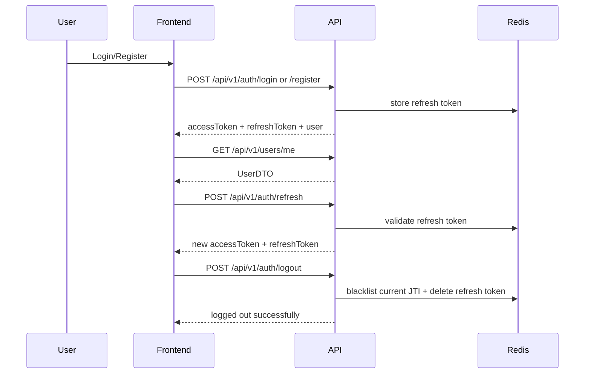

# Authentication Model / 认证与授权模型

This document describes the currently implemented auth contract across the Go
backend, frontend bootstrap flow, Redis token state, and CORS settings.

## Authentication Stack

- user persistence: PostgreSQL `users`
- access token: JWT signed with `JWT_SECRET`
- refresh token: opaque token tracked in Redis
- revocation: Redis blacklist keyed by token JTI
- profile validation: `GET /api/v1/users/me`
- CORS allowlist: `ALLOW_ORIGINS`

## Lifecycle

## Current Frontend Behavior

The auth store in `lib/stores/auth-store.ts`:

- persists `accessToken`, `refreshToken`, and `user`
- bootstraps a session by calling `GET /api/v1/users/me`
- if the access token is rejected and a refresh token exists, performs exactly
  one `POST /api/v1/auth/refresh`
- clears session state if refresh recovery fails

## Redis Contract

Current implemented keys in `src-go/internal/repository/cache.go`:

| Key pattern | Value | TTL | Purpose |
| --- | --- | --- | --- |
| `refresh:{userID}` | refresh token string | refresh-token TTL | validate refresh requests |
| `blacklist:{jti}` | `"1"` | remaining access-token TTL | revoke an access token |
| `widget:{key}` | JSON payload | caller-defined | cache dashboard widget data |

## Fail-Closed Rules

Important repository truth:

- logout revocation does not pretend to succeed when Redis is unavailable
- refresh token validation does not silently degrade without Redis
- protected JWT middleware consults blacklist state through the cache repository

If Redis is unavailable:

- refresh fails
- logout fails
- blacklist-backed protected-route checks fail closed

## CORS

The backend default `ALLOW_ORIGINS` value is:

- `http://localhost:3000`
- `tauri://localhost`
- `http://localhost:1420`

For production, keep only the public origins that should reach the API.

## Password Management

- passwords are stored as bcrypt hashes in `users.password`
- password changes require both `currentPassword` and `newPassword`
- `newPassword` must be at least 8 characters
