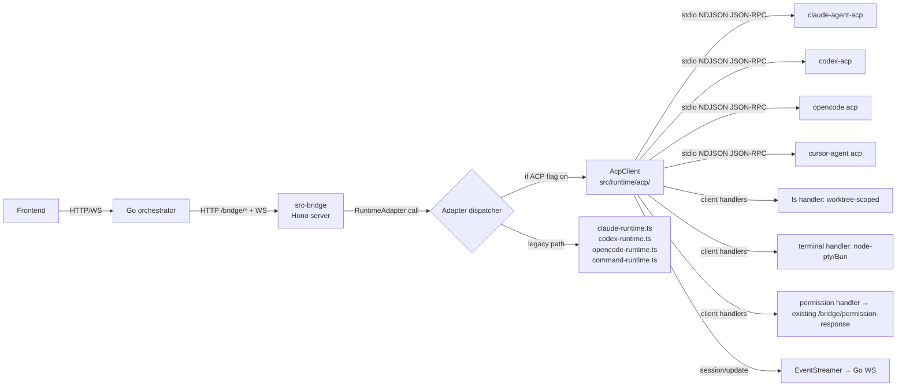

# Bridge ACP Client Integration — Spec (draft-1)

- **ID**: `2026-04-16-bridge-acp-client-integration`
- **Author**: Claude (作业编排) + Max Qian
- **Status**: draft-1
- **Scope**: `src-bridge/` runtime layer and server routes
- **Evidence snapshot date**: 2026-04-18
- **Supersedes (not deletes)**: `2026-04-16-runtime-capability-matrix-and-adapter-v2-design.md` — kept as capability-reference appendix
- **Primary references**:
  - ACP schema: https://github.com/agentclientprotocol/agent-client-protocol @ `12cb17d` (2026-04-15)
  - ACP site: https://agentclientprotocol.com
  - `openclaw/acpx` — reference implementation we mirror (MIT, TypeScript)

---

## 1. Background

`src-bridge/` today speaks seven different languages to seven agent runtimes:

| Adapter | Transport | Entry file |
|---|---|---|
| `claude_code` | Anthropic Agent SDK in-proc | `src-bridge/src/handlers/claude-runtime.ts` |
| `codex` | Codex CLI subprocess (custom protocol) | `src-bridge/src/handlers/codex-runtime.ts` |
| `opencode` | HTTP to OpenCode server | `src-bridge/src/handlers/opencode-runtime.ts` |
| `cursor` | stdio subprocess (Cursor CLI JSON stream) | `src-bridge/src/handlers/command-runtime.ts` |
| `gemini` | stdio subprocess (gemini CLI JSON stream) | same |
| `qoder` | stdio subprocess | same |
| `iflow` | stdio subprocess | same |

Every adapter re-implements its own message framing, streaming event translation, tool-call plumbing, permission prompting, and process supervision. Four concrete consequences:

1. **Claude-specific leak.** `agent-runtime.ts:135-143` hardcodes `runtime === "claude_code"` when exposing `live_controls`. `setModel / setThinkingBudget / mcpServerStatus / rewindFiles` only work for Claude because only Claude exposes a `ClaudeQueryControl` handle.
2. **Capability divergence.** Three of the four non-Claude adapters (`cursor / gemini / qoder / iflow` wrapped by `command-runtime.ts`) throw `UnsupportedOperationError` from `registry.ts:711-722` for `fork / rollback / revert / getMessages / getDiff / executeCommand / executeShell / setThinkingBudget / getMcpServerStatus / interrupt / setModel` — the bridge silently downgrades most features.
3. **Four separate translation layers** converting adapter-native events into `AgentEventType` (`tool_call`, `tool_result`, `output`, `partial_message`, …). Each one is a bug surface.
4. **Zed ecosystem alignment drift.** The four agents we care about (`claude-code / codex / opencode / cursor`) already ship maintained ACP agent wrappers. We pay the cost of maintaining seven fork-specific pipelines against the cost of zero upstream reuse.

## 2. Goals and non-goals

### Goals

1. Bridge becomes an **ACP client** that drives the four target adapters (`claude_code / codex / opencode / cursor`) over stdio JSON-RPC using the official ACP schema.
2. Reuse shipped ACP agents — no DIY ACP agent wrappers on our side.
3. The 12-method `RuntimeAdapter` surface and all `/bridge/*` HTTP routes stay **stable at the boundary** (Go orchestrator and frontend unchanged except where a currently-unsupported feature starts working).
4. All four target adapters gain uniform support for: cancel, set_mode, set_model, set_config_option, permission dialog, structured tool-call streaming, fs.read/write, terminal.
5. Legacy Claude-specific code paths inside the bridge are retired. `live_controls` becomes adapter-agnostic.
6. Feature-flagged roll-out: per-adapter flag `BRIDGE_ACP_<ADAPTER>=1` switches that adapter between legacy and ACP transports until all four are stable, then legacy paths are deleted.

### Non-goals (this spec)

- Bridge as an ACP **agent** (server). Zed-side integration is a future spec.
- Migrating `gemini / qoder / iflow` — they stay on `command-runtime.ts` until separate ACP wrappers exist.
- Rewriting the WS event contract to Go. We map ACP events to the current `AgentEventType` set; any new event types are additive.
- New MCP runtime. We continue using `src-bridge/src/mcp/client-hub.ts` for in-proc MCP; ACP agents get MCP server configs pushed through `session/new.mcpServers`.
- Unstable ACP features (`session/set_model / fork / resume / close`, NES, providers, documents, elicitation). We declare `protocolVersion: 1` and stay on the stable channel; unstable adoption is a later spec.

## 3. Architecture overview



Key points:

- The HTTP boundary is untouched. A request hitting `/bridge/execute` still calls `adapter.execute(runtime, streamer, req, systemPrompt)`.
- A new **adapter dispatcher** lives inside each of the four migrating factories (in `registry.ts`). Based on env flag, the factory returns either the legacy closure or one that delegates into `AcpClient`.
- `AcpClient` is the single class that owns ACP JSON-RPC transport, lifecycle, and client-side method handlers.
- Client-side handlers (fs, terminal, permission) reuse existing AgentForge infrastructure: worktree sandbox, `HookCallbackManager`, `EventStreamer`.

## 4. ACP client module design

### 4.1 Module layout

All new code lives under `src-bridge/src/runtime/acp/`:

```
src-bridge/src/runtime/acp/
├── client.ts              # AcpClient: owns ACP connection + dispatch
├── registry.ts            # Adapter-id → spawn command map
├── process.ts             # Child-process lifecycle, restart, health
├── transport.ts           # NDJSON framing over stdio (wraps child stdin/stdout)
├── handlers/
│   ├── fs.ts              # fs.read_text_file / fs.write_text_file
│   ├── terminal.ts        # terminal.create / output / kill / release / wait_for_exit
│   └── permission.ts      # session.request_permission ↔ /bridge/permission-response
├── events/
│   └── session-update.ts  # SessionUpdate → AgentEventType mapping
├── session.ts             # Per-task session state, prompt turn state machine
├── errors.ts              # AcpProtocolError, AcpProcessCrash, AcpCancelled
└── index.ts               # Public barrel
```

### 4.2 `AcpClient` public surface

```ts
// runtime/acp/client.ts
export interface AcpClientOptions {
  adapterId: "claude_code" | "codex" | "opencode" | "cursor";
  cwd: string;                       // session working directory (worktree root)
  env: Record<string, string>;       // adapter-specific env (API keys, OAuth tokens)
  streamer: EventStreamer;           // where to fan out session/update → AgentEvent
  permissionRouter: PermissionRouter;// see §6.3
  fsSandbox: FsSandbox;              // enforces worktree-rooted paths
  terminalManager: TerminalManager;  // pty pool
  mcpServers: McpServerConfig[];     // passed into session/new
  logger: Logger;
}

export class AcpClient {
  constructor(opts: AcpClientOptions);
  initialize(): Promise<AgentCapabilities>; // negotiates capabilities; MUST be called before newSession
  newSession(): Promise<SessionId>;
  loadSession(sessionId: SessionId): Promise<void>; // only if agentCapabilities.loadSession
  prompt(sessionId: SessionId, content: ContentBlock[]): Promise<StopReason>;
  cancel(sessionId: SessionId): Promise<void>;
  setMode(sessionId: SessionId, modeId: string): Promise<void>;
  setConfigOption(sessionId: SessionId, key: string, value: unknown): Promise<void>;
  dispose(): Promise<void>; // drain + kill child
}
```

Invariants:

- One `AcpClient` owns exactly one child process.
- Within that child, multiple `session/new` calls are allowed; each gets its own `SessionId`.
- `AcpClient` does not mutate `AgentRuntime` state directly — it pushes events through `streamer` and returns structured results to the caller.
- All RPC calls surface as typed promise rejections mapped to `AcpProtocolError / AcpProcessCrash / AcpCancelled`.

### 4.3 Transport

`transport.ts` wraps child stdin/stdout with **NDJSON framing** (one JSON-RPC message per `\n`-delimited line). This matches acpx (`openclaw/acpx`) and all four target agents — none of them use LSP `Content-Length` framing. We build the JSON-RPC dispatcher on top with:

- Request ID counter, pending-request map.
- Notification handler table keyed by method name (`session/update`, `session/request_permission`, `fs/read_text_file`, `fs/write_text_file`, `terminal/*`).
- Backpressure: stdin write drains before next request.
- Line-buffer parser tolerant of partial reads; emits protocol error on unparseable JSON or missing `jsonrpc: "2.0"`.

### 4.4 Process supervision (`process.ts`)

- Spawn via `Bun.spawn` or `node:child_process`. Stdin/stdout in `pipe` mode. Stderr is captured line-buffered and logged at `warn` unless adapter-specific patterns match a fatal error.
- Child process environment merges base process env with `AcpClientOptions.env`.
- Graceful shutdown: send `session/cancel` for each open session, await replies, then close stdin, wait up to 2s, then `SIGTERM`, then `SIGKILL` at 5s.
- Crash detection: if exit code ≠ 0 while a prompt is in flight, reject pending promises with `AcpProcessCrash` carrying last 2 KB of stderr.
- No auto-restart in this phase — the caller (adapter factory) decides to spin up a fresh client on next turn.

## 5. Adapter registry

### 5.1 Target commands

Mirrors `openclaw/acpx/src/agent-registry.ts` exactly:

```ts
// runtime/acp/registry.ts
export const ACP_ADAPTERS = {
  claude_code: {
    command: "npx",
    args: ["-y", "@agentclientprotocol/claude-agent-acp@^0.28.0"],
    envRequired: ["ANTHROPIC_API_KEY"],
    cursorExtensions: false,
  },
  codex: {
    command: "npx",
    args: ["-y", "@zed-industries/codex-acp@^0.11.1"],
    envRequired: ["OPENAI_API_KEY"], // or codex-side OAuth; see §5.3
    cursorExtensions: false,
  },
  opencode: {
    command: "opencode",
    args: ["acp"],
    envRequired: [],               // provider auth handled by opencode itself
    cursorExtensions: false,
  },
  cursor: {
    command: "cursor-agent",
    args: ["acp"],
    envRequired: [],               // cursor login handled by cursor-agent
    cursorExtensions: true,
  },
} as const satisfies Record<string, AcpAdapterConfig>;
```

### 5.2 Deprecation caveat

The old `@zed-industries/claude-code-acp` package is deprecated and re-routed to `@agentclientprotocol/claude-agent-acp`. We pin to the new name.

### 5.3 Auth passthrough

- **claude_code**: `ANTHROPIC_API_KEY` (or Claude Console login) read from bridge env; forwarded unchanged.
- **codex**: `@zed-industries/codex-acp` shells out to the `codex` CLI, so the CLI's own auth method applies (OpenAI API key env var, or `codex login` one-time OAuth). Bridge forwards env and inherits the filesystem login state.
- **opencode**: existing `/bridge/opencode/provider-auth/*` routes stay; the spawned `opencode acp` process picks up the same on-disk auth state.
- **cursor**: `cursor-agent` refuses to start if not logged in. Bridge surfaces a structured error (`AUTH_REQUIRED`) mapped to existing auth-error event type. No new FE UI in this spec.

### 5.4 Capability flags

During `initialize` we declare:

```ts
clientCapabilities: {
  fs: { readTextFile: true, writeTextFile: true },
  terminal: true,
}
```

Agent replies with its own `agentCapabilities`. We store the returned capabilities on the `AcpClient` and gate prompt-content types (image/audio/embeddedContext) by `agentCapabilities.promptCapabilities.*`. Any prompt attempt that would exceed advertised caps rejects before sending.

## 6. Client-side handlers

### 6.1 `fs/*` handler

Handler signature (registered during `initialize`):

```ts
// runtime/acp/handlers/fs.ts
export function createFsHandler(sandbox: FsSandbox) {
  return {
    async readTextFile({ sessionId, path, line, limit }) { ... },
    async writeTextFile({ sessionId, path, content }) { ... },
  };
}
```

**Sandbox rule**: `sandbox.resolve(sessionId, path)` must normalize `path` relative to the session's worktree root (`AcpClientOptions.cwd`) and reject paths that escape it (symlink-following `realpath` check). Non-compliant calls reject with JSON-RPC error code `-32602` ("Invalid params") and `data.reason = "path_escapes_worktree"`. We do **not** fall back to the outer filesystem.

`line + limit` slice semantics exactly as ACP schema (1-based line, limit in lines). `content` writes are UTF-8; we do not implement binary writes in this phase.

### 6.2 `terminal/*` handler

Uses a shared `TerminalManager` backed by `node-pty` on desktop (Tauri sidecar) and `Bun.spawn` fallback for web-dev mode. One PTY per `terminalId`.

Capacity: per-task default `outputByteLimit = 10 MB`, globally `maxConcurrentTerminals = 16`. Over-capacity allocation rejects with a structured error passed back to the agent.

Lifecycle:

- `terminal/create` → allocate PTY, return `terminalId`.
- `terminal/output` → snapshot current buffer (honor `truncated` flag) + optional `exitStatus` if child exited.
- `terminal/wait_for_exit` → resolves when PTY child exits; carries `exitCode` and `signal`.
- `terminal/kill` → SIGKILL child, `terminalId` stays valid until `terminal/release`.
- `terminal/release` → free PTY + allocator slot. Embedded tool calls referencing the id keep their last-known output snapshot.

### 6.3 `session/request_permission` handler

Reuses existing `HookCallbackManager` and `/bridge/permission-response/:request_id` route — no new FE surface.

Flow:

1. Agent sends `session/request_permission` with `toolCall: ToolCallUpdate, options: PermissionOption[]`.
2. `PermissionRouter.request(taskId, toolCall, options)` generates a `request_id`, emits `permission_request` event (existing type) through `EventStreamer`, and registers a resolver in `HookCallbackManager`.
3. Frontend → Go → `POST /bridge/permission-response/:request_id` with `{ option_id }` or `{ cancelled: true }`.
4. Handler resolves the pending promise; router returns either `{ outcome: "selected", optionId }` or `{ outcome: "cancelled" }` to the agent.

`PermissionOptionKind` mapping: the `allow_once / allow_always / reject_once / reject_always` enum is surfaced to frontend unchanged; persistence of `always` variants is out of scope for this spec (tracked as open question §12.3).

## 7. Session lifecycle

### 7.1 Per-task state machine

```
new-task → ensureClient → initialize → newSession → (prompt | setMode | setConfigOption)* → dispose
                                                          ↓
                                                   cancel → wait for stopReason=cancelled
```

- `ensureClient(taskId)` looks up the `AcpClient` in a per-task pool (keyed by `task_id`). Miss → spawn.
- `initialize` is called once per `AcpClient`; `newSession` is called once per task.
- Prompt turns are serialized per session — ACP disallows concurrent prompts on the same session.
- On `/bridge/cancel` or `/bridge/interrupt`, we call `AcpClient.cancel(sessionId)` and await the current prompt's `stopReason=cancelled`.
- Task archival or crash triggers `AcpClient.dispose()`.

### 7.2 Fork / rollback / revert mapping

Stable ACP does **not** include `session/fork / resume / close`. For this phase, we keep the existing `/bridge/fork / rollback / revert` routes but remap internal behavior:

- **fork**: `newSession` with the same `cwd`, then replay prior user messages via successive `prompt` calls until the desired ancestor point (only when adapter supports `loadSession`). Otherwise: reject with `UnsupportedOperationError` as today (no regression).
- **rollback**: same strategy — replay from start up to chosen turn.
- **revert**: file-level revert is handled by our existing worktree snapshot logic, not ACP. No change required; we just stop routing it through adapter-specific CLI commands and call the worktree service directly.

Unstable `session/fork` etc. are **not** adopted here. Tracked as open question §12.1.

### 7.3 `live_controls` unification

`agent-runtime.ts:135-143` today:

```ts
if (runtime === "claude_code" && this.claudeQuery) {
  live_controls = { ... claude-specific handles ... };
}
```

After migration, `AcpClient` exposes uniform control methods and we populate `live_controls` for every ACP-backed adapter. We drop the `runtime === "claude_code"` branch. `setThinkingBudget` only populates the field when `agentCapabilities` advertises support — otherwise it's omitted from `live_controls` (not exposed at all, not "unsupported"). Frontend gracefully handles absence (already does).

## 8. Streaming: `session/update` → `AgentEventType`

Single translation table lives in `runtime/acp/events/session-update.ts`. No per-adapter dialects.

| `SessionUpdate.sessionUpdate` | Existing `AgentEventType` | Notes |
|---|---|---|
| `user_message_chunk` | `partial_message` | direction=user |
| `agent_message_chunk` | `output` | text delta (existing) |
| `agent_thought_chunk` | `reasoning` | existing type |
| `tool_call` | `tool_call` | `ToolCall` → existing tool-call event |
| `tool_call_update` | `tool_result` when status ∈ {completed, failed}; otherwise `tool.status_change` | preserves current FE expectation |
| `plan` | `todo_update` | `PlanEntry[]` → existing todo schema |
| `available_commands_update` | `progress` with subtype=`commands` | additive; non-breaking |
| `current_mode_update` | `status_change` with kind=`mode` | additive subtype |
| `config_option_update` | `status_change` with kind=`config_option` | additive subtype |

Permission requests flow through §6.3, not this table. Cost / budget events are emitted by the bridge itself when ACP `_meta` carries usage info; if the target agent does not publish usage, we fall back to per-adapter heuristics (Claude exposes `_meta.usage`; Codex/OpenCode/Cursor — TBD, see §12.5).

`_meta` on every variant is copied verbatim into the outgoing `AgentEvent.metadata` so downstream consumers (Go, frontend) can opt into richer fields without a schema change.

## 9. Cross-layer impact

### 9.1 Go orchestrator

- **No API change required.** Bridge HTTP routes and WS event shapes are preserved.
- Observable change: `live_controls` is populated for non-Claude adapters; Go should treat `live_controls` as present for any runtime, not gate on `runtime`. Current Go code already does (search confirmed — but audit step is Task T9).
- Cost events for codex/opencode/cursor may arrive where they didn't before (previously only claude_code emitted). No downstream breakage expected.

### 9.2 Frontend

- No required change. Adding mode/config_option subtypes to `status_change` is backwards-compatible — existing handlers ignore unknown subtypes.
- Optional follow-up (out of this spec): surface `current_mode_update` and `available_commands_update` in UI.

### 9.3 Tauri

- Sidecar packaging: `src-tauri/tauri.conf.json` must ship `npx`, `opencode`, and `cursor-agent` binaries (or document that users install them). Desktop build testing covers this.
- `@zed-industries/codex-acp` ships a platform-specific native binary via optional deps. Tauri desktop bundle must resolve the correct one per target triple.

### 9.4 IM Bridge

- Not touched in this spec.

## 10. Testing strategy

Test layers land in this order (matches plan phases):

1. **Unit** (`src-bridge/tests/unit/runtime/acp/`): transport framing, JSON-RPC dispatcher edge cases, fs sandbox escape rejection, permission router timeout, session-update → event mapping.
2. **Component** (`src-bridge/tests/component/acp/`): spawn a mock ACP agent (test fixture that speaks JSON-RPC stubs) and exercise `AcpClient.initialize / newSession / prompt / cancel`.
3. **Integration — per adapter** (`src-bridge/tests/integration/acp/<adapter>.test.ts`): spawn the real adapter command (skippable by env flag `SKIP_ACP_INTEGRATION`), run smoke prompt "echo hello", assert text delta received. One smoke + one cancel + one fs-write + one terminal invocation per adapter.
4. **End-to-end** (manual for this spec): run `pnpm dev:all`, task dispatched from frontend for each of the four adapters, verify parity with legacy path.

Fixture mock agent: `src-bridge/tests/fixtures/mock-acp-agent.ts` — a standalone script invoked by unit/component tests. Minimal coverage: initialize, session/new, session/prompt, session/update (text delta), session/request_permission round-trip.

## 11. Migration plan

Legacy paths stay in-place behind feature flags. Cutover happens per adapter, gated by env:

- `BRIDGE_ACP_CLAUDE_CODE=1`
- `BRIDGE_ACP_CODEX=1`
- `BRIDGE_ACP_OPENCODE=1`
- `BRIDGE_ACP_CURSOR=1`

Default OFF during development. Per-adapter smoke test must pass before flag defaults to ON; legacy path stays available as fallback via `BRIDGE_ACP_<ADAPTER>=0` for one release cycle, then deleted.

### 11.1 Deletion list (after all four flags default to ON and fallback window closes)

- `src-bridge/src/handlers/claude-runtime.ts`
- `src-bridge/src/handlers/codex-runtime.ts`
- `src-bridge/src/handlers/opencode-runtime.ts`
- `src-bridge/src/handlers/command-runtime.ts` (only the cursor-dispatch path; gemini/qoder/iflow entries stay)
- `src-bridge/src/opencode/` transport module
- `src-bridge/src/runtime/registry.ts` adapter factories at lines 464–723 (cc/codex/opencode/cursor portions)
- `AgentRuntime.claudeQuery` field + `live_controls` `runtime === "claude_code"` gate at `agent-runtime.ts:135-143`

### 11.2 Retained

- `EventStreamer`, `SessionManager`, `RuntimePoolManager`, `HookCallbackManager`, `MCPClientHub`, Hono server routes, `AgentRuntime` state container, per-adapter `continuity` shapes (still useful for state snapshotting across restart).

## 12. Open questions

1. **Unstable `session/fork` adoption** — worth negotiating the unstable channel to restore first-class fork/rollback for supported adapters, or keep replay-based emulation? Revisit after Phase 3.
2. **Process pooling** — one ACP child per task is simple but wastes warm-up cost. Investigate per-adapter pool with session re-use once baseline stabilizes. Out of this spec.
3. **`allow_always / reject_always` persistence** — currently treated as `allow_once / reject_once` with no persistence. Spec requires no behavior change; real persistence belongs to a permissions-UX spec.
4. **Cursor-specific `cursor/*` extensions** — `ask_question / create_plan / update_todos / task / generate_image`. We capability-gate behind `cursorExtensions: true`; mapping is a separate future spec. This spec only declares they exist.
5. **Usage / cost telemetry outside Claude** — Codex/OpenCode/Cursor `_meta` payloads need inspection to know whether we can emit `cost_update` uniformly. Phase 3 integration tests produce the data to decide.
6. **Linux build paths for `@zed-industries/codex-acp`** — platform optionalDep resolution in CI + Tauri. Validate during Task T6.

## 13. References

- Current spec (preserved, capability-reference): `docs/superpowers/specs/2026-04-16-runtime-capability-matrix-and-adapter-v2-design.md`
- Matrix skeleton + claude_cli / claude_sdk research (preserved appendix): `docs/superpowers/specs/2026-04-16-runtime-capability-matrix-and-adapter-v2/` (matrix.csv, research/claude-cli.md, research/claude-sdk.md, sources.md)
- ACP schema (stable, `schema/schema.json` blob `9aca01f4…`, `meta.json` `d67543ff…`): https://github.com/agentclientprotocol/agent-client-protocol/tree/12cb17d/schema
- `openclaw/acpx`: https://github.com/openclaw/acpx
- Adapter wrappers: `@agentclientprotocol/claude-agent-acp@^0.28.0`, `@zed-industries/codex-acp@^0.11.1`, `opencode acp` (native), `cursor-agent acp` (native)

## 14. Changelog

- **draft-1** (2026-04-16) — initial spec after brainstorm pivot from capability-universe matrix to ACP client integration. Four target adapters: `claude_code / codex / opencode / cursor`. Zero DIY ACP wrappers required.
